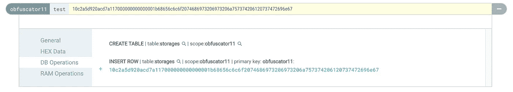
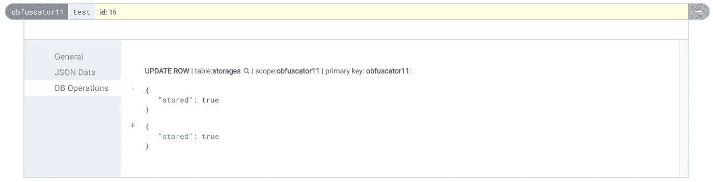

# 混淆 EOSIO 智能合同

> 原文：<https://medium.com/coinmonks/obfuscating-eosio-smart-contracts-72756ac3dc96?source=collection_archive---------1----------------------->

有几类智能合约，人们不愿透露它们的内部运作方式。这是私人智能合约的一个共同主题，例如，交易机器人智能合约，因为套利交易是一个非常竞争的零和游戏。

> 在软件开发中，[混淆](https://en.wikipedia.org/wiki/Obfuscation_(software))是指故意创建人类难以理解的源代码或机器代码的行为。[维基百科](https://en.wikipedia.org/wiki/Obfuscation_(software))

通常，这是指将源代码更改为难以逆向工程的不可读的混乱状态，就像只使用`[[]()+!](http://www.jsfuck.com/)`字符编写 JavaScript 一样。EOSIO 智能合同被编译为 WebAssembly，并以这种格式存储在链上。也就是说，混淆也需要发生在 WebAssembly 级别。请记住，这只会使攻击者更难对合同进行逆向工程，但并非不可能——只要有足够的时间，攻击者仍然会成功(晦涩难懂的“安全性”)。

> 这里我们不是在讨论*不可区分性混淆*的加密领域，它可以将一个程序转换成一个新的程序，这个新的程序被**证明**除了它的输入输出行为之外不会泄露任何东西。这实际上将允许你在程序中包含私钥，并在智能合同中实现签名创建，但截至 2020 年，这是不可行的(即使在智能合同之外)。

在第一部分中，我们将看看最简单的混淆形式:改变合同的 ABI。这很容易实现，并且已经产生了很大的效果，因为它在块探索者上显示十六进制值，迫使某人深入 WASM 代码来破译动作参数和表结构。让我们看看一些方法。

## 1.名字模糊的 ABI

这是我见过的最常见的方法。人们没有为动作参数使用有意义的名称，而是简单地将它们命名为`a`、`b`、`c`或类似的名称。这也是最糟糕的混淆，因为它保留了动作参数和表结构的所有类型信息。

我相信它仍然如此受欢迎的原因是它允许与智能合约轻松交互，因为正确的 ABI 在链上，并且像`cleos`、`eosjs`或任何钱包这样的工具仍然可以与这种方法一起工作，因为它们可以序列化操作。

## 2.没有 ABI

另一种方法是根本不上传 ABI。这会导致块管理器无法反序列化数据，而是显示普通的十六进制数据，从而丢失所有类型信息以及一个操作有多少个参数。让我们用这个示例契约来测试它:

```
CONTRACT obfuscate : public contract {
public:
  using contract::contract;
  obfuscate(eosio::name receiver, eosio::name code,
            eosio::datastream<const char *> ds)
      : contract(receiver, code, ds), _storages(receiver, receiver.value) {}

  TABLE storage {
    name account;
    uint64_t value;
    std::string message;

    uint64_t primary_key() const { return account.value; }
  };
  typedef eosio::multi_index<"storages"_n, storage> storage_t;

  storage_t _storages;

  ACTION test(const name &account, const uint64_t &value, const string &message) {
    auto storage = _storages.find(account.value);
    if (storage == _storages.end()) {
      _storages.emplace(get_self(), [&](auto &x) {
        x.account = account;
        x.value = value;
        x.message = message;
      });
    } else {
      _storages.modify(storage, get_self(), [&](auto &x) {
        x.value += value;
        x.message = message;
      });
    }
  }
};
```

我们现在可以使用`eosio::setcode`动作来设置这个合同代码，但是不能上传 ABI。在 eosq 上，调用`test`动作将如下所示:



*Invoking an action on a contract with no ABI*

动作数据和表格行只是显示普通的十六进制数据，这比前面的方法好得多。但是，如果没有 ABI，我们实际上如何调用契约动作呢？我们需要自己序列化动作数据。与这样的契约交互的最简单的方法是使用`eosjs`并定义一个自定义`AbiProvider`。

AbiProvider 负责获取任何契约的 ABI，然后用于在用`api.transact`发送事务时序列化动作数据。我们可以编写自己的 AbiProvider，从文件系统中读取我们的合同的 ABI，并尝试从任何其他合同的链中获取 ABI。

```
import { JsonRpc, Api, Serialize } from "eosjs";
import { AbiProvider, BinaryAbi } from "eosjs/dist/eosjs-api-interfaces";
import { TextEncoder, TextDecoder } from "util";

// converts JS object ABI to serialized ABI
const jsonToRawAbi = (json) => {
  // ...
};

const privateAbis: { [key: string]: Buffer } = {};
// load obfuscator ABI from file
privateAbis[`obfuscator11`] = jsonToRawAbi(require(`./obfuscate.abi.json`));

export default class PrivateAbiProvider implements AbiProvider {
  rpc: JsonRpc;

  constructor(rpc) {
    this.rpc = rpc;
  }

  async getRawAbi(account): Promise<BinaryAbi> {
    // if we're interacting with the obfuscator contract use local ABI
    if (privateAbis[account])
      return {
        accountName: account,
        abi: privateAbis[account],
      };

    return (await this.rpc.getRawAbi(account)).abi as any;
  }
}
```

在 eosjs 的 API 对象中使用这个自定义的 AbiProvider 很简单:

```
const signatureProvider = new JsSignatureProvider(keys)
const customAbiProvider = new PrivateAbiProvider(rpc)
const api = new Api({
  rpc: rpc,
  signatureProvider,
  abiProvider: customAbiProvider,
  textDecoder: new TextDecoder(),
  textEncoder: new TextEncoder(),
})

// send test action
const actions = [
  {
    account: `obfuscator11`,
    name: `test`,
    data: {
      account: `obfuscator11`,
      value: 23,
      message: `hello this is just a string`,
    },
    authorization: [{ actor: `obfuscator11`, permission: `active` }],
  },
]

await api.transact(
  {
    actions,
  },
  {
    broadcast: true,
    sign: true,
    blocksBehind: 3,
    expireSeconds: 300,
  }
)
```

## 3.假 ABI

我们可以更进一步，迷惑任何在块浏览器中查看动作的人。我们没有上传 ABI，而是创建了一个假的 ABI，其中的动作参数和表结构类型与原始的不匹配。我们可以自己编写 ABI 文件，或者让`eosio-cpp`为我们完成:

```
CONTRACT obfuscate : public contract {
// ...

  // no TABLE anymore
  struct storage {
    // ... same as before
  };
  typedef eosio::multi_index<"storages"_n, storage> storage_t;
  storage_t _storages;

  // no ACTION anymore
  void test(const name &account, const uint64_t &value, const string &message) {
    // ... same as before
  }

  // this will just be used to create the fake ABI
  struct [[eosio::table("storages")]] fake_storage {
    bool stored;

    uint64_t primary_key() const { return 0; }
  };
  [[eosio::action("test")]] void fake_test(const uint8_t &id) {}
};

extern "C" {
void apply(uint64_t receiver, uint64_t code, uint64_t action) {
  if (code == receiver) {
    switch (action) { EOSIO_DISPATCH_HELPER(obfuscate, (test)) }
  }
  eosio_exit(0);
}
}
```

我们从原始动作中删除了`ACTION`宏(因此必须实现一个定制的`apply`函数),并创建一个具有相同动作名称的假动作。桌子也一样。这导致 ABI 生成器为正确的动作/表名选择假类型，块浏览器将使用这些动作/表名来反序列化数据。

在我们的 eosjs ' AbiProvider 中，我们仍然使用正确的 ABI。在 eosq 上产生的操作如下所示:



*Invoking an action on a contract with a fake ABI*

看起来我们发送了一个带有单个`uint8_t id`参数的`test`动作，就好像我们存储了一个单个布尔值`stored`。我们使用的其余字节没有被反序列化，也没有显示出来。用这种方式欺骗某人是非常容易的，除非他们检查动作痕迹并查看实际的十六进制数据。

这已经很好地保护了您的契约，防止有人试图通过查看块浏览器中的动作或表来理解它。在下一篇文章中，我们将看看混淆 WebAssembly 代码。

[](https://learneos.dev)

最初发表于[https://cmichel.io/obfuscating-eosio-smart-contracts/](https://cmichel.io/obfuscating-eosio-smart-contracts/)

> [在您的收件箱中直接获得最佳软件交易](https://coincodecap.com/?utm_source=coinmonks)

[](https://coincodecap.com/?utm_source=coinmonks)