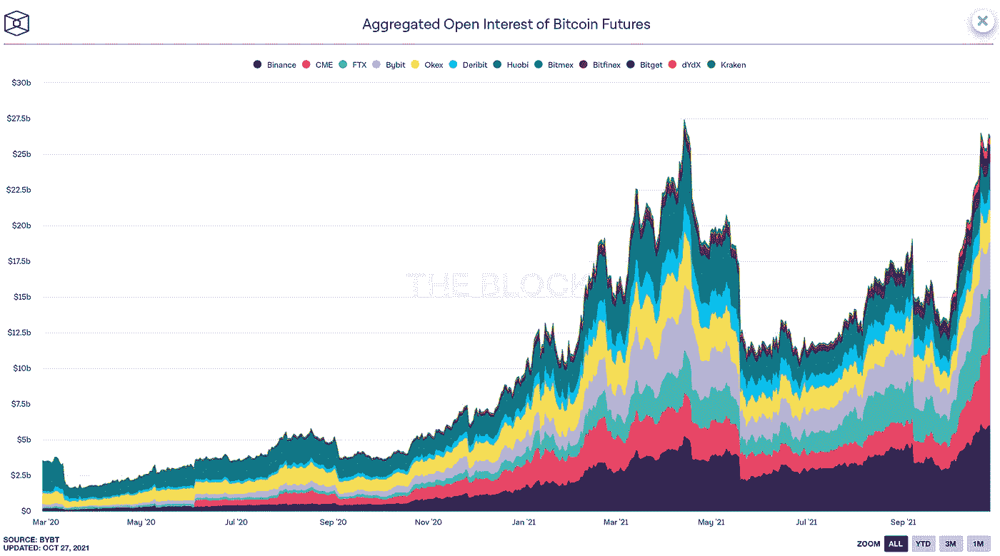
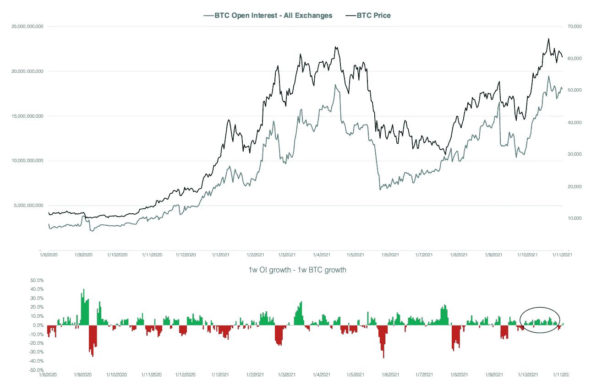
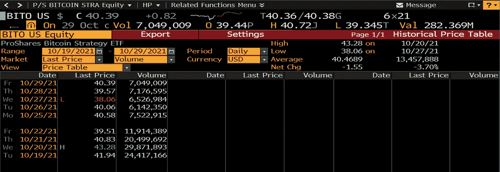

# 10 月加密市场综述

> 原文：<https://medium.com/coinmonks/october-overview-of-crypto-market-59d278f4a26b?source=collection_archive---------4----------------------->

## 您对数字资产世界的每月简报

> *条乘*

**

*Photo by: [Karina Zhukovskaya](https://www.pexels.com/@karina-zhukovskaya) | Unsplash*

*   ***十月回顾** *——BTC 杠杆检查**
*   ***中国禁令会伤害 Crypto 吗？** *——对香港的影响**
*   ***放大比特币期货 ETF***
*   ***监管机构对密码***
*   ***进一步的机构收养***

# ***十月回顾***

*在 twitter 俚语中，10 月份一直被称为“Uptober ”,这是名副其实的。过去一个月，BTC 上涨了 40%，ETH 上涨了 43%。*

*除了历史上是比特币最强劲的月份之一，今年的 Uptober 还带来了一个无价的消息，即 SEC 监管的比特币 ETF 的推出——这可能是加密领域迄今为止全球监管接受度最高的一个月。10 月 10 日，比特币价格创下 67000 美元的历史新高。以太坊也是如此——这种加密货币在 10 月 29 日(币安)达到了 4460.89 美元的 ATH。*

*自 10 月 22 日以来，BTC 在经历了期货交易所交易基金推出的催化剂并触及 ATH 水平后来回盘整。随着 11 月 16 日即将到来的 Taproot 激活，我们还没有看到上升趋势是否会继续，或者它将是另一个在加密领域如此常见的“购买谣言，出售新闻”类型的事件。*

## ***BTC 未平仓利息***

*追踪 CME 比特币期货的 ETF 成功推出后，相对于币安、FTX、Bybit 和其他大型加密交易所，CME 的未平仓头寸正在增加。*

**

**Source: theblockcrypto.com**

*然而，声称高未平仓合约等于高杠杆率是一种常见的误解。在加密市场中，未结权益头寸通常由实物资产持有。也就是说，投资头寸的美元价值会随着其基础资产的价格波动而自然增加或减少。所以我们要看的是 BTC 价格变化率和其他投资变化率之间的差异。最小的差异意味着投资收益与 BTC 价格同步增长，进入市场的新杠杆也是最小的。*

*在下图中，我们比较了比特币未平仓头寸的周变化率和 BTC 价格的周变化率。在牛市中，OI 的增长速度比 BTC 快意味着新的杠杆进入市场，反之亦然。*

**

**Source: app.intotheblock.com | JKL Research**

*如下图所示，新的杠杆在整个 10 月份逐渐累积。这种情况增加了由长期清算或杠杆流动性推动的大幅调整的风险。与今年早些时候的牛市相比，当时杠杆积累期过后是长期杠杆流出，这几乎总是与重大价格调整同时发生。*

# *中国的禁令会伤害 CRYPTO 吗？*

*进入 10 月，中国加密禁令仍然是我们从客户那里收到的首要问题之一。交易所停止了在 mainland China 的在岸新客户，并宣布了到 2021 年底取消所有中国客户的计划。在这些声明之后，市场在 9 月底修正了大约 15%,只是在 10 月份出现了强劲的反弹。*

## ***那么，中国的打击会影响加密货币的未来吗？***

*对于行业参与者来说，中国禁止所有加密活动并不意外。事实上，该国多年来一直对加密货币进行严格的监管和限制。沃顿商学院(Wharton School)进行的定量分析显示，总体而言，监管公告不会影响加密货币网络的交易量。此外，专家毫不怀疑，无论有没有中国的参与，加密货币市场都将达到顶峰，脸书(不在中国运营)就是一个很好的例子。([阅读更多](https://knowledge.wharton.upenn.edu/article/will-chinas-regulation-kill-cryptocurrencies/))*

## *中国的禁令会限制香港的加密业务吗？*

*在接受 Forkast 采访时，香港证监会前监管人 Angelina Kwan 表示:*“我们的观点是，展望未来，香港将继续保持其在管理财务和行政事务方面的自主权……随着数字资产行业受到越来越多的监管，香港作为一个法治金融中心变得更具吸引力，而不是更弱。”* ( [阅读更多](https://forkast.news/will-chinas-crypto-ban-change-hong-kongs/))*

# ***放大比特币期货 ETF***

*今年年初，对 SEC 批准的比特币交易所交易基金的期望很高，然后很低，当美国 SEC 主席加里·詹斯勒暗示比特币和以太坊期货交易所交易基金的可能性时，期望又很高。立即，市场充满了对此事的猜测和意见。*

## *BITO 的巨大成功*

*最终，在十月中旬，这些希望变成了现实。或者尽可能的接近。10 月 15 日，SEC 投资者教育办公室的官方 twitter 账户发布了一条关于 SEC 今年 6 月发布的比特币期货公告的推文。当天晚些时候，彭博发表了一篇关于即将推出的 BTC 期货交易所交易基金的文章——这两条消息都足以证实交易所交易基金的最终批准。BTC 价格一天之内飙升了 10%。([阅读更多](https://www.bloomberg.com/news/articles/2021-10-15/bitcoin-futures-etf-said-not-to-face-sec-opposition-at-deadline))*

*ProShares 推出的首只比特币期货 ETF $ BITO 的表现符合最乐观的预期。它目前享有先发优势，首日交易超过 10 亿美元，交易量超过 2440 万笔，收盘价为 41.94 美元。这使得 ProShares 比特币期货交易所交易基金成为首日交易量第二大的交易所交易基金。*

**

## ***期货溢价&跟踪误差***

*围绕比特币期货交易所交易基金，最常被引用的担忧之一是跟踪误差。跟踪问题意味着 ETF 期货合约不会很好地跟踪基础比特币，因为远月合约与期货价格的升水冲突。([阅读更多](https://www.coindesk.com/markets/2021/10/11/dying-for-a-bitcoin-futures-etf-watch-out-for-contango-bleed/))*

*由于跟踪误差，ETF 发行者(ProShare 的$BITO，瓦尔基里的$BTF，VanEck 的$XBTF)更喜欢近月合约，这比长期合约更好地跟踪基础 BTC:例如，10 月期货比 11 月或 12 月合约更接近跟踪 BTC。那么，ETF 为什么不直接累积 10 月合约呢？CME 将每个 ETF 发行者的期货合约数量限制在 4000 份，在到期前三天降至 2000 份。如果一只 ETF 的需求超过了这一限制，它们就不得不买入远月合约。随着新 ETF 进入市场，它们打开了更多近月 CME 期货的通道。与此同时，如果需求继续增长，现有 ETF 发行者将被迫将资产转移至更远期的 11 月和 12 月合约，放大对 BTC 的跟踪误差。(阅读更多内容)发行人如何根据近月和远月合约构建 eft 将直接反映机构投资者的流动。*

*ProShares 已经申请延长 CME 期货合约的限制，以获得更多近月期货合约。对于追踪误差是否仍将是比特币期货 ETF 产品的一个大问题，CME 的回应将提供一个答案。([阅读更多](https://www.coindesk.com/business/2021/10/24/proshares-seeks-waiver-from-cme-for-position-limits-on-new-bitcoin-futures-etf-report/))*

*回到比特币现货 ETF，就目前情况来看，概率仍然相当低。即使比特币期货交易所交易基金成功上市，分析师们也不看好比特币现货交易所交易基金会很快获批。直到我们看到监管加密现货市场的新监管制度出台。*

# ***密码规则***

> *SEC 主席 Gensler 告诉众议院委员会，SEC 没有禁止加密的计划。([阅读更多](https://www.coindesk.com/policy/2021/10/05/sec-chair-gensler-a-ban-on-crypto-would-be-up-to-congress/?utm_medium=email&_hsmi=168461724&_hsenc=p2ANqtz-8OHuol5vncakH0QZTm2nZNs7HbQqdoAlqrDYD7gCkS9vqDbWJoBETg1_6R8JpXHM410hmagLivfAMHQsbklJAoDzIjrA&utm_content=168461724&utm_source=hs_email))*
> 
> *美联储主席鲍威尔表示，他“无意”禁止加密。([阅读更多](https://www.coindesk.com/policy/2021/09/30/fed-chair-powell-says-he-has-no-intention-of-banning-crypto/))*
> 
> *美国银行监管机构的一个团队正在设计银行可以在资产负债表上持有密码、提供托管和促进客户交易的方法。([阅读更多](https://www.coindesk.com/policy/2021/10/28/us-regulators-weigh-avenues-for-banks-to-hold-crypto-report/))*
> 
> *澳大利亚参议院发布期待已久的加密报告，希望将该国转变为全球行业领导者。([阅读更多](https://forkast.news/australia-senate-releases-long-awaited-crypto-report/))*
> 
> *金融行动特别工作组发布加密指南定稿，对 DeFi、NFTs 进行了澄清。([阅读更多](https://www.theblockcrypto.com/post/122372/fatf-final-crypto-guidance-defi-nft))*

# ***机构加密采用***

*在 JKL Capital，我们看到越来越多的机构进入加密领域。机构兴趣的提升出现在基差较高的时候，这确保了一个有吸引力的“现购自运”机会。在 10 月份，JKL Capital 的套利“基差均值回归”市场中性策略产生了超过 30%的市场中性年化回报。*

## ***金融机构***

> *NYSE Arca 文件将灰度比特币信托转换为现货 ETF ( [阅读更多](https://grayscale.com/our-filing-to-convert-gbtc-into-an-etf/))*
> 
> *乔治·索罗斯的基金拥有比特币，首席执行官证实([阅读更多](https://www.cnbc.com/2021/10/07/george-soros-fund-owns-bitcoin-ceo-confirms.html))*
> 
> *法国最大的银行之一法国兴业银行申请 2000 万美元的 MakerDAO 贷款，使用债券作为抵押([阅读更多信息](https://www.coindesk.com/business/2021/09/30/societe-generale-applies-for-20m-makerdao-loan-using-bond-token-collateral/))*
> 
> *美国银行与 NYDIG 合作提供比特币托管服务([阅读更多](https://www.theblockcrypto.com/linked/119571/u-s-bank-partners-with-nydig-to-offer-bitcoin-custody-services)*

## ***企业&定义***

> *Bakkt 与谷歌合作，将数字资产介绍给数百万消费者*
> 
> *万事达卡和 Bakkt 合作提供创新的加密和忠诚度解决方案([阅读更多](https://www.businesswire.com/news/home/20211025005487/en/Mastercard-and-Bakkt-Partner-to-Offer-Innovative-Crypto-and-Loyalty-Solutions))*

*在上述新闻的背后，有必要介绍一下 Bakkt Holdings Inc——一个值得信赖的数字市场，它为希望让客户使用 crypto 的商家提供了支付便利。公司于 2018 年由洲际交易所(也是纽交所的母公司)组建，10 月 18 日才在纽交所上市。在万事达卡合作消息发布后，Bakkt Holdings 股价上涨 451%，将加密货币支付纳入主流。([阅读更多](https://markets.businessinsider.com/news/currencies/bakkt-stock-price-soars-mastercard-fiserv-crypto-payments-bitcoin-deal-2021-10))*

> *FTX 在 B-1 轮融资中从 69 名投资者手中筹集了 4.2 亿美元。([阅读更多](https://www.coindesk.com/business/2021/10/21/ftx-raises-420690000/?utm_medium=email&_hsmi=173757048&_hsenc=p2ANqtz-85QxcsRhM2q-b5SCHfvhQc7TgInEYeWNn9vzL1mb7h9zwLVCkcDYiyAMMjJA1G-eLy8iYucUqS2rOti6wBWIMZ7hVhIg&utm_content=173757048&utm_source=hs_email))*
> 
> *火币日本获得监管机构批准提供加密衍生品。([阅读更多](https://forkast.news/headlines/huobi-japan-approval-crypto-derivatives/))*
> 
> *彭博发表了一项深入研究，试图找到泰瑟的数十亿美元。([阅读更多](https://www.bloomberg.com/news/features/2021-10-07/crypto-mystery-where-s-the-69-billion-backing-the-stablecoin-tether))*
> 
> *美国参议院警告脸书不要推出 Diem 货币和 Novi 钱包。([阅读更多](https://www.schatz.senate.gov/imo/media/doc/schatz_et_al_letter_to_facebook_on_diem.pdf?utm_medium=email&_hsmi=173757048&_hsenc=p2ANqtz-_BMVo0winbD4aTQHrgLHi_xH7lG1EApr3xj2EnqY2083RPjxqYe0lKtfWQcJ7XC22_jjzjcv9Zk2qVjv39EuMJOhAGOA&utm_content=173757048&utm_source=hs_email))*
> 
> *新的 Adobe Photoshop 功能支持市场上的 NFT 验证([了解更多](https://www.coindesk.com/business/2021/10/27/new-adobe-photoshop-feature-to-support-nft-verification-on-marketplaces/)*
> 
> *脸书更名为 Meta 后，元宇宙代币飙升([阅读更多](https://www.forbes.com/sites/ninabambysheva/2021/10/29/metaverse-tokens-soar-following-facebooks-rebrand-news/?sh=5e20ef28a9fb)*

## *放弃*

*本材料的内容未经任何监管机构审查。建议您对本材料的内容保持谨慎。虽然本材料中包含的信息是从据信可靠的来源汇编的，但 JKL 不代表或保证本材料中包含的信息的准确性、完整性或可靠性。如果您对本材料的任何内容有任何疑问，您应该获得独立的专业意见。JKL 或其任何关联公司，或其任何或其各自的董事、高级职员、员工和代表都不会对因使用或依赖本材料中包含的任何信息而导致的任何直接、间接或后果性损失承担任何责任或义务。本材料不构成认购或购买任何金融产品的要约或邀请。其目的不是提供任何信贷或其他评估的基础，也不应被视为购买任何金融产品的建议。*

> *加入 Coinmonks [电报频道](https://t.me/coincodecap)和 [Youtube 频道](https://www.youtube.com/c/coinmonks/videos)了解加密交易和投资*

## *也阅读*

* [## 最佳加密交易所| 2021 年十大加密货币交易所

### 编辑描述

blog.coincodecap.com](https://blog.coincodecap.com/crypto-exchange)  [## 2021 年 10 大最佳加密贷款平台| CoinCodeCap

### 编辑描述

blog.coincodecap.com](https://blog.coincodecap.com/crypto-lending)  [## 2021 年最佳免费加密交易机器人

### 2021 年币安、比特币基地、库币和其他密码交易所的最佳密码交易机器人。四进制，位间隙…

medium.com](/coinmonks/crypto-trading-bot-c2ffce8acb2a)  [## 最佳 4 个加密交易信号电报通道

### 这是乏味的找到正确的加密交易信号提供商。因此，在本文中，我们将讨论最好的…

medium.com](/coinmonks/best-crypto-signals-telegram-5785cdbc4b2b)  [## BlockFi 评论 2021:利弊和利率| CoinCodeCap

### 编辑描述

blog.coincodecap.com](https://blog.coincodecap.com/blockfi-review)  [## 如何在印度购买比特币？2021 年购买比特币的 7 款最佳应用[手机版]

### 如何使用移动应用程序购买比特币印度

medium.com](/coinmonks/buy-bitcoin-in-india-feb50ddfef94)  [## 加密税务软件——五大最佳比特币税务计算器[2021]

### 不管你是刚接触加密还是已经在这个领域呆了一段时间，你都需要交税。

medium.com](/coinmonks/best-crypto-tax-tool-for-my-money-72d4b430816b)  [## 存储比特币的最佳加密硬件钱包[2021] | CoinCodeCap

### 编辑描述

blog.coincodecap.com](https://blog.coincodecap.com/best-hardware-wallet-bitcoin)*