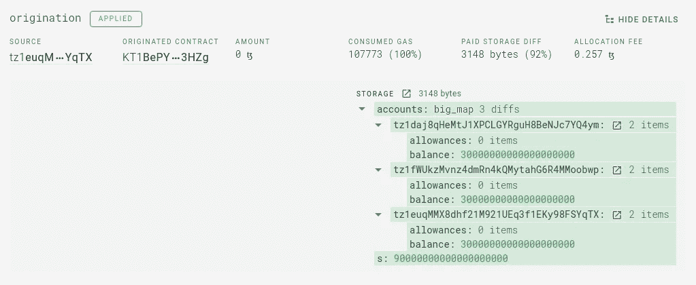

# 离线事件和 Tezos 令牌索引

> 原文：<https://medium.com/coinmonks/off-chain-events-and-tezos-tokens-indexing-f594fb147bcf?source=collection_archive---------3----------------------->

本文提出了一种令牌余额记帐的方法。这是早先提出的想法[的发展，考虑到即将到来的合同元数据标准](https://forum.tezosagora.org/t/deriving-fa-token-balance-updates-from-big-map-diff/1972) [TZIP-16](https://gitlab.com/smondet/tzip/-/blob/smondet-metadata-tzip16-02/proposals/tzip-16/tzip-16.md) 。

简而言之，在对改变令牌余额的操作进行索引时会出现一个问题:如果被调用的方法没有被标准化(目前我们只有 FA1.2/FA2 `transfer`)，或者如果在发起时有一个初始令牌分发，那么索引器就不可能确定哪些特定余额发生了变化以及如何发生变化。

> **终极目标** 从操作内容和结果中获取已变更的代币余额列表。

当前的方法是为已知的契约使用定制的处理程序。显然，它依赖于特定的索引器实现，并且不可伸缩，因此我们需要一个更好的替代方案，即:

1.  足够灵活以覆盖大多数情况；
2.  简单到足以实现/集成现有代码库；
3.  不依赖于任何特定的实体或实现。

# 链外事件

解决方案就在表面上:我们需要从索引器中取出所有的定制逻辑，并给契约的开发人员自己编辑它的机会。
这实际上是外部(链外)视图的概念:应用于契约存储的一段迈克尔逊代码。实际上，人们可以用 LIGO、SmartPy、Lorentz 或其他高级语言编写这些外部脚本，然后向下编译到迈克尔逊。
即将发布的 TZIP-16 标准化了链外视图，并定义了两种可在合同元数据中使用的视图。

> **注意** 索引元数据的任务超出了本文的范围，我们简单地假设对于一个特定的契约，我们有一个符合 TZIP-16 的数据文件。

现有的视图种类不足以满足我们的需求，所以我们建议增加一些新的。下面我们将列出需要使用离链视图的情况，以及相应的实现示例。

> **定义**

# 初始存储

让我们考虑这样一种情况，即在部署合同时预先制作并分发令牌。



除了从另一个合同复制整个分类帐的情况( *Big_map* copy，我们稍后再处理)，我们需要的一切都在结果存储中( *Big_map* items 已经包含在内)。

让我们以上面的样本契约的存储类型为例:

```
pair
    (big_map *%accounts* address 
                       (pair (map *%allowances* address nat) 
                             (nat *%balance*)))
    (nat %s)
```

相应的事件脚本应该有:

*   `unit`参数类型；
*   存储类型类似于目标合同中的存储类型，除了所有的`big_map`事件都被替换为`map`；
*   代码必须以一条`FAILWITH`指令结束，并且在栈顶必须有一个`map address balance`类型的值。

该值实际上是在协定调用期间更改的所有余额，对于每个更改，索引器需要知道:

*   持有人地址；
*   令牌 ID(如果合同中有多个令牌)；
*   最终余额。

请注意，我们可以省略令牌 ID，例如对于 FA1.2 或具有单个令牌的其他合同。否则我们只好用`**map** (**pair** address nat) nat`来代替。

以下是从给定的合同存储中导出令牌余额的脚本:

```
**parameter** unit;
**storage** (pair
            *# we changed `big_map` to `map` to be able to iterate*
            (map *%accounts* address (pair (map *%allowances* address nat) (nat)))
            (nat *%s*));
**code** {
    CDAR ; 
    MAP { CDDR } ;
    FAILWITH
}
```

调用带有`Unit`参数和原始存储的脚本，我们得到一个预期的运行时错误:

```
{ Elt "tz1daj8qHeMtJ1XPCLGYRguH8BeNJc7YQ4ym" 30000000000000000000 ; 
  Elt "tz1euqMMX8dhf21M921UEq3f1EKy98FSYqTX" 30000000000000000000 ;
  Elt "tz1fWUkzMvnz4dmRn4kQMytahG6R4MMoobwp" 30000000000000000000 }
```

最后，元数据文件看起来像这样:

```
{
    "version": "1.0.0",
    "license": "MIT",
    "authors": ["Unknown"],
    "interfaces": ["TZIP-7"],
    "views": [{
        "name": "get-changed-token-balances",
        "description": "Get changed token balances from the operation receipt.",
        "pure": "true",
        "implementations": [{ 
            "**michelson-initial-storage-token-event**": {
                "storage": {"prim": "pair", "args": [...]},  // modified storage type
                "return-type": {"prim": "map", "args": [{"prim": "address"}, {"prim": "nat"}]},
                "code": [{"prim": "CDR"}, {"prim": "CAR"}, ... , {"prim": "FAILWITH"}]
            }
        }]
    }]
}
```

请注意，我们有一个单独的视图项负责导出令牌平衡更新，并根据具体情况使用多个实现。

*最初发表于 2020 年 8 月 28 日*[*https://baking-bad.org*](https://baking-bad.org/blog/2020/08/28/off-chain-events-and-tezos-tokens-indexing/)*，在那里你可以找到文章的完整版本。*

## 另外，阅读

*   最好的[密码交易机器人](/coinmonks/crypto-trading-bot-c2ffce8acb2a)
*   [密码本交易平台](/coinmonks/top-10-crypto-copy-trading-platforms-for-beginners-d0c37c7d698c)
*   最好的[加密税务软件](/coinmonks/best-crypto-tax-tool-for-my-money-72d4b430816b)
*   [最佳加密交易平台](/coinmonks/the-best-crypto-trading-platforms-in-2020-the-definitive-guide-updated-c72f8b874555)
*   最佳[加密贷款平台](/coinmonks/top-5-crypto-lending-platforms-in-2020-that-you-need-to-know-a1b675cec3fa)
*   [最佳区块链分析工具](https://bitquery.io/blog/best-blockchain-analysis-tools-and-software)
*   [加密套利](/coinmonks/crypto-arbitrage-guide-how-to-make-money-as-a-beginner-62bfe5c868f6)指南:新手如何赚钱
*   最佳[加密制图工具](/coinmonks/what-are-the-best-charting-platforms-for-cryptocurrency-trading-85aade584d80)
*   [莱杰 vs 特雷佐](/coinmonks/ledger-vs-trezor-best-hardware-wallet-to-secure-cryptocurrency-22c7a3fd391e)
*   了解比特币的[最佳书籍有哪些？](/coinmonks/what-are-the-best-books-to-learn-bitcoin-409aeb9aff4b)
*   [3 商业评论](/coinmonks/3commas-review-an-excellent-crypto-trading-bot-2020-1313a58bec92)
*   [AAX 交易所评论](/coinmonks/aax-exchange-review-2021-67c5ea09330c) |推荐代码、交易费用、利弊
*   [Deribit 审查](/coinmonks/deribit-review-options-fees-apis-and-testnet-2ca16c4bbdb2) |选项、费用、API 和 Testnet
*   [FTX 密码交易所评论](/coinmonks/ftx-crypto-exchange-review-53664ac1198f)
*   [n 零审核](/coinmonks/ngrave-zero-review-c465cf8307fc)
*   [Bybit 交换审查](/coinmonks/bybit-exchange-review-dbd570019b71)
*   3Commas vs Cryptohopper
*   最好的比特币[硬件钱包](/coinmonks/the-best-cryptocurrency-hardware-wallets-of-2020-e28b1c124069?source=friends_link&sk=324dd9ff8556ab578d71e7ad7658ad7c)
*   最佳 [monero 钱包](https://blog.coincodecap.com/best-monero-wallets)
*   [莱杰纳米 s vs x](https://blog.coincodecap.com/ledger-nano-s-vs-x)
*   [bits gap vs 3 commas vs quad ency](https://blog.coincodecap.com/bitsgap-3commas-quadency)
*   [莱杰 Nano S vs 特雷佐 one vs 特雷佐 T vs 莱杰 Nano X](https://blog.coincodecap.com/ledger-nano-s-vs-trezor-one-ledger-nano-x-trezor-t)
*   [block fi vs Celsius](/coinmonks/blockfi-vs-celsius-vs-hodlnaut-8a1cc8c26630)vs Hodlnaut
*   Bitsgap 评论——一个轻松赚钱的加密交易机器人
*   为专业人士设计的加密交易机器人
*   [PrimeXBT 审查](/coinmonks/primexbt-review-88e0815be858) |杠杆交易、费用和交易
*   [埃利帕尔泰坦评论](/coinmonks/ellipal-titan-review-85e9071dd029)
*   [赛克斯石评论](https://blog.coincodecap.com/secux-stone-hardware-wallet-review)
*   [BlockFi 评论](/coinmonks/blockfi-review-53096053c097) |从您的密码中赚取高达 8.6%的利息