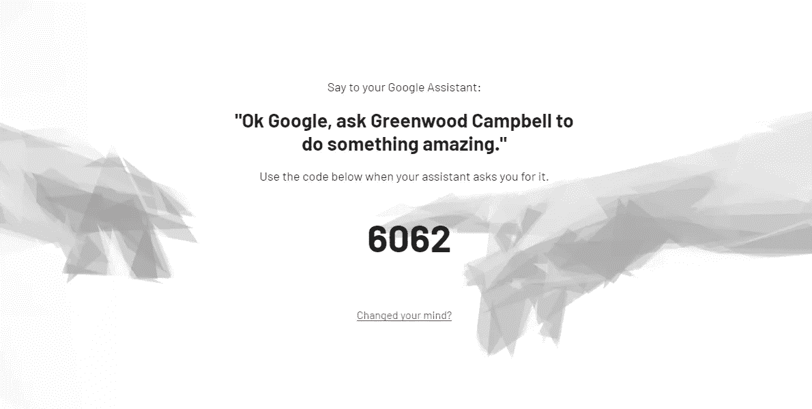

# “好的谷歌，向下滚动。”我们如何将谷歌助手 VUI 与网站整合

> 原文：<https://medium.com/coinmonks/ok-google-scroll-down-how-we-integrated-google-assistant-vui-with-a-website-eb5dfe6ac7b?source=collection_archive---------3----------------------->

有了这么多关于语音用户界面(VUI)的讨论，我决定尝试一下，围绕它做一点实验。这个想法是使用语音用户界面来完成一些不寻常的事情，但同时可以被广泛的观众所接受。因此，尽管我喜欢所有的物联网实验(如[这个](https://www.youtube.com/watch?v=X9inuvuyzHQ))，但我不得不放弃它们，因为它们需要硬件来玩。

它必须是**网上可以买到的东西**，于是我们决定把我们公司的网站作为一个游乐场。

*如果你只是想玩玩它，而不想了解它是如何制作的，现在就跳到这篇文章的底部。*

# 如果你能用语音浏览网站会怎么样？

哦是的。坐下来对着你的屏幕说话。这是展示 VUI 所能做的多么奇妙的方式啊！噱头？是的。但作为一家数字机构，我们有权利(如果不是义务的话)玩最新技术——谁知道它会在什么时候繁荣起来，把我们的努力货币化。

是的，类似的东西已经存在了——使用 SpeechAPI，你只需要 HTML 和 JS 技能就可以构建它。但事实很快证明，目前斯佩查皮的支持率非常低:

# **谷歌助手出手相救**

不得不寻找替代解决方案，我将研究转向智能音箱。最近在我们的机构，我们一直在尝试很多对话界面(聊天机器人)，以及语音助手(谷歌助手，Alexa，Siri)。没过多久，谷歌助手就被选为该项目的主要语音平台——它可以在每一款 Android 设备上使用，允许同时通过语音和视觉界面建立对话，附带很棒的 SDK 和文档——玩起来真的很有趣。

# 这个计划

那么，我们想要实现什么呢？首先，让我们考虑一个企业网站上的经典用户之旅:

1.  用户登陆主页
2.  向下滚动一点，看看发生了什么
3.  开始浏览感兴趣的区域。点击导航项目。
4.  用户阅读更多关于感兴趣的特定领域的内容，可能会播放一些视频。
5.  最后，想取得联系并填写联系表。

太棒了，让我们用声音来做这些。

# 工具

现在越来越科技化了。以下是我们使用的方法:

1.  [dialog flow](https://dialogflow.com/)——在谷歌上创建对话入口、意图和管理一切美好而简单的活动。
2.  [NodeJS](https://nodejs.org/)app——创建自定义函数并允许处理复杂的查询，否则在 Dialogflow 中是不可能做到的。
3.  Heroku —托管我们的 nodejs 应用程序。为了不让我们的应用程序睡着，需要一个付费计划
4.  [网站](https://www.greenwoodcampbell.com/)——理想情况下以单页应用的方式构建——允许平滑的页面转换，并使处理会话更容易
5.  [Socket.io](https://socket.io/) —连接 VUI 客户端和网站，允许实时通信

没多久就把所有东西组合在一起，创建了第一个功能，用语音触发。最耗时的事情是测试和错误处理。仅仅通过观察人们使用你的应用程序，你就能创造出令人难以置信的新功能、旅程、意图和流程。

其中一个挑战是引入同步机制将两个设备耦合在一起，并防止向其他客户端广播事件。令人欣慰的是，stack overflow 中有很多优秀的人给出了几乎所有用例的代码片段。随机生成的数字(服务器端)检查占用的组合，并送达回网站前端做的把戏。然后语音代理要求提供这个唯一的号码来同步设备，一旦操作成功，socket.io 就会在[同一个房间](https://socket.io/docs/rooms-and-namespaces/#Rooms)中欢迎代理和网站。

# 发布您的操作

为了让我们的行为被发现，我们必须通过批准过程。谷歌需要大约 1-2 天的时间来完成这项工作。
**注意！**每次您想要发布在 Dialogflow 中完成的哪怕是最小的更改，您都必须再次通过审批流程。说实话挺烦的，不过哎，质量第一。

最大的技巧是通过说“好吧，谷歌，请格林伍德·坎贝尔做一些令人惊讶的事情”来让一个意图被发现。这样，我们可以带用户进行我们的特殊旅程，并在 Dialogflow 设置中使用它作为上下文。上下文也是语音代理的一种记忆。

*后来发现，谷歌还用隐式调用索引了我们的意图:“好吧，谷歌，用语音控制一个网站”。你根本不用提我们的机构名称 Greenwood Campbell(这几乎就像免费获得一个网站域名！)更多关于动作发现和调用类型* [*这里*](https://developers.google.com/actions/discovery/) *。*

你仍然可以通过说“好的，谷歌，和格林伍德·坎贝尔谈谈”来触发格林伍德·坎贝尔行动，但是这样你就永远找不到网站控制者了。我们的实验计划首先从与网站互动开始。

# 米，不是米嘘

最有趣的(当我说有趣的时候，我的意思是我们挣扎得很厉害……)是我们接触的形式。

首先，我们允许用户说出他们的名字来填写表单上的字段。但是——如果你的名字不是英文，或者不太常见，谷歌助手要么没得到，要么拼错得很惨。我的姓是米——波兰语是“泰迪熊”的意思，但是谷歌从来没有弄对过。我不满意通过联系表发送错误的数据。

但是——每一个谷歌助手的用户都会在谷歌的数据库中以某种方式被识别。从你的账户中可能有各种各样的数据要检索，对吗？嗯，不是所有种类的数据。而且你必须允许谷歌助手使用它。但是它有效，并且提供准确的结果。[在这里查看](https://developers.google.com/actions/assistant/helpers)当你构建你的行动时，你能得到什么。联系方式问题解决。

# 外卖食品

现场启动这个实验使我们网站的流量增加了几倍，跳出率大幅下降，平均停留时间也有了很大改善。它也给我们带来了一些网站画廊的认可(和[奖项](https://www.awwwards.com/sites/greenwood-campbell)！)我们有一个很棒的 VUI 功能演示，即使它只是一个小游戏。不过，最好的收获是对各种系统的学习，以及在谷歌上向我们的客户交付行动的信心。

# 让我们来玩吧！

这就是:[https://www.greenwoodcampbell.com/](https://www.greenwoodcampbell.com/)

使用合适的浏览器和笔记本电脑/台式机屏幕启动 VUI 控制器。你需要在你的手机上安装谷歌助手或谷歌主页来与之互动。玩得开心:)

如果你也在尝试 VUI 和集成，请在评论中告诉我。我总是很高兴听到令人兴奋的想法。干杯！

编辑:由于这种整合不再是 greenwoodcampbell.com 网站的一部分，我认为它是如何工作的视频会很有用。在这里(声音不是很大，抱歉！)

> [直接在您的收件箱中获得最佳软件交易](https://coincodecap.com/?utm_source=coinmonks)

