# 你应该买 OKB 代币吗？OKExChain 令牌

> 原文：<https://medium.com/coinmonks/okb-token-74e71e909c26?source=collection_archive---------5----------------------->

分散交易所是未来，但人们不能忽视集中交易所在现在和不久的将来的作用。鉴于其自 2017 年以来的发展根源，难怪 OKEx 是另一个集中式交易所，但积极因素多于消极因素。这是因为该平台最近推出了自己的区块链，以 OKB 作为其本地令牌。

## 一分钟总结

*   **投放日期:** 2017 年
*   **自有区块链:**有，2020 年 2 月宣布- Ok 连锁
*   **自有指标:**是—2021 年上线
*   **交易费用:**0.1–0.15%
*   **全天候支持:**是
*   **交易对:** 400+
*   **支持菲亚特:**是
*   **手机 App:** 是
*   **位于:**马耳他
*   **演示交易:**是
*   KYC:是的

## OKEx 是什么？

OKEx 是最受欢迎的加密交换平台之一。此外，该平台提供如下各种产品，要了解更多信息，您可以阅读 [OKEx 评论](https://coincodecap.com/okex-review)。

*   永久互换
*   集成存储钱包
*   [OKEx 现货交易](https://coincodecap.com/okex-spot-trading)
*   密码对密码交易
*   秘密交易
*   [OKEx 保证金交易](https://coincodecap.com/okex-margin-trading)
*   通过移动应用进行交易
*   支持多种支付方式
*   [OKEx 期货交易](https://coincodecap.com/okex-futures-trading)

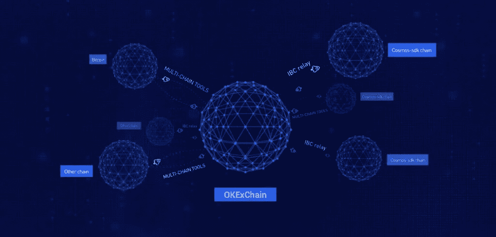

OKExChain

## 什么是 OKB 代币？

OKB 是一种全球通用的代币，由 OKEx 生产，OKChain 区块链的本地硬币，用于结算交易费用或在 OKChain 上建立的 Dapps 中使用。此外，在区块链俄克拉荷马州连锁医院成立后，OKB 从 ERC-20 医院转到了俄克拉荷马州连锁医院。

此外，OKB 代币持有者可以投票支持未来的代币上市。

1 个 OKB = 1 票

## OKB 令牌组学

在写这篇文章的时候，OKB 站在下面。

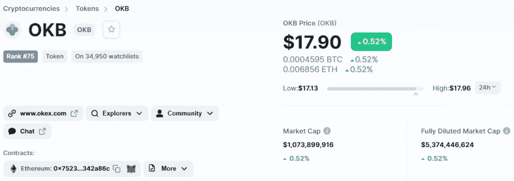

OKB: CoinMarketCap

以下是你可以购买代币的交易所。

需要注意的一点是，代币是通货紧缩的。它回购和燃烧。换句话说，在定期预定的时间间隔，一定数量的令牌将被烧毁，并且永远不会回来。下面是片段。

[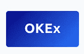](https://www.okx.com/join/8432835)[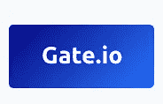](https://www.gate.io/ref/3674014)

需要注意的一点是，代币是通货紧缩的。它回购和燃烧。换句话说，在定期预定的时间间隔，一定数量的令牌将被烧毁，并且永远不会回来。下面是片段。

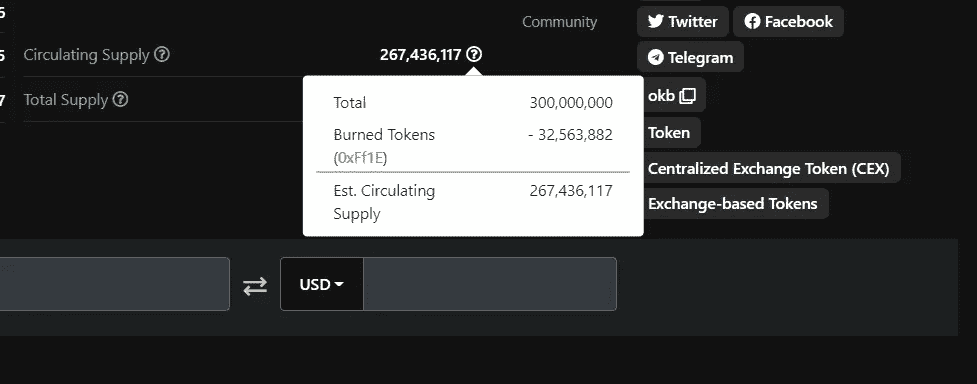

## OKB 代币回购和焚烧

OKB 代币回购和焚烧计划于 2019 年 5 月推出。该功能旨在保持平台的可持续增长。

在 2021 年 3 月 1 日至 2021 年 5 月 31 日之间，OKB 团队开始了第 12 轮回购和焚烧计划。本轮从二级市场回购并焚烧的 OKB 代币总数为 2，008，753.54 OKB——相当于 36，150，000 美元(按 90 天均价计算)——被移至特定焚烧地址。

OKB 回购和焚烧计划于 2019 年 5 月 4 日首次推出，当时 30%的现货市场交易费用于从最初的 300，000，000 OKB 池中回购代币，然后这些代币被转移到一个没有人可以访问的焚烧地址。

> 到目前为止，我们总共烧掉了 32，563，881.78 OKB。目前流通的 OKB 总数为 267，436，118.22 OKB。
> 
> *由*[OKEx](https://www.okex.com/support/hc/en-us/articles/360062074332-OKB-Buy-Back-and-Burn-report-2021-3-01-2021-05-31-)

令牌烧录的烧录地址如下:

刻录地址— [点击此处](https://www.oklink.com/eth/address/0xff1ee8604f9ec9c3bb292633bb939321ae861b30)

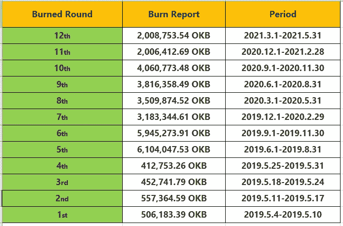

OKB Buy Back and Burn Report

## 多样化的生态系统应用

目前，OKB 生态系统包括全球 80 个正在开发的应用，包括支付、交易、钱包、贷款、金融管理、技术安全、旅游、生活服务、娱乐、社交网络、电子合同和 C2C 服务。

通过使用 OKB，OKB 持卡人还可以享受一流的安全服务、抵押贷款服务、各种钱包服务、线上和线下购物支付服务、酒店预订服务以及其他优惠。

作为一名杰出的 OKB 持有者，您可以访问以下多元化的 OKB 生态系统:

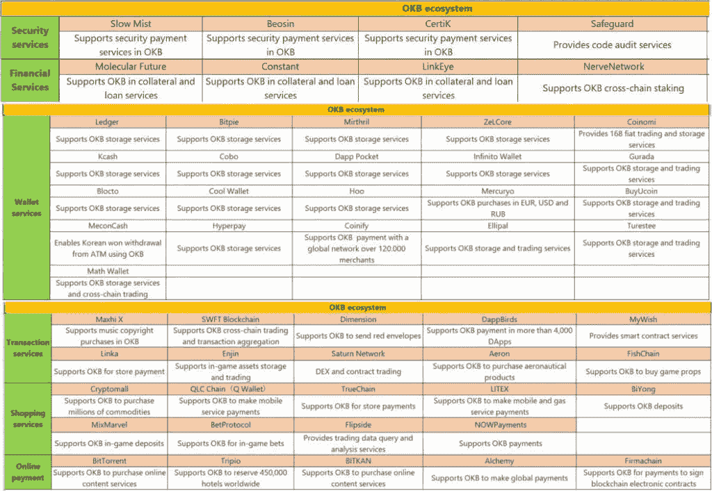

OKEx Ecosystem

## OKEx 为什么要做自己的区块链？

比特币交易所倾向于拥有自己的区块链。例如，币安在 2017 年发表的一篇论文获得了关注，但许多人只是在过去几年才开始朝着这个目标努力。

自 2019 年 4 月币安推出其本土区块链以来，至少有三家其他主要的集中式数字资产交易所透露了建设区块链网络的计划。

## OKChain

OKEx 在 2 月份表示，它自己的区块链 OKChain 正在进入测试阶段。2020 年 3 月，总部位于马耳他的加密交易所宣布，它正在建设一个区块链，并在其基础上建立一个分散式交易所(DEX)。

OKChain 是由 OKEx 建立的一个独立的商业公共链，它已经 100%开源，以便为我们所有的生态合作伙伴提供一个高效、免费和无限增值的生态系统。此外，交叉链和“OpenDEX”技术使 OKex 团队能够追求“商业链联盟”的愿景，以促进区块链行业的重大发展。

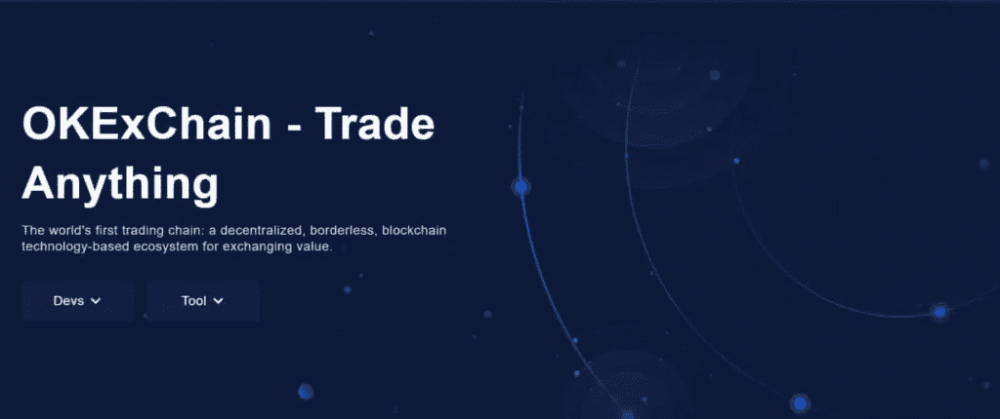

OKChain

## OKExChain 的技术优势

OKExChain 允许*多链并行开发*，可以大大加快开发速度，实现大规模应用的部署。此外，多方可以同时在一个应用程序上工作。

## 链上数据的扩展

链上的数据分为三层:块数据、操作数据和链外数据，所有这些都保留了区块链技术的优点，例如不可逆和防篡改。

只有*操作数据*被链上计算算法存储，当需要大量数据来达成共识时，减少了传送的数据量。

## 奥克西恩— OKB 托肯— OKT 三角

OKB 和 OKT 是 OKEx 连锁生态系统的本土标志。OKB 将可以在 OKEx DEX 上进行交易，使用该链的开放和无信任环境与用户在该平台上开发的分散交易所和交易对进行互动。

此外，在 OKExChain genesis 和 node 块上生成的另一个本机令牌 OKT 将根据 OKB 持有者的持股情况 100%映射到他们。因此，在奥克西恩，OKT 和 OKB 是不可分割的。

## OKEx 链浏览器

[OKExChain 块浏览器](https://www.oklink.com/)让你搜索、浏览和分析 OKExChain 数据，如块、事务、验证器和其他重要信息。

## OKEx 是一个可靠的交易所吗？

虽然在评估方面可能无法与某些加密货币交易所相比，但在消费者反馈方面，OKEx 在与世界上最大的加密货币交易所的竞争中占据了一席之地。

根据 236 条评论，OKEx 获得了最大的用户评论分析师 Trustpilot 的 4 星评级。

有趣的是，币安在 Trustpilot 上被评为 2 星。

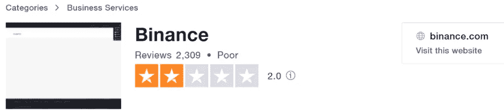

Binance TrustPilot Ratings

## KYC 验证

用户必须通过 KYC 验证才能获得提高代币取款限额和 C2C 交易等服务。用户需要 KYC 验证的内容如下:

*   护照或其他政府颁发的身份证明文件。
*   视频验证或/和居住地址。

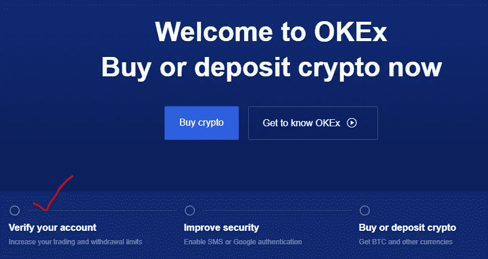

OKEx KYC Verification

## OKEx 费用

当用保证金交易较高的仓位并在一天内进行大量交易时，低成本可能是至关重要的，这可能会减少你的潜在收益。

要理解 OKEx 的收费，我们必须首先考察他们的客户水平。OKEx 有一个独特的制造者和接受者类别。创建者和接受者的费率由客户水平、交易市场和资产类型决定。

## 交易费用

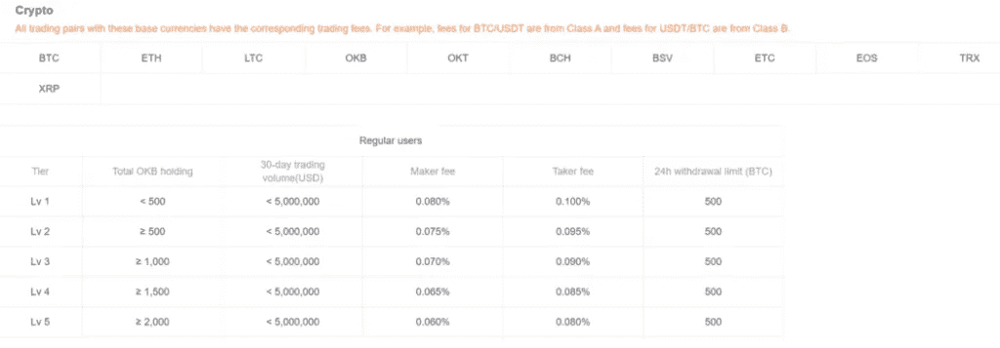

OKEx Trading Fees

普通用户如果保持每月至少 500 万美元的交易量，就可以晋升为 VIP。VIP 会员目前根据其交易量分为七个等级，交易量从 500 万美元到 10 亿美元不等。

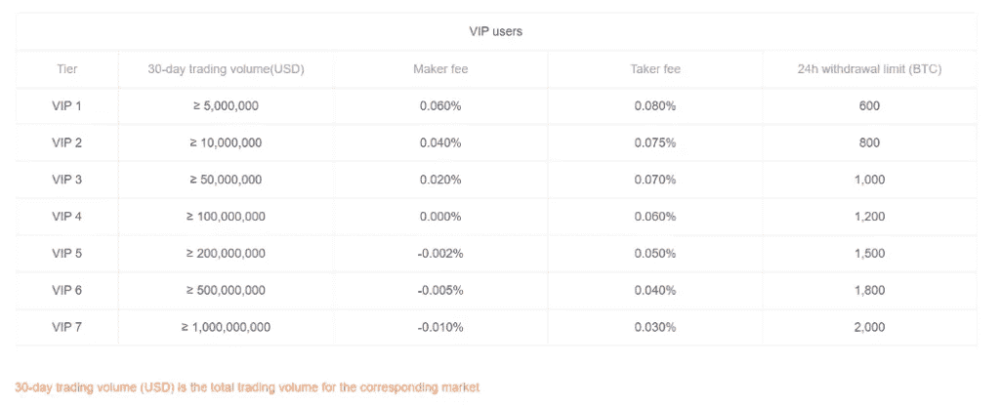

OKEx Trading Fees: VIP users

## OKEx 取款费

在所有知名交易所中，该平台的提款成本最低。例如，BTC 在 OKEx 上的取款费是 0.0004 BTC。

除了少数加密货币，OKEx 对其他加密货币不收取提现费用。因此，就存款成本而言，OKEx 不收取任何操作您的加密账户的费用。

## OKEx 安全吗？

与市场上的其他加密货币交易所一样，OKEx 重视安全性。因此，2FA、KYC 和 MFA 等安全措施已经成为加密领域的标准。

不遵守基本安全程序的钱包和交易所经常被列入黑名单或禁止使用。因此，OKEx 实施了强大的安全机制，允许客户保护他们的货币，而不会招致额外的风险。

OKEx 用户可以通过使用 MFA 或 2FA 认证来保护他们的资产。此外，在平台上开户之前，OKEx 用户必须验证他们的个人信息。尽管交易额达到 100 亿美元，但它没有任何黑客攻击的记录。

## 有没有 OKEx 的 app？

OKEx 移动交易应用程序可在所有主要平台上下载，包括 Android、iOS、微软和 Mac。用户可以通过手机即时交换资产。此外，OKEx 移动应用程序允许用户在旅途中进行技术分析。

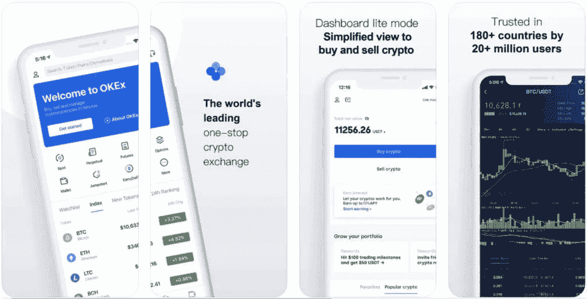

OKEx Mobile App

## OKEx 的挫折

当涉及到集中交易时，它们总是受到特定限制的约束。OKEx 在 2020 年 10 月禁止所有加密货币提现。

该交易所的主要股东之一已经“沉默”，因为他们“现在正在配合公安机关的调查。”OKEx 的首席执行官后来表示，调查是由于钥匙持有人的“个人问题”而进行的。

交易所在[发布的一份通知](https://www.okex.com/support/hc/en-us/articles/360051090391-Suspension-of-Digital-assets-Cryptocurrencies-Withdrawals)中称，钥匙持有人的缺席禁止兑现提款许可。

根据链上交易监控公司 Whale 的检测，在新闻发布前几个小时，以太、创和比特币的大量取款都是从已知的 OKEx 附属地址完成的。

OKEx 在一条推文中表示:“我们无法透露正在进行的调查的性质，但希望向所有 OKEx 用户保证，他们的资金是安全的，OKEx 上的所有其他功能都不受影响。”

在一个月的不确定性之后，OKEx 发布了一份新闻稿，表示他们已经[允许提款](https://www.okex.com/academy/en/okex-to-resume-withdrawals-after-the-temporary-suspension)。

## OKB Token/ OKEx:利弊

**优点**

*   超过 400 个不同交易对的优势
*   使用各种方法购买或出售加密货币，包括银行转账、Visa、万事达卡、ApplePay、Paypal 等
*   具有抵抗力的多层安全系统
*   苹果和安卓用户将受益于一款设计精良的移动应用
*   没有押金
*   与其他市场选择相比，交易和融资费用很低

**缺点**

*   联系客户服务部可能需要一些时间
*   主要国家在地理上受到限制
*   提款和转让的限制
*   不适合新手

## OKB Token/ OKEx:结论

竞争的集中交易总是有助于消费者获得有竞争力的价格。然而，任何集中交易都受到监管机构的密切关注。因此，最好的做法是在不使用或长期持有时，将硬币从集中交易所转移到冷钱包中。

请对你的钱的去向非常谨慎。

*   [ko only 回顾](https://coincodecap.com/koinly-review) | [Binaryx 回顾](https://coincodecap.com/binaryx-review)|[Hodlnaut vs CakeDefi](https://coincodecap.com/hodlnaut-vs-cakedefi-vs-celsius)
*   [40 个最佳电报频道](https://coincodecap.com/best-telegram-channels) | [1xBit 回顾](https://coincodecap.com/1xbit-review) | [Keevo 钱包回顾](https://coincodecap.com/keevo-wallet-review)
*   [如何在印度购买以太坊？](https://coincodecap.com/buy-ethereum-in-india) | [如何在币安购买比特币](https://coincodecap.com/buy-bitcoin-binance)
*   [在美国如何使用 BitMEX？](https://coincodecap.com/use-bitmex-in-usa) | [BitMEX 回顾](https://coincodecap.com/bitmex-review) | [买入索拉纳](https://coincodecap.com/buy-solana)
*   [德国最佳加密交易所](https://coincodecap.com/crypto-exchanges-in-germany) | [Arbitrum:第二层解决方案](https://coincodecap.com/arbitrum)
*   [比诺莫评论](https://coincodecap.com/binomo-review) | [斯多葛派 vs 3Commas vs TradeSanta](https://coincodecap.com/stoic-vs-3commas-vs-tradesanta)
*   [Capital.com 评论](https://coincodecap.com/capital-com-review) | [香港的加密借贷平台](https://coincodecap.com/crypto-lending-hong-kong)
*   [支持卡审核](https://coincodecap.com/uphold-card-review) | [信任钱包 vs 元掩码](https://coincodecap.com/trust-wallet-vs-metamask)
*   [赢取注册奖金——10 大最佳加密平台](https://coincodecap.com/earn-sign-up-bonus)

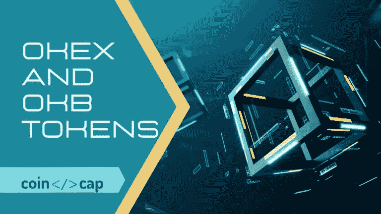

OKEx Tokens