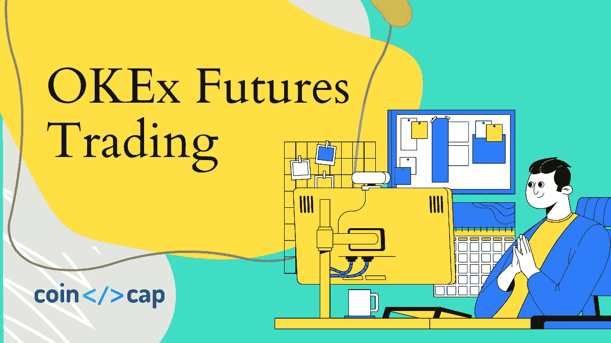
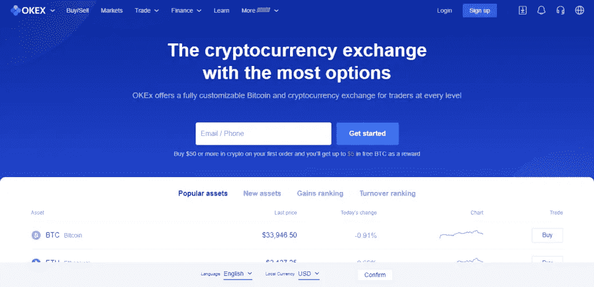
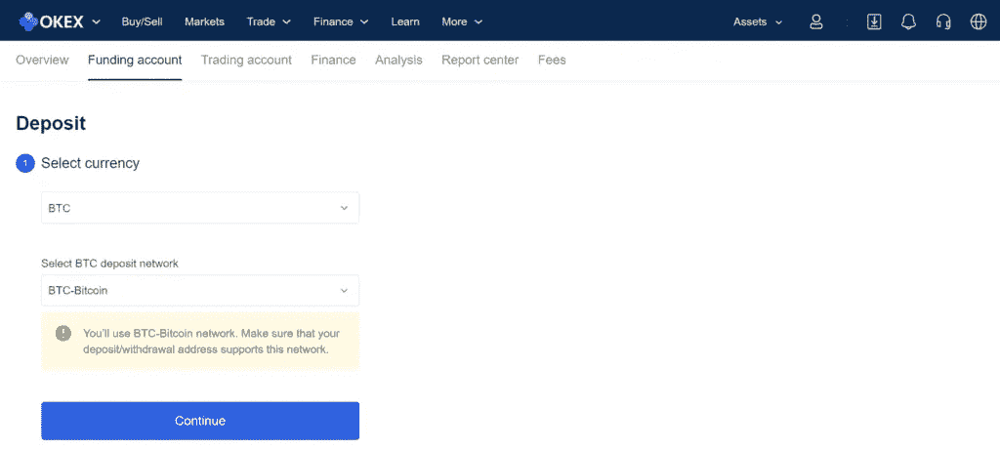
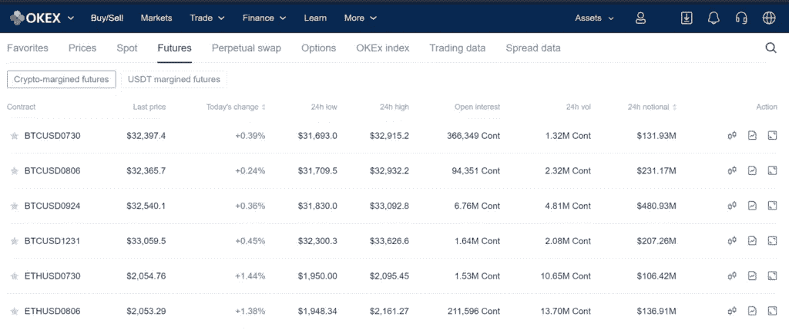
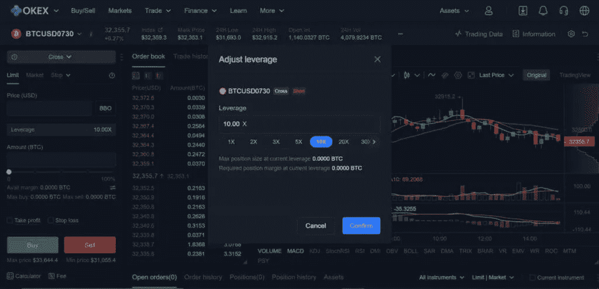
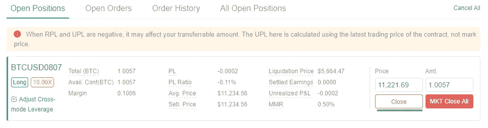
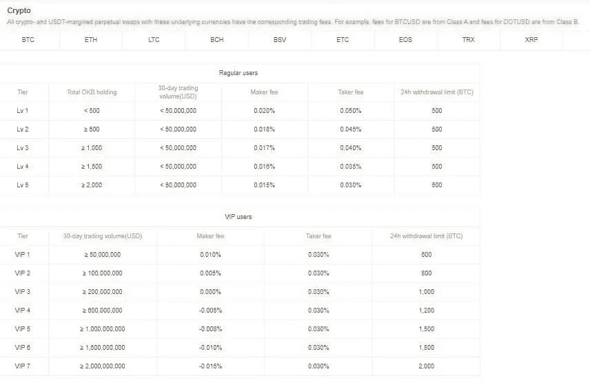

# OKEx 期货交易 2021:杠杆交易安全吗？

> 原文：<https://medium.com/coinmonks/okex-futures-trading-38c9533d9af1?source=collection_archive---------6----------------------->

Trading Futures at OKEx

OKEx 是提供期货交易的最好的加密交易所之一。此外，该平台支持 9 种加密资产和高达 100 倍的利用率。此外， [OKEx](https://blog.coincodecap.com/go/okex) 是在加密期货市场开始交易之旅的最佳地点。

# 总结(TL；博士)

*   OKEx 是一个加密交易所，提供各种加密资产、服务、交易对和支付选项。
*   提供的服务之一是标准和永久掉期合约的期货交易，杠杆高达 100 倍。
*   交易程序很简单，有两种保证金模式——固定保证金和交叉保证金。
*   交易者获得最佳出价的自动化选项。
*   你可以轻松地在 OKEx 进行期货交易，而且费用很低。

Try OKEx Futures Trading

# OKEx 是什么？

OKEx 是一个为各种交易者策划的交易所，从新手到老手，都有定制的范围。除了在 200 多个国家运营之外，该平台还提供 400 多个交易对和多种法定货币。它使交易者能够将 30 多种当地货币转换为 BTC、瑞士联邦理工学院、USDT 或所需的加密资产，并提供 VISA、Mastercard 和更多支付选项。要了解更多，请阅读 [OKEx 评论](https://blog.coincodecap.com/okex-review)。

此外，以旧换新现货，保证金，指数，永续，期货和各种订单类型的期权-限制，市场，停止和冰山。此外，OKEx 为采矿和财富管理提供加密借贷和高级工具。

OKEx Homepage

# 什么是加密期货交易？

加密期货交易是在预定的时间内以预定的价格买卖合同。在这种情况下，交易者要么在未来某个固定的价格和日期买入或卖出标的资产。这些加密资产主要是 BTC，联邦理工学院，长期合作，交通部，XRP 等，以及其他。交易者既可以交易有时间限制的期货合约，也可以交易永久掉期。

到期日用于识别期货。当合约即将到期或已经到期时，交易者会用现金平仓。要了解更多，请阅读[我们的加密期货交易指南](https://blog.coincodecap.com/futures-trading)。

# OKEx 期货交易

OKEx 包括服务大伞下的期货交易。是最好的期货交易平台之一。此外，它是 OKEX 提供的一种衍生品，用于购买/出售 BTC 或 LTC 等数字资产的加密资产合同，杠杆比率从 0.01 到 100 不等。

此外，这些合同中的每一份分别代表 BTC 或其他数字资产的 100 美元或 10 美元。此外，这些合同的期限为一周、两周、一个季度或两个季度。

衍生品交易(期货和期权)支持基础资产的价格发现，因为它们是预测或推测市场价格变动的必要工具。期货市场的走势是市场情绪的良好指标，因此对价格走势有支撑作用。

> *也读作:* [*OKEx 融资融券交易*](https://blog.coincodecap.com/okex-margin-trading)

# OKEx USDT 保证金期货

在 OKEx 上，交易者可以通过交易 USDT 保证金期货来建立自己的投资组合。你也可以通过衍生品或标记价格来跟踪它们。这有助于确定资产的移动。

几乎所有的合约在 USDT 保证金和硬币保证金中都有很好的交易量。交易者可以同时拥有多种合约类型的未平仓头寸，以很好地对冲他们的头寸。在选择上，合同时间的长短也可以由他们来决定。交易者可以在交易永久掉期时继续使用同样的策略。

Try OKEx Futures Trading

# OKEx 永久互换

OKEx 永久掉期类似于期货合约，交易者可以在基础资产中建立多头或空头头寸。然而，期货合约有一个到期日，或者只在特定时间内有效。理论上，永久互换可以无限期进行。交易者可以继续持有他们的头寸，只要他们愿意。随着合约临近到期，价格和标的资产价格将会趋同。但对于永久性互换，交易者将不得不支付一笔融资费用，以避免与基础资产现货价格出现重大偏离。

# OKEx 期货交易:特点

1.  **高流动性-** 交易者可以在 OKEx 上以高流动性交易期货合约，这意味着这些合约的最佳价格。
2.  **可用市场数据-** OKEx 提供市场数据和期货交易图表，以便更好地了解市场趋势。它给出了当前和历史市场数据，以获得最大利益。
3.  **多种合约-** OKEx 为多种数字资产提供标准和永久掉期期货合约。
4.  **降低风险系数:** OKEx 旨在降低价格波动和杠杆头寸方面的风险系数。例如，它将合同价值固定为 100 美元，而不是 BTC。因此，它使杠杆乘数保持不变，并稳定利润/损失。此外，它还帮助交易者进行种植和套利，以管理他们的资金。例如，投资 100 美元将通过以下方式产生利润:*100 美元*固定杠杆乘数* BTC 价格变化*

此外，OKEx 还提供了一个系统来保护交易者免受市场操纵策略的影响。它从六个不同的主要加密交换的索引中计算索引。

Try OKEx Futures Trading

# 如何在 OKEx 上交易期货？

OKEx 支持标准期货交易和永久互换。它允许对九种主要数字资产进行期货交易:BTC、LTC、ETH、ETC、BCH、XRP、EOS、BTG 和美元。

## 创建一个帐户

访问 OKEx 的官方网站，通过注册创建一个帐户。此外，验证您的电子邮件并登录您的 OKEx 帐户。

使用此 [**链接**](https://blog.coincodecap.com/go/okex) 在 OKEx 上创建一个账户，并获得交易费折扣。

## 融资期货账户

交易者需要向他们的账户提供资金，才能开始在平台上交易期货。因此，首先，导航到“资产”下拉菜单下的“基金”。此后，点击转账选项，然后将资金从资金账户转移到交易账户。

Funding Account

## 选择期货合约

首先，选择位于页面顶部的边距类型。例如，这里有两种类型的边距:

1.  **加密保证金期货**
2.  **USDT 保证金期货**

第二，选择合同到期所需的期限框架。根据名字，交易者得到关于合同的信息。

比如:BTCUSD0807。在这里，0807 表示 2020 年 8 月 7 日的到期日。

Select a Futures Contract

# 为合同选择杠杆

融资完成后，选择保证金模式和期望的杠杆乘数。在 [OKEx](https://blog.coincodecap.com/go/okex) 有两种余量模式。

1.  **固定**:保证金不随价格波动而变化。
2.  **交叉**:保证金随价格变化而变化。

# 订单详情和执行

输入交易所需的订单类型、价格和金额。然而，如果你想节省时间，点击 BBO，它会以最好的出价执行交易。最后决定做多还是做空。多头/空头头寸意味着买卖密码。

Order Details

## 检查您的订单

最后，一旦交易执行，交易者可以通过导航到交易视图底部的未结头寸标签来评估他们的头寸状态。该屏幕反映平均价格，清算价格，未实现的 P&L，和其他有益的信息。

## 平仓(可选)

如果交易者想要平衡未平仓头寸，他们可以点击*未平仓头寸*选项卡上的*平仓*。

Open Positions

> *另外，阅读* [*3 款最佳期货交易机器人|期货机器人*](https://blog.coincodecap.com/futures-trading-bot) *。*

# OKEx 交易费用

OKEx 的期货交易费用是有竞争力的，对 VIP 和普通用户是不同的。此外，您可以通过访问 [OKEx 费用部分](https://www.okex.com/en-IN/fees.html)查看完整列表。

OKEx futures trading fees

# OKEx 期货交易:结论

OKEx 对于新手和有经验的交易者来说是一个有益的加密交易所。它提供许多服务、订单类型和交易对，其中之一是期货交易。然而，合约本身是有风险的，主要是对经验丰富的交易者是可取的。期货交易有很多选项，可以定制订单，获得最大收益。不过，这个过程本身很简单，而且杠杆高达 100 倍，费用也很低。总的来说，OKEx 上的期货交易简单、便宜且有利可图。

Try OKEx Futures Trading

# 常见问题

**OKEx 的期货交易允许哪些加密资产？**

OKEx 支持交易所的期货交易，杠杆高达 100 倍。它支持九种加密货币——BTC、LTC、ETH、ETC、BCH、XRP、EOS、BTG /美元。

**OKEx 期货交易安全吗？**

OKEx 是最安全的加密平台，具有高交易流动性和交易量。它是全球性的。OKEx 上的期货交易是安全的。交易员可以定制自己的合约，以控制波动性和风险。此外，OKEx 为防止期货交易中的价格操纵提供了一个系统。总的来说，OKEx 对于期货或交易是安全的。

【OKEx 期货交易的费用和限额是多少？

OKEx 暗示了期货合约的一些费用和限制。这是一种基于层级的费用和限额。[这里](https://www.okex.com/fees.html)是一个详细的列表，供参考。

*   OKEx 评论 2021:这是合法的还是骗局？
*   [OKEx 保证金交易——杠杆交易安全吗？](https://blog.coincodecap.com/okex-margin-trading)
*   [OKEx 现货交易指南【2021】](https://blog.coincodecap.com/okex-spot-trading)
*   [市场上 5 款最佳 OKEx 交易机器人【2021】](https://blog.coincodecap.com/okex-trading-bot)
*   [期货交易——加密期货交易指南](https://blog.coincodecap.com/futures-trading)

*原载于 2021 年 7 月 27 日*[*https://blog.coincodecap.com*](https://blog.coincodecap.com/okex-futures-trading)*。*