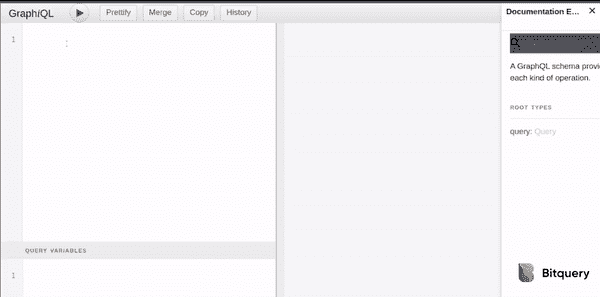
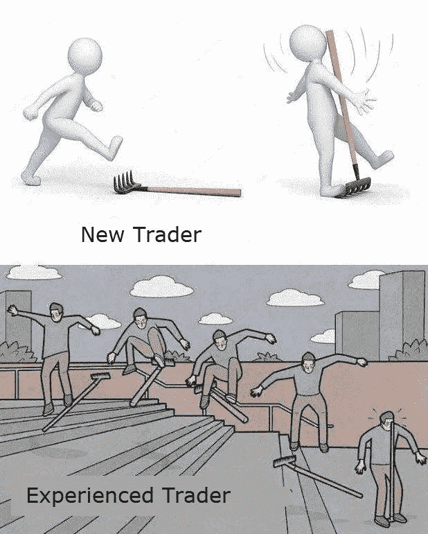
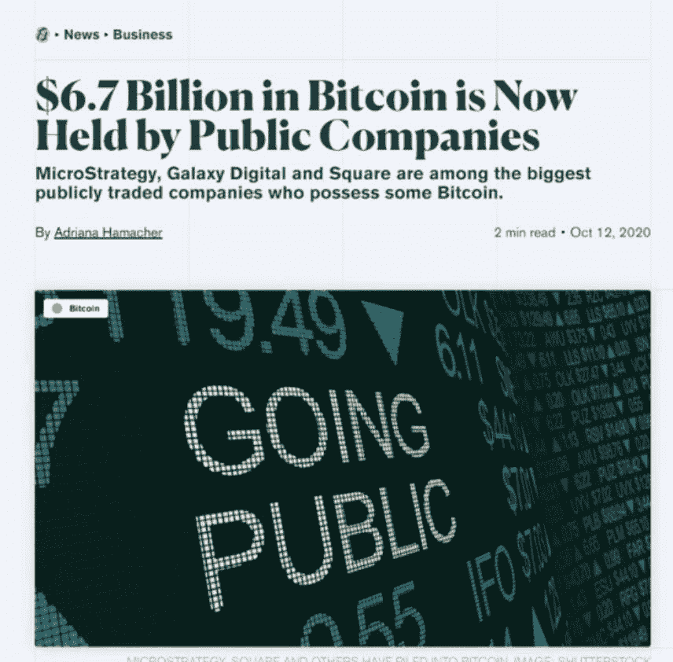

# OKEx 暂停所有提款/ Filecoin Mainnet 正在运行/ ETH2 存款合约将于本周推出

> 原文：<https://medium.com/coinmonks/okex-halted-all-withdrawals-filecoin-mainnet-is-live-eth2-deposit-contract-to-launch-this-week-9ef927ebbbab?source=collection_archive---------3----------------------->

## Schnorr 和 Taproot 合并为比特币/第一个比特币混合器，受到 FinCEN /通用基本收入应用程序发布的处罚

[Source](https://www.reddit.com/r/Bitcoin/comments/jdxv82/monday_art_diego_rodriguez/)

*   据报道，OKEx 交易所创始人徐明星正在与中国警方合作。因此，OKEx 停止了所有提款。恢复提款没有时间表或规定的标准。
*   一名以太坊 2.0 开发者预测，该协议的存款合同将在几天内发布，ETH 2.0 staking 将在今年上线。
*   Filecoin Mainnet 已经推出。三年前，它通过 ICO 筹集了 2 亿美元，但受到了延期的困扰。

[**ETH2.0 资源管理器**](https://bitquery.io/blog/eth2-explorer-api-widgets) **、小部件和 graph QL API**

[Bitquery](https://bitquery.io/) 增加了 ETH2.0[Medalla Testnet Explorer](https://explorer.bitquery.io/medalla)来显示 eth 2.0 数据和分析。此外，浏览器是由可嵌入的部件组成的，所以你现在可以在你的网站上嵌入 ETH2.0 数据部件。

此外，Bitquery 现在还支持[eth 2.0 graph QL API](https://graphql.bitquery.io/)。所以现在可以使用 Btiqery 查询 ETH2.0 网络。在这里阅读更多**。**

****

## **[数量不足](https://quadency.com/?r=ea20aa360c45d1f5ad47a19a)**

**试试 [Quadency](https://blog.coincodecap.com/go/quadency) ，这是一个为交易者构建的交易终端，用于自动化他们的加密交易。阅读我们的[季度回顾](/coinmonks/quadency-review-a-crypto-trading-automation-platform-3068eaa374e1)。**

****

## **最新消息📰**

*   **第一个比特币[“混合器”因违反反洗钱法被 FinCEN 处罚](https://www.fincen.gov/news/news-releases/first-bitcoin-mixer-penalized-fincen-violating-anti-money-laundering-laws)**
*   **以太坊 2.0 [存款合同](https://cointelegraph.com/news/ethereum-2-0-deposit-contract-to-launch-this-week-consensys-dev)将于本周推出:ConsenSys dev**
*   **CFTC 主席希斯·塔伯特谈论以太坊、DeFi 和下一个 BitMEX**
*   **富达[建议](https://www.coindesk.com/fidelity-report-says-portfolios-should-consider-5-bitcoin-allocation)投资组合考虑 5%的比特币配置**
*   **[Schnorr 和 Taproot 升级](https://www.btctimes.com/news/schnorr-taproot-upgrade-merged-into-bitcoin-core)提案并入比特币核心**
*   **[Filecoin 断然](https://decrypt.co/45529/filecoin-denies-mining-crisis)否认任何“矿业危机”**
*   **[通用基本收入](https://decrypt.co/45419/universal-basic-income-app-launches-gives-users-free-crypto)应用发布，为用户提供免费加密**
*   **[恢复](https://decrypt.co/45391/no-timeline-resuming-bitcoin-withdrawals-okex)比特币提现没有时间表:OKEx**
*   **Uniswap 的第一次治理投票以讽刺性的失败告终**
*   **深圳加油站[推出数字元](https://decrypt.co/45254/digital-yuan-rolls-out-for-use-in-shenzhen-gas-stations)**
*   **Stone Ridge [披露价值 1 . 15 亿美元的比特币投资是数十亿美元衍生产品的一部分](https://www.forbes.com/sites/michaeldelcastillo/2020/10/13/stone-ridge-reveals-115-million-bitcoin-investment-as-part-of-billion-dollar-spin-off/#9a4897f98506)**

> ***买一个* [***硬件钱包***](/coinmonks/the-best-cryptocurrency-hardware-wallets-of-2020-e28b1c124069)*[*保护你的加密货币*](/coinmonks/how-to-prevent-cryptocurrency-hacking-and-theft-from-your-wallet-65c8ff767766) *。****

******

***[Source](https://www.reddit.com/r/CryptoCurrency/comments/jaetq3/how_to_mine_bitcoin/)***

## ***好的读物📑***

*   ***做旧的事情[比做全新的事情](https://a16z.com/2020/10/18/doing-old-things-better-vs-doing-brand-new-things/)***
*   ***比特币主根简介[指南](/coinmonks/an-introduction-guide-on-bitcoin-taproot-7a8e0f06af8e)***
*   ***2020 年:[有足够的理由](/@matbalez/2020-reason-enough-to-take-another-look-at-bitcoin-7c32bc0da29f)重新审视比特币***
*   ***为什么我们[选择 xDai 链](/@perpetualprotocol/why-we-chose-xdai-chain-to-scale-perpetual-protocol-5b6cfd6cf5aa)来扩展永久协议***
*   ***DeFi — Alpha 释放的风险[分数](/gauntlet-networks/understanding-risk-in-defi-f64574593979)***
*   ***道斯& [基于令牌的治理](https://twitter.com/verbine/status/1315959108684722176)是一个幻想***
*   ***创作者，[社区](https://www.nichanank.com/blog/2020/10/9/gray-space-in-the-middle)，以及中间的灰色空间***
*   ***Gitcoin Grants 第 7 轮[回顾](https://vitalik.ca/general/2020/10/18/round7.html)***
*   ***[关于 2020 年 ETH 和 DeFi 现状的 7 大要点](https://twitter.com/spencernoon/status/1316384559416717315)和 20 个数据点***
*   ***[2020 年第三季度 DeFi](https://docs.google.com/viewer?embedded=true&url=https%3A%2F%2Fmessari-download.s3-us-west-2.amazonaws.com%2Fpdf%2Fdefi-review-q3-2020.pdf%3Futm_source%3Dproemail%26utm_medium%3Dpdf%26utm_campaign%3DDEFIQ3)***
*   ***[Defi 项目中的解剖风险](/coinmonks/dissecting-risk-in-defi-projects-5ad5b543b4ff)***
*   ***[抗脆弱](/coinmonks/antifragile-a-definition-worth-living-by-cf6575b479b1)——一个值得坚守的定义***
*   ***对 [NFT 平台的数据驱动展望](https://ournetwork.substack.com/p/our-network-issue-43)***

> ***检查 Block 团队的新 [**加密分析控制面板**](https://www.theblockcrypto.com/data/on-chain-metrics/bitcoin) 。***

******

***[Source](https://www.reddit.com/r/CryptoCurrency/comments/jebice/when_you_start_trading_defi_tokens/)***

## ***开发商***

*   ***翻开[以太坊 JavaScript](/nomic-labs-blog/turning-a-page-in-ethereum-javascript-history-4ec89136fccc) 历史的一页***
*   ***Fe:以太坊生态系统的新语言***
*   ***以太坊[DEX graph QL API](https://bitquery.io/blog/ethereum-dex-graphql-api)示例***
*   ***技术深度挖掘: [Geora 事件源](/geora/technical-deep-dive-the-geora-event-sourcing-architecture-27188bc1eb1a)架构***
*   ***用 js-libp2p 启动您的[应用](/moxystudio/kickoff-your-application-with-js-libp2p-68221baaf38c)***
*   ***SkyDB :一个用于分散式网络的可变数据库***
*   ***Arbitrum Rollup Testnet :全功能开放***
*   ***EIP 的[生活](/nethermind-eth/the-life-of-eip-8031e2c079d1)***
*   ***最新[eth 2 的新功能](https://hackmd.io/@benjaminion/eth2_news/https%3A%2F%2Fhackmd.io%2F%40benjaminion%2Fwnie2_201018)***
*   ***[100%的时间在 Etherscan 上验证您的合同](https://kndrck.co/posts/verify-contracts-etherscan-100/)***
*   ***任重道远:论[无气代币](https://soliditydeveloper.com/erc20-permit)和 ERC20-Permit***
*   ***如何[使用 ethers.js 重新发送天然气价格更高的交易](https://www.quiknode.io/guides/web3-sdks/how-to-re-send-a-transaction-with-higher-gas-price-using-ethers-js)***
*   ***Sushiswap [智能合约缺陷](/@DraculaProtocol/sushiswap-smart-contract-bug-and-quality-of-audits-in-community-f50ee0545bc6)和社区审计质量***
*   ***[构建互操作性](https://forum.openzeppelin.com/t/building-for-interoperability-why-we-re-focusing-on-upgrades-plugins/4088) : OpenZeppelin 升级插件***
*   ***Smart [契约测试驱动开发](/ethworks/pragmatic-smart-contracting-tdd-pairing-waffle-buidler-335e42c8762d)使用 Waffle & Buidler***
*   ***建立在以太坊主网上——一个固执己见的指南***
*   ***一个[引导](/upland/a-guide-to-nfts-in-upland-a62515f75aa4)去高地的非森林公园***

******

***[Source](https://www.reddit.com/r/CryptoCurrency/comments/jc23wz/every_time/)***

## ***多方面的***

*   ***使用 Prysm 用户界面设定 ETH2***
*   ***[ETH2.0 ETL](https://github.com/blockchain-etl/ethereum2-etl)***
*   ***[Solidity v0.7.4](https://solidity.ethereum.org/2020/10/19/solidity-0.7.4-release-announcement/) 出了！修复了一个存储损坏错误***
*   ***介绍[文学作品](https://litentry.medium.com/introducing-litentry-d47b23d54281)***
*   ***[使用 Snap store 为 Linux 安装 IPFS](https://snapcraft.io/ipfs)***
*   ***[弹弓](https://slingshot.filecoin.io/) —面向存储客户的社区竞赛***

## ***播客💽***

*   ***[设计以太坊](https://www.youtube.com/watch?v=-R0j5AMUSzA) | Vitalik Buterin***

## ***黑客马拉松、活动和峰会***

*   ***你好世界！由波尔卡多特***
*   ***【2020 年流动性***
*   ***[种子俱乐部](https://gitcoin.co/hackathon/seed-club-hacks/onboard)黑客马拉松***
*   ***[投资](https://events.bizzabo.com/invest-ethereum-economy)以太坊***
*   ***[Hackatom](https://hackatomv.devpost.com/)***

## ***加密交易和折扣🔖***

*   ***当你加入[***mud rex***](https://mudrex.com/signup?referral_code=COIN3566)时，你可以获得 25 美元的信用点数来支付费用***
*   ****在*[***Botsfolio***](/coinmonks/botsfolio.com/?coupon=gaure27)*使用此* [*链接*](/coinmonks/botsfolio.com/?coupon=gaure27) *。****
*   ***[**BlockFi**](https://blockfi.mxuy67.net/c/2458937/907782/10568) 向注册并在 30 天内存款的**提供高达 275 美元的比特币(BTC)奖励*****
*   *****SecuX STONE** 硬件钱包—使用优惠券代码“coinmonks”或“coinmonksw10”享受 15%的优惠***
*   ***全新 [**Trezor** 钱包盒](https://shop.trezor.io/?offer_id=10&aff_id=5199&source=coinmonks&tiny_url=1)有多种颜色可选***

## ***产品评论和其他加密软件📙***

*   ***[3commas Review](https://blog.coincodecap.com/3commas-review-an-excellent-crypto-trading-bot) |一款优秀的密码交易机器人***
*   ***你需要知道的 2020 年前 5 大[加密贷款平台](https://blog.coincodecap.com/top-5-crypto-lending-platforms)***
*   ***[2020 年最佳加密交易机器人](/coinmonks/whats-the-best-crypto-trading-bot-in-2020-top-8-bitcoin-trading-bot-c16adeb13317)***
*   ***[2020 年最佳加密交易平台](/coinmonks/the-best-crypto-trading-platforms-in-2020-the-definitive-guide-updated-c72f8b874555)***
*   ***最好的[加密税务软件](/coinmonks/best-crypto-tax-tool-for-my-money-72d4b430816b)***
*   ***[最佳加密交易平台](/coinmonks/the-best-crypto-trading-platforms-in-2020-the-definitive-guide-updated-c72f8b874555)***
*   ***Bitmex 上的[保证金交易的白痴指南](/coinmonks/the-idiots-guide-to-margin-trading-on-bitmex-dbbd7742c6fc?source=friends_link&sk=7bfa99d2a181142510c8442c8ddb0786)***
*   ***[加密摇摆交易的权威指南](/coinmonks/the-definitive-guide-to-crypto-swing-trading-7e4af6496d4d?source=friends_link&sk=70448050bd9323b42f63bfc0bb1e60d1)***
*   ***[Bitmex 高级保证金交易指南](/coinmonks/bitmex-advanced-margin-trading-guide-2270c195ce25?source=friends_link&sk=1d986cca731f5084b9a2db4a4bc4a7ad)***
*   ***[面向开发人员的最佳加密 API](/coinmonks/best-crypto-apis-for-developers-5efe3a597a9f)***

***想让我们展示你的产品吗？请通过 [Twitter @coinmonks](https://twitter.com/coinmonks) 联系我们***

## ***照片说明了一切📷***

******

## ***乔布斯👷***

*   ***Bitquery 正在招聘 [Ruby 开发者](https://angel.co/company/bitquery/jobs)***
*   ***[泽里昂](https://cryptocurrencyjobs.co/engineering/zerion-senior-frontend-engineer/) —高级前端工程师***
*   ***[MyCrypto](https://cryptocurrencyjobs.co/engineering/mycrypto-senior-front-end-engineer/) —高级前端工程师***
*   ***Celo 正在雇佣数据领导者***
*   ***a16z 正在[招聘](https://a16z.com/about/jobs/?gh_jid=4167628003)一名数据科学家***
*   ***Livepeer 正在招聘一名[区块链社区营销+运营主管](https://angel.co/company/livepeer/jobs/874811-blockchain-public-network-community-marketing-associate)***
*   ***作为营销总监[与 Chainlink 令人难以置信的生态系统合作](https://chainlinklabs.com/careers#job-492239)***
*   ***小道消息招聘精英[区块链安全工程师](https://jobs.lever.co/trailofbits/4f459855-3299-462f-9e73-299a840d5baf) & [app 安全](https://jobs.lever.co/trailofbits/8b7f7fc1-efb0-4e89-b406-784c3a2d77e4)***
*   ***DeFi devs！Yield 正在招聘可靠的前端人员—联系@yield.is***
*   ***0x 正在招聘开发人员！[全堆栈、后端、前端或可靠性](https://0x.org/about/jobs)***
*   ***Nexus Mutual: [经历了 Solidity dev](https://angel.co/company/nexus-mutual-1/jobs/967538-smart-contract-engineer)；首选欧洲时区***
*   ***[Devops 或 SRE](https://authenticjobs.com/job/3006/textile-devops-or-sre/) :纺织，远程。***
*   ***[分布式系统工程师](https://jobs.lever.co/3box):3 箱***
*   ***[前端显影剂](https://twitter.com/ceramicnetwork/status/1305886402886995968):陶瓷***
*   ***[远程高级软件工程师](https://jobs.lever.co/audius):奥迪斯，远程***
*   ***[UI 工程师](https://textile.breezy.hr/p/2efb847aca79-ui-engineer):纺织，远程***

## ***在 Coinmonks 上发布***

***如果你喜欢在 crypto/区块链空间上写教育文章，并且想在 Coinmonks 出版物上发表。只需在**发邮件给我或者 DM 我**[***推特***](https://twitter.com/coinmonks)*****

> ******“如果你喜欢读*[*coin monks*](https://medium.com/coinmonks)*[*你也可以捐我们*](/coinmonks/monks-need-your-help-7440418d67ec) *。*******

> *****[在您的收件箱中直接获得最佳软件交易](https://coincodecap.com?utm_source=coinmonks)*****

**********