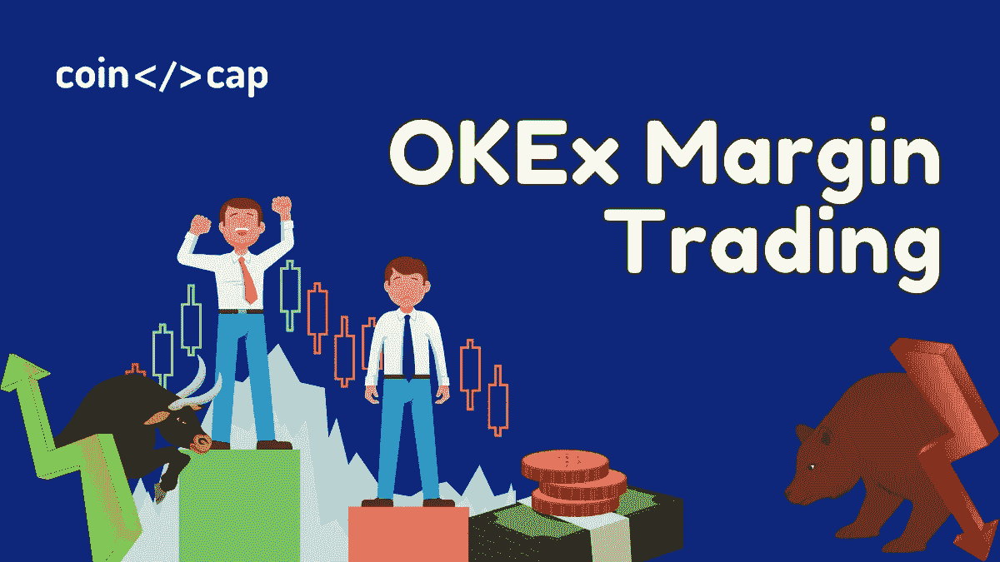
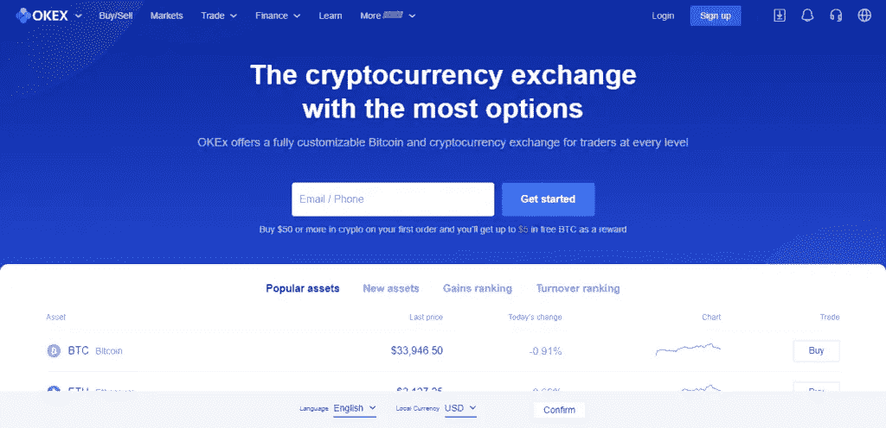
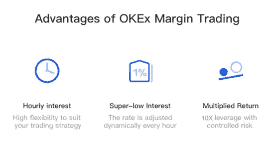
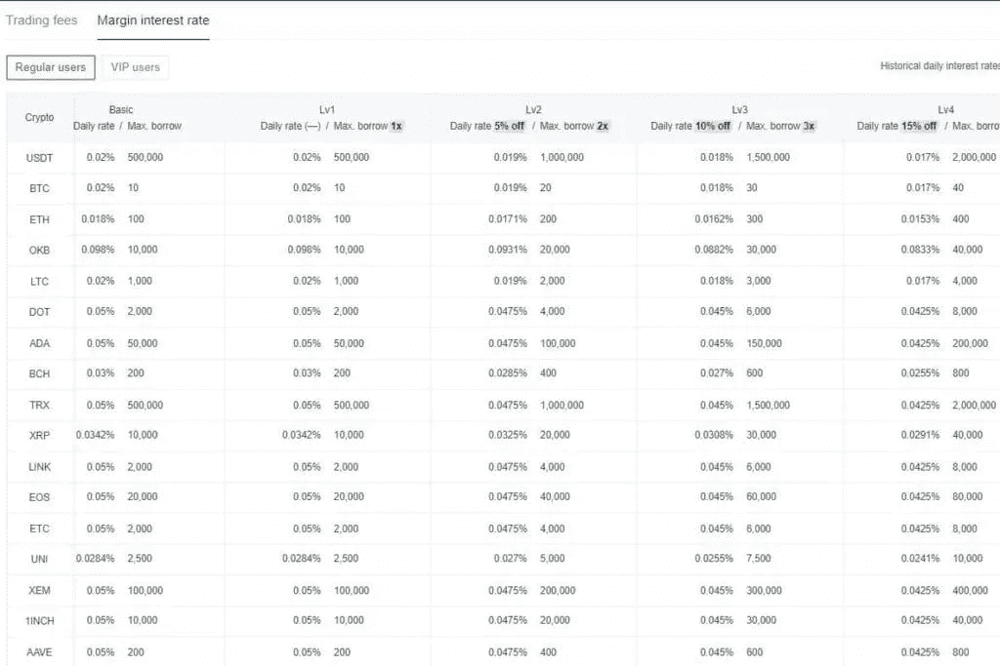
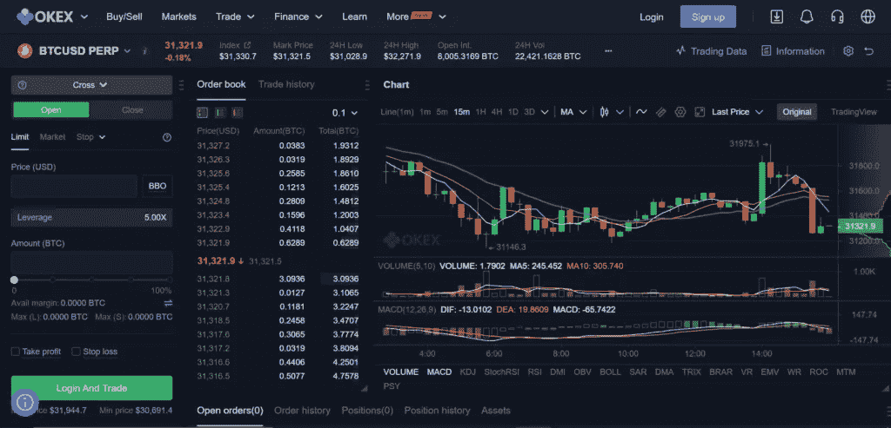
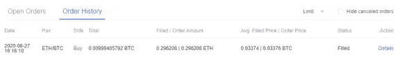
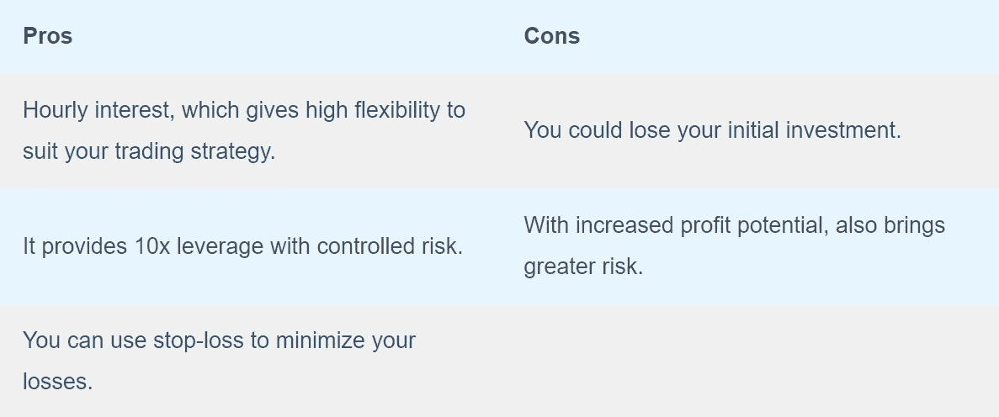

# OKEx 保证金交易-杠杆交易安全吗？

> 原文：<https://medium.com/coinmonks/okex-margin-trading-a28d8944f8ef?source=collection_archive---------4----------------------->

OKEx Margin Trading

加密市场为交易者提供几种交易类型，其中一种是保证金交易。今天在这篇文章中，我们将为您全面介绍 [OKEx](https://blog.coincodecap.com/go/okex) [保证金交易](https://blog.coincodecap.com/go/margin-trading)以及如何在 [**OKEx 交易所**](https://blog.coincodecap.com/go/okex) 使用杠杆。

# 总结(TL；博士)

*   [**OKEx**](https://blog.coincodecap.com/go/okex) 提供加密[保证金交易](https://blog.coincodecap.com/go/margin-trading)平台，拥有 30 多种加密货币和多个交易对，利率极具竞争力。
*   [保证金交易](https://blog.coincodecap.com/go/margin-trading)有几个必备要素——[杠杆交易](https://blog.coincodecap.com/leveraged-token)，利息，平仓价格，交叉/隔离，多头/空头。
*   此外， [OKEx](https://blog.coincodecap.com/go/okex) 允许杠杆高达 10 倍，并有最大借款限额。
*   该交易所提供三种订单类型-停止，触发，提前限制。
*   高级限额进一步分类为仅过账、FOK 和立即或取消。

# 什么是 OKEx 交易所？

OKEx 是一个可定制的加密交易所，在 200 多个国家运营。该平台通过各种订单类型和高级工具提供现货、保证金、DEX、永久、期货和期权交易。此外，OKEx 还提供赌注、贷款、联营等服务。为你的加密资产提供被动收入。

要了解更多，请阅读 [OKEx 评论](https://blog.coincodecap.com/okex-review)。

OKEx

# 什么是保证金交易？

[保证金交易](https://blog.coincodecap.com/margin-trading)允许你用你的资本作为抵押品来借入资金。此外，你可以利用杠杆选择你想借的金额。然而，杠杆越高，涉及的风险就越大。

保证金交易是高度投机的，如果市场与你的预测不一致，那么你可能会失去所有的抵押品。此外，如果不使用适当的止损，你的抵押品可能会在市场突然波动时变现。

> *还有，阅读* [*5 个最好的比特币保证金交易交易所*](https://blog.coincodecap.com/bitcoin-margin-trading-exchange)

# OKEx 保证金交易:术语表

## 杠杆作用

杠杆率是交易者决定从贷方借款以增加投入资本的原始金额的百分比。 [**OKEx**](https://blog.coincodecap.com/go/okex) 提供了高达 125 倍的杠杆。例如，如果你运用 2 倍杠杆，你得到的是实际抵押品的两倍。比如，300 美元通过 2 倍杠杆变成 600 美元，总资本变成 900 美元。

## 兴趣

像任何其他贷款一样，贷方也收取利息。然而，在加密市场和保证金交易中，利息是按小时计算的。这个利息百分比在不同的[密码交易所](https://blog.coincodecap.com/go/crypto-exchange)中有所不同。然而，例如，这个小时费率低至 **0.003%** 。所以，交易者可以通过适当的策略在几个小时内赚取大量利润。要了解更多信息，[请访问](https://www.okex.com/en-IN/fees.html)OKEx 利润率部分。

## 清算价格

我们在上面提到了你的抵押品永久清算的损失情况。所以，当你开始失去一个头寸，并且 [**OKEx**](https://blog.coincodecap.com/go/okex) 开始亏损，那么它会部分或全部自动卖出你的资产以防止亏损。

## 交叉/隔离

在交叉保证金模式下，你可以用抵押品获得多笔贷款。此外，建立交叉保证金头寸可以防止你平仓，因为你的盈利头寸可以支持你的亏损头寸。

在孤立的形式中，特定头寸的抵押品仅限于该头寸本身。此外，一个孤立的立场是建议初学者，因为它可以防止你失去一切，在清算的情况下，你只是失去了特定位置的资本。

> 要了解更多信息，请阅读[什么是保证金交易？保证金交易是如何运作的？](https://blog.coincodecap.com/margin-trading)

## 长/短

在保证金交易中做多意味着购买一项预期会增值的资产。在融资融券交易中做空意味着卖出一项预计未来会贬值的资产。意味着未来价格下跌，你回购加密资产获利。

# OKEx 保证金交易

[**OKEx**](https://blog.coincodecap.com/go/okex) 提供多种加密资产和交易类型的保证金交易平台。目前，OKEx 支持 30 多种加密资产，最大利用率高达 10 倍。

此外， [OKEx 账户](https://blog.coincodecap.com/go/okex)包括用于保证金交易的不同交易类型的十个账户。此外，交易者可以借入的最大金额取决于三个因素:

1.  保证金账户余额，
2.  主要账户，以及
3.  头寸保证金比率

此外，个人的借款限额因交易对手而异。例如，如果一个交易者借 1，000，000 USDT 用于 BTC/ USDT 交易，他仍然可以额外借 500，000 USDT 用于 XRP/ USDT 交易。这些限额因多种因素而异，确切的金额可在保证金交易页面上找到。

> *同样，阅读* [*最佳 7 种密码交易信号电报渠道*](https://blog.coincodecap.com/best-crypto-signals-telegram)

# OKEx 保证金利率

可征收的利率因加密资产和账户级别而异。利率因层级结构而异。这里是一些加密资产的利益表。您可以从保证金利率页面查看[明细表](https://www.okex.com/fees.html)。

OKEx Interest Rates

上表是关于统一账户的借款限额。对于经典账户，借款限额为统一账户的 100%(USDT 的比例为 60%)。

# 如何在 OKEx 上进行保证金交易？

这里是一个循序渐进的教程，适用于新手和资深交易者在 OKEx 上利用杠杆交易加密货币。此外， [**OKEx**](https://blog.coincodecap.com/go/okex) 为有经验的用户提供很少的高级交易功能，以方便复杂的交易策略。

# 保证金交易部分的导航和激活

进入 OKEx 主页，进入顶部菜单的交易，同时选择保证金交易标签。如上所述，融资融券交易风险很大。因此， [OKEx](https://blog.coincodecap.com/go/okex) 有一个额外的激活步骤来提防交易者。

# 选择保证金交易对

此时，交易者可以从 OKEx 的保证金交易窗口的左边栏中选择所需的交易对。此外，屏幕会在每个保证金交易对旁边显示最大杠杆倍数。

## 选择杠杆金额

现在，交易者可以从融资融券交易平台右上角标有“杠杆”的蓝框中选择杠杆金额。 [**OKEx**](https://blog.coincodecap.com/go/okex) 还提供所选杠杆金额的借款限额和所需的维持保证金。如果选择的杠杆数量超过建议的保证金，将显示一条警告消息。最后，在选择所需的杠杆率后，单击提交。

现在，要增加您的保证金头寸，请单击“借入”从资产栏的右侧借入额外资金。然后，再次点击提交以确认借款。

## 保证金交易详细信息

比如，你选择了 ETH/ BTC。现在点击买入/卖出标签来买入/卖出 ETH。同时，输入订单类型、BTC 价格和加密资产金额。此外，每种加密货币都有不同的最低购买/销售限额。在 [**OKEx**](https://blog.coincodecap.com/go/okex) 输入这些细节时，它显示在屏幕上。

# OKEx 保证金交易:审核交易

成功提交和执行交易后，通过订单历史选项卡查看交易状态。此部分显示诸如已完成订单和订单金额等信息。填充价格和订单价格，状态，等等。如果订单未执行，检查未结订单的状态。

## 偿还借款金额

点击交易平台右侧的偿还。接下来，选择一个加密货币单位和还款金额。最后，点击提交以偿还借款金额。

如果保证金账户与维持保证金不符，就会触发追加保证金通知。在这种情况下，交易者要么追加资金，要么部分或全部清算抵押品。

> *使用市场上最好的 5 款 OKEx 交易机器人* [*自动完成交易*](https://blog.coincodecap.com/okex-trading-bot)

# OKEx 保证金交易:利弊

OKEx Margin Trading: Pros and Cons

# OKEx 保证金交易:结论

[**OKEx**](https://blog.coincodecap.com/go/okex) 为交易者提供保证金交易平台，拥有超过 30+加密资产和 125 倍杠杆。该门户是安全的，并采取必要的步骤来减少风险和暴露。它有多个警告和触发器，以确保交易者的安全。该交易所可按竞争性利率定制各种市场类型。这个过程很漫长，但对任何交易者来说，在 OKEx 开始交易都很容易。总的来说，保证金交易有风险，但通过精确的交易策略可以产生利润。

# 常见问题

【OKEx 支持保证金交易吗？

OKEx 是一个综合性的[加密交易所](https://blog.coincodecap.com/go/crypto-exchange)，为交易者提供多种服务。它允许在平台上进行保证金交易。这里，统一账户支持保证金交易。

**OKEx 融资融券的借款限额是多少？**

[**OKEx**](https://blog.coincodecap.com/go/okex) 有一个融资融券的借款限额，这个限额随多种因素而变化。交易者可以借入的最大金额取决于三个因素:
**—**保证金账户余额、
—初级账户、
—**—**持仓保证金比例

**OKEx 中支持保证金交易的加密货币有哪些？**

OKEx 在交易所支持超过 35 种加密货币。下面是 [**OKEx**](https://blog.coincodecap.com/go/okex) 在平台上接受的几种加密货币。
BTC，LTC，ETH，ETC，BCH，USDT，BSV，DASH，EOS，NEO，QTUM，TRX，XRP，ADA，ALGO，ATOM，BTM，BTT，ELF，HC，ist，IOTA，LINK，OKB，OMG，ONT，VSYS，XLM，XMR，XTZ，ZEC，ZIL，HBAR，RVN。

*   [Pionex 套利机器人|通过现货赚取—期货加密套利](https://blog.coincodecap.com/pionex-arbitrage-bot)
*   [Bybit 保证金交易指南 2021](https://blog.coincodecap.com/bybit-margin-trading)
*   [bit MEX 2021 年回顾—保证金交易、费用、测试网和计算器](https://blog.coincodecap.com/bitmex-review)
*   [币安保证金交易 2021 |你需要知道的一切](https://blog.coincodecap.com/binance-margin-trading)
*   [5 家最佳比特币保证金交易交易所【2021】](https://blog.coincodecap.com/bitcoin-margin-trading-exchange)

> 加入 [Coinmonks 电报频道](https://t.me/coincodecap)，了解加密交易和投资

## 另外，阅读

*   [尤霍德勒 vs 科恩洛安 vs 霍德诺特](/coinmonks/youhodler-vs-coinloan-vs-hodlnaut-b1050acde55a) | [Cryptohopper vs 哈斯博特](https://blog.coincodecap.com/cryptohopper-vs-haasbot)
*   [币安 vs 北海巨妖](https://blog.coincodecap.com/binance-vs-kraken) | [美元成本平均交易机器人](https://blog.coincodecap.com/pionex-dca-bot)
*   [如何在印度购买比特币？](/coinmonks/buy-bitcoin-in-india-feb50ddfef94) | [WazirX 审核](/coinmonks/wazirx-review-5c811b074f5b) | [BitMEX 审核](https://blog.coincodecap.com/bitmex-review)
*   [比特币主根](https://blog.coincodecap.com/bitcoin-taproot) | [Bitso 评论](https://blog.coincodecap.com/bitso-review) | [排名前 6 的比特币信用卡](/coinmonks/bitcoin-credit-card-bc8ab6f377c6)
*   [双子座 vs 比特币基地](https://blog.coincodecap.com/gemini-vs-coinbase) | [比特币基地 vs 北海巨妖](https://blog.coincodecap.com/kraken-vs-coinbase) | [硬币罐 vs 硬币点](https://blog.coincodecap.com/coinspot-vs-coinjar)
*   [印度加密交易所](/coinmonks/bitcoin-exchange-in-india-7f1fe79715c9) | [比特币储蓄账户](/coinmonks/bitcoin-savings-account-e65b13f92451) | [Paxful 审核](/coinmonks/paxful-review-4daf2354ab70)
*   [杠杆令牌](/coinmonks/leveraged-token-3f5257808b22) | [最佳加密交易所](/coinmonks/crypto-exchange-dd2f9d6f3769) | [AscendEX 评论](/coinmonks/ascendex-review-53e829cf75fa)
*   [Godex.io 审核](/coinmonks/godex-io-review-7366086519fb) | [邀请审核](/coinmonks/invity-review-70f3030c0502) | [BitForex 审核](/coinmonks/bitforex-review-c4bb28d9e271) | [HitBTC 审核](/coinmonks/hitbtc-review-c5143c5d53c2)
*   [Crypto.com 费用](/coinmonks/binance-fees-8588ec17965) | [僵尸加密审查](/coinmonks/botcrypto-review-2021-build-your-own-trading-bot-coincodecap-6b8332d736c7) | [替代品](https://blog.coincodecap.com/crypto-com-alternatives)
*   [MXC 交易所评论](/coinmonks/mxc-exchange-review-3af0ec1cba8c) | [Pionex vs 币安](https://blog.coincodecap.com/pionex-vs-binance) | [Pionex 套利机器人](https://blog.coincodecap.com/pionex-arbitrage-bot)
*   [我的密码交易经验](/coinmonks/my-experience-with-crypto-copy-trading-d6feb2ce3ac5) | [比特币基地评论](/coinmonks/coinbase-review-6ef4e0f56064)
*   [CoinFLEX 评论](https://blog.coincodecap.com/coinflex-review) | [AEX 交易所评论](https://blog.coincodecap.com/aex-exchange-review) | [UPbit 评论](https://blog.coincodecap.com/upbit-review)
*   [AscendEx 保证金交易](https://blog.coincodecap.com/ascendex-margin-trading) | [Bitfinex 赌注](https://blog.coincodecap.com/bitfinex-staking)
*   [麻雀交换评论](https://blog.coincodecap.com/sparrow-exchange-review) | [纳什交换评论](https://blog.coincodecap.com/nash-exchange-review)
*   [加密货币储蓄账户](/coinmonks/cryptocurrency-savings-accounts-be3bc0feffbf) | [赌注加密](https://blog.coincodecap.com/staking-crypto) | [StealthEX 评论](/coinmonks/stealthex-review-396c67309988)
*   [BigONE 交易所评论](/coinmonks/bigone-exchange-review-64705d85a1d4) | [CEX。IO 审查](https://blog.coincodecap.com/cex-io-review) | [Swapzone 审查](/coinmonks/swapzone-review-crypto-exchange-data-aggregator-e0ad78e55ed7)
*   [最佳比特币保证金交易](/coinmonks/bitcoin-margin-trading-exchange-bcbfcbf7b8e3) | [Bityard 保证金交易](https://blog.coincodecap.com/bityard-margin-trading) | [Prokey 审核](/coinmonks/prokey-review-26611173c13c)
*   [加密保证金交易交易所](/coinmonks/crypto-margin-trading-exchanges-428b1f7ad108) | [赚取比特币](/coinmonks/earn-bitcoin-6e8bd3c592d9) | [Mudrex 投资](https://blog.coincodecap.com/mudrex-invest-review-the-best-way-to-invest-in-crypto)
*   [WazirX vs coin dcx vs bit bns](/coinmonks/wazirx-vs-coindcx-vs-bitbns-149f4f19a2f1)|[block fi vs coin loan vs Nexo](/coinmonks/blockfi-vs-coinloan-vs-nexo-cb624635230d)
*   [BlockFi 信用卡](https://blog.coincodecap.com/blockfi-credit-card) | [如何在币安购买比特币](https://blog.coincodecap.com/buy-bitcoin-binance)

*原载于 2021 年 7 月 18 日 https://blog.coincodecap.com**[*。*](https://blog.coincodecap.com/okex-margin-trading)*