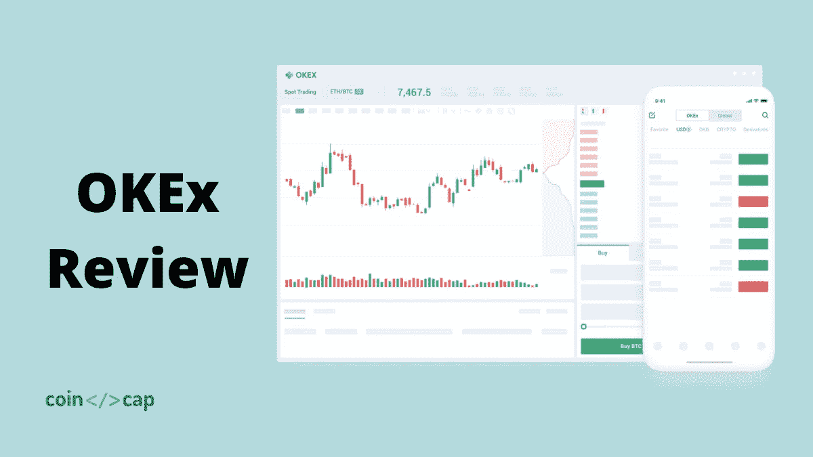
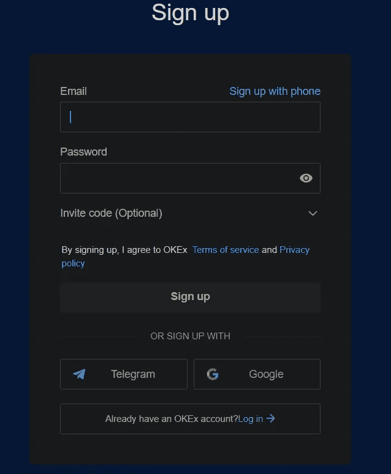
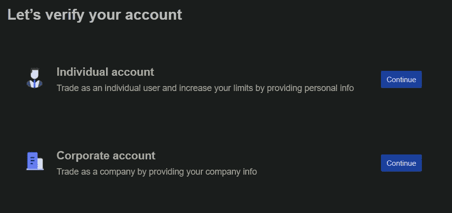
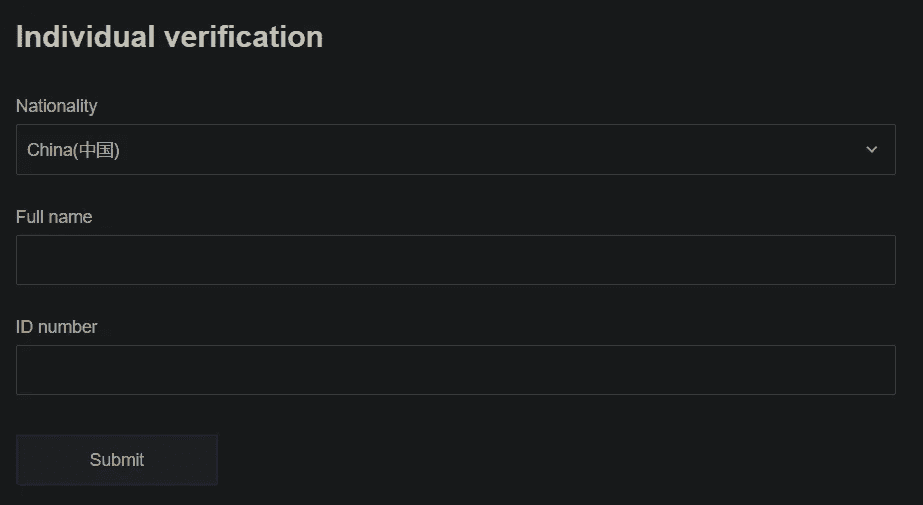
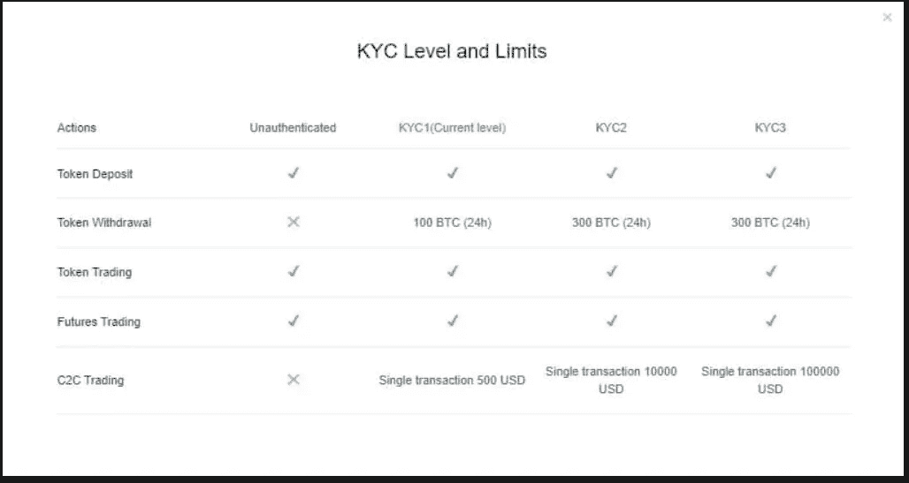
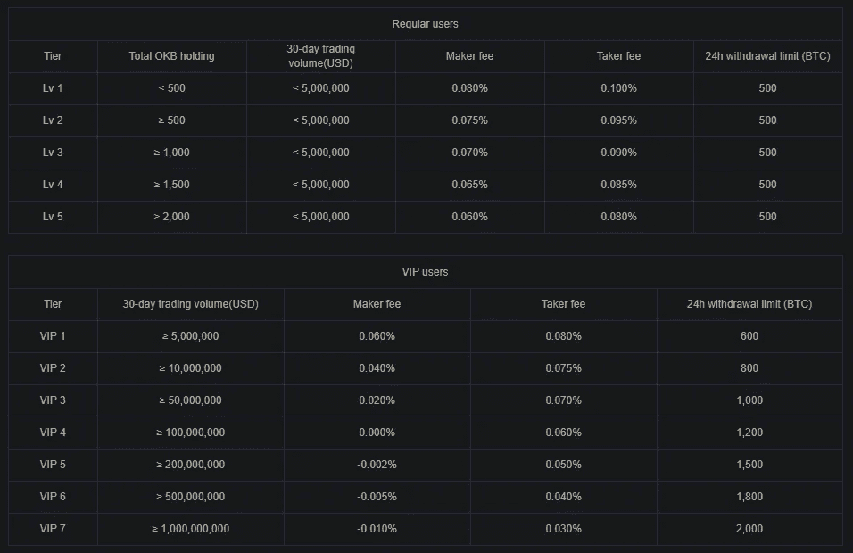
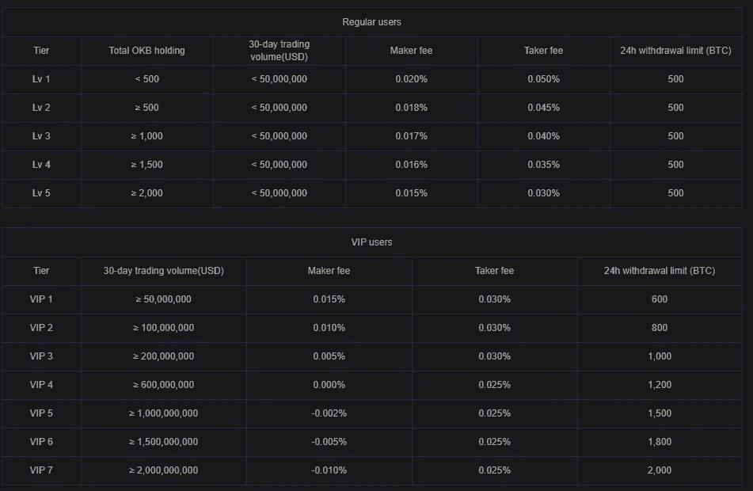
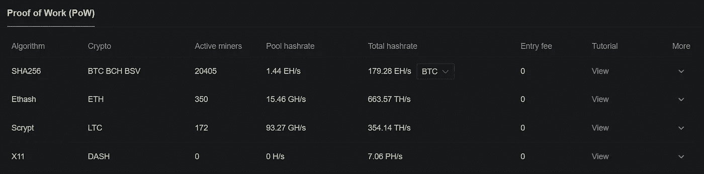
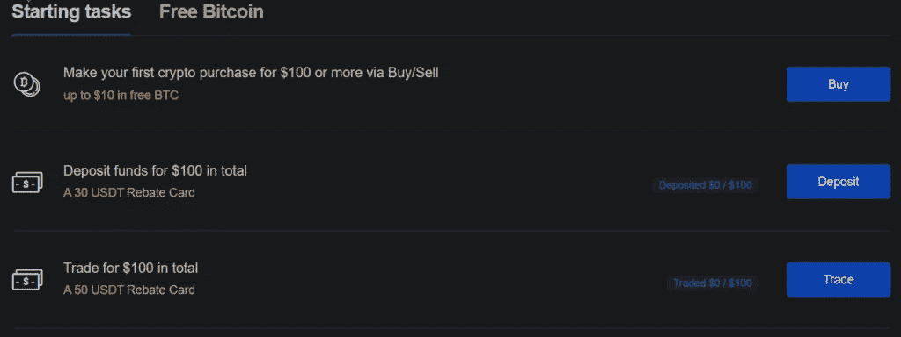

# OKex 评论 2021:这是合法的还是骗局？

> 原文：<https://medium.com/coinmonks/okex-review-6b369304110f?source=collection_archive---------7----------------------->

在本文中，我们将回顾国际数字资产和加密货币交易平台[OKEx](https://blog.coincodecap.com/crypto-exchange)exchange，该平台允许用户在数百个代币上进行交易。这是一个由明星徐在 2014 年创立的创新交易所。这个交易所脱胎于 OKCoin，目标是更高级的加密货币交易商。

在 CoinMarketCap.com， [**OKEx 交易所**](https://blog.coincodecap.com/go/okex) 被列为全球最大的[加密交易所](https://blog.coincodecap.com/crypto-exchange)之一。根据他们的官方网站，仅比特币期货交易产品一项，他们的日交易额就在 15 亿美元左右。

2018 年初，与其他中国交易所一样， [OKEx](https://blog.coincodecap.com/go/okex) 也推出了他们的公用令牌加密货币。用户可以使用该令牌来结算交易费用或支付专有服务，如增强的 API 费率限制和 exchange 平台上的客户支持。虽然一直没有官方宣布，但一直有传言称 [OKEx](https://blog.coincodecap.com/go/okex) 将推出自己的以太坊式公共区块链平台。

# OKEx 回顾:总结(TL；博士)

*   [OKEx](https://blog.coincodecap.com/go/okex) 是领先的一站式加密货币交易平台。
*   它有一个易于使用的界面和用户友好。
*   初级和高级交易者都可以在这个平台上交易。
*   OKEx 接受 30 种法定货币，包括美元、CNY、欧元和其他货币。
*   它有 17 种支付方式，如 VISA、MasterCard 等，用于购买密码。
*   OKEx fiat gateway 允许用户购买[比特币](https://blog.coincodecap.com/a-candid-explanation-of-bitcoin)、以太坊、USDT、Ripple、莱特币、OKB，交易费用低至 0%。
*   现货交易的特点是具有高流动性和低价差的订单簿。
*   用户可以在永久掉期和期货市场上以高达 100 倍的杠杆进行加密交易。
*   它高度关注安全性，并使用离线冷藏措施。
*   适用于[安卓](https://play.google.com/store/apps/details?id=com.okinc.okex.gp)和 [iOS](https://apps.apple.com/us/app/okex-bitcoin-cryptocurrency/id1327268470) 版本智能手机的 OKEx 应用也已上市。
*   其他计划，如推荐和附属奖励用户带来的用户到这个平台。
*   支持系统效率高，支持多种语言。

# OKEx 怎么入门？

按照这些步骤开始使用 OKEx 平台。点击 OKEx 官网右上角的'[报名](https://blog.coincodecap.com/go/okex)按钮。点击后，你会发现注册窗口。填写所有细节，包括一个有效的电子邮件 id 和一个强密码。完成详细信息后，单击注册。

您将在注册时输入的电子邮件 id 上收到一个代码。输入代码。确认代码后，您的注册过程将结束。现在，您可以[登录](https://www.okex.com/account/login)到您的帐户。

# OKEx 验证流程

要开始 **OKEx 验证**过程，首先点击您的个人资料，然后点击验证。一个如下所示的窗口将在你的电脑上打开。

我们将把“个人账户”考虑在内。

# 步骤 1:个人验证

要完成 KYC 的这一部分，请输入您的全名，选择您的国籍、身份证类型以及指定身份证的身份证号。填写完详细信息后，单击提交。一旦核实，你的 24 小时提款限额将增加到 200 BTC。

# 第二步:照片识别

这是 KYC 验证的第二级。在这种情况下，您必须上传您在 1 级验证中选择的文档图像。完成后，你的提款限额将增加到 300 BTC。

# 第三步:KYC

这是完成 KYC 的最后一部分。完成后，用户将获得提高提款限额的杠杆作用和其他好处。

以下是完成不同级别的 KYC 后你将享受到的好处的总结。

# OKEx 费用

现货、期货和永久掉期的[交易费用](https://www.okex.com/fees.html)不同。无论用户是普通用户还是 VIP 用户，OKEx 的交易费用也是不同的。

例如，如果你是一个从事现货交易的普通用户，你将向买方收取 0.10%的费用，向卖方收取 0.08%的费用。如果你以某种方式实现了 30 天超过 5000 BTC 的交易量，并持有超过 1000 枚 OKB 代币，那么你只需向接受者支付 0.09%，向创造者支付 0.07%。

# OKEx 现货交易费

在 [**OKEx 交易所**](https://blog.coincodecap.com/go/okex) 接受者的交易费用为现货交易的 0.10%。这一金额低于行业平均水平 0.25%。此外，接受者和制造者的费用因投资者的交易量而异。而且 VIP 用户还能享受更有竞争力的 0.030%-0.080%的交易费。

# OKEx 期货和永久费用

像现货交易费用一样，期货和永久启动的做市商和接受者 **OKEx 费用**分别为 0.02%和 0.05%。该费用也根据用户持有的 OKB 代币而变化或减少。

# OKEx 存款和取款费用

[**OKEx**](https://blog.coincodecap.com/go/okex) 不收取用户任何存取款费用。但是，用户从交易所提取比特币时，需要支付最低金额的比特币网络费。 **OKEx 提款**费用约为 0.0005BTC

# 如何在 OKEx 上存资金？

在这个平台上，用户只能使用数字货币向自己的账户注资。 [**OKEx**](https://blog.coincodecap.com/go/okex) 没有任何将法定货币转移到交易所的选项。因此，用户为其新账户提供资金有两种选择:

*   用户可以从另一个交易所或硬件钱包转移密码。
*   他们可以在网站上用合适且可用的支付方式购买密码。

# OKEx 评论:支持的加密货币

目前， [**OKEx**](https://blog.coincodecap.com/go/okex) 提供超过 246 种不同的加密货币，用户可以在网站上对 ETH、USD、和进行交易。如果用户使用 OKEx 公用令牌 OKB 进行交易，该平台还提供交易费折扣。

为了烧掉 3 亿 OKB 的流通供应量，OKEx 启动了每三个月一次的回购计划。这是通过减少供应量来抬高代币价格的积极方式。

# OKEx 池

[OKEx 交易所](https://blog.coincodecap.com/go/okex)平台提供了一个挖矿[池](https://www.okex.com/pool)，是加密货币矿工的共享群。这些矿工通过网络结合他们的计算资源来挖掘数字资产。除此之外，它还支持九种重要加密货币的[工作证明](https://blog.coincodecap.com/how-bitcoin-mining-work) (PoW)挖掘。这意味着用户可以提供他们的计算机散列率，作为回报，他们将获得额外的收入。

# OKEx 评论:算法顺序选项

为了帮助投资者以预定的数量和价格进行交易，不同类型的市场订单和使用 Algo 订单的能力对于活跃的日常用户来说至关重要。因此， [**OKEx**](https://blog.coincodecap.com/go/okex) 平台允许用户对不同类型的订单进行交易。止损单、市价单、限价市价单、高级限价单、追踪顶部单、时间加权平均价格单和冰山单都是可用的。

# OKEx 奖励系统

[**OKEx**](https://blog.coincodecap.com/go/okex) 为所有用户提供[奖励系统](https://www.okex.com/rewards)。使用这个，用户可以[获得比特币](https://blog.coincodecap.com/earn-bitcoin)以及完成任务和免费比特币学习任务的返利卡。请记住，要获得奖励，用户必须在注册前 30 天完成任务。

# OKEx 评论:如何买卖加密货币？

## 步骤 1: OKEx 登录

登录您的 [OKEx](https://blog.coincodecap.com/go/okex) 账户，买卖任何加密货币。点击 OKEx 官方网站右上角的“登录”。输入您的详细信息并登录。

## 第二步:选择买入/卖出

登录后，您会在顶部菜单中找到“购买/出售”选项。点击它进入下一步。

## 第三步:选择你的买/卖方式

下一步是选择您喜欢的购买或出售加密货币的方法。一般来说，OKEx 上有两个主要选项:

1.  快速交易
2.  P2P 交易

以下是你需要了解的。

# OKEx 评论:快速交易

这是在 OKEx 平台上购买加密货币最简单的方式。所有用户都必须选择他们喜欢的加密货币和他们希望消费的法定货币。在选择付款方式之前，请输入您的法定货币或加密货币的正确金额。支付完成后，加密货币会自动转入您的账户。

# OKEx 评论:P2P 交易

在此下，从下拉菜单中单击您想要的货币，然后选择所需的货币。输入金额和支付方式，最后点击“购买”选项购买该加密货币。

# OKEx 移动应用

[**OKEx**](https://blog.coincodecap.com/go/okex) 支持 [Android](https://play.google.com/store/apps/details?id=com.okinc.okex.gp) 和 [iOS](https://apps.apple.com/us/app/okex-bitcoin-cryptocurrency/id1327268470) 用户的移动应用。OKEx 应用是一个用于加密货币交易的一体化交易应用。有了它，用户可以随时随地买卖各种形式的数字资产。他们还可以查看实时流媒体报价，存款和取款，并将加密硬币存储在内置的数字钱包中。

# OKEx 审查:支持的国家和地区

[**OKEx**](https://blog.coincodecap.com/go/okex) 是一个面向全球 100 多个国家的全球交易平台。然而，这些国家也有除 OKEx 以外的其他选择。

这些国家是朝鲜。克里米亚、叙利亚、厄瓜多尔、玻利维亚、美国及其领土、香港、苏丹、马来西亚、吉尔吉斯斯坦、孟加拉国和古巴。

# OKEx 评论:安全性

说到加密货币中的安全标准， [**OKEx**](https://blog.coincodecap.com/go/okex) 是最安全的交易平台之一。几个新时代，创新技术，如冷钱包技术，和核心私钥加密算法，使其成为最先进的平台之一，最好的私人加密。

OKex 也是最大的交易平台之一，这使得它非常可靠。该平台的交易服务和数字资产符合[虚拟金融资产法](https://www.mfsa.mt/fintech/virtual-financial-assets/)(“VFAA”)的规定，并受马耳他金融服务管理局的监管。

这些是用户可以更好地保护其资产的方法 **:**

*   通过电子邮件发送验证码
*   通过电话提取资金的验证码和安全设置。
*   通过两个因素认证

# OKEx 评论:客户支持

[**OKEx**](https://blog.coincodecap.com/go/okex) 拥有坚实可靠的技术[支持](https://www.okex.com/support-center.html)团队，为各种模式提供全天候协助。它还有一个专门的 FAQ 部分，包含用户面临的一般问题。询问你的疑问的另一种方式是通过[提交](https://www.okex.com/account/support)请求。您也可以直接与他们的客户支持团队聊天。用户还可以通过他们的“加入社区”部分直接联系他们平台上的成员。

# OKEx 评论:利弊

## 赞成的意见

1.  融资和交易费用相当低。
2.  PayPal 是一种被接受的支付方式。
3.  不需要押金费用，交易和提现费用也相当可以忽略不计。
4.  收到法定货币存款。
5.  这个平台的移动应用程序非常用户友好
6.  获得最广泛的独特数字资产硬币。
7.  你将获得衍生品和现货交易的便利。
8.  您将全天获得客户支持。
9.  交易平台级别高，你将获得最广泛的 pro 交易选择。

## 骗局

1.  所有美国公民都不能接触到它。
2.  取款转账是有限制的。
3.  所有的顾客评价都不太令人满意。
4.  目前，仅支持 CNY 平板电脑。

# OKEx 审查:结论

无论你只是一次性投资者，还是日常活跃交易者，都没关系。 [**OKEx**](https://blog.coincodecap.com/go/okex) 是一个专业的交易平台，有着良好的后盾和国际化的目标。它提供各种交易选择，而且交易费用也很低。用户还可以使用 OKEx 提供的特殊功能赢得比特币和其他奖励。客户支持令人印象深刻，用户可以通过各种方式进行交流。最后，OKEx 还是一个安全的平台，没有严重黑客攻击的记录。

# 常见问题

OKEx 存款需要多长时间？

数字资产转移是一个简单的三步流程:
●请求
●确认
●信用
有时，由于网络拥塞，过程可能会变得很慢，但通常会很快。

KYC 是否强制使用 OKEx？

不，KYC 不是使用 OKex 交易平台的强制要求。您可以完成 KYC，以获得额外的好处，如增加 24 小时取款限额。

OKex 安全吗？

到目前为止，还没有 OKEx 被黑的传闻。此外，谈到安全性和可靠性，OKEx 是领先的平台之一。

美国商人可以使用 OKEx 吗？

不，OKEx 不向美国公民提供服务，因为他们有严格的内部规定，不受交易所控制。要投资加密货币，投资者需要在美国找到一个获得许可的交易平台。

*   [加密交易机器人](/coinmonks/crypto-trading-bot-c2ffce8acb2a)
*   [Pionex 套利机器人|现货-期货加密套利](https://blog.coincodecap.com/pionex-arbitrage-bot)
*   [币安 vs Bittrex |哪个对你来说是最好的交换？【2021】T5](https://blog.coincodecap.com/binance-vs-bittrex)
*   [如何在印度购买以太坊？【手机和网站 2021】](https://blog.coincodecap.com/buy-ethereum-in-india)
*   [最佳加密钱包【2021】](https://blog.coincodecap.com/best-crypto-wallets-app)
*   [如何在印度购买比特币 2021？【先看这个】](https://blog.coincodecap.com/buy-bitcoin-india)

> 包括附属链接

*原载于 2021 年 5 月 17 日 https://blog.coincodecap.com***。**