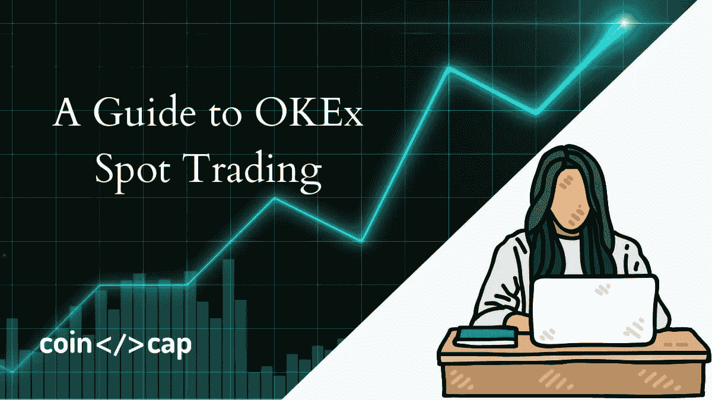
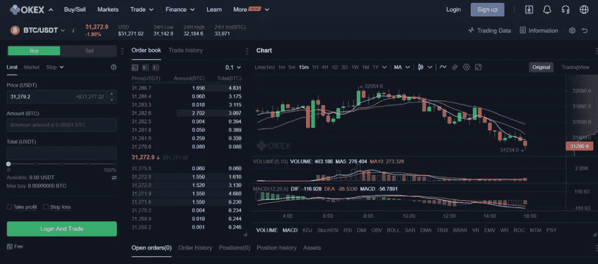
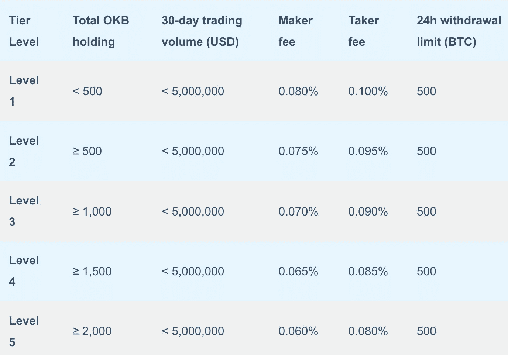
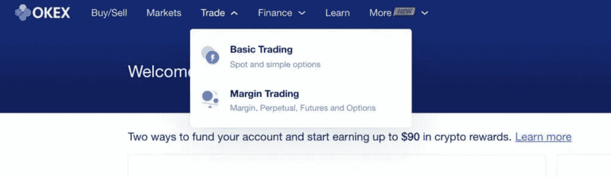
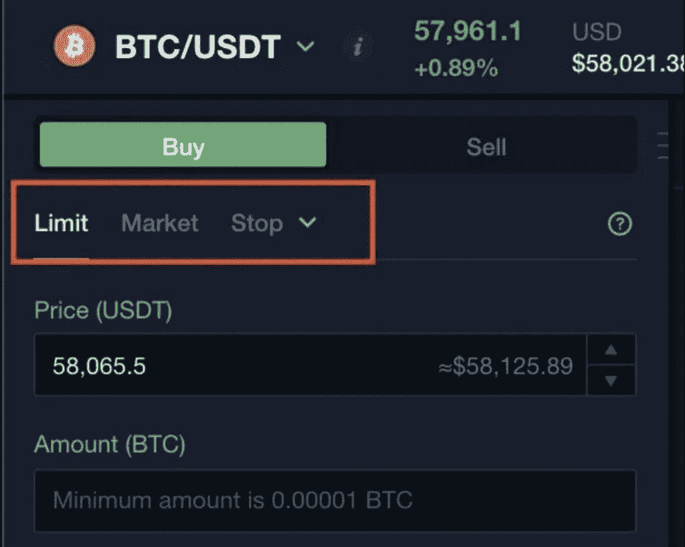
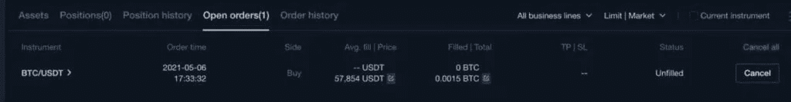

# OKEx 现货交易指南[2021]

> 原文：<https://medium.com/coinmonks/okex-spot-trading-75327cdb121?source=collection_archive---------7----------------------->

[**OKEx**](https://blog.coincodecap.com/go/okex) 是全球最受欢迎的加密交易所之一。因此，今天，我们将谈论 OKEx 现货交易，并交出一份指南，让你的第一笔交易不那么可怕。

# 总结(TL；博士)

*   [**OKEx**](https://blog.coincodecap.com/go/okex) 以低廉的费用提供初级加密货币和多个交易对的现货交易平台。
*   手续费从(-0.010%)到 0.1%不等。
*   交易视图是干净的和用户友好的。
*   交易者可以从三种订单类型中选择——止损、触发、提前限价。
*   高级限额进一步分类为仅过账、FOK 和立即或取消。

# 什么是 OKEx 交易所？

OKEx 交易所是一个可定制的[加密交易所](https://blog.coincodecap.com/crypto-exchange)为新手&资深交易者策划。除了在 200 多个国家运营之外，该平台还提供 400 多个交易对和多种法定货币。此外，它使交易者能够使用 VISA、Mastercard 和更多支付选项进行交易、借入和借出所需的加密资产。此外，交易者可以使用各种订单类型和高级工具进行现货、保证金、DEX、永久、期货和期权交易。

要了解更多信息，请阅读 [OKEx 评论](https://blog.coincodecap.com/okex-review)。

OKEx

# 什么是现货交易？

加密现货交易允许你购买和出售加密资产，如瑞士联邦理工学院，BTC，XRP 等。，并获得即时交货。买卖双方直接进行交易，交易所收取少量交易费。

此外，在现货交易中，你拥有自己资产的所有权，可以随时提取到你的离线钱包中。你甚至可以通过[押注](https://blog.coincodecap.com/staking-crypto) / [出借](https://blog.coincodecap.com/top-5-crypto-lending-platforms)你的数字资产来赚取被动收入。

> *另外，请阅读* [*加密赌注——加密赌注的终极指南*](https://blog.coincodecap.com/staking-crypto)

# OKEx 上的现货交易是什么？

OKEx 适合新手和有经验的交易者，旨在提供丰富的交易经验，交易者可以从各种各样的交易对中进行选择。此外，交易者可以选择在这些主要加密货币之间进行现货交易。此外，该平台支持资产，如 BTC，瑞士联邦理工学院，长期资本，OKB，OKT，BCH，BSV 等，EOS，TRX，XRP 等。

Spot Trading on OKEx

# OKEx 交易费用

OKEx 的现货交易费用很有竞争力。这是现货交易的收费清单。此外，你可以在 [OKEx 费用](https://www.okex.com/fees.html)部分看到完整的清单。

OKEx fee

# OKEx 订单类型

[**OKEx**](https://blog.coincodecap.com/go/okex) 为交易者提供各种订单类型的选项。这些订单类型主要分为三种类型。

*   **止损-** 当特定价格水平交叉时，交易者使用止损单下达市价单或限价单。条件止损单有一个触发器，而 OCO 单有两个触发器，彼此抵消。止损单在下单时冻结交易者的资产。
*   **触发-** 当特定价格水平交叉时，使用该触发订单选项下达市价订单或限价订单。当触发订单触发时，如果您的账户余额低于订单金额，系统会根据您在该特定时间的加密余额自动下单。但是，触发指令不会在下单时冻结资产。此外，触发订单在触发后最终成为限价/市价订单。在等待执行时，未执行的限价/市价订单显示在未结订单列表中。
*   **提前限价-** 在提前限价中，使用三种提前限价订单类型为您的限价订单设置规则:a)仅过账，b)填充或取消，c)立即或取消。

> *还有，阅读* [*以太坊今年要冲击 10000 美元——这是为什么？*](https://blog.coincodecap.com/ethereum-to-hit-10000)

# OKEx 怎么用？

[**OKEx**](https://blog.coincodecap.com/go/okex) 支持一级交易平台现货交易。这里有一个完整的现货交易步骤。

## 导航至现货交易平台

在 [OKEx 交易所](https://blog.coincodecap.com/go/okex)上，登录/注册你的账户开始交易。然后，移动到顶部菜单上的交易。同时，屏幕上显示两个选项-基本交易&保证金交易。最后，点击基本交易进行现货交易。

Navigate to Spot Trading Platform

## 选择所需的加密交易对

一旦你到达现货交易平台，屏幕的左侧显示可用的市场对。市场对旁边是一个小箭头。点击那个小箭头，查看可用的交易对列表。此外，您可以在**通过搜索栏选项搜索交易对。**

## **购买或销售**

**一旦交易者选择了所需的加密交易对，根据需要选择是否买入/卖出订单。**

## **下订单**

**决定是买还是卖后，选择订单类型——限价、市价、止损。订单类型出现在买入/卖出选项的正下方。这里，停损单类型有三种:**

1.  **停止**
2.  **引发**
3.  **高级限制**

****

**Place the Order**

## **确认并执行订单**

**输入所有订单详情后，输入您希望购买或出售的加密资产的价格和数量。最后，点击买入/卖出按钮确认并执行订单。**

****

**Open Orders**

**您可以在“未结订单”标签中访问您的所有订单。**

> ***另外，阅读* [*市场上 5 个最好的 OKEx 交易机器人*](https://blog.coincodecap.com/okex-trading-bot)**

# **OKEx 现货交易:结论**

**现货交易是初学者友好的交易选择。交易者根据统计数据买卖加密货币，并等到升值。 [**OKEx**](https://blog.coincodecap.com/go/okex) 提供现货交易以及统计和订单。在您的帐户中有适当的资金，您可以通过现货交易开始加密交易。而且 OKEx 给予交易者现货交易多种订单类型和交易对，使交易体验全面。**

# **常见问题**

****OKEx 适合新手开始现货交易吗？****

**[**OKEx**](https://blog.coincodecap.com/go/okex) 提供两个版本——基础版和高级版。所以对新手和有经验的都有好处。**

**现货交易是最适合初学者的选择。许多风险和暴露被消除，因为价格变化因素不影响现货交易价格。价格考虑仍然是从订购时而不是资产交付时开始的。这使得它适合密码市场的新来者。**

****交易员如何在加密现货交易中获利？****

**现货交易中的交易者购买一种加密货币，等待其升值后卖出。因此，从技术上讲，交易者通过加密货币的升值价格获利。或者，他们可以购买他们预计未来会升值的其他加密货币。**

****现货交易 OKEx 对交易者来说利润有多高？****

**OKEx 对平台上的现货交易收取很低的费用。然而，他们并不是最低的。 [**OKEx**](https://blog.coincodecap.com/go/okex) 提供安全措施和多种订单类型和交易对。这是一个盈利性和安全性平衡的加密交换。**

*   **[OKEx 评论 2021:这是合法的还是骗局？](https://blog.coincodecap.com/okex-review)**
*   **[Pionex 套利机器人|通过现货赚取—期货加密套利](https://blog.coincodecap.com/pionex-arbitrage-bot)**
*   **[每位用户的五大免费 Cryptohopper 应用【2021】](https://blog.coincodecap.com/cryptohopper-apps)**
*   **[4 大最佳免费加密信号|顶级加密交易信号电报频道](https://blog.coincodecap.com/free-crypto-signals)**
*   **[2021 年帕拉蒂卡评论|加密交易策略](https://blog.coincodecap.com/paratica-review)**

***原载于 2021 年 7 月 19 日 https://blog.coincodecap.com***。****