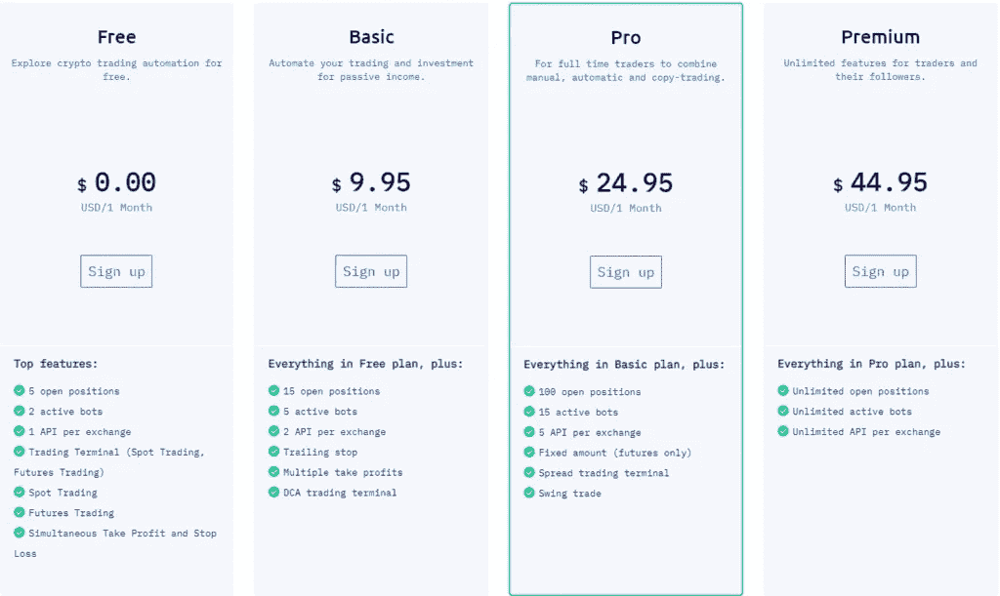

# 5 款最佳 OKEx 交易机器人

> 原文：<https://medium.com/coinmonks/okex-trading-bots-234920f61e60?source=collection_archive---------2----------------------->

OKEx trading bots

[**OKEx**](https://www.okx.com/join/8432835) 是[最大的加密交易所](https://coincodecap.com/crypto-exchange)之一，仅其期货交易平台就超过 15 亿美元。这篇文章将讨论最好的 OKEx 交易机器人，以及它们的定价、功能和最重要的优缺点。

# 总结(TL；博士)

*   加密交易机器人有助于你的交易自动化，如果你没有足够的时间观察市场，这是一个不错的选择。
*   OKEx 是最大的交易所之一，他们可以使用 token 来降低交易费用。
*   一些 OKEx 交易机器人是 [CryptoHopper](https://www.cryptohopper.com/?atid=26097) 、 [Bitsgap](https://bitsgap.com/?ref=2cb1231-2) 、 [3Commas](https://3commas.io/?c=tc252152) 、 [Shrimpy](https://www.shrimpy.io/referral?r=I6VFZ7d2E) 和 [Wunderbit](https://wundertrading.com/en/trader/register?ref=wbt8e5404fc) 。
*   首先， [**3Commas**](https://coincodecap.com/go/best-okx-trading-bots-in-the-market) 提供了多种功能，包括 [DCA bot](https://blog.coincodecap.com/dca) 、 [GRID bot](https://blog.coincodecap.com/grid-trading) 、options bot 等。
*   CryptoHopper 是一个广泛使用的加密交易机器人，以其做市机器人和策略而闻名。
*   [**Bitsgap**](https://bitsgap.com/?ref=2cb1231-2) 是另一个和 OKEx 很搭的像样的交易机器人。该平台最好的特性之一是它的 Bitsgap 演示交易模式。
*   此外， [**Shrimpy**](https://www.shrimpy.io/referral?r=I6VFZ7d2E) 是一个著名的自动化、管理和长期增长投资组合的机器人。
*   最后， [**神童**](https://wundertrading.com/en/trader/register?ref=wbt8e5404fc) 在队列中也有很多让人印象深刻的特性。其中一些是自由交易终端，智能密码交易自动化等。

# 什么是加密交易机器人？

加密交易机器人仅仅是用于实施交易策略的计算机程序。通过使用这些机器人，你可以自动化你的交易过程和暴涨你的回报。

 [## 最佳免费加密交易机器人——前 16 名比特币交易机器人[2021]

### 2021 年币安、比特币基地、库币和其他密码交易所的最佳密码交易机器人。四进制，位间隙…

medium.com](/coinmonks/crypto-trading-bot-c2ffce8acb2a) 

# OKEx 是什么？

是由明星徐在 2014 年创立的新锐交易所，兴起于 OKCoin。此外，它针对的是更有经验的比特币交易商。

[**OKEx**](https://www.okx.com/join/8432835) 与其他中国交易所一样，在 2018 年初推出了公用事业令牌。用户可以使用此令牌来支付 exchange 平台上的独家服务，如改进的 API 费率限制和客户支持。要了解更多信息，请阅读 [OKEx 交易所评论](https://coincodecap.com/okex-review)。

# 五个最好的 OKEx 交易机器人

交易机器人帮助你最大化利润，降低风险。此外，他们节省了你大量的时间，你可以投资在其他职业上。所以，我们来看看 [**OKEx**](https://www.okx.com/join/8432835) 的五个交易机器人。

# 1.3commas OKEx 交易机器人

## 什么是 3Commas？

[**3Commas**](https://coincodecap.com/go/best-okx-trading-bots-in-the-market) 是一个位于迈阿密的交易机器人，可以实现各种交易策略。而且对于没有技术背景的交易者或者交易行业的初学者来说都是不错的选择。此外，机器人能够定制独特的交易位置和部署用户界面。

要了解更多信息，请阅读[3 商业评论](https://coincodecap.com/3commas-review-an-excellent-crypto-trading-bot)。

## 3 常见功能

平台 3Commas 提供令人兴奋的功能，包括 [DCA 机器人](https://coincodecap.com/dca)、网格机器人、交易终端、期权机器人、第三方市场[加密交易信号](https://coincodecap.com/what-are-crypto-trading-signals)等。此外，DCA 机器人是任何级别交易者的绝佳选择。类似地，一个[网格机器人](https://coincodecap.com/grid-trading)需要最小的努力，它在价格下跌时买入一项资产，在价格上涨到指定范围时卖出。

## 3 商品定价

3Commas 的月套餐分为四个部分，如果你购买的是年套餐，你可以享受折扣。有关详细信息，请参考以下内容:

[3commas](https://coincodecap.com/go/best-okx-trading-bots-in-the-market) Pricing

## 3Commas 合法吗？

[**3Commas**](https://coincodecap.com/go/best-okx-trading-bots-in-the-market) 交易机器人使用 API 密匙连接交易所。再者，平台的服务条款很模糊，好像是 bot 收集用户的具体交易数据。然而，该团队使用收集的数据来改进他们的交易机器人。

## 3commas:利弊

3commas: Pros and Cons

# 2.CryptoHopper OKEx 交易机器人

## 什么是隐漏斗？

[CryptoHopper](https://www.cryptohopper.com/?atid=26097) 机器人有一个移动应用程序来帮助你快速实现交易自动化。此外，该机器人支持自动交易，复制交易等。；你也可以根据你的财务目标改变交易策略。

要了解更多信息，请阅读 [CryptoHopper 评论](https://coincodecap.com/cryptohopper-review)。

## 隐蝇的特征

CryptoHopper 最好的特性之一是一个加密的做市机器人。它根据流动性自动下达买卖指令；因此，它从市场差价中赚取的利润很少。这个 bot 还有它的策略规划器、[套利](https://en.wikipedia.org/wiki/Arbitrage)工具、纸面交易模式、社交交易平台、[密码电报 bot](https://coincodecap.com/cryptohopper-telegram-bot) 等。

## 密码漏斗定价

要使用自动交易功能，您必须购买 CryptoHopper 的付费版本。它有三个类别——探险家套件、冒险套件和英雄套件。下面是每个机器人的功能和定价。

CryptoHopper Pricing

## CryptoHopper 合法吗？

该机器人已经在市场上运行了三年多。因此，它是一个可靠、安全、合法的机器人。除此之外，它使用 API 密匙来处理交易，并且不能从你的账户中取钱。因此，使用机器人是完全安全的，但如果市场突然波动，交易机器人可能就派不上用场了。

## 隐跳虫:利与弊

CryptoHopper Pros and Cons

# 3.Bitsgap OKEx 交易机器人

## 什么是 Bitsgap？

[**Bitsgap**](https://bitsgap.com/?ref=2cb1231-2) 是另一个著名的 bot 提供者，它作为 OKEx API bot 也很顺利。此外，它支持多交换环境，通过这个机器人，你可以把你所有的账户集中到一个地方。该平台在 25 个重要的交易所运行，包括币安、北海巨妖等。此外，您可以在 14 天的免费试用中检查和尝试该机器人的一些功能。

要了解更多信息，请阅读 [Bitsgap 评论](https://blog.coincodecap.com/bitsgap-review)。

Bitsgap OKEx trading bot

## Bitsgap 功能

交易机器人提供商 Bitsgap 有许多功能，包括套利、交易终端、投资组合跟踪等。例如，套利有助于最大化各交易所之间的价格差异。此外， [Bitsgap 期货交易机器人](https://coincodecap.com/bitsgap-futures-bot)是市场上可以买到的一种机器人。

交易终端拥有先进的[加密制图工具](/coinmonks/what-are-the-best-charting-platforms-for-cryptocurrency-trading-85aade584d80)，帮助交易者创造高额利润。最后，最好的功能之一是 Bitsgap 演示交易模式，让您可以测试运行机器人。

## Bitsgap 定价

**Bitsgap** 也有三个订阅计划，每个计划支持 14 天的免费试用期。有关更多信息，请参考下图:

Bitsgap Pricing

## Bitsgap 合法吗？

Bitsgap 是一个安全合法的交易机器人。此外，它使用高端 2048 加密方法来确保其客户的完全安全。除此之外，它使用 API 密钥，不能访问您的资金提款。此外，不直接在 Bitsgap 平台上存款。

## Bitsgap:利弊

Bitsgap Pros and Cons

 [## 最佳 6 个加密交易信号电报通道

### 这是乏味的找到正确的加密交易信号提供商。因此，在本文中，我们将讨论最好的…

medium.com](/coinmonks/best-crypto-signals-telegram-5785cdbc4b2b) 

# 4.Shrimpy OKEx 交易机器人

## 什么是 Shrimpy？

从长远来看，Shrimpy trading bot 有助于自动执行您的交易策略。这是因为它有大量的历史数据库来展示各种交易策略的表现。

除此之外，Shrimpy 是一个[社交交易平台](/coinmonks/what-are-the-best-charting-platforms-for-cryptocurrency-trading-85aade584d80)，也就是说，它允许你复制专业交易者的策略。然而，Shrimpy 的显著优势是您可以从多个交易所收集过去和现在的历史数据。要了解更多信息，请阅读 [Shrimpy 评论](https://coincodecap.com/shrimpy-crypto-trading-bot-review)。

Shrimpy

## 虾的特征

Shrimpy 提供了一个社交投资组合管理系统，允许你从专业交易者那里复制策略。此外，Shrimpy 的机器人显然是为了管理和建立一个长期的可观的投资组合。最重要的是，使用 Shrimpy 的显著优势是它支持相关的、有价值的 API 池。

## 苛刻的定价

目前， **Shrimpy** 的社交交易平台收费 19 美元/月，它让你可以访问 Shrimpy 的每一项功能。此外，您还可以在下面查看您选择的计划的功能:

Shrimpy Pricing

## 虾肉合法吗？

**Shrimpy** 是一个安全合法的交易机器人。此外，它在市场上拥有良好的声誉，迄今为止没有任何安全威胁。此外，该平台旨在开发交易员的投资组合，并不直接访问您的交易所账户。到目前为止，交易机器人与 [**OKEx**](https://www.okx.com/join/8432835) 配合得很好，是启动你交易之旅的绝佳选择。

## Shrimpy:赞成和反对

Shrimpy Pros and Cons

# 5.神童 OKEx 交易机器人

## 什么是 Wubderbit？

作为 OKEx API 机器人，Wunderbit 可以成为另一种自动交易的选择。该交易所自 2018 年以来一直在市场上，并以其交易服务而闻名。此外，bot 是各个层次的交易者和投资者的正确选择。此外，除了自动交易机器人，Wunderbit 还提供交易和商业服务。要了解更多信息，请阅读[神童评论](https://coincodecap.com/wunderbit-review)。

Wunderbit OKEx trading bot

## 神奇的功能

谈到智能交易自动化，它拥有一些灵活和相关的工具。其中一些是智能加密交易自动化、自由交易终端、多账户管理等。例如，通过 Wunderbit 交易终端，你可以开始交易，每次交易没有佣金。除此之外，该平台还提供社交交易市场和金字塔机器人自动化等功能。

## 神奇的定价

[**Wunderbit**](https://wundertrading.com/en/trader/register?ref=wbt8e5404fc) 有四个订阅计划可以帮助你实现交易过程的自动化。免费计划还为交易自动化提供了一些功能。更多详情请参考下图:

Wunderbit Pricing

## 神童比特合法吗？

Wunderbit 是一个安全合法的加密交易机器人，有助于增加您的回报和降低风险。此外，它使用 API 密钥来访问您的 exchange 帐户，并且不能代表您取款。

## 神童:利弊

Wunderbit Pros and Cons

# OKEx 交易机器人:结论

OKEx 是[最受欢迎的加密交易所](https://coincodecap.com/crypto-exchange)之一，提供各种交易选择，交易费用很低。对于没有时间整天盯着屏幕的交易者来说，第三方交易机器人是必要的。例如， [**CryptoHopper**](https://www.cryptohopper.com/?atid=26097) 以其做市机器人和独占市场而闻名。另一方面， [**Bitsgap**](https://bitsgap.com/?ref=2cb1231-2) 演示交易模式允许你测试你的策略。同时，[**3**](https://3commas.io/?c=tc252152)有智能机器人，如期权机器人和网格机器人，用于实现不同的交易策略。

此外， [**Shrimpy**](https://www.shrimpy.io/referral?r=I6VFZ7d2E) 非常适合希望专注于长期投资组合管理和增长的交易者。最后， [**神童**](https://wundertrading.com/en/trader/register?ref=wbt8e5404fc) 提供了一个免费的交易终端，社交交易市场，和金字塔机器人。

# 常见问题

**OKEx 最好用的 Github 交易机器人是哪个？**

最好的开源交易机器人之一包括 [Freqtrade](https://github.com/freqtrade/freqtrade) ，可以在 [Github](https://en.wikipedia.org/wiki/GitHub) 上免费获得；它为交易者提供了巨大的机会。此外，你可以选择 Pionex，因为他们免费提供世界级的交易机器人。

**如何在 OKEx 上存放代币？**

登录您的 **OKEx** 账户，从标题中的“资产”选项卡进入“存款”部分。此后，选择您希望存入的货币，然后选择您希望使用的网络。最后，点击继续按钮扫描二维码或获取钱包地址。

**在美国如何使用 OKEx？**

OKEx 不在美国提供服务；然而，你可以使用 VPN，如 [Hola VPN](https://hola.org/get_hola?a_aid=606ecf87d43eb) 从世界任何地方使用 **OKEx** 。

**OKEx 期货是如何运作的？**

OKEx 期货提供硬币保证金合同和 USDT 合同，它有三个到期合同可供选择，每周，每两周和每季度。此外，你必须将资金从你的另一个 [**OKEx**](https://www.okx.com/join/8432835) 账户存入你的 OKEx 期货账户。最后，你可以选择单独/交叉保证金和杠杆在 OKEx 期货市场交易。

**披露:附属链接包括在内**

> 加入 [Coinmonks 电报频道](https://t.me/coincodecap)，了解加密交易和投资

## 另外，阅读

 [## BlockFi 评论 2021 —通过您的加密获得 8.6%的利率

### 让你的密码发挥作用，获得比特币和其他加密货币的最佳利率

medium.com](/coinmonks/blockfi-review-53096053c097)  [## 加密税务软件——五大最佳比特币税务计算器[2021]

### 不管你是刚接触加密还是已经在这个领域呆了一段时间，你都需要交税。

medium.com](/coinmonks/best-crypto-tax-tool-for-my-money-72d4b430816b) 

*   [XT.COM 评论](https://coincodecap.com/profittradingapp-for-binance)币安评论 |
*   [SmithBot 评论](https://coincodecap.com/smithbot-review) | [4 款最佳免费开源交易机器人](https://coincodecap.com/free-open-source-trading-bots)
*   [杠杆代币](/coinmonks/leveraged-token-3f5257808b22) | [最佳密码交易所](/coinmonks/crypto-exchange-dd2f9d6f3769) | [Paxful 点评](/coinmonks/paxful-review-4daf2354ab70)
*   [加密套利](/coinmonks/crypto-arbitrage-guide-how-to-make-money-as-a-beginner-62bfe5c868f6)指南| [如何做空比特币](/coinmonks/how-to-short-bitcoin-568a2d0b4ae5)
*   [币安期货交易](https://coincodecap.com/binance-futures-trading)|[3 commas vs Mudrex vs eToro](https://coincodecap.com/mudrex-3commas-etoro)
*   [如何购买 Monero](https://coincodecap.com/buy-monero) | [IDEX 评论](https://coincodecap.com/idex-review) | [BitKan 交易机器人](https://coincodecap.com/bitkan-trading-bot)
*   [YouHodler vs CoinLoan vs Hodlnaut](/coinmonks/youhodler-vs-coinloan-vs-hodlnaut-b1050acde55a) |[Cryptohopper vs HaasBot](https://coincodecap.com/cryptohopper-vs-haasbot)