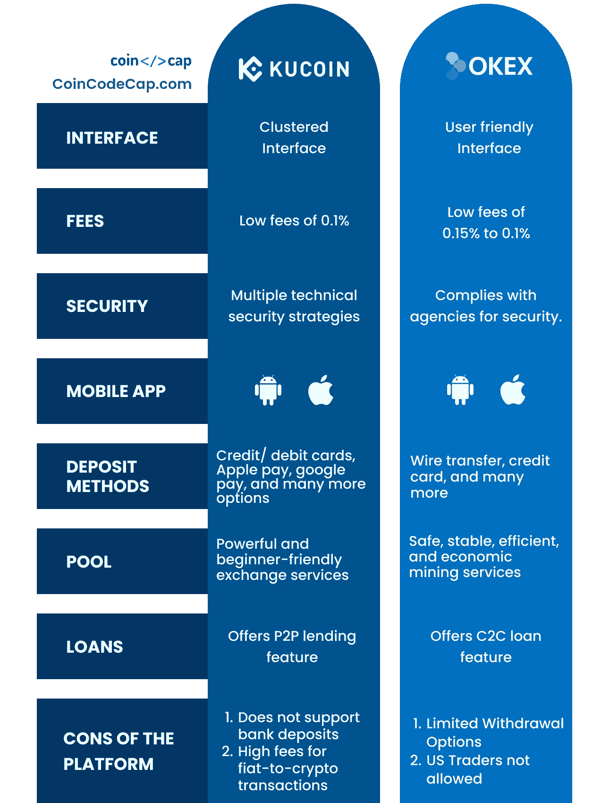
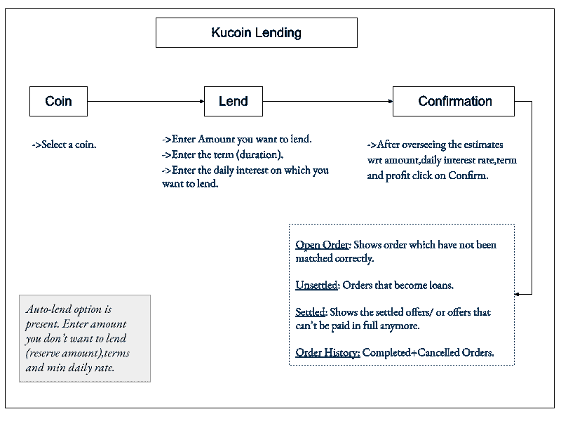
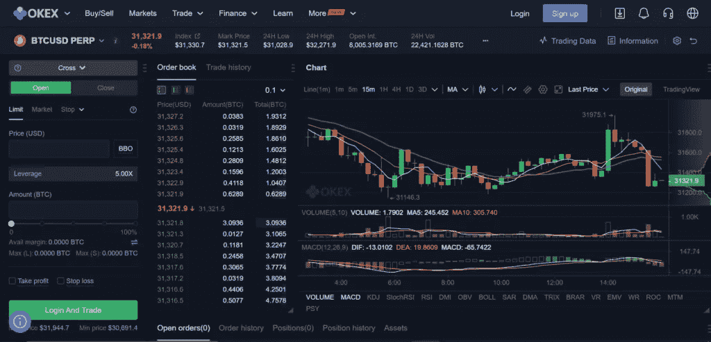
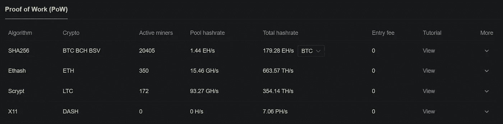
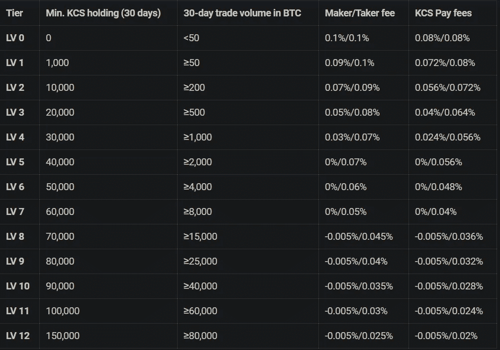
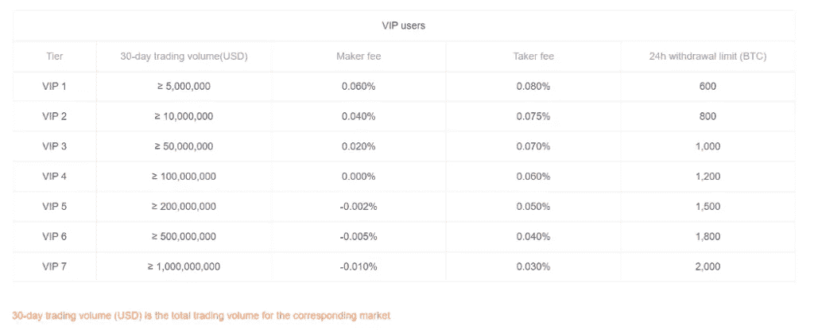
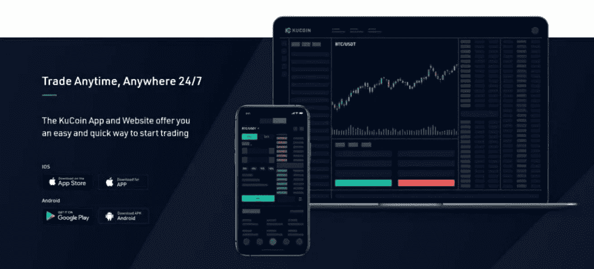
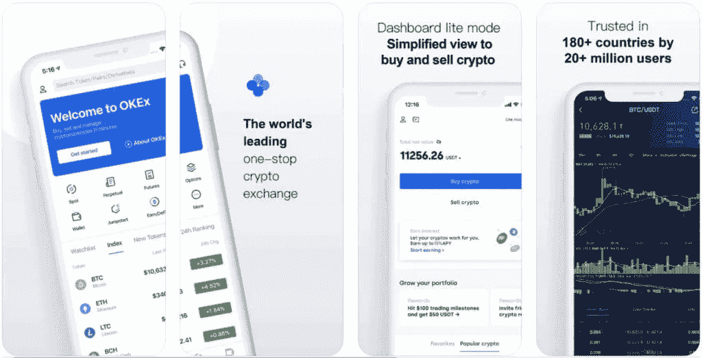
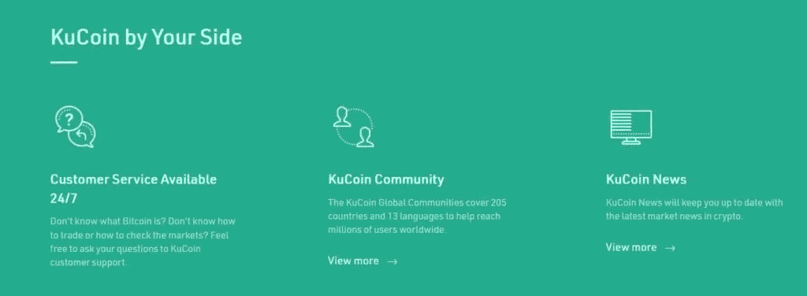
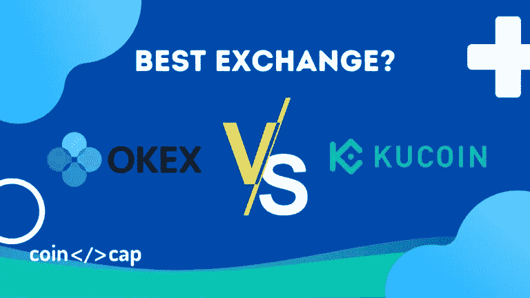

# OKEx vs KuCoin:哪个是最好的交易所？

> 原文：<https://medium.com/coinmonks/okex-vs-kucoin-30eb2924a616?source=collection_archive---------8----------------------->

加密市场有很多加密交易可以提供。今天我们就来对比一下其中的两个， [KuCoin](https://www.kucoin.com/ucenter/signup?rcode=rJ45SVB) 和 [OKEx](https://www.okx.com/join/8432835) 。根据 CoinMarketCap 的数据，这两个平台的交易量都是最高的。所以今天我们就来阐述这些，帮助你在两者之间做出明确的选择。

## 总结(TL；博士)

*   [KuCoin](https://www.kucoin.com/ucenter/signup?rcode=rJ45SVB) 和 [OKEx](https://www.okx.com/join/8432835) 是具有可比特征的竞争性加密交换。
*   此外，两家交易所都提供许多加密货币和交易对。但是， [KuCoin](https://www.kucoin.com/ucenter/signup?rcode=rJ45SVB) 有更高的杠杆机会。
*   两者都有许多支付选择，OKEx 接受电汇更具优势。
*   同样，这两个交易所都有各种各样的订单类型和借贷工具。
*   此外， [KuCoin 提供交易机器人](https://coincodecap.com/kucoin-trading-bot)，OKEx 最近推出了自己的区块链 [OKExChain](https://www.okex.com/en-in/okexchain) 。
*   就费用而言， [KuCoin](https://www.kucoin.com/ucenter/signup?rcode=rJ45SVB) 和 [OKEx](https://www.okx.com/join/8432835) 不相上下。然而，KuCoin 以微小的差异领先于 OKEx。
*   两家交易所都有兼容 iOS 和 Android 设备的移动应用。
*   这两个平台在交易所交易都是安全的。此外，两家交易所都有多种安全策略，为加密交易提供安全的环境。
*   两家交易所的客户支持基础反应迅速。然而， [OKEx](https://www.okx.com/join/8432835) 的目标是一个全面的 FAQ 部分。相反，KuCoin 的目标是实时聊天部分。

# OKEx vs KuCoin:概述

这两个平台都有很多服务和产品可以提供。因此，我们将向您简要介绍这两种加密交换。

## 什么是 OKEx 交易所？

OKEx 交易所的目标是覆盖所有的交易者，从新手到老手，并可能进行定制。它在 200 多个国家开展业务，提供 400 多个交易对和多种法定货币。在这里，交易者可以将许多当地货币兑换成 BTC、瑞士联邦理工学院、USDT，或者使用 VISA、万事达卡和更多支付选项兑换所需的加密资产。此外，该交易所还提供现货、保证金、DEX、永久、期货和期权交易。

此外，交易者可以用各种订单类型交易——限价单、市价单、止损单和冰山单。此外，OKEx 还支持加密借贷以及用于挖掘和钱包管理的高级工具。

更多深入信息，请查看 [OKEx 评论](https://coincodecap.com/okex-review)。

## 什么是库币交易所？

[KuCoin](https://www.kucoin.com/ucenter/signup?rcode=rJ45SVB) 是一个[加密货币交易平台](https://coincodecap.com/crypto-exchange)，位于塞舌尔，支持超过 200 种加密货币。该交易所旨在为全球观众提供一个安全易用的数字硬币交易平台。此外，它还提供许多贸易配对和加密相关的服务。

此外，它有一个本地公用事业令牌- KuCoin 股票(KSC)与额外的折扣和被动收入。因此，该门户以简单、高效和透明的 UI 为 600 多万用户提供了高流动性。

关于库币交易所更深入的信息，请查看[库币评论](https://coincodecap.com/kucoin-review)。

# KuCoin vs OKEx:产品

密码交易所的主要功能是提供交易选项。因此，我们将讨论交易选项和各种 [KuCoin](https://www.kucoin.com/ucenter/signup?rcode=rJ45SVB) 和 [OKEx](https://www.okx.com/join/8432835) 。

## KuCoin 产品

让我们看看 KuCoin 的产品。

**融资融券交易**

[KuCoin](https://www.kucoin.com/ucenter/signup?rcode=rJ45SVB) 提供杠杆头寸的保证金交易，提供超过 15 种加密货币，如 KCS、瑞士法郎和 BTC。此外，KuCoin 支持 35 个交易对，杠杆高达 10 倍。

**期货交易**

KuCoin 还提供期货交易，用户可以买卖加密期货标准化合约。在 KuCoin 上，交易者可以用高达 100 倍的杠杆交易硬币保证金合约。此外，KuCoin 有两个不同的版本，一个适用于初学者，另一个适用于有经验的交易者。

**场外交易台**

KuCoin 为交易者提供 OTC 柜台交易平台。这允许交易者以特定的价格购买大量的加密资产。此外，用户可以用加元、印尼盾、越南盾和 CNY 直接购买 USDT、BTC 和其他加密货币。

**库币交易机器人**

KuCoin 提供其内部的[加密交易机器人](/coinmonks/crypto-trading-bot-c2ffce8acb2a)。此外，KuCoin 交易机器人提供免费交易策略，允许交易者在没有持续监控的情况下获取回报。此外，交易者无需使用 KuCoin 的 API 密钥连接第三方僵尸工具服务提供商。交易者可以通过存入资金、选择指定策略和启用机器人来开始使用 KuCoin 交易机器人。了解更多阅读，[如何使用 KuCoin Bot？](https://coincodecap.com/kucoin-bot)

**借贷平台**

KuCoin 借贷平台允许交易者将加密货币借给其他用户并赚取利息。贷方填写关于贷款金额和日利率的详细信息。利率从 0 到 0.2%不等。贷款期限从 7 天到 28 天不等。但是，默认期限是 28 天。

> 此外，阅读[最佳加密贷款平台](https://coincodecap.com/crypto-lending)。

**库币池**

Pool-X 是下一代 POS 平台，支持由 [KuCoin](https://www.kucoin.com/ucenter/signup?rcode=rJ45SVB) 支持的锁定加密交易。它为抵押资产的流动性提供了一个交换条件。用户可以通过交易赌注加密资产获得流动性。它有助于降低赌注的障碍，并有助于提高赌注率。此外，它有一个强大的和初学者友好的交流系统。

> *此外，请阅读*[*Staking Crypto——Crypto Staking*](https://coincodecap.com/staking-crypto)*终极指南。*

**点对点交易**

KuCoin 提供了一个 P2P 加密市场，允许使用 PayPal 和其他方便的法定支付方式进行买卖。此外，KuCoin 还有许多加密货币选项可供交易。

> 使用 KuCoin 交易机器人自动完成交易。

## OKEx 产品

**现货交易**

OKEx 为新手和有经验的交易者提供现货交易服务。它提供丰富的交易经验，交易者可以从各种各样的交易对中进行选择。此外，交易者可以选择在各种初级和许多稀有和本地加密货币之间进行现货交易。

更多详情，请阅读我们的 [OKEx 现货交易](https://coincodecap.com/okex-spot-trading)指南。

**OKEx 保证金交易**

OKEx 还允许 30 多种加密资产和交易类型的保证金交易，最大杠杆高达 10 倍。此外，交易者可以借入的总额取决于三个因素——保证金账户余额、原始账户和头寸保证金比率。

然而，这些限制因多种因素而异，以降低交易者的风险。更多详情，请阅读我们的 [OKEx 保证金交易](https://coincodecap.com/okex-margin-trading)指南。

Margin Trade on OKEx

**OKEx 期货交易**

平台为[期货交易](https://coincodecap.com/futures-trading)提供一周、两周、一个季度、两个季度的存续期。OKEx 为 BTC 或 LTC 等数字资产提供购买/出售加密资产合同，杠杆高达 100 倍。平台流动性高，合同种类多。然而， [OKEx](https://www.okx.com/join/8432835) 不支持法定货币。此外，OKEx 还提供了一个针对市场操纵策略的保护系统。要了解更多信息，请阅读 [OKEx 期货交易](https://coincodecap.com/okex-futures-trading)。

**永久财产**

OKEx 提供衍生品和许多其他服务。OKEx 永久掉期是一种以数字货币结算的虚拟衍生产品。它支持多种加密货币的硬币保证金和 USDT 保证金永久掉期，杠杆高达 125 倍，具体取决于头寸层级。

**贷款**

OKEx 在平台的 OKEx Earn 部分提供 C2C 贷款功能。在这里，用户可以贷款或借钱给其他用户来赚取被动收入。在 OKEx 上借贷很容易。此外，利率是有竞争力的，交易员可以借出或提取资金。

**OKEx 池**

Okex 为用户提供安全、稳定、高效的采矿服务。此外，Okex Pool 是 Okex 创建的一个全面的加密货币挖掘池。这是为全球用户提供的一站式采矿和交易服务。它不要求任何最低支付或每日结算。此外，它还具有灵活的波动风险控制和稳定的收入流。

OKEx: Pools

**OKExChain**

OKEx 提供了一个叫做 DEX 的交易选项，这是一个[分散交易](https://en.wikipedia.org/wiki/Decentralized_exchange)。他们的家乡区块链称为 OKExChain 的电力交易所。此外，OKEx DEX 是一个无边界、分散的交易平台，具有安全性、非托管资产和钱包等功能，以及独特的订单匹配机制。在这里，交易者享受额外的好处，如低费用和无缝交易体验。

使用 [OKEx 交易机器人](https://coincodecap.com/okex-trading-bot)实现交易自动化。

# KuCoin vs OKEx:费用

在决定交易的交易所时，交易者的费用起着至关重要的作用。[加密交易所](https://coincodecap.com/crypto-exchange)可以用高额的交易费消耗掉很大一部分利润。现在，我们将概述 KuCoin 和 OKEx 的费用结构。

## 库币费

与任何其他替代硬币交易所相比，KuCoin 的交易费用最低。此外，KuCoin 对现货交易收取 0.1%的固定费用。此外，它还根据用户 30 天的交易量和 KuCoin 股票持有量提供费用折扣。除此之外，KuCoin 还提供可调整的美元/ USDT 期货贷款利率。

此外，库币取款费最低，BTC 取款为 0.0004 BTC。特别是，在 KuCoin 上的存款费用是零。要了解更多信息，请阅读 [KuCoin 交易费用、存款、&取款费用](https://coincodecap.com/kucoin-trading-fees)。

KuCoin Trading Fees

## OKEx 费用

OKEx 提供多种服务和账户类型。因此，费用会因账户类型、加密货币交易和交易选项的不同而有很大差异。此外，30 天的交易量影响收取的价格。点击这里查看详细的 OKEx 交易费和利率费。

而且 OKEx 提现费和存款都是免费的。但是，交易需要支付网络费用。

OKEx Trading Fees: VIP users

# KuCoin vs OKEx:移动应用

密码市场变化无常，瞬息万变。这需要持续的监控。因此，移动应用对密码交易员来说是必不可少的。KuCoin 和 OKEx 都有移动应用。

## 酷币 App

[KuCoin](https://www.kucoin.com/ucenter/signup?rcode=rJ45SVB) 提供全功能的移动应用。此外，它的界面非常吸引人，并提供与官方网站同步的实时报价、KuCoin 奖金& KuCoin 推荐计划模块和全天候可用的帮助中心。此外，交易者可以获得实时市场趋势视图、持续信息和个人账户信息。此外，交易者还会收到关于登录、KuCoin 代币价格达到您预设的警告价格、新闻&促销和资产变更公告的通知。KuCoin 应用程序兼容 [iOS](https://apps.apple.com/us/app/kucoin/id1378956601) 和 [Android](https://play.google.com/store/apps/details?id=com.kubi.kucoin) 设备。

KuCoin Mobile App

## OKEx 移动应用程序

[OKEx](https://www.okx.com/join/8432835) 为 [Android](https://play.google.com/store/apps/details?id=com.okinc.okex.gp) 和 [iOS](https://apps.apple.com/us/app/okex-bitcoin-cryptocurrency/id1327268470) 设备提供移动应用。是一款集加密货币交易于一体的交易 app。通过该应用程序，用户可以随时随地以各种形式买卖数字资产。该应用程序还可以显示实时的流媒体报价，实现资金的存取，并在内置的数字钱包中存储加密硬币。

OKEx Mobile App

# OKEx vs KuCoin:用户界面

交易员在交易平台上花了很多时间。因此，用户界面对于交易所和交易者来说是必不可少的。此外，简单的 UI 使交易者在门户上进行交易变得容易。

## KuCoin 用户界面

KuCoin 界面带有快速指南和导航。此外，整体界面是黑色和绿色的，这是简单的，舒缓的眼睛。

## OKEx 用户界面

OKEx 有一个简单易用的界面。交易平台很简单，采用黑暗模式，让人耳目一新。交易的整个过程可能会很漫长，但交易所是用户友好的。

# KuCoin vs OKEx:安全性

安全性对于保护用户数据和资金至关重要。因此，交易者需要考虑交易是否安全。

## KuCoin 安全吗？

KuCoin 采取各种安全措施。首先，它具有银行级的资产安全性，以确保所有交易和 KuCoin 账户持有人的最安全环境。第二，它使用小额取款钱包来进行两次拆分。

此外，它通过动态多因素身份认证、行业级多层加密和专门的内部风险控制部门来保护提款。此外，KuCoin 团队定期监控交易所，以确保严格的安全标准。

## OKEx 安全吗？

OKEx 是最安全的加密交换，有许多安全措施。首先，它使用创新技术，如冷钱包和核心私钥加密算法。因此，这些策略使它成为一个拥有最好的私有加密的高级平台。

此外，马耳他金融交易所遵守《虚拟金融资产法》( [VFAA](https://www.welcome-center-malta.com/blockchain-services-in-malta/ico-crypto-regulation-in-malta/the-virtual-financial-act-vfa-in-malta/) )，并接受马耳他金融服务管理局的监管。

此外，用户还可以通过其他一些方式来代表自己确保安全性。

*   电子邮件上的验证码
*   手机上的验证码
*   双因素认证

# 客户支持

每个交易所都需要确保响应迅速的客户支持，以确保交易者的满意度和可靠性。解决客户问题和 24*7 响应的工作人员团队构成了强大的客户支持基础。

## OKEx vs 库币:库币支持

[KuCoin](https://www.kucoin.com/ucenter/signup?rcode=rJ45SVB) 拥有全面的客户支持，由三个构件组成。

首先，客户支持是全天候的。第二，网站上有一个广泛的常见问题部分。它很容易回答交易者关于交易所的所有可能的问题。第三，它不断监测平台，以确保安全并毫不拖延地提供支持。

此外，KuCoin 的客户支持基础侧重于贸易商的贸易问题。此外，他们会立即采取行动，全天候提供帮助。此外，它支持网站上的实时聊天功能，以解决查询。

KuCoin Support

## OKEx vs KuCoin: OKEx 支持

OKEx 通过各种模式提供 24*7 的帮助。首先，OKEx 有一个稳定可靠的支持团队，交易者可以在这里联系。其次，它有一个额外的专门的常见问题部分。第三，交易者可以通过在此提交请求[来查询他们的疑问。](https://www.okex.com/account/support)

此外，交易者可以直接与他们的客户支持团队聊天。此外，用户可以通过他们的社区部分直接联系他们平台上的成员。

# KuCoin vs OKEx:结论

KuCoin 和 OKEx 是综合性平台，交易对多，加密货币多，服务多，交易量大。

这两家公司都进入了 CoinMarketCap 交易量的前 20 名。此外，两家交易所的费用、安全性和客户支持都很有竞争力。此外，这两个平台都有基于层的费用结构和本机实用程序令牌。然而，OKEx 似乎对初学者也很友好，风险暴露有限且经过计算。

两家交易所在很多方面都很相似，具有可比性。因此，交易者应该明智地选择一个，取决于他们的需求和工作方式。

# 常见问题

**KYC 有必要在 OKEx 交易吗？**

不，KYC 不是 OKEx 交易平台交易的强制要求。然而，拥有完全 KYC 的交易者会得到额外的好处，比如提高每日提款限额。

【OKEx 允许美国交易商吗？

不，OKEx 支持除美国以外的许多国家。然而，由于严格的规定，它不向美国公民提供服务。

**库币位于哪里？**

KuCoin 是一家位于塞舌尔的加密交易所。

KuCoin 上有必要进行 KYC 验证吗？

是的，所有库币用户都需要完成 KYC 验证。经认证的交易者还享有更高的 24 小时 KuCoin 取款限额。此外，KYC 作为一种安全战略，有助于减少洗钱、欺诈、恐怖融资和其他恶意活动。

然而，交易者仍然可以在没有验证账户的情况下进行小额交易。

**库币支持法币吗？它接受信用卡吗？**

是的，KuCoin 接受 20 多种不同的法定货币在交易所交易。此外，KuCoin 与 Banxa 合作，通过 VISA/ Mastercard、Apple Pay 和许多其他支付选项来实现加密购买。

*   [购买 Dogecoin 的 7 种最佳方式](https://coincodecap.com/ways-to-buy-dogecoin) | [ZebPay 评论](https://coincodecap.com/zebpay-review)
*   [如何在 Bitbns 上购买柴犬(SHIB)币？](https://coincodecap.com/buy-shiba-bitbns)
*   [最佳加密分析或链上数据](https://coincodecap.com/blockchain-analytics) | [Bexplus 评论](https://coincodecap.com/bexplus-review)
*   [NFT 十大市场造币集锦](https://coincodecap.com/nft-marketplaces)
*   [iTop VPN 审查](https://coincodecap.com/itop-vpn-review) | [曼陀罗交易所审查](https://coincodecap.com/mandala-exchange-review)
*   [最佳期货交易信号](https://coincodecap.com/futures-trading-signals) | [期交所评论](https://coincodecap.com/liquid-exchange-review)
*   [最佳加密交易信号电报](/coinmonks/best-crypto-signals-telegram-5785cdbc4b2b) | [MoonXBT 评论](/coinmonks/moonxbt-review-6e4ab26d037)

OKEx vs KuCoin