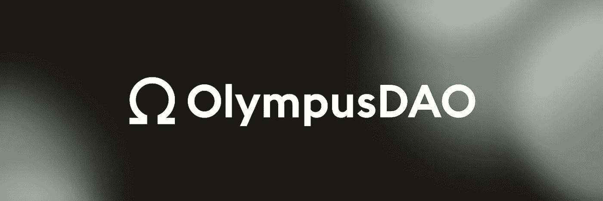
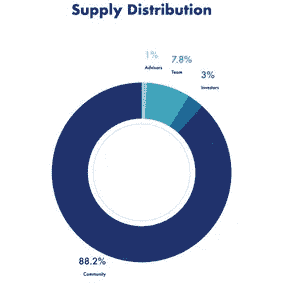

# 奥林巴斯:货币再造

> 原文：<https://medium.com/coinmonks/olympus-currency-reimagined-e968cbaaeb1?source=collection_archive---------4----------------------->

密码市场变化无常。这在分散融资(DeFi)中尤为明显，在这种情况下，寻求大的年收益率(APYs)的用户可能会从一个项目跳到另一个项目，以追求最大的投资回报。由于资本大量外流导致流动性不足，这一动向对许多 DeFi 项目来说是致命的。缺乏流动性会削弱任何 DeFi 项目，无论其原则和象征经济学多么合理。发生这种情况是因为 DeFi 项目在历史上没有流动性。相反，流动性是通过短期窗口向用户借入的，有时只有几个小时。如果你参与了 DeFi 领域，你很可能会看到项目在几天内从提供 80，000%的 APY 变成提供负 APY。如果该项目拥有部分或全部自有流动性，这种变化就不会那么突然。奥林巴斯是第一个拥有自有流动资金的 DeFi 项目。奥林巴斯通过支持每一个$OHM 至少一个$DAI 来做到这一点。美元兑是一种广泛使用的稳定货币，与美元挂钩，由美元等资产支持，由马克道监管。如今，$OHM 由三种稳定的硬币(戴、、)和两种常规加密货币(瑞士法郎和寿司)支持。在撰写本文时，奥林巴斯财政部共有 174，553，083 美元的无风险资产和 760，032，208 美元的风险资产。如今，OHM 的价格为 163 美元，交易价格约为 764 美元。即使每个$OHM 的所有者都要立刻出售，奥林巴斯协议也会以 163 美元或更高的价格买下所有的$OHM。这种支持允许市场投机，并确保该协议可以成功地提供 7000%的 APY。按照目前的国库结构，奥林巴斯可以在 316 天内持续提供 7000%的 APY。所有这些数字都意味着波动，以支持项目的寿命。奥林巴斯的既定目标是创造一种稳定的硬币，不与美元挂钩，但准确跟踪并保持其购买力。奥林巴斯的目标是成为一种自由浮动储备，由一大篮子资产支持，能够在市场波动的情况下保持其购买力。截至今天，大多数密码是用$USDT(系绳)购买的，这是一种与美元挂钩的稳定硬币。我们都知道美元在历史上无法保持其购买力。奥林巴斯是第一个试图废黜美元挂钩的稳定硬币，如$USDT，成为加密市场的主要交易货币的项目。

奥林巴斯协议是如何运作的？

简单地说，奥林巴斯的运作方式是铸造一个或一个以上的美元兑换一千美元，然后以不到一千美元的价格购买一千美元。这确保了协议总是在盈利。我将尝试简化和解释 Olympus 的基本功能，尽管其背后的确切机制很复杂，超出了本文的范围。更多阅读请访问奥林巴斯协议的信息页面[这里](https://docs.olympusdao.finance/main/)。

**下注:**用户通过奥林巴斯网站购买$OHM 并下注以赢取 rebase 奖励。重定基础奖励来自协议出售债券的收益。重定基础奖是复合的，平均每八小时发布一次。

**债券:**奥林巴斯通过债券保证自己的流动性。与美元欧姆的市场价格相比，美元欧姆的债券以折扣价出售，但定价远高于 1 美元的 DAI，这是该协议铸造新美元欧姆的成本。通过这些债券，美元欧姆在一段时间内归属给焊接机。该协议仅在$OHM 以高于保留价格的市场价格交易时铸造新的$OHM，并且总是在$OHM 以低于保留价格交易时烧掉$OHM 并买回$ OHM。

债券投资者受益于停滞或上涨的价格趋势，而赌注者则受益于任何一种趋势。因为所有这些都发生在区块链上，所以该协议具有最新的准确数据，并且可以相应地采取行动。管理奥林巴斯的智能合同都经过了 [Peckshield](https://github.com/peckshield/publications/blob/master/audit_reports/PeckShield-Audit-Report-OlympusDAO-v1.0.pdf) 和 [Omnisci](https://omniscia.io/olympusdao-algorithmic-currency-protocol/) a 的审计，奥林巴斯只有 8 个月左右的历史，还没有出现重大挫折。与所有 DeFi 项目一样，我们必须警惕智能合同风险和管理密钥漏洞等问题。到目前为止，这项货币实验做得非常好。Olympus DAO 甚至推出了 Olympus Pro，这是一款流动性即服务软件。Olympus Pro 使用与 Olympus 类似的智能合约进行绑定。奥林巴斯 Pro 的采用令人难以置信，DeFi 项目如 [GroProtocol](http://linktr.ee/groprotocol) 和 Fantom 在奥林巴斯 Pro 上推出。奥林巴斯已经成为 DeFi 的中流砥柱，并将继续创新。

**奥林巴斯背后是谁？**

Olympus 是由一群伪匿名的开发人员创建的，这对于 DeFi 项目来说一点也不稀奇。奥林巴斯的“首席”开发者自称宙斯，从一开始就是这个项目的代言人。奥林巴斯目前由一个 DAO 管理，该 DAO 对协议变更的提案进行投票，并有权决定从奥林巴斯网站的外观到奥林巴斯财政部持有的资产等任何事情。所有社区成员都可以提出更改建议并对建议进行投票。所有的投票都根据投票者钱包里的欧姆或欧姆来加权。一旦提案获得足够的票数，它将被发送到由七人组成的 DAO 委员会，该委员会的任务是只否决被七名 DAO 负责人中的大多数认为对协议有恶意的提案。这最后的检查是为了确保协议的寿命，并检查潜在的少数规则。奥林巴斯最初由 Zee Prime Capital、Nascent、D64 Ventures、Maven11 Capital 和一些个人投资者提供资金。奥林巴斯有一个透明的令牌分配，可以在下图中看到，其中 88.2%的$OHM 分配给社区。

**为什么是奥林巴斯？**

奥林巴斯是一个全新类型的 DeFi 项目，具有全新类型的令牌组学。在奥林巴斯推出的几个月里，我们已经看到的叉子的数量是惊人的，这极大地促进了我对$OHM 和奥林巴斯刀的看好。奥林巴斯是一个长期项目的设计，比这个领域的一些提供类似 APY 的 DeFi 项目风险小得多。到目前为止，奥林巴斯在身份和协议结构上仍然是所有分支中最合法的。随着$OHM 在分散化交易所和流动性池中的流动性呈指数级增长，选择参与奥林巴斯是一个可能会让你在 DeFi 2.0 赛季中期遭遇不测的举措。

*作者 David Coryat，Istari Capital LP 的加密专家和分析师。*

【https://www.istari.io/ 

*此内容仅供参考，您不应将任何此类信息或其他材料理解为法律、税务、投资、财务或其他建议。本报告中的任何内容均不构成 Istari 或任何第三方服务提供商在该司法管辖区或任何其他司法管辖区购买或出售任何证券或其他金融工具的邀约、建议、认可或要约，根据该司法管辖区的证券法，此类邀约或要约是非法的。请注意，Istari Capital LP 投资于本文讨论的项目或与本文相关的项目。*

> 加入 Coinmonks [电报频道](https://t.me/coincodecap)和 [Youtube 频道](https://www.youtube.com/c/coinmonks/videos)了解加密交易和投资

## 也阅读

 [## 最佳加密交易所| 2021 年十大加密货币交易所

### 编辑描述

blog.coincodecap.com](https://blog.coincodecap.com/crypto-exchange)  [## 2021 年最佳加密借贷平台| 6 大比特币借贷平台

### 获得比特币和其他加密货币的最佳贷款利率

medium.com](/coinmonks/top-5-crypto-lending-platforms-in-2020-that-you-need-to-know-a1b675cec3fa)  [## 2021 年最佳免费加密交易机器人

### 2021 年币安、比特币基地、库币和其他密码交易所的最佳密码交易机器人。四进制，位间隙…

medium.com](/coinmonks/crypto-trading-bot-c2ffce8acb2a)  [## 最佳 4 个加密交易信号电报通道

### 这是乏味的找到正确的加密交易信号提供商。因此，在本文中，我们将讨论最好的…

medium.com](/coinmonks/best-crypto-signals-telegram-5785cdbc4b2b)  [## 5 个最佳社交交易平台[2021] | CoinCodeCap

### 编辑描述

blog.coincodecap.com](https://blog.coincodecap.com/best-social-trading-platforms)  [## BlockFi 评论 2021:利弊和利率| CoinCodeCap

### 编辑描述

blog.coincodecap.com](https://blog.coincodecap.com/blockfi-review)  [## 如何在印度购买比特币？2021 年购买比特币的 7 款最佳应用[手机版]

### 如何使用移动应用程序购买比特币印度

medium.com](/coinmonks/buy-bitcoin-in-india-feb50ddfef94)  [## 加密税务软件——五大最佳比特币税务计算器[2021]

### 不管你是刚接触加密还是已经在这个领域呆了一段时间，你都需要交税。

medium.com](/coinmonks/best-crypto-tax-tool-for-my-money-72d4b430816b)  [## 存储比特币的最佳加密硬件钱包[2021] | CoinCodeCap

### 编辑描述

blog.coincodecap.com](https://blog.coincodecap.com/best-hardware-wallet-bitcoin)  [## Pionex 评论 2021 |免费加密交易机器人和交换

### Pionex 是为交易自动化提供工具的后起之秀。Pionex 上提供了 9 个加密交易机器人…

medium.com](/coinmonks/pionex-review-exchange-with-crypto-trading-bot-1e459d0191ea)