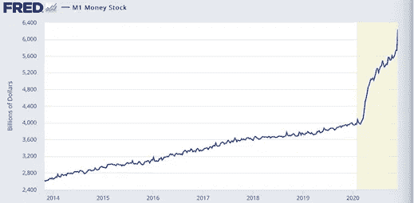

# 比特币在企业金库中无处不在

> 原文：<https://medium.com/coinmonks/omnipresence-of-bitcoin-within-corporate-treasuries-7b7408788770?source=collection_archive---------3----------------------->

Square、MicroStrategy Inc、Stone Ridge Holdings Group 等公司有什么共同点？他们都是价值数十亿美元的公司，是的，他们都是美国经济生态系统的支柱。然而，这三家公司以及超过 25 家其他上市公司、私人公司和 ETF 类公司的另一个共同点是，它们持有的美国国债中有很大一部分是比特币。

对于在今年 Q1 第三季度买入比特币的公司来说，它们的地位比“盈利”更值得关注——它们的业绩证实了对数字货币是一种可靠资产的基本信念和信任。尽管比特币年初至今上涨了近 350%，但 2021 年的目标更高，未来几年更是如此。该领域的领导者，如双子座信托公司的泰勒和卡梅隆·文克莱沃斯，以及世界上最大的银行摩根大通的分析师，预计比特币的近期价格将达到约 40，000 美元。

随着数字货币通过机构资金和机构信任将自己确立为可靠的投资工具，比特币正在越来越多的公司资产负债表中找到自己的位置。原因如下:

**美国经济摇摇欲坠**

在评估美国当前的经济气候时，恶性通货膨胀和全面经济崩溃是一个过了头的步骤。也就是说，严重衰退甚至萧条是完全可能的。以 M1(货币存量)的指数增长为例(见下图)。仅在过去的 10 个月里，美联储就印刷了 35%的流通美元。不仅如此，所有股票的总市值占 GDP 的比例([自助餐指标](https://www.gurufocus.com/stock-market-valuations.php))达到了 183%，这通常被用来表明股票目前“被严重高估”。为了让美国赚钱，他们提高贷款利率并征税，但美联储表示，他们将在大约 5 年内将利率保持在“接近 0%”的水平，刺激措施将大幅削减该国的税收。总而言之，美国经济的未来岌岌可危，投资者、首席财务官和公司董事会都清楚地看到了这一点。事实上，很明显，他们甚至没有在比特币上*下注*，而是*依靠比特币*在众多不同资产类别中**胜过**传统资产。

**国债只是企业投资组合**

国库管理一个企业的资产负债表，并使其功能平稳运行。通过优化流动性和资本成本，它实际上在增加股本回报率和推动股东回报方面具有核心作用[【1】](https://www.toptal.com/finance/treasury-manager/treasury-management-best-practices)。就此而言，对于任何投资组合或国债来说，目标都是随着时间的推移超过通胀，因为购买力每年都会因各种原因导致的通胀而下降:低借款利率、美联储印钞或货币供应扩张。对于大多数公司来说，由于美元的下跌趋势，资产负债表上有过多的现金是一种风险。自 2020 年 3 月见顶以来，美元已贬值近 12%[【2】](https://www.fox10tv.com/news/us_world_news/why-the-us-dollar-could-be-the-big-loser-of-2021/article_06344046-e701-5490-aec0-522cabc6fb26.html#:~:text=The%20US%20dollar%20has%20weakened,currencies%20since%20peaking%20in%20March.&text=(CNN)%20%2D%2D%20The%20US%20dollar,currencies%20since%20peaking%20in%20March.)。为了将国债发行成债券，我们需要比现在更高的利率，目前的利率接近 0%。由于利率接近零，而且未来几个月可能会出现负利率，因此无法对冲通常为每年 2%左右的**T5通胀。最后，对于公司资产负债表上的股票头寸，反对的理由突显了最近股市的零星和当前被高估的性质。大型科技股，即 FAANG、Zoom、微软和少数其他科技股不成比例地引领股指创下历史新高，而绝大多数股票只是勉强及格。**

**比特币更靠谱**

总的来说，比特币已经证明了自己是一种更好的对冲美元价值损失(通货膨胀)的工具，也证明了它可以跑赢股票，今年已经翻了十倍。比特币的 [Beta](https://www.macroaxis.com/invest/ratio/BTC.CC/Beta#:~:text=About%20Beta,-In%20a%20nutshell&text=In%20accordance%20with%20the%20recently,which%20currently%20averages%200.0)%20industry.) 为 0，这意味着它与市场走势无关。这是一种完全不同的资产类别，严格按照供求关系变动。这支持了一个结论:大多数公司将开始在资产负债表上积累比特币头寸，因为这是回报最可靠的工具。在越来越多的老牌公司看来，比特币比其他投资选择具有更好的风险/回报比。

这具有严重的[积极的]影响

我们已经看到 MicroStrategy Inc .和 Square 是在其资产负债表上积累比特币的首批行动者之一，这也给 PayPal、摩根大通(J . P Morgan)和 gray dy Investments 等公司带来了一些机构信心。随着比特币吸引越来越多的机构积累，数字资产的供应将巧合地萎缩，从而推动需求和价格大幅上涨。随着需求和价格的增加，回报也会增加，这些回报将远远超过任何股票、债券或现金头寸。以此为例:MicroStrategy Inc .的首席执行官迈克尔·塞勒(Michael Saylor)在 2020 年 12 月宣布，他的公司已将 11.25 亿美元的国库用于比特币，平均成本为 15964 美元/枚。截至今日【2021 年 1 月】，比特币价格为~ $ 34000[【3】](https://www.coindesk.com/microstrategy-buys-bitcoin-debt)。

比特币是一种对冲所有其他传统投资工具表现不佳的工具，由于国内和全球经济目前的疲软，比特币将继续如此。随着公司管理投资组合风险并为自己或投资者寻求高于平均水平的回报，比特币成为最安全的投资首选。随着时间的推移，即使我们的世界经济正在复苏，它也将在我们的体制结构中根深蒂固。比特币在这里成长，但更重要的是，它会留在这里。

[1][https://www . top tal . com/finance/treasury-manager/treasury-management-best-practices](https://www.toptal.com/finance/treasury-manager/treasury-management-best-practices)

[2][https://www . fox 10 TV . com/news/us _ world _ news/why-the-us-dollar-be-the-big-loser-of-2021/article _ 06344046-e701-5490-AEC 0-522 c ABC 6 FB 26 . html](https://www.fox10tv.com/news/us_world_news/why-the-us-dollar-could-be-the-big-loser-of-2021/article_06344046-e701-5490-aec0-522cabc6fb26.html#:~:text=The%20US%20dollar%20has%20weakened,currencies%20since%20peaking%20in%20March.&text=(CNN)%20%2D%2D%20The%20US%20dollar,currencies%20since%20peaking%20in%20March)

[https://www.coindesk.com/microstrategy-buys-bitcoin-debt](https://www.coindesk.com/microstrategy-buys-bitcoin-debt)