# 关于比特币脚本和见证大小

> 原文：<https://medium.com/coinmonks/on-bitcoin-transaction-sizes-97e31bc9d816?source=collection_archive---------0----------------------->

下面的调查处理不同事务类型的脚本和见证的大小要求。通过对第一性原理和经验数据的分析，为脚本和证人建立了一组估计。这些估计值可以作为定量模型的输入，这些模型的预测可能有助于使未来的区块规模讨论更加客观。

这篇文章的结构如下。下一节包含对相关术语的简要讨论。以下两节重点介绍比特币中使用的公钥和签名的编码。然后对所有的比特币交易输出类型进行单独详细的讨论。最后，结果部分总结了调查结果。

# 术语

为了避免误解和进行理性的讨论，需要对关键术语进行简要的定义。特别是，区分*交易类型*和*交易输出类型*是有帮助的，因为这两个术语有时会被混淆，这会导致混淆。

*事务类型*定义了事务可以拥有的两个属性。第一个属性与新硬币的创造有关:每个块恰好包含一个 *coinbase* 事务，由矿工用来生成新硬币；该组中的所有其他交易使用先前存在的硬币，并且是*非硬币基础*交易。第二个属性涉及比特币的隔离见证(segwit)升级:当一个或多个交易的输入与见证数据相关联时，整个交易被视为一个 *segwit* 交易；否则，该交易被视为*非 segwit* 交易。

另一方面，*事务输出类型*定义了事务输出的类型。每个输出都包含一个锁定脚本，该脚本设置锁定在输出中的硬币可以使用的条件，输出的类型由输出中使用的脚本类型决定:例如，当输出的脚本指定需要公钥来解锁硬币时，输出的类型是 Pay-to-Public-Key (P2PK)。

花费产出的过程有时被称为交易，因此花费 P2PK 产出成为 P2PK 交易。然而，这意味着术语*交易*现在有两种不同的含义:一方面，它指的是比特币的交易数据结构；另一方面是花费产出的行为。按照这个术语，单个事务(第一个含义)可以包含多个事务(第二个含义)，这可能会引起混淆。

总之，可以确定的是，只有 coinbase 和 segwit 交易指的是真正的*交易类型*，而所有其他交易类型实际上指的是一个输入花费一个具有特定*交易输出类型*的输出。

# 公钥的编码

[比特币](https://blog.coincodecap.com/a-candid-explanation-of-bitcoin/)使用椭圆曲线加密技术，公钥对应于椭圆曲线上点的 *x* -和*y*-坐标。比特币使用的椭圆曲线 *secp256k1* ，在效率加密标准(SEC)中定义，使用 256 位数字来表示曲线上点的 *x* -和*y*-坐标。

除了为不同的椭圆曲线建立参数外，sec 还定义了公钥编码标准。本来比特币只支持*未压缩* SEC 格式。在这种格式中，公钥由一个单字节的幻数表示，该幻数表示所使用的 sec 编码的种类(在这种情况下，是未压缩的)以及密钥的两个 32 字节的 *x* 和 *y* 坐标的编码。因此，未压缩的 SEC 格式总共使用 65 个字节。

一段时间后，*压缩*秒格式的支持被添加到[比特币](https://blog.coincodecap.com/a-candid-explanation-of-bitcoin/)中。通过利用公钥的 *y* 坐标(除了它的符号)可以从公钥的 *x* 坐标导出的事实，压缩格式显著减小了公钥的编码大小。因此，当使用压缩的 SEC 格式时，不是编码公钥的 *x* 和 *y* 坐标，而是仅编码其 *x* 坐标。关于 *y* 坐标符号的模糊性通过使用两个不同的单字节幻数作为 SEC 前缀来解决:一个表示压缩的 SEC 格式，具有正的 *y* 坐标；另一个为负 *y* 坐标。通过去掉 *y* 坐标，编码的大小可以减少 32 个字节。因此，使用压缩格式，仅使用 33 个字节就可以对公共密钥进行编码。

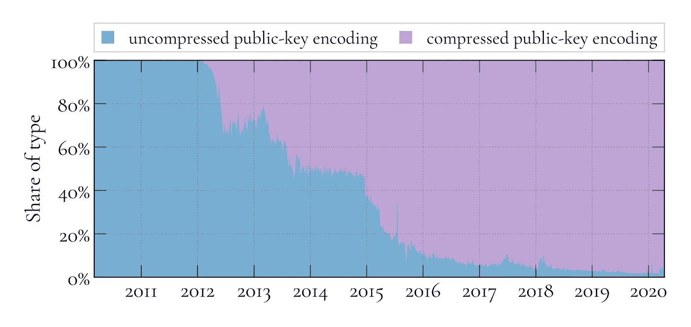

上图显示了 P2PK、P2PKH 和 P2WSH 事务中未压缩和压缩编码的份额。经验数据显示，多年来，比特币中未压缩密钥的使用稳步下降。事实上，在最近的过去，使用未压缩密钥的交易份额非常低，以至于为了实用的目的，今天的编码公钥的大小可以被假定为 33 字节。

# 签名编码

比特币的签名编码遵循区分编码规则(DER)。一个签名由两个 256 位的数字组成， *r* 和 *s* 。用 DER 编码时，每个数字都有两个字节作为前缀:一个用来编码数据类型，是整数；另一个以字节表示数字的长度。

接下来是对 *r* 和 *s* 的值进行编码。尽管这些值是 256 位值，但它们的编码并不总是 32 字节。例如，DER 使用有符号整数的事实对编码的大小有影响:有符号整数使用数字的二进制表示的最高位来区分正值和负值，因此最高位被设置的 *r* 和 *s* 的值将被解释为负数。为了防止这种情况，在设置了最高位的情况下，会在前面加上一个零字节:这使值保持不变，但强制最高位不设置。设置了最高位并要求补零的 *r* 和 *s* 的值也称为*高*值，而没有设置最高位且不要求补零的值称为*低*值。

自比特币核心版本 0 . 11 . 1(2015 年 10 月)起，“低 *s* 规则强制仅中继具有低 s 值的交易，这意味着 s 的编码将具有至多 32 字节的大小；只有矿工可以绕过这一限制，将具有高 *s* 值的签名包含在块中。对于 *r* 来说，这个限制是不存在的。假设值是均匀分布的，签名应该有一半时间包含高值。因此，平均而言，其编码大小为 32.5 字节。

用两个字节表示每个值的数据类型和长度，到目前为止，平均大小为:r*r*34.5 字节，s*s*34 字节，或者两者都是 68.5 字节。要获得有效的 DER 签名，还需要两个字节:一个字节表示编码保存多个值，另一个字节表示编码的总长度。一个完整的 DER 签名由这两个字节组成，后面是之前讨论过的 *r* 和 *s* 值的编码。因此 DER 签名的平均大小是 70.5 字节。最后需要指出的是，比特币支持多种签名类型。为了区分这两者，指示签名类型的字节被附加到 DER 签名。因此，编码签名的平均大小为 71.5 字节。

为了完成对签名大小的分析，还需要讨论两个方面。第一个问题是签名的 *r* 和 *s* 值是随机的。如果随机 256 位数字的二进制表示具有 8 个或其前导位被设置为零，则该数字可以使用少于 32 个字节来编码。第二个方面涉及签名大小的优化，该优化由于以下事实而成为可能: *r* 和 *s* 值的生成涉及随机输入:一些实现丢弃具有高值的签名；相反，它们选择新的随机输入并导出新的 *r* 和 *s* 值，直到发现低 *r* 值。加上由强制用于标准事务的 low-s 值，生成的签名的大小最多为 71 个字节。

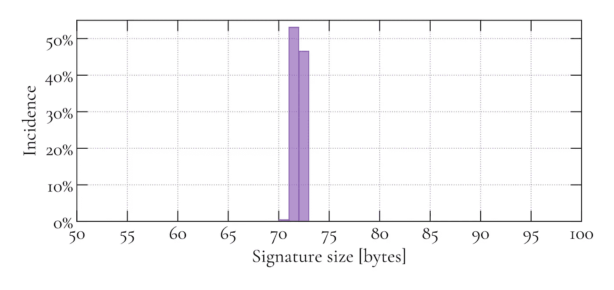

为了量化影响签名大小的不同因素的总体影响，需要对经验数据进行分析。上面的直方图显示了在区块 626，267 之前的两年中，比特币区块链中不同签名大小的出现。正如所料，大部分签名的大小为 71 或 72 字节。稍微偏向 71 字节可以归功于前面讨论的 low-r*优化。此外，可以观察到少量的 70 字节签名。这可以归因于前面讨论的在 *r* 和 *s* 值的二进制表示中前导零比特的出现。事实上，甚至有只有 69 或 68 字节的签名；然而，这种情况很少发生，因此在直方图中看不到。根据经验数据，平均签名大小为 71.46 字节，这与之前分析估计的 71.5 字节相匹配。因此，出于实际目的，今天的签名的大小可以假设为 71.5 字节。*

# 支付公钥

Pay-to-Public-Key (P2PK)输出的锁定脚本格式为`<len> <pubkey> OP_CHECKSIG`，其中`<len>`为后续公钥的长度，以字节为单位；`<pubkey>`，一个 sec 编码的公钥；以及`OP_CHECKSIG`，用于签名验证的比特币脚本指令。

公钥和比特币脚本指令的长度编码各需要一个字节。先前确定的公钥估计值为 33 字节。因此，P2PK 输出的锁定脚本大小估计为 35 字节。

P2PK 输出的解锁脚本格式为`<len> <sig>`，其中`<len>`为后续签名的大小，单位为字节；以及`<sig>`，一个 DER 编码的签名。

签名长度的编码需要一个字节，而先前建立的签名大小的估计值是 71.5 字节。因此，P2PK 解锁脚本的估计值为 72.5 字节。

P2PK 脚本的总体贡献由锁定和解锁脚本的大小之和给出。前者的大小为 35 字节；后者 72.5 字节。因此，P2PK 脚本的估计值为 107.5 字节。

上图所示的经验数据证实了该估计的有效性，该图显示了截至块 626、267 的所有消耗的 P2PK 输出的 P2PK 脚本大小的直方图。正如所料，大部分事务的脚本大小为 107 和 108 字节(由于 low- *r* 优化，稍微偏向于 107 字节)。以 141 字节为中心的第二簇大小对应于使用*未压缩*公钥的事务。请注意，直方图包括来自所有 P2PK 交易的*数据。第二个簇只是比特币早期的产物，当时未压缩的密钥更常见，因此它的存在对今天 P2PK 交易中脚本的 107.5 字节估计值的有效性没有影响。*

# 付费公钥哈希

Pay-to-Public-Key-Hash (P2PKH)输出的 locking-script 格式为`OP_DUP OP_HASH160 0x14 <hash> OP_EQUALVERIFY OP_CHECKSIG`，其中`OP_DUP`为复制栈顶项的比特币脚本指令；`OP_HASH160`，将 HASH-160 函数应用于栈顶项的比特币脚本指令；`0x14`，以下 20 字节 hash 的长度，以字节为单位(采用十六进制表示)；`<hash>`，一个 20 字节的 HASH-160 公钥；`OP_EQUALVERIFY`，两个栈顶项不同时，使交易无效的比特币脚本指令；以及`OP_CHECKSIG`，验证签名的比特币脚本指令。

四个比特币脚本指令和散列长度的编码各需要一个字节。加上 20 字节的散列，这意味着锁定脚本的大小为 25 字节

P2PKH 输出的解锁脚本格式为`<len> <sig> <len> <pubkey>`，其中`<len>`为后续签名的大小，单位为字节；`<sig>`，一个 DER 编码的签名，使用私钥创建，下一个在锁定脚本中出现的公钥就是从该私钥导出的；`<len>`，以下公钥的大小，以字节为单位；以及`<pubkey>`，SEC 编码的公钥，锁定脚本中使用的 HASH-160 就是从这个公钥派生出来的。

签名和公钥的长度编码各需要一个字节。加上先前建立的分别为 71.5 和 33 字节的签名和公钥的估计，这导致了 106.5 字节的解锁脚本大小估计。

P2PKH 脚本的总贡献是锁定和解锁脚本大小的总和，分别为 25 和 106.5 字节。因此，P2PKH 脚本的估计值为 131.5 字节。

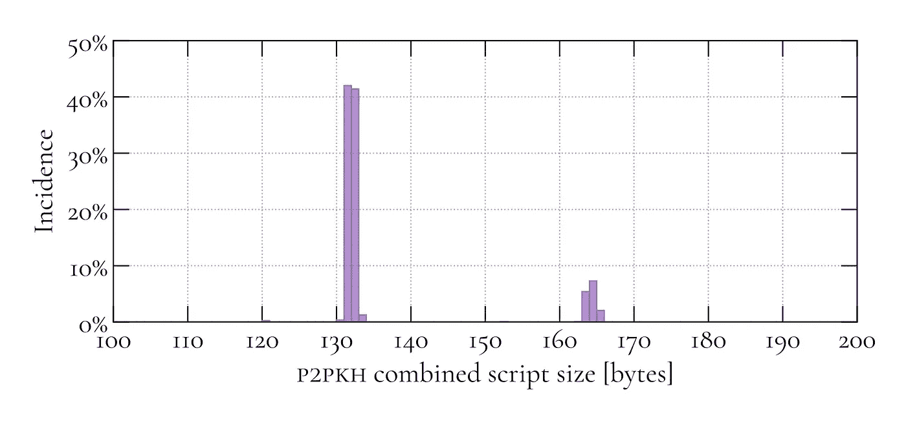

和以前一样，这一估计的有效性得到了经验数据的证实。上图包含一个直方图，显示了截至块 626，267 的所有 P2PKH 事务的组合脚本大小。正如所料，大部分事务的脚本大小为 131 和 132 字节。大约 164 字节的第二簇对应于使用*未压缩*公钥的事务。请注意，直方图包括了所有的 P2PKH 交易，所以第二个聚类也是比特币早期的产物，当时未压缩密钥更为普遍。因此，第二个群集不会降低对今天的 P2PKH 事务的组合脚本大小的 131.5 字节估计的有效性。

# 裸多重签名

裸多签名(multisig)输出的锁定脚本格式是`OP_m <len> <pubkey1> ... <len> <pubkeyn> OP_n OP_CHECKMULTISIG`，用`OP_m`指定 *m* ，花费输出所需的签名数；`<len>`，后续编码密钥的长度，以字节为单位；`<pubkey1> ... <pubkeyn>`，n 个*秒编码的公钥列表；`OP_n`，编码 *n* ，公钥的个数；以及`OP_CHECKMULTISIG`，多签名验证的比特币脚本指令。*

与 P2PK 和 P2PKH 输出类型不同，在 P2PK 和 P2PKH 输出类型中，锁定脚本的大小是固定的，而 multisig 的锁定脚本的大小取决于脚本中使用的公钥的数量。为了更好地了解最流行的 multisig 用例以及相应的锁定脚本大小，需要对经验数据进行分析。

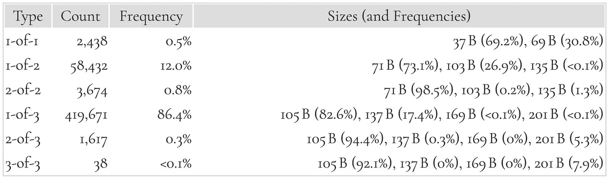

上表显示了截至模块 626、267 的不同裸 multisig 输出类型的计数、频率和锁定脚本大小(及其频率)。数据显示，2 选 1 和 3 选 1 是迄今为止最受欢迎的裸 multisig 变体，合计占所有 multisig 输出的 98%以上。因此，在下文中，重点将放在对这些特定变量的估计上。

此外，数据显示了向最小输出大小的强烈趋势:在最后一列中，每行的第一个条目表示所有公钥都使用压缩 SEC 格式编码的情况；对于每种类型，这是最常见的编码。对于最后一列中的任何特定行，将一个条目向右移动对应于以未压缩而不是压缩的 SEC 格式表示的多一个公钥，这对应于锁定脚本的大小增加了 32 个字节。进一步的分析揭示了来自最近过去的 multisig 输出对所有压缩的键具有更强的偏好；使用一个或多个未压缩公钥的输出比例很小，这是由于比特币早期的输出经常使用未压缩的密钥。

总结一下关于锁定脚本大小的讨论，可以确定 2 选 1 和 3 选 1 的 multisig 输出是两个最重要的用例；今天，它们的大小估计分别是 71 和 105 字节。

multisig 输出的解锁脚本格式为`<OP_0> <len> <sig1> ... <len> <sigm>`，带有`OP_0`，这是一个虚拟的比特币脚本指令，用于解决`OP_CHECKMULTISIG`实现中的一个 bug`<len>`，以下签名的长度，以字节为单位；和`<sig1> ... <sig1>`，m 个*DER 编码签名的列表。*

与锁定脚本的情况一样，multisig 输出的解锁脚本大小是不固定的；在解锁脚本的情况下，大小取决于签名的数量。伪脚本指令`OP_0`总是贡献 1 个字节；每个签名长度编码贡献另一个字节；并且每个签名还有 71.5 字节。在两个最流行的用例中(1-of-2 和 1-of-3 multisig)，必须在解锁脚本中提供一个签名。因此，两种变体的解锁脚本大小的估计是 73.5 字节。

multisig 脚本总大小的估计值是锁定和解锁脚本大小的总和。对于 1-of-2 multisig 事务，相应的脚本贡献 71 和 73.5 字节，导致脚本大小估计为 144.5 字节；对于 1/3 变体，贡献为 105 和 73.5 字节，产生 178.5 字节的脚本估计值。

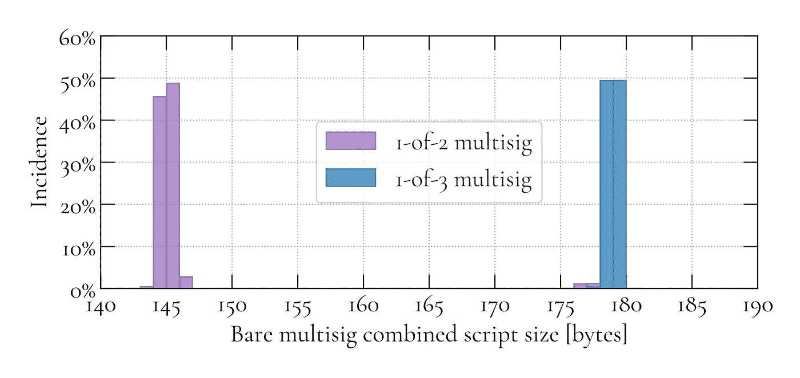

像往常一样，这些估计得到了经验数据的支持。上图包含截至块 626，267 的所有 2 选 1 和 3 选 1 multisig 交易的组合脚本大小的直方图。对于 1-of-2 multisig，可以观察到少量脚本大小为 176 和 177 字节的事务，这对应于使用未压缩公钥的事务。和以前一样，这个由比特币早期的旧交易造成的假象并不影响对今天交易的估计。正如预期的那样，大多数 1/2 multisig 事务的脚本大小符合 144.5 字节的估计值，大小为 144 或 145 字节。在 1/3 multisig 的情况下，大多数事务的脚本大小与 178.5 字节的估计一致，大小为 178 或 179 字节。

# 付费脚本哈希

Pay-to-Script-Hash (P2SH)输出的锁定脚本格式为`OP_HASH160 0x14 <hash> OP_EQUAL`，其中`OP_HASH160`是将 HASH-160 函数应用于栈顶项目的比特币脚本指令；`0x14`，以下 20 字节哈希的长度以字节表示(采用十六进制表示)；`<hash>`，一个 20 字节的 HASH-160 的 rename 脚本锁定输出；以及`OP_EQUAL`，判断两个栈顶项目是否相等的比特币脚本指令。

每个比特币脚本指令贡献一个字节，哈希长度的编码也是如此。加上 20 字节的散列，总的锁定脚本大小是 23 字节。

P2SH 输出的解锁脚本格式为`<data> <len> <redeem script>`，带有`<data>`，一些数据满足赎回脚本设置的条件；`<len>`，以下赎回脚本的长度；以及`<redeem>`，将被解释为锁定脚本的赎回脚本。

理论上，赎回凭证可以设置任意的消费条件，这意味着赎回凭证的大小是可变的；同样，根据兑现脚本中规定的条件，兑现脚本的数据也有很大不同。鉴于此，估计 P2SH 解锁脚本的大小似乎不切实际。然而，如下图中的数据所示，在实践中，大多数兑换脚本仅分为三类。在块 626，267 之前的一年中，所有赎回凭证的 69.3%是 P2SH-支付给见证人-公钥-哈希(P2SH-P2WPKH)类型；P2SH-Pay-to-Witness-Script-Hash-multisig(P2SH-P2WSH-multisig)类型的 21.1%；P2SH-multisig 型占 9.2%。考虑到只有 0.4%的 rename 脚本不属于前面的任何类别，关注最相关用例的估计而忽略其余的似乎是可以接受的。

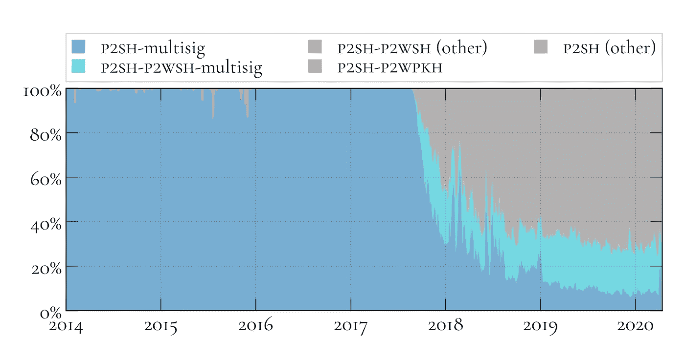

## 支付给脚本哈希支付给见证公钥哈希

对于 P2SH-P2WPKH 最流行的用例，redempt 脚本是`OP_0 0x14 <hash>`，带`OP_0`，一个比特币脚本指令，用来表示见证程序的版本；`0x14`，以下 20 字节哈希的长度以字节表示(采用十六进制表示)；以及`<hash>`，公钥的 20 字节 HASH-160。见证程序的版本和哈希长度的编码各贡献一个字节。加上 20 字节的散列，这导致了 22 字节的 redempt-script 大小。由于解锁脚本还包括长度为 22 字节的赎回脚本的字节编码，因此解锁脚本的总大小为 23 字节。

P2WPKH 的见证格式为`0x02 <len> <sig> <len> <pubkey>`，格式为`0x02`，见证脚本中包含的项数(P2WPKH 为两个:签名和对应的公钥)；`<len>`，以下签名的大小以字节为单位；`<sig>`，使用私钥创建的 DER 编码的签名，在锁定脚本中接下来呈现的公钥是从该私钥导出的；`<len>`，以下公钥的大小，以字节为单位；以及`<pubkey>`，从其导出在兑换脚本中使用的 HASH-160 的公钥。见证的平均大小由指示见证脚本中项的数量的字节、指示签名和公钥长度的两个字节、71.5 字节的平均签名大小和 33 字节的公钥大小给出。因此，P2WPKH 的见证大小估计为 107.5 字节。

## 支付给脚本哈希支付给见证脚本哈希多重签名

对于 P2SH-P2WSH-multisig，兑换脚本为`OP_0 0x20 <hash>`，其中`OP_0`为比特币脚本指令，用于表示见证程序的版本；`0x20`，以下 32 字节哈希的长度以字节表示(采用十六进制表示)；和`<hash>`，锁定输出的见证脚本的 32 字节 SHA-256 散列。见证程序的版本和哈希长度的编码各贡献一个字节。加上 32 字节的散列，这导致了 34 字节的 redempt-script 大小。除了兑换脚本之外，解锁脚本还包含兑换脚本长度的编码，它贡献了一个字节。因此，解锁脚本的总大小为 35 字节。

P2SH-P2WSH-multisig 输出的见证是`<nitems> <data> <len> <witness script>`，其中`<nitems>`是见证中包含的项目数；`<data>`，一些数据满足见证脚本设置的条件；`<len>`，以下见证脚本的长度；以及`<witness script>`，将被解释为锁定脚本的见证脚本。

经验数据显示，2-of-2 和 2-of-3 multisig 变体占所有 P2SH-P2WSH-multisig 交易的 90%以上，因此见证规模估计侧重于这两种情况。

在 2-of-2 multisig 的情况下，见证脚本大小对应于 2-of-2 multisig 的锁定脚本大小，即`OP_2 <len> <pubkey1> <len> <pubkey2> OP_2 OP_CHECKMULTISIG`。三个比特币脚本指令各贡献一个字节；公钥长度的两种编码也各贡献一个字节；最后，每个公钥贡献 33 个字节。因此，见证脚本大小估计为 71 字节。为了满足见证脚本，必须在见证中提供两个 71.5 字节的签名和每个签名长度的编码，并附带一个`OP_0`，总计 146 字节。最后，见证中的项数和见证脚本的长度的编码各贡献一个字节。因此，见证的总大小估计为 219 字节。

在 2-of-3 multisig 的情况下，必须在见证脚本中提供额外的 33 字节公钥和密钥长度编码，因此见证脚本的大小从 71 字节增加到 105 字节。如前所述，花费基金需要两个签名，因此见证人的大小保持为 146 字节。给定见证中项目数的编码和见证脚本的长度各一个字节，146 字节的`<data>`部分和 105 字节的见证脚本本身，见证大小的总估计值为 253 字节。

## 付费脚本哈希多重签名

正如 P2SH-P2WPKH-multisig 的情况一样，对于 P2SH-multisig，2-of-2 和 2-of-3 用例占所有事务的 90%以上，因此锁定脚本大小估计将仅针对这两种情况给出。

对于 2-of-2 P2SH-multisig，redempte 脚本是一个 2-of-2 multisig 锁定脚本，其大小估计值先前被确定为 71 字节。为了满足 redempt 脚本，必须在见证中提供两个 71.5 字节的签名和每个签名长度的编码，并附带一个`OP_0`，总计 146 字节。因此，总解锁脚本大小对应于 146 字节签名部分、71 字节赎回脚本和用于赎回脚本长度编码的字节的总和。因此，相应的解锁脚本大小估计为 218 字节。

对于 2-of-3 P2SH-multisig，redempte 脚本是一个 2-of-3 multisig 锁定脚本，其大小估计值先前被确定为 105 字节。由于兑换脚本已经变得大于 75 字节，因此需要两个字节来编码其大小(参见此处的`OP_PUSHDATA1`)。所有其他贡献保持不变，因此 3 选 2 P2SH-multisig 的锁定脚本大小对应于 146 字节的`<data>`部分、105 字节的兑换脚本和编码兑换脚本大小所需的两个字节的总和。因此，相应的解锁脚本估计值为 253 字节。

对于前面讨论的事务类型，组合的脚本大小由锁定和解锁脚本大小的总和给出。但是，在嵌套 Segwit 事务(即 P2SH-P2WPKH 和 P2SH-P2WSH)的情况下，在确定脚本和见证的总体贡献时，必须包括见证的大小。

因此，P2SH-P2WPKH 事务的脚本和见证大小估计考虑了 23 字节的锁定脚本大小、23 字节的解锁脚本大小和 107.5 字节的见证大小。因此，P2SH-P2WPKH 事务的相应估计值为 153.5 字节。

对于 P2SH-P2WSH-multisig 事务，锁定和解锁脚本大小分别为 23 和 35 字节。对于 2-of-2，见证大小是 219 字节；对于 2/3，它是 253 字节。因此，2/2 和 2/3 P2SH-P2WSH-multisig 事务的组合脚本和见证大小估计值分别为 277 和 311 字节。

对于 P2SH-multisig 交易，锁定脚本大小为 23 字节。2-of-2 P2SH-multisig 的解锁脚本大小为 218 字节；对于 2/3，它是 253 字节。因此，2/2 和 2/3 P2SH-multisig 事务的组合脚本估计值分别为 241 和 276 字节。

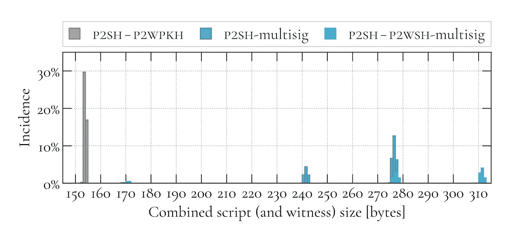

所有的估计都有经验数据支持。上图包含截至块 626、267 的所有 P2SH 事务的组合脚本(和见证)大小的直方图。从左到右，第一簇对应于 153.5 字节的 P2SH-P2WPKH 估计；241 字节的 2-of-2 P2SH-multisig 估计的下一个；第三个是 276 字节的 2/3 P2SH-multisig 估计值；第四个与第三个稍微重叠，是 277 字节的 2-of-2 P2SH-P2WSH-multisig 估计；最后，第五个是 311 字节的 2/3 P2SH-P2WSH-multisig 估计值。

# 空数据

空数据输出的锁定脚本格式为`OP_RETURN <len> <data> ... <len> <data>`，其中`OP_RETURN`是表示空数据输出类型的比特币脚本指令；`<len>`，以下数据项的长度；而`<data>`，任意数据。

比特币脚本指令贡献一个字节。如果数据最多为 75 字节，则数据长度的编码贡献一个字节，如果数据大于 75 字节，则贡献两个字节。在比特币核心 0.11 中，数据部分的大小限制从 40 字节增加到 80 字节。因此，锁定脚本的总大小介于 1 个字节(只有`OP_RETURN`，没有数据)和 83 个字节(`OP_RETURN`，2 个字节编码数据长度，80 个字节数据)之间。鉴于这一广泛的范围，有必要对经验数据进行分析，以得出对锁定脚本大小的有意义的估计。

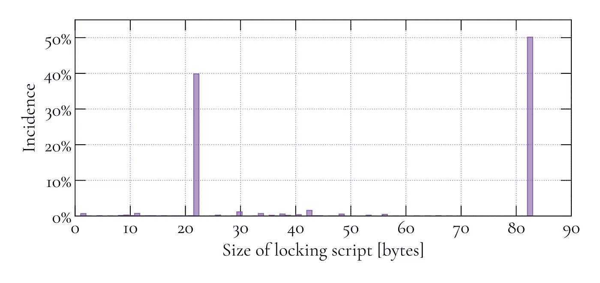

上图包含了截至块 626，267 的所有空数据输出的锁定脚本大小的直方图。该数据揭示了两个主要的用例，它们合起来占所有空数据输出的 90%以上。22 字节处的第一个峰值对应于 20 字节的数据大小，这可能是在空数据输出中记录 HASH-160 或 RIPEMD-160 散列的实例。第二个峰值为 83 字节，表示数据大小为 80 字节，这是空数据输出的上限。这些实例可能对应于这样的用例:大量数据被分成多个空数据输出，每个输出存储尽可能多的数据。直方图中的数据表明批量数据用例稍微更受欢迎。基于这个经验数据，锁定脚本大小的估计值是 53.6 字节。

空数据输出被设计成不可描述的，所以估计解锁脚本的大小是没有意义的。此外，因为不可能有空数据事务，所以给出事务大小估计值同样没有意义。

# 支付给证人公钥散列

Pay-to-Witness-Public-Key-Hash(p 2 wpkh)输出的锁定脚本格式为`OP_0 0x14 <hash>`，其中`OP_0`为比特币脚本指令，用于表示见证程序的版本；`0x14`，以下 20 字节哈希的长度以字节表示(采用十六进制表示)；以及`<hash>`，公钥的 20 字节 HASH-160。

P2WPKH 输出的锁定脚本大小始终为 22 个字节:20 个字节的哈希，以及比特币脚本指令和哈希长度编码各一个字节。

一个 P2WPKH 输出的见证是`0x02 <len> <sig> <len> <pubkey>`，其中`0x02`，见证脚本中包含的项数(在 P2WPKH 的情况下是两个:签名和对应的公钥)；`<len>`，以下签名的大小以字节为单位；`<sig>`，使用私钥创建的签名，下一个在见证中呈现的公钥是从该私钥导出的；`<len>`，以下公钥的大小，以字节为单位；以及`<pubkey>`，从中导出锁定脚本中使用的 HASH-160 的公钥。

见证中的项数以及签名和公钥的长度的编码各占一个字节。加上 71.5 字节的签名和 33 字节的公钥，这导致 107.5 字节的见证大小估计。

P2WPKH 事务的脚本和见证的总贡献是锁定脚本和见证大小的总和，分别为 22 和 107.5 字节。因此，P2WPKH 事务的脚本和见证估计值为 129.5 字节。

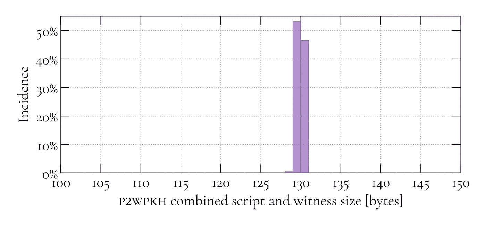

经验数据证实了 129.5 字节的估计值:上图包含了截至块 626，267 的所有 P2WPKH 事务的组合脚本和见证大小的直方图，显示了超过 99%的事务具有 129 或 130 字节的组合脚本和见证大小。

# 支付给证人脚本哈希

Pay-to-Witness-Script-Hash(P2WSH)输出的 locking-script 格式为`OP_0 0x20 <hash>`，其中`OP_0`为比特币脚本指令，用于表示见证程序的版本；`0x20`，以下 32 字节哈希的长度以字节表示(采用十六进制表示)；和`<hash>`，锁定输出的见证脚本的 32 字节 SHA-256 散列。

P2WSH 输出的锁定脚本大小始终是 34 个字节:32 个字节的哈希，以及用于比特币脚本指令和哈希长度编码的各一个字节。

P2WSH 输入的一般见证格式为`<nitems> <data> <len> <witness script>`，带`<nitems>`，见证包含的项数；`<data>`，一些数据满足见证脚本设置的条件；`<len>`，以下见证脚本的长度；`<witness script>`，将被解释为锁定脚本的见证脚本。

理论上，见证脚本可以设置任意的花费条件，这意味着见证脚本的大小是可变的；同样，根据见证脚本中规定的条件，履行见证脚本的数据也有很大不同。有鉴于此，估计 P2WSH 见证人的规模似乎不切实际。然而，如下图中的数据所示，在实践中，大多数见证脚本都规定了多重签名支出条件。

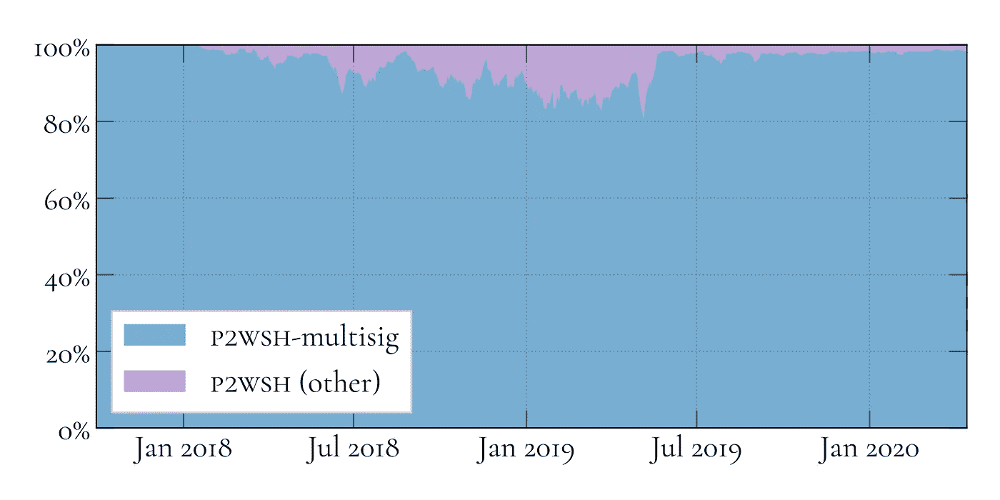

此外，只有三种用例占所有 P2WSH-multisig 交易的 98%以上，即 1 对 1 (20%)、2 对 2 (17%)和 3 对 2(62%)multisig 变体。考虑到这一点，关注这些相关用例的估计而忽略其余的似乎是可以接受的。

对于 1-of-1 P2WSH-multisig，见证脚本对应于 1-of-1 multisig 锁定脚本，即`OP_1 <len> <pubkey> OP_1 OP_CHECKMULTISIG`。三个比特币脚本指令各贡献一个字节，公钥长度的编码也是如此，而公钥本身贡献 33 个字节。因此，见证脚本大小估计为 37 字节。为了满足见证脚本，必须提供一个 71.5 字节的签名和一个带有`OP_0`的签名长度编码，因此`data`部分的总贡献是 73.5 字节。最后，见证中的项数和见证脚本的长度的编码各贡献一个字节。因此，相应的见证大小估计值为 112.5 字节。

对于 2-of-2 P2WSH-multisig，见证脚本包含第二个公钥和密钥长度的编码，因此见证脚本大小增加了 34 个字节，达到 71 个字节。为了满足见证，需要第二个 71.5 字节的签名和签名长度的编码，将`data`部分的贡献增加 72.5 字节，达到 146 字节。见证中的项数和见证脚本的长度的编码的剩余贡献为两个字节，因此相应的见证大小估计值为 219 个字节。

对于 2-of-3 P2WSH-multisig，见证脚本包含第三个公钥和密钥长度的编码，因此见证脚本的大小又增加了 34 个字节，达到 105 个字节。所有其他贡献仍然存在，因此相应的见证大小估计值为 253 字节。

对于所有 P2WSH-multisig 变体，总的脚本和见证贡献由锁定脚本和见证大小的总和给出。前者总是 34 字节。后者 112.5 字节用于 1-of-1；219 字节用于 2 选 2；和 253 字节用于 3 个 P2WSH-multisig 中的 2 个。因此，对于 1-of-1，组合的脚本和见证大小估计为 146.5 字节；253 字节用于 2 选 2；和 287 字节用于 3 个 P2WSH-multisig 中的 2 个。

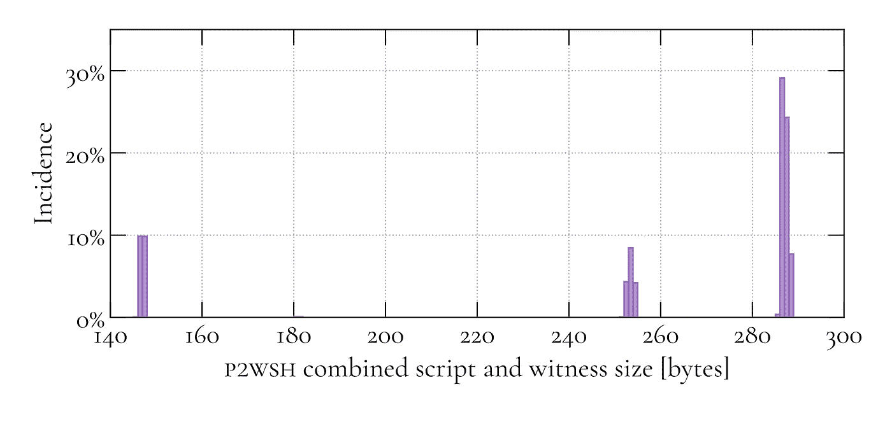

经验数据支持所有这些估计。上图包含截至块 626，267 的所有 P2WSH 事务的组合脚本和见证大小的直方图。从左到右，第一簇对应于 146.5 字节的 1/1 P2WSH-multisig 估计；第二个是 253 字节的 2/2 P2WSH-multisig 估计值；最后，第三个是 287 字节的 2/3 P2WSH-multisig 估计值。

# 结果和结论

使用第一性原理分析和经验数据，调查了所有交易输出类型的脚本和见证的大小(截至 2020 年 5 月)。基于分析的结果，为所有相关的用例建立了评估；此外，所有的估计都是用经验数据验证的。下表总结了调查结果。它显示了所有相关用例的锁定脚本、解锁脚本和见证大小；还显示了以字节为单位的组合脚本(和见证)大小、以重量单位(WU)为单位的总重量以及以 vbytes 为单位的虚拟大小(vsize)。

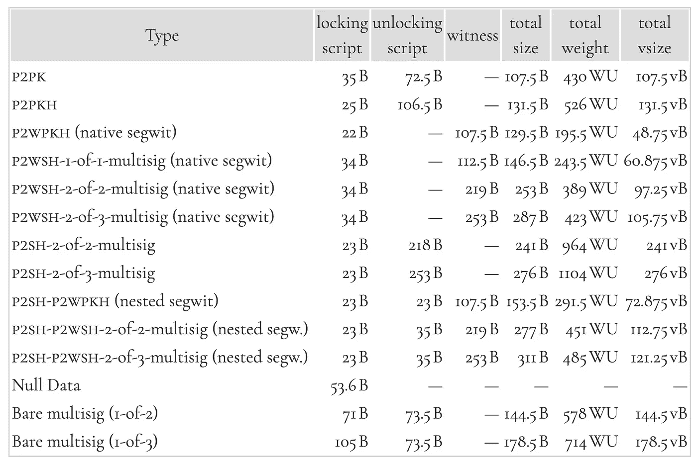

这张表代表了上一次调查的主要结果。它旨在作为开发定量模型的起点，这些模型的预测可能会为未来关于比特币各种改进的讨论提供一些客观性。

如果您发现本文中的信息有用，请随意投稿:`16pGpaoAhzoneLdRdxPSo9xAAPhzWnP2dA`。如果你有科学、比特币相关的自由职业者工作，[让我知道](mailto:cato@zen.science)。

> [在您的收件箱中直接获得最佳软件交易](https://coincodecap.com/?utm_source=coinmonks)

