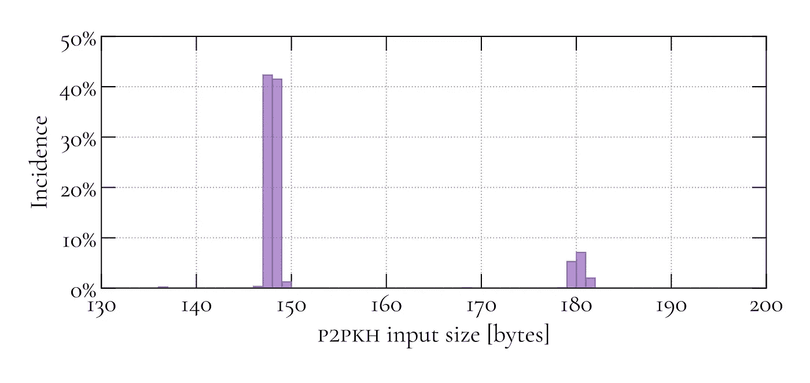

# 比特币交易规模——第二部分

> 原文：<https://medium.com/coinmonks/on-bitcoin-transaction-sizes-part-2-9445373d17f4?source=collection_archive---------1----------------------->

作为建立分析交易吞吐量模型目标的中间步骤，之前的两篇文章调查了最常见的比特币交易类型以及尚未实现但备受期待的[支付到主根交易类型](/coinmonks/on-bitcoins-schnorr-signature-algorithm-and-taproot-script-and-witness-sizes-fe4d1e6591a7)的脚本和见证大小。

本文基于以前的发现，调查了不同交易类型的输入、输出和见证的大小。为此，基于第一性原理的估计被导出并使用经验数据验证。这些发现被提取到 [*libtxsize*](https://github.com/virtu/libtxsize) 中，这是一个为具有任意输入、输出和见证的事务提供大小、重量和虚拟大小估计的库。

这篇文章的结构如下。首先，讨论了事务输入、输出和见证的一般格式。然后将讨论的结果与以前文章的发现相结合，得出不同交易类型的输入、输出和见证的规模估计；除了没有实证数据的 Pay-to-Taproot 之外，所有的估计都是使用比特币区块链的数据进行验证的。接下来，讨论了比特币交易的格式，并整合了关于输入、输出和见证大小的发现，以创建一个分析模型来估计任意比特币交易的大小。文章最后展示了 *libtxsize* ，这是一个集成了所有以前的见解的库，用于自动进行事务规模估计，并提供了一个简短的总结。

# 事务输入、输出和见证格式

在下文中，讨论了输入、输出和见证的一般格式，并研究了这些格式对交易规模的影响。

## 交易输入格式

从高层次的观点来看，每个事务输入包含两个关键信息:对未用完事务输出(UTXO)的引用和满足被引用 UTXO 的锁定脚本的解锁脚本。

为了引用 UTXO，输入包括一个 32 字节的事务散列和一个 4 字节的整数，前者用于标识前一个事务，后者指定输出在该事务中的位置。

解锁脚本的大小可变，将在下一节讨论。现在，注意到解锁脚本具有可变大小的事实就足够了，这使得显式编码它们的大小成为必要。这是通过使用一个[可变长度整数](https://en.bitcoin.it/wiki/Protocol_documentation#Variable_length_integer)来完成的，这是一种数据类型，设计用于在编码最大 8 个字节的非负整数时最小化大小。可变长度整数需要一个字节来编码从 0 到 252 的值；16 位整数的三个字节；32 位整数的 5 个字节；64 位整数用 9 个字节。实际上，大多数解锁脚本都小于 253 字节，因此脚本长度的编码通常是一个字节。

最后，每个输入包含一个 4 字节的序列号，该序列号目前用于费用替换机制，该机制允许更新事务的费用，以增加它被包含在块中的可能性。

总之，输入大小由 40 字节的固定部分决定，包括 32 字节的散列、4 字节的位置和 4 字节的序列号；和一个可变的，包括解锁脚本及其长度的编码。

## 交易输出格式

事务输出包括两条关键信息:金额和锁定脚本。

与输出相关的比特币数量使用一个 8 字节的整数进行编码。像解锁脚本一样，锁定脚本的大小也是可变的，将在下一节中讨论。此外，输出包括一个可变长度的整数，它对锁定脚本的大小进行编码。

总之，输出大小由两部分组成:8 个字节的固定部分，对应于数量的编码；以及由解锁脚本及其长度编码确定的可变贡献。

## 交易见证格式

见证可以作为解锁输出的数据的替代存储。每个见证都包含一个可变长度的整数来指示它包含的项数。这些条目的大小是任意的，所以每个条目的长度也使用一个可变长度的整数进行编码。

# 估计不同输入、输出和见证类型的大小

在下文中，将推导出输入、输出和见证类型(如果适用)的分析估计值，并与经验数据(如果后者可用)进行比较。请注意，锁定和解锁脚本以及见证的大小是基于以前的发现(一般情况下，参见本文[的“结果和结论”下的表格；关于 Pay-to-Taproot，参见](/coinmonks/on-bitcoin-transaction-sizes-97e31bc9d816)[这篇文章](/coinmonks/on-bitcoins-schnorr-signature-algorithm-and-taproot-script-and-witness-sizes-fe4d1e6591a7)。

## 支付公钥

Pay-to-Public-Key (P2PK)输出的固定大小为 44 个字节:8 个字节对值进行编码，1 个字节的可变长度整数对锁定脚本的大小进行编码，35 个字节的锁定脚本。

下图所示的经验数据验证了这一分析估计值，该图包含截至模块 637，302 的所有 P2PK 输出大小的直方图。除去 76 字节的输出，所有输出的大小都是 44 字节，76 字节的输出是比特币早期的产物，当时公钥是使用未压缩的 SEC 格式编码的。(关于未压缩 SEC 格式的详细讨论，请参见本文中[的“公钥编码”。)](/coinmonks/on-bitcoin-transaction-sizes-97e31bc9d816)


P2PK 输入的平均大小约为 113.5 字节:40 字节用于引用 UTXO 和序列号，一个 1 字节的变长整数用于编码解锁脚本的大小，72.5 字节的解锁脚本。然而，请注意，使用最近推出的[低 r 优化](https://github.com/bitcoin/bitcoin/pull/13666)，可以为 P2PK 输入实现 113 字节的一致大小。

如前所述，经验数据验证了分析估计。下图显示了截至模块 637，302 的所有 P2PK 输入大小的直方图。正如所料，超过 90%的输入大小为 113 或 114 字节。偏差是由 ECDSA 签名的 DER 编码引起的，这可能导致根据(随机)签名值增加或减少字节。(详见本文中[的“签名编码”)。](/coinmonks/on-bitcoin-transaction-sizes-97e31bc9d816)


## 付费公钥哈希

Pay-to-Public-Key-Hash (P2PKH)输出的固定大小为 34 个字节:8 个字节对值进行编码，1 个字节的可变长度整数对锁定脚本的大小进行编码，25 个字节的锁定脚本。

同样，分析估计得到经验数据的证实，如下图所示。截至块 637、302 的所有 P2PKH 输出的大小的直方图中的数据指示所有这样的输出具有 34 字节的大小。


P2PKH 输入的平均大小约为 147.5 字节:40 字节用于引用 UTXO 和序列号，一个 1 字节的变长整数用于编码解锁脚本的大小，106.5 字节的解锁脚本。再次注意，使用[低 r 优化](https://github.com/bitcoin/bitcoin/pull/13666)，P2PKH 输入可以实现 147 字节的一致大小。

这一估计得到了经验数据的支持。下图显示了截至模块 637，302 的所有 P2PKH 输入大小的直方图。正如所料，大多数输入的大小为 147 或 148 字节。和以前一样，估计值周围的偏差是 DER 签名编码标准引起的副作用。此外，约 180 字节的第二簇可以忽略，因为它是比特币早期的产物，当时 P2PKH 输入中的公钥是使用未压缩的 SEC 格式编码的。



# 裸多重签名

裸多重签名(multisig)输出的大小取决于 *n* ，即接受的密钥集的大小。总大小由两部分组成:一个固定的 12 字节部分，包括 8 字节的量；编码锁定脚本大小的单字节可变长度整数；三个字节用于作为锁定脚本一部分的`OP_m`、`OP_n`和`OP_CHECKMULTISIG`指令。此外，还有 34 个 *n* 字节的动态贡献，因为锁定脚本中的每个公钥编码都需要一个 1 字节的变长整数来表示密钥的大小和 33 字节的密钥本身。因此，*m*-of-*-n*-multisig 输出的总大小估计为 12+34 *n* 字节。

在下文中，该分析估计值针对 2 选 1 和 3 选 1 多信号输出进行了验证，这两种输出合计占所有多信号输出的 98%以上。前者的估计值为 80 字节；对于后者，它是 114 字节。下图中的经验数据包含截至模块 637，302 的所有 2 选 1 和 3 选 1 多信号输出的大小直方图，支持这些估计值:2 选 1 和 3 选 1 多信号输出的大部分大小分别为 80 和 112 字节。在每种情况下，都有比估计值大 32 字节的少量输出。像以前一样，这些都是可以归因于比特币早期的人工制品，当时公钥是使用未压缩的 SEC 格式编码的。


multisig 输入的大小取决于 *m* ，解锁参考输出所需的签名数量。总大小由两个部分组成:一个固定的 42 字节部分，包括 32 字节的哈希、4 字节的位置、4 字节的序列号、一个用于编码解锁脚本长度的可变长度整数的字节，以及一个用于作为解锁脚本一部分的`OP_0`指令的字节。此外，存在 72.5 *m* 字节的动态贡献，因为解锁脚本中的每个签名编码包括一个 1 字节的可变长度整数来指示签名大小和签名本身，签名本身平均具有 71.5 字节的大小。因此，multisig 输入的*m*-of-*-n*-的总大小估计为 44+72.5 *m* 字节。

如前所述，这一分析估计值针对 2 选 1 和 3 选 1 的 multisig 变体进行了验证。因为对于两种变体来说 *m* =1，所以它们共享相同的 114.5 字节的估计值。下图中的经验数据包含截至模块 637，302 的所有 2 选 1 和 3 选 1 multi SIG 输出的大小直方图，支持这一估计:正如所料，所有 2 选 1 和 3 选 1 multi SIG 输出的大部分大小为 114 或 115 字节。


# 空数据

空数据输出的大小取决于 *s* ，即输出中包含的用户有效载荷的大小。总的输出大小由两个部分组成:一个固定的 10 字节部分，包括 8 字节量，一个字节用于编码解锁脚本长度的可变长度整数，一个字节用于作为锁定脚本一部分的`OP_RETURN`指令。此外，还有一个动态贡献，包括锁定脚本长度的编码、用户有效负载长度的编码和实际有效负载。如果有效载荷小于 75 字节，其长度可以在比特币脚本中显式编码，只需要一个字节；如果有效载荷大于 75 字节，则需要一个额外的`OP_PUSHDATA1`指令，从而将有效载荷长度编码为两个字节的总要求增加了。因此，当包括大小高达 75 字节的有效载荷时，空数据输出的总估计为 11+ *s* ，当包括更大的有效载荷时，为 12+ *s* 。

这一分析估计值针对 20 字节和 80 字节的空数据输出进行了验证，这两种数据合计占所有空数据输出的 90%以上。前者的估计值为 31 字节；对于后者，它是 92 字节。下图中的经验数据支持这些估计，该图包含截至块 637，302 的所有空数据输出的大小的直方图。


## 付费脚本哈希

Pay-to-Script-Hash (P2SH)输出的固定大小为 32 个字节:8 个字节对值进行编码，1 个字节的可变长度整数对锁定脚本的大小进行编码，23 个字节的锁定脚本。

下图中的经验数据证实了这一分析估计，该图包含截至块 637，302 的所有 P2SH 输出的直方图，并确认所有 P2SH 输出的大小为 32 字节。


与固定大小的 P2SH 输出相反，P2SH 输入的大小根据输入中包含的兑换脚本的类型而有很大的不同。下面讨论了最相关的赎回脚本用例。

## 付费脚本哈希多重签名

P2SH-multisig 输入的大小取决于 *m* ，满足兑换脚本所需的签名数量；以及 *n，*所接受的密钥集的大小。P2SH-multisig 输入的总大小由两部分组成:固定的 40 字节部分，包括 32 字节的散列、4 字节的位置和 4 字节的序列号；以及包括解锁脚本的大小和脚本大小的编码的可变贡献。反过来，解锁脚本由两部分组成:一个 redempt 脚本，它的散列与被引用的 UTXO 的锁定脚本中的散列相匹配，被解释为锁定脚本；和数据来满足兑换脚本。

赎回脚本与裸 multisig 锁定脚本相同，并且包括:用于`OP_m`、`OP_n`和`OP_CHECKMULTISIG`脚本指令的三个字节的固定贡献；以及 34 个 *n* 字节的动态贡献，对于 redempe 脚本中的每个 *n* 编码的公钥，贡献一个字节的可变长度整数来编码密钥大小和 33 字节的密钥本身。因此，兑换脚本的贡献总共是 3+34 *n* 字节。将兑换脚本推送到堆栈上的比特币脚本指令的开销取决于兑换脚本的大小:如果它小于 75 字节，则其长度可以使用一个字节的比特币脚本指令显式编码；如果 redempt 脚本大于 75 字节，则需要一个额外的`OP_PUSHDATA1`指令，将贡献增加一个字节。

此外，解锁脚本包含满足赎回脚本的数据。该数据与裸露的 multisig 解锁脚本相同，并包含固定的一个字节的`OP_0`指令部分；以及 72.5 *m* 字节的动态贡献，以编码 *m* 71.5 字节 ECDSA 签名及其长度。因此，数据的贡献是 1+72.5 *m* 字节。

因此，P2SH-multisig 输入的总大小由固定的 40 字节贡献、3+34 *n* 字节的赎回脚本大小、将赎回脚本推送到堆栈上的 1 或 2 字节开销、满足 1+72.5 *m* 字节赎回脚本的数据贡献以及编码解锁脚本长度的可变大小整数的贡献的总和给出。

该分析估计值针对 2/2 和 3/2 的 P2SH-multisig 输入进行了验证，这两种输入合计占 P2SH-multisig 输入的 90%以上。对于前者，n= *2* ，因此兑换脚本的大小估计为 3+34 *n* =71 字节。因为见证脚本小于 75 个字节，所以将其压入堆栈的开销只有一个字节。而且， *m* =2，所以满足 redempt 脚本的数据贡献是 146 字节。因此，解锁脚本的大小为 218 字节。因为脚本小于 253 字节，所以编码其大小的可变长度整数只需要一个字节。加上 40 字节的固定贡献，2/2 P2SH-multisig 输入的估计值为 259 字节。

这一估计由下面直方图中所示的经验数据证实，该直方图包含截至块 637，302 的所有 2/2 和 2/3 P2SH-multisig 输入的直方图。几乎一半的 2/2 P2SH-multisig 输入的大小为 259 字节。剩余的输入或者比那个值小一个字节或者比那个值大一个字节，这个事实可以用签名平均为 71.5 个字节来解释:如果没有低 r 优化，有 50%的概率生成 71 字节或者 72 字节的签名；对于两个签名，这意味着有 25%的机会出现两个 71 字节的签名(对应于大小为 258 字节的输入)，有 50%的机会出现一个 71 字节和一个 72 字节的签名(导致 259 字节的输入)，有 25%的机会出现两个 72 字节的签名(导致 260 字节的输入)。


对于 2/3 P2SH-multisig 输入，n=3，因此兑换脚本的大小估计为 3+34 *n* =105 字节。因为见证脚本大于 75 个字节，所以将其压入堆栈的开销是两个字节:一个字节用于`OP_PUSHDATA1`指令，另一个字节用于编码赎回脚本的大小。此外， *m* =2，因此满足赎回脚本的数据贡献是 146 字节。因此，解锁脚本的大小为 253 字节。在这个实例中，脚本的大小不小于 253 字节，因此用可变长度整数对解锁脚本的大小进行编码需要三个字节。
加上 40 字节的固定贡献，3 选 2 P2SH-multisig 输入的估计值为 296 字节。

上图所示的经验数据也验证了这一估计值:几乎一半的 2/3 P2SH multisig 输入的大小为 296 字节。和以前一样，大约 25%的输入的大小比估计值大一个字节；同样，这种情况可以用 25%的机会生成两个 72 字节的签名来解释，而估计使用的是 71.5 字节的两倍。另外 25%的输入的大小为 293 字节，比估计值小 3 个字节。其原因是，在两个 71 字节签名的情况下，解锁脚本的大小仅为 252 字节，这意味着它的大小可以用一个字节的变长整数而不是三个字节的整数进行编码。因此，大小的组合减少是三个字节:使用两个 71 字节的签名而不是估计的两倍 71.5 字节，减少了一个字节；另外两个字节，因为只需要一个字节(而不是三个)来编码解锁脚本的大小。

## 支付给脚本哈希支付给见证脚本哈希多重签名

Pay-to-Script-Hash-Pay-to-Witness-Script-Hash-Multi-SIG(P2SH-P2WSH-Multi SIG)输入的固定大小为 76 个字节:40 个字节用于引用 UTXO 和序列号，1 个字节的可变长度整数用于编码解锁脚本的大小，35 个字节的解锁脚本。

如下图所示，经验数据支持分析估计。直方图显示了截至块 637，302 的所有 P2SH-P2WSH-multisig 输入的大小，表明所有这样的输入具有 76 字节的大小。


P2SH-P2WSH-multisig 见证的大小取决于满足见证脚本所需的签名数量*m*；以及 *n，*所接受的密钥集合的大小。见证人的规模完全是动态的；贡献包括:被解释为锁定脚本的见证脚本；满足锁定脚本的数据；以及指示每个见证项的大小以及所有项的数量的可变长度整数。

见证脚本包含与 P2SH-multisig redempte 脚本相同的信息，因此它提供相同的 3+34 *n* 字节。因为见证脚本是一个见证项，所以它的长度是使用变长整数编码的。

解锁见证脚本的数据类似于 P2SH-multisig 输入中使用的数据，唯一的区别是签名是单独的见证项，其长度使用变长整数进行编码，而不是使用比特币脚本指令推送到堆栈上的脚本数据。然而，这对大小没有影响:每个 *m* 签名平均贡献 71.5 字节，外加一个字节使用可变长度整数对其长度进行编码。此外，数据包括一个可变长度的整数，指示一个零长度的项将一个空项推送到堆栈上(类似于在比特币脚本中对数据进行编码时使用的`OP_0`指令)。因此，数据的总贡献与 P2SH-multisig 输入的情况相同，为 1+72.5 *m* 字节。

因此，总见证大小由指示见证项数量的可变长度整数的大小、1+72.5*m*字节的数据贡献、3+34*n*字节的见证脚本贡献以及指示见证脚本大小的可变长度整数的大小给出。

该分析估计值针对 2/2 和 3/2 的 P2SH-P2WSH-multisig 输入进行了验证，这两种输入的总和超过 P2SH-P2WSH-multisig 输入的 90%。对于前者，*m*=*n*=*2*，所以数据和见证脚本的贡献分别为 1+72.5 *m* =146 字节和 3+34n=71 字节。加上两个 1 字节的可变长度整数来指示见证项的数量(三个:两个签名和见证脚本)和见证脚本的长度，总的估计值为 219 字节。

对于 3 选 2 P2SH-P2WSH-multisig 输入， *m* =2， *n* =3，因此数据和见证脚本的贡献分别为 1+72.5 *m* =146 字节和 3+34n=105 字节。同样，指示见证项数量和见证脚本长度的两个可变长度整数贡献了两个字节，因此总体估计值为 253 个字节。

下图中显示的经验数据支持这些估计，该图包含截至块 637，302 的所有 2/2 和 2/3 P2SH-P2WSH-multisig 见证的直方图。对于两种 multisig 变体，分布的峰值与估计值匹配。如前所述，比估计值小或大一个字节的输入有 25%的机会创建两个 71 字节的签名或两个 72 字节的签名，而不是使用两倍 71.5 字节平均值的估计值。


## 支付给脚本哈希支付给见证公钥哈希

Pay-to-Script-Hash-Pay-to-Witness-Public-Key-Hash(P2SH-p 2 wpkh)输入具有 64 字节的固定大小:40 字节用于引用 UTXO 和序列号，一个 1 字节的可变长度整数用于编码解锁脚本的大小，还有一个 23 字节的解锁脚本。

如下图所示，经验数据支持分析估计。该直方图包括所有 P2SH-P2WPKH 输入的大小，如块 637，302 所示，表明所有这些输入的大小为 64 字节。


P2SH-P2WPKH 见证的平均大小约为 107.5 字节:一个一字节的变长整数，表示见证中的项数(两个:一个签名和一个公钥)；一个 71.5 字节的签名和一个编码其大小的 1 字节变长整数；一个 33 字节的公钥和一个编码其大小的 1 字节变长整数。

这一估计得到了经验数据的证实。下图所示的直方图显示了截至块 637，302 的所有 P2SH-P2WPKH 见证的大小。数据表明超过 60%的所有 P2SH-P2WPKH 见证具有 107 字节的大小；其余 40%的大小为 108 字节。偏向 107 字节可以用[低 r 优化](https://github.com/bitcoin/bitcoin/pull/13666)来解释，与估计使用的 71.5 字节平均值相比，它产生了 71 字节的签名。


## 支付给证人公钥散列

pay-to-Witness-Public-Key-Hash(p 2 wpkh)输出的固定大小为 31 个字节:8 个字节用于对值进行编码，一个 1 字节的可变长度整数用于对锁定脚本的大小进行编码，还有一个 22 字节的锁定脚本。

下图所示的经验数据支持这一分析估计，该数据包含截至模块 637，302 的所有 P2WPKH 输出大小的直方图。正如所料，所有观察到的输出都有 31 字节的大小。


P2WPKH 输入也有固定大小。一个 32 字节的事务 id、一个 4 字节的位置、一个 1 字节的变长整数、一个空的解锁脚本和一个 4 字节的序列号的贡献导致总大小为 41 字节。

同样，这一估计得到了经验数据的证实。下图包含截至模块 637，302 的所有 P2WPKH 输入大小的直方图。数据表明它们的大小都是 41 字节。


P2WPKH 见证包含与 P2SH-P2WPKH 见证相同的数据:一个单字节的变长整数，表示见证中的项数(两个:一个签名和一个公钥)；一个 71.5 字节的签名和一个编码其大小的 1 字节变长整数；一个 33 字节的公钥和一个编码其大小的 1 字节变长整数。因此，P2WPKH 见证具有与 P2SH-P2WPKH 见证相同的 107.5 字节估计值。

同样，分析估计得到了经验数据的支持。下图所示的直方图显示了截至块 637，302 的所有 P2WPKH 见证的大小。数据显示大部分见证的大小为 107 或 108 字节。与 P2SH-P2WPKH 见证的情况一样，偏向 107 字节可以通过[低 r 优化](https://github.com/bitcoin/bitcoin/pull/13666)来解释，与用于估计的 71.5 字节平均值相比，低 r 优化允许产生 71 字节签名。


## 支付给证人脚本哈希

pay-to-Witness-Script-Hash(P2WSH)输出的固定大小为 43 个字节:8 个字节对值进行编码，1 个字节的可变长度整数对锁定脚本的大小进行编码，34 个字节的锁定脚本。

下图中显示的经验数据支持这一分析估计，该数据包含截至块 637，302 的所有 P2WSH 输出大小的直方图。正如所料，所有观察到的输出都有 43 字节的大小。


P2WSH 输入也有固定的大小。一个 32 字节的事务 id、一个 4 字节的位置、一个 1 字节的变长整数、一个空的解锁脚本和一个 4 字节的序列号的贡献导致总大小为 41 字节。

和以前一样，这一估计得到了经验数据的证实。下图包含截至块 637，302 的所有 P2WSH 输入大小的直方图。数据表明它们的大小都是 41 字节。


P2WSH 见证服务器包含与 P2SH-P2WSH 见证服务器相同的数据。因此，P2WSH 见证的大小由以下因素给出:指示见证项数量的变长整数；1+72.5 *m* 字节数据满足见证脚本；见证脚本，贡献 3+34 *n* 字节；另一个可变长度整数表示见证脚本的大小。

在下文中，对 1 对 1、2 对 2 和 3 对 2 的 P2WSH-multisig 见证进行了分析估计验证，这些见证合计占所有 P2WSH-multisig 交易的 98%以上。

对于 1-of-1 P2WSH-multisig，见证脚本是 3+34 *n* =37 个字节，因此编码见证脚本大小的可变长度整数只需要一个字节。而且，满足见证脚本的数据贡献了 1+72.5 *m* =73.5 字节。用于编码堆栈项目数量的可变长度整数贡献了另一个字节。因此，总估计值为 112.5 字节。

下图中显示的经验数据支持这一估计，该数据包含所考虑的 P2WSH-multisig 变体的所有见证大小的直方图。对于 1/1 P2WSH-multisig，观察到的 112 或 113 字节的大小与分析估计相匹配。


对于 2 选 2 P2WSH-multisig， *m* =2， *n* =2。因此，见证脚本是 3+34 *n* =71 个字节，编码见证脚本大小的可变长度整数只需要一个字节。而且，满足见证脚本的数据贡献了 1+72.5 *m* =146 字节。用于编码堆栈项目数量的可变长度整数贡献了另一个字节。因此，总估计值为 219 字节。

对于 2-of-3 P2WSH-multisig， *m* =2， *n* =3，因此数据和见证脚本的贡献分别为 1+72.5 *m* =146 字节和 3+34n=105 字节。同样，指示见证项数量和见证脚本长度的两个可变长度整数贡献了两个字节，因此总体估计值为 253 个字节。

上图所示的经验数据支持 2/2 和 3/2 的估计。注意，如前所述，在 3 选 2 P2WSH-multisig 的情况下，偏向 252 字节可以通过[低 r 优化](https://github.com/bitcoin/bitcoin/pull/13666)来解释。

## 支付给主根

Pay-to-Taproot (P2TR)输出具有 43 字节的固定大小:8 个字节对值进行编码，1 个字节的可变长度整数对锁定脚本的大小进行编码，34 个字节的锁定脚本。

P2TR 输入也有固定的大小。一个 32 字节的事务 id、一个 4 字节的位置、一个 1 字节的变长整数、一个空的解锁脚本和一个 4 字节的序列号的贡献导致总大小为 41 字节。

对于关键路径，P2TR 见证也有固定的大小。一个指示见证项数量的 1 字节变长整数、另一个指示 Schnorr 签名长度的 1 字节变长整数和一个 64 字节 Schnorr 签名的贡献导致对见证的总大小的估计为 66 字节。

对于脚本路径，P2TR 见证具有可变的大小。鉴于缺乏经验数据，不可能推导出常见用例的大小。此外，缺乏经验数据，以前的分析估计无法验证。

# 交易格式

到目前为止，已经讨论了不同输入、输出和见证类型的大小。为了对交易进行估计，需要考虑作为交易一部分的附加数据。

除了输入、输出和见证，事务还包括:四字节版本；如果交易的任何输入使用见证数据，一个一字节隔离见证(SegWit)标记和一个一字节 SegWit 版本；两个变长整数，用于指示输入、输出的数量(见证的数量与输入的数量相同，因此两个变长整数就足够了)；和一个四字节的锁定时间字段。

然后，事务大小估计由事务版本和锁时间给出的固定八字节贡献给出；指示输入数量和输入本身的可变长度整数的大小；可变长度整数的大小，表示输出和输入本身的数量。对于 SegWit 事务，还必须考虑见证的大小以及 SegWit 标记和标志的固定两字节贡献。

# 使用 libtxsize 自动估计事务大小

[*libtxsize*](https://github.com/virtu/libtxsize) 将所有以前的发现提取到一个库中，用于自动化的交易规模估计。libtxsize 是用 Python 编写的，包括简单的 Python 接口来获得输入、输出和见证大小的估计值，以及任意事务的估计值。此外，它还包括一个命令行界面供您使用；估计事务的大小就像指定所需的输入和输出类型一样简单:

```
λ$ ./libtxsize-cli.py -i P2WPKH,P2SH-1-of-2-multisig -o P2PKH,P2TR
+-------------------------+------------+-------------+-------------+
| Part/Metric             |   size [B] | weight [WU] |  vsize [vB] |
+-------------------------+------------+-------------+-------------+
| INPUTS                  |            |             |             |
| 1\. P2WPKH               |         41 |         164 |          41 |
| 2\. P2SH-1-of-2-multisig |        186 |         744 |         186 |
+-------------------------+------------+-------------+-------------+
| WITNESSES               |            |             |             |
| 1\. P2WPKH               |        107 |         107 |       26.75 |
| 2\. P2SH-1-of-2-multisig |        N/A |         N/A |         N/A |
+-------------------------+------------+-------------+-------------+
| OUTPUTS                 |            |             |             |
| 1\. P2PKH                |         34 |         136 |          34 |
| 2\. P2TR                 |         43 |         172 |          43 |
+-------------------------+------------+-------------+-------------+
| INPUT DATA              |        227 |         908 |         227 |
| WITNESS DATA            |        108 |         108 |        27.0 |
| OUTPUT DATA             |         77 |         308 |       19.25 |
| TRANSACTION OVERHEAD    |         12 |          34 |         8.5 |
+-------------------------+------------+-------------+-------------+
| TRANSACTION TOTAL       |        424 |        1366 |       341.5 |
+-------------------------+------------+-------------+-------------+
```

除了总体事务规模估计之外， *libtxsize* 还包括事务的不同部分的信息，比如单个输入、输出和见证，以及事务开销。此外， *libtxsize* 除了大小估计之外，还包括重量和虚拟大小估计。

请注意，为了使结果更加相关，估计值基于 2018 年推出的[低 r 优化](https://github.com/bitcoin/bitcoin/pull/13666)假设 71 字节签名大小。

# 结果和结论

使用第一性原理分析研究了不同输入、输出和见证类型的大小。基于分析的结果，为所有相关的用例建立了评估；此外，所有的估计(除了支付到主根)都验证了使用经验数据。

下表总结了这些发现，以供快速参考。它包括最相关用例的输入、输出和见证大小。请注意，估计值是基于 71.5 字节的 ECDSA 签名大小。


此外， [*libtxsize*](https://github.com/virtu/libtxsize) 是一个自动化事务规模估算的库。 *libtxsize* 代表了本次和之前调查结果的精髓。

如果您发现本文中的信息有用，请随意投稿:`16pGpaoAhzoneLdRdxPSo9xAAPhzWnP2dA`。如果你有科学、比特币相关的自由职业工作，[让我知道](mailto:cato@zen.science)。

## 另外，阅读

*   最好的[密码交易机器人](/coinmonks/crypto-trading-bot-c2ffce8acb2a)
*   [密码本交易平台](/coinmonks/top-10-crypto-copy-trading-platforms-for-beginners-d0c37c7d698c)
*   最好的[加密税务软件](/coinmonks/best-crypto-tax-tool-for-my-money-72d4b430816b)
*   [最佳加密交易平台](/coinmonks/the-best-crypto-trading-platforms-in-2020-the-definitive-guide-updated-c72f8b874555)
*   最佳[加密贷款平台](/coinmonks/top-5-crypto-lending-platforms-in-2020-that-you-need-to-know-a1b675cec3fa)
*   [最佳区块链分析工具](https://bitquery.io/blog/best-blockchain-analysis-tools-and-software)
*   [加密套利](/coinmonks/crypto-arbitrage-guide-how-to-make-money-as-a-beginner-62bfe5c868f6)指南:新手如何赚钱
*   最佳[加密制图工具](/coinmonks/what-are-the-best-charting-platforms-for-cryptocurrency-trading-85aade584d80)
*   [莱杰 vs 特雷佐](/coinmonks/ledger-vs-trezor-best-hardware-wallet-to-secure-cryptocurrency-22c7a3fd391e)
*   了解比特币最好的[书籍有哪些？](/coinmonks/what-are-the-best-books-to-learn-bitcoin-409aeb9aff4b)
*   [3 商业评论](/coinmonks/3commas-review-an-excellent-crypto-trading-bot-2020-1313a58bec92)
*   [AAX 交易所评论](/coinmonks/aax-exchange-review-2021-67c5ea09330c) |推荐代码、交易费用、利弊
*   [Deribit 审查](/coinmonks/deribit-review-options-fees-apis-and-testnet-2ca16c4bbdb2) |选项、费用、API 和 Testnet
*   [FTX 密码交易所评论](/coinmonks/ftx-crypto-exchange-review-53664ac1198f)
*   [n 零审核](/coinmonks/ngrave-zero-review-c465cf8307fc)
*   [Bybit 交换审查](/coinmonks/bybit-exchange-review-dbd570019b71)
*   [3Commas vs Cryptohopper](/coinmonks/cryptohopper-vs-3commas-vs-shrimpy-a2c16095b8fe)
*   最好的比特币[硬件钱包](/coinmonks/the-best-cryptocurrency-hardware-wallets-of-2020-e28b1c124069?source=friends_link&sk=324dd9ff8556ab578d71e7ad7658ad7c)
*   最佳 [monero 钱包](https://blog.coincodecap.com/best-monero-wallets)
*   [莱杰 nano s vs x](https://blog.coincodecap.com/ledger-nano-s-vs-x)
*   [bits gap vs 3 commas vs quad ency](https://blog.coincodecap.com/bitsgap-3commas-quadency)
*   [莱杰纳米 S vs 特雷佐 1 vs 特雷佐 T vs 莱杰纳米 X](https://blog.coincodecap.com/ledger-nano-s-vs-trezor-one-ledger-nano-x-trezor-t)
*   [block fi vs Celsius](/coinmonks/blockfi-vs-celsius-vs-hodlnaut-8a1cc8c26630)vs Hodlnaut
*   Bitsgap 评论——一个轻松赚钱的加密交易机器人
*   为专业人士设计的加密交易机器人
*   [PrimeXBT 审查](/coinmonks/primexbt-review-88e0815be858) |杠杆交易、费用和交易
*   [埃利帕尔泰坦评论](/coinmonks/ellipal-titan-review-85e9071dd029)
*   [SecuX Stone 评论](https://blog.coincodecap.com/secux-stone-hardware-wallet-review)
*   [BlockFi 评论](/coinmonks/blockfi-review-53096053c097) |从您的密码中赚取高达 8.6%的利息