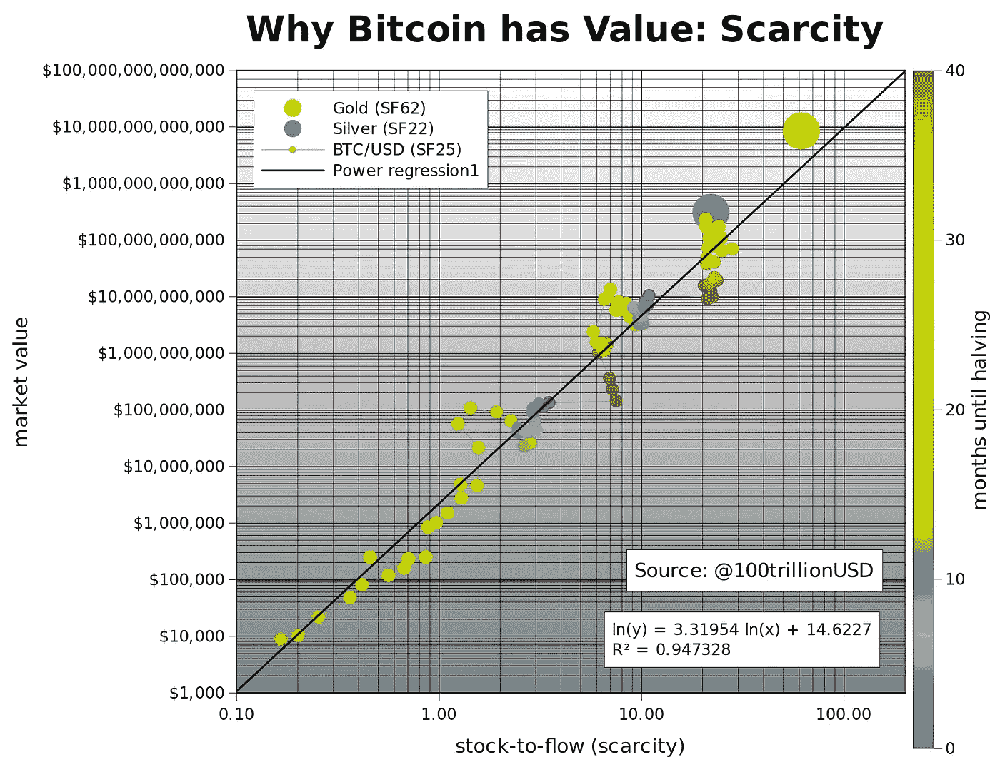
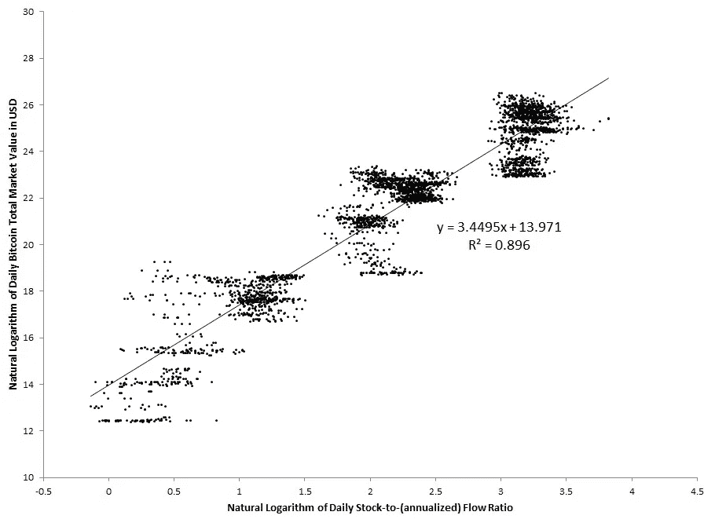
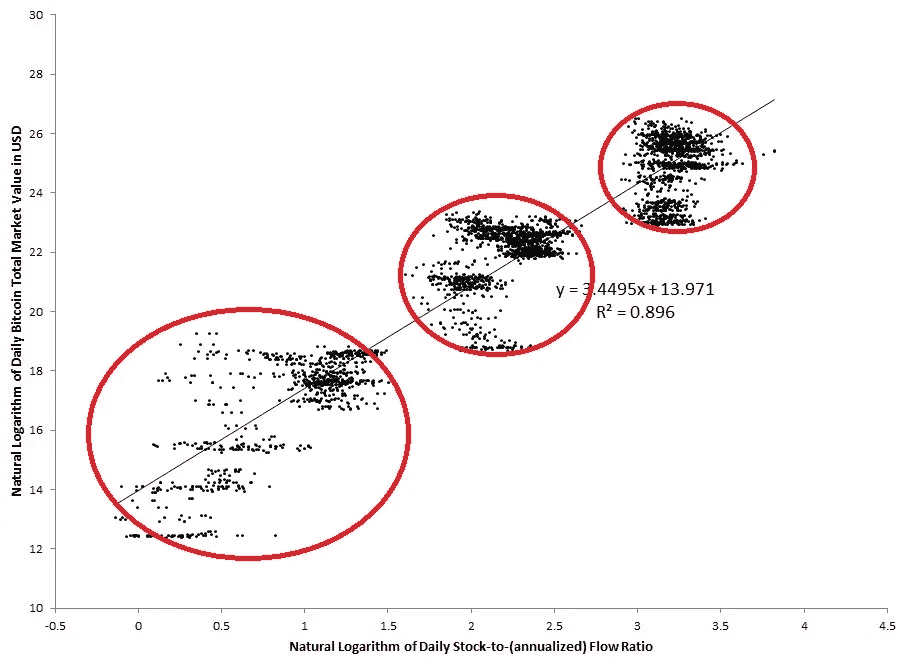
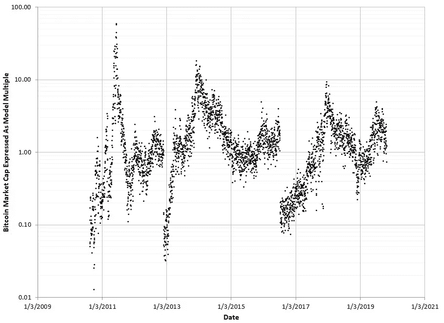
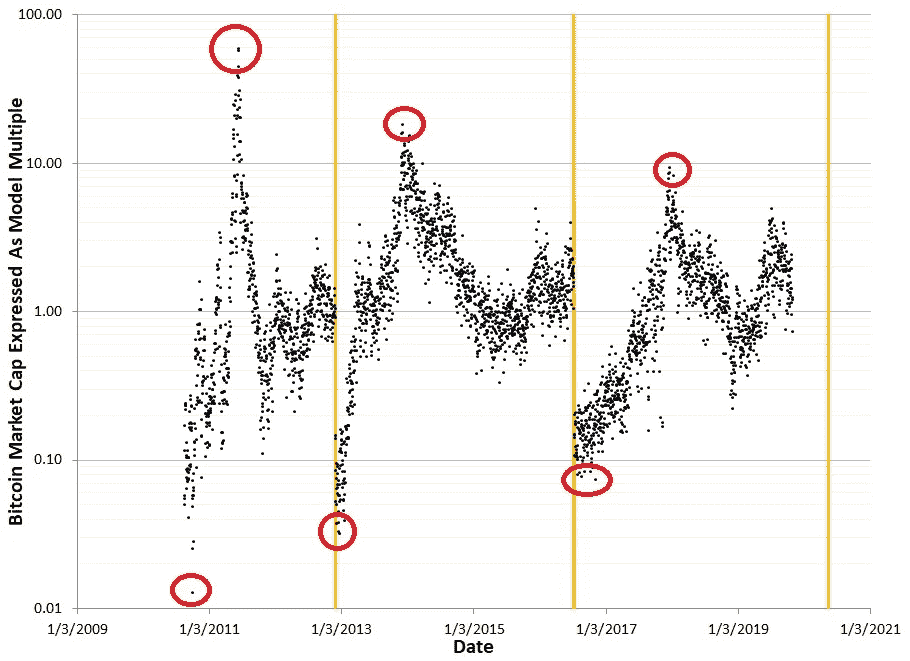
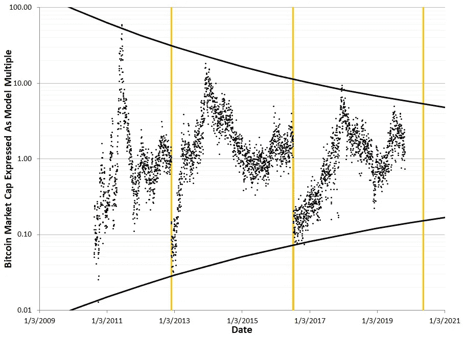
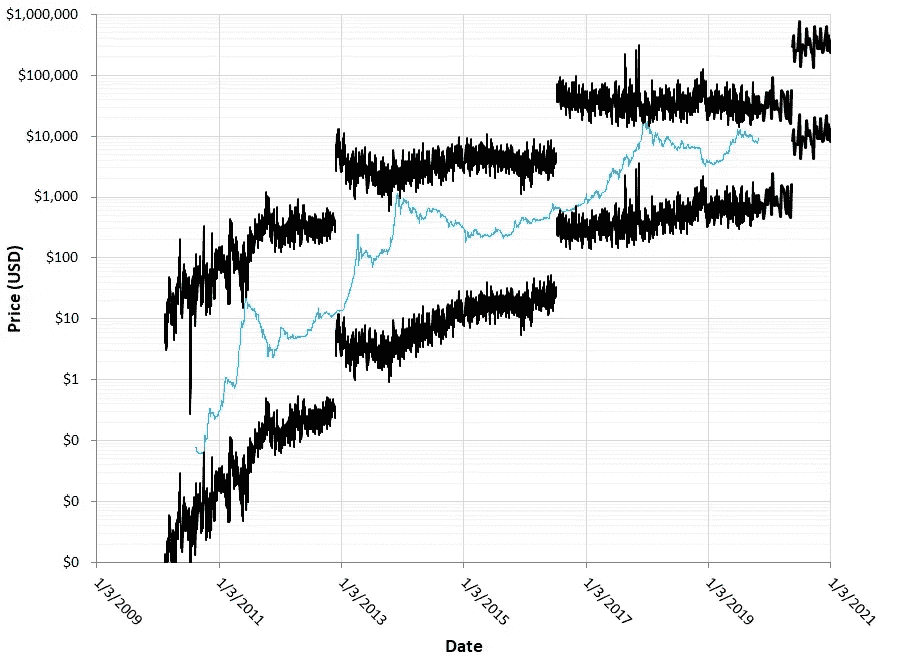
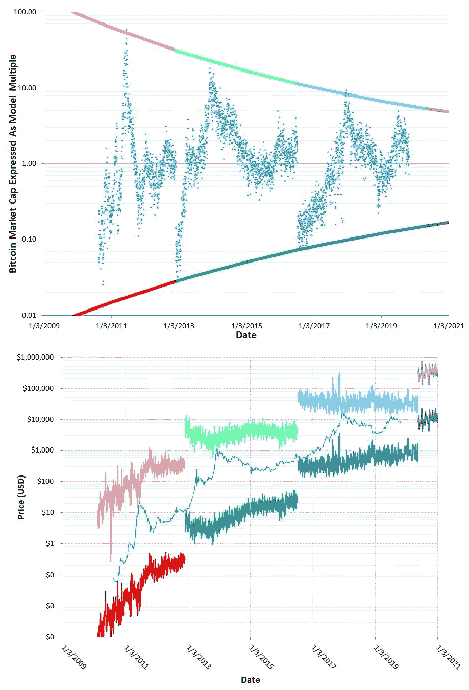
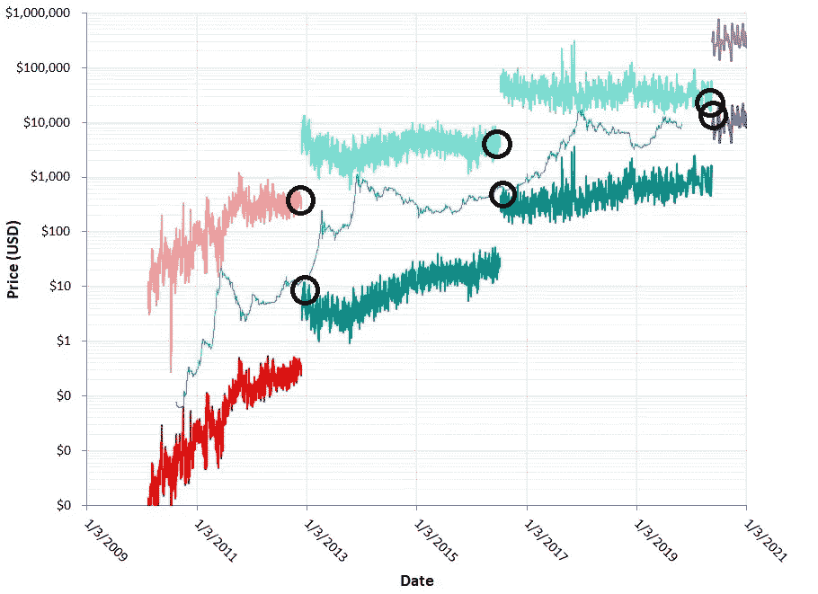
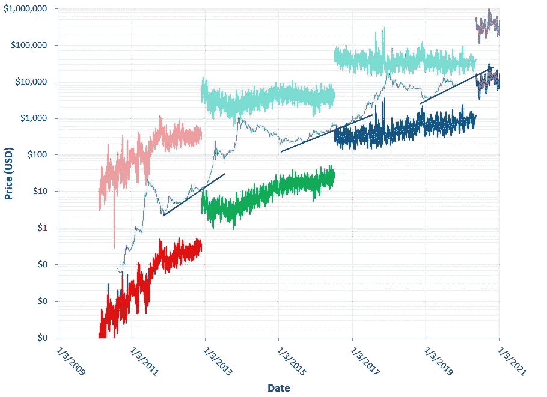

# 比特币的融合:简化版，第一部分

> 原文：<https://medium.com/coinmonks/on-bitcoins-convergence-simplified-part-1-3e521b0b1515?source=collection_archive---------0----------------------->

## 你们都记得这张照片，对吧？

Bitcoin’s market value correlation with stock-to-flow. Source: Plan B’s Medium page: [PlanB](https://medium.com/u/bcb63a182704?source=post_page-----3e521b0b1515--------------------------------)

如果你不知道，那么你可以去 B 计划的页面上看看。如果你知道那是什么，我们继续。

B 计划用比特币月度数据制作了这张图表。同样的图表可以使用每日数据制作:

The same chart, but using daily data instead of monthly data.

同样，这是和 B 计划一样的情节，但它适用于 2010 年 8 月 17 日以后的所有日子。现在，请注意，数据分布在左下角，聚集在右上角。在这里，我圈出了这个:

the data is spread out at lower S/F ratios, and gets clustered at higher stock to flow ratios.

有意思。可以做的另一件事是将相同的数据显示为库存到流量模型的倍数。因此，对于对角线以上的点，它们的倍数将大于 1.0，对于对角线以下的点，它们的倍数< 1.0 and greater than 0\. We can also show the data with the x-axis as time, instead of x-axis as S/F ratio. So, that’s this chart here:

The same data points expressed as a multiple of the stock-to-flow model. The regression line is now the same as the middle horizontal line (multiple of 1.0).

Now the data points are ordered chronologically, and they are shown as a multiple of the stock-to-flow model. So, the linear regression line is now the middle horizontal line at the y-axis level of 1.0.

Do you see a pattern? Here, let me highlight some things:

The same plot with some highlights

Now the dates of the halvings are shown as vertical orange lines. Also, the all-time-highs and all-time-lows are circled. The circles are getting closer and closer with time to the middle line of 1.0, which is the S/F model. This is why the data points in figure 2 are spread out at the bottom left and are bunched closer to the linear fit at the top right. The value of Bitcoin is *将*向库存-流量模型收敛。

这种融合可以用一些曲线直观地呈现出来，就像这样:

The same plot with convergence lines

这个故事的所有数学细节都在这个故事的完整版本中呈现，这里:[https://medium . com/@ AJC 241469/on-the-apparent-convergence-of-the-apparent-of-the-convergence-of-the-stock-to-flow-evaluation-model-7a 9275 AC 2206](/@AJC241469/on-the-apparent-convergence-of-bitcoins-usd-market-value-toward-the-stock-to-flow-valuation-model-7a9275ac2206)

现在，这些汇合线是如何出现在比特币价格图上的？它们是这样出现的:

Converging lines shown on the Bitcoin logarithmic price chart

请注意，这些聚合线是断开的，并且不平滑。这是因为它们现在明确依赖于 S/F 比率，而在此之前，它们只是价格数据的一种拟合，而价格数据已经转化为 S/F 模型的倍数。它们是断开的，以突出减半的效果，这极大地增加了信噪比。关于这张图片需要注意的一点是，与 2019 年 10 月 25 日之后的日期相对应的会聚线是模拟的近似值。

如果这有点令人困惑，下图可能会有所帮助。它是彩色编码的，以展示什么是什么:

Color-coded plots of Bitcoin’s market value and the converging lines.

希望这证明了这些都是相同的数据，只不过是两种不同的表达方式——1)作为 S/F 模型的倍数，其中市值数据是不规则的，收敛线是平滑的，或者 2)作为美元价格，其中市值数据是平滑的，收敛线是不规则的。

展望未来，人们可能会问，“价格必须如何变动，才能使市场价值保持向 S/F 模型收敛的模式？”为了回答这个问题，我们来看看下图:

The end-points of the narrow halving windows, circled.

在该图中，会聚线的“角”被圈起来。这些代表了所谓的“窄减半窗口”的端点，这是比特币在减半之日必须通过的价格范围，以维持其向 S/F 模型收敛的模式。很明显，这些圆圈越来越近。因此，如果比特币的市值要继续其向 S/F 模型收敛的模式，那么在 2020 年 5 月，一个比特币的价格必须通过一个非常窄的范围——大约 14000 美元到 20000 美元。我们很快就会知道这种趋同模式是否会持续到下一个减半周期。但是，现在，这里有一个提示…..

Support lines showing signs of supporting Bitcoin’s price directly into the narrow halving windows.

BTC:1 D1 so 2 suthgngbt 2 wf exf 4g HQ 8 jss 8 f 4 lk

声明:本文并非财务建议。

> [在您的收件箱中直接获得最佳软件交易](https://coincodecap.com/?utm_source=coinmonks)

