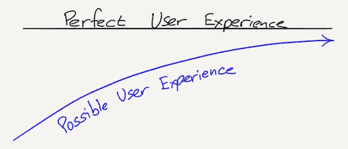

# 通货膨胀目标制的块大小和渐近极限

> 原文：<https://medium.com/coinmonks/on-block-size-and-asymptotic-limits-of-inflation-targeting-1ceea1f52ed7?source=collection_archive---------1----------------------->

Still image [taken](https://www.youtube.com/watch?v=qwPid_NAjoA) from Philip Glass’s ‘Koyaanisqatsi: Life Out of Balance’

尼采的*“权力意志”*从来没有被一部作品正式定义过，所以很难明确说出它的含义；也许除了一般的观察之外，现实变成了我们相信的东西。

当前的经济范式*通胀目标*遵循这些原则:2%的目标被认为是合适的，通过观察消费习惯来制定措施，以影响*物价水平*的稳定。

# 分叉战争、散列率和块大小

比特币诞生的那一刻，一个平行的网络被创造出来，(它)分散了传统系统的支付，并对央行管理经济现状的垄断地位提出了质疑。

这导致不同的连锁店从 BTC 分流出来，以更低的费用、更快的确认和更大的交易能力销售自己。

*“哈希战争”被制造出来，表明了每条链的受欢迎程度(以对它们承诺的能量的形式)，其中比特币现金(BCH)的分割可能是最广为人知的。*

# *增长的渐近极限*

*在[比特币白皮书](https://bitcoin.org/bitcoin.pdf)上进行 CTRL+F [word]搜索，会发现*“诚实”*这个词频繁出现。这是指*诚实链*增长最快，超过了竞争链:看起来 Satoshi 意识到了未来的哈希冲突。*

*同样，杰夫·贝索斯在预测亚马逊的增长和采用率的可能限制时，也进行了观察:*

> *“从短期来看，股市是一台投票机，从长期来看，它是一个秤”[看不见的渐近线](https://www.eugenewei.com/blog/2018/5/21/invisible-asymptotes)*

*[渐近线](https://en.wikipedia.org/wiki/Asymptote)(在这个亚马逊增长的具体例子中)被用作理解阻力界限的一种方式:运费很早就被确定为提供*完美*客户体验(理想的)而不是*真实*客户体验的长期增长的限制。*

**

*Consumer expectations are not static — but note how the line of perfect user experience is not actually touched*

> *“然而，所有诚实的负面反馈构成了某些客户群中某种渐近线的基础，即使约束还没有收紧。”[尤金·卫，看不见的渐近线](https://www.eugenewei.com/blog/2018/5/21/invisible-asymptotes)*

*在宏观经济背景下，约翰·纳西谈到了一种[理想货币](http://personal.psu.edu/gjb6/nash/money.pdf) *渐进地限制了我们的通胀实践*——这可以用来理解围绕区块大小的问题。*

# *按比例观察*

*信任——连同诚实——在比特币白皮书中频繁出现，如果要求第三方对欺诈进行仲裁,(比特币的)主要好处就会丧失。*

*纳什的理想货币谈到了一种非主权货币标准，通过这种标准，主权货币可以非政治化地衡量它们的发行——有人问比特币是不是纳什理想货币的渐近线？一个理想的稳定的货币方案会将比特币的零通货膨胀缩小。*

*这可以解释为什么比特币起源在每个区块的交易容量有限:它是为已经规模化的同行(机构)之间的高价值交易而设计的。*

# *较大块的渐近极限*

*在消费者层面，为消费者交易设计的较大区块没有可信第三方在传统支付网络上提供的保障。这对可信结算有影响。更大的区块也需要相对较大的能量来“缩放”到签证系统的程度，用户可能不愿意*兑现*“硬币”越来越多的价值。*

# *通货膨胀目标制的渐近极限*

*历史表明，不同的经济模式会让位于其他模式。对于那些构建和衡量通胀的人来说，将越来越多的免费消费和寿命更短的数字服务考虑在内，正变得越来越成问题。*

*人们还向[展示了](https://aeon.co/essays/was-francis-fukuyama-the-first-man-to-see-trump-coming)空虚的消费主义是如何腐蚀信任的——尼采的[übermensch](https://en.wikipedia.org/wiki/Übermensch)形象地理解了人们对卓越和强烈情感的需求。*

# *管理动态*

*渐近线的无形本质类似于亚当·斯密著名的经济学说“看不见的手”:信任和诚实在合作场景中或多或少地表现出来，因为它们倾向于理想。*

*关于 Satoshi 的电子点对点现金的即时性，信任和诚实如何优化或“扩展”的现实仍然是一个有待猜测的问题。*

*然而，有人建议，如果[法律基准](/coinmonks/london-calling-will-bitcoin-arbitrage-global-litigation-424cce90352a)与最“努力”的区块链相一致——表示信任和诚实——它们可能会在这方面提供一个通往其他世俗成就的垫脚石:这种现实是我们开始相信的。*

> *[直接在您的收件箱中获得最佳软件交易](https://coincodecap.com/?utm_source=coinmonks)*

**