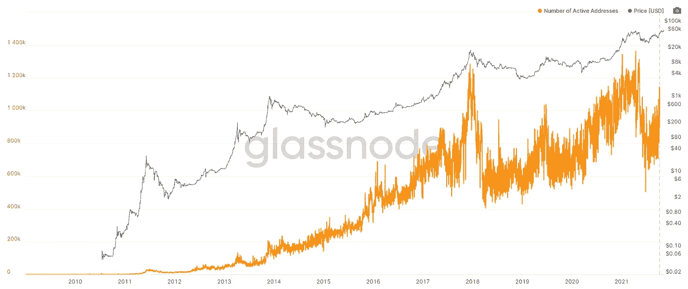
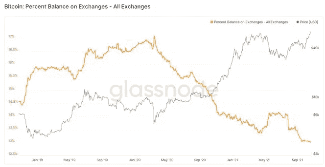
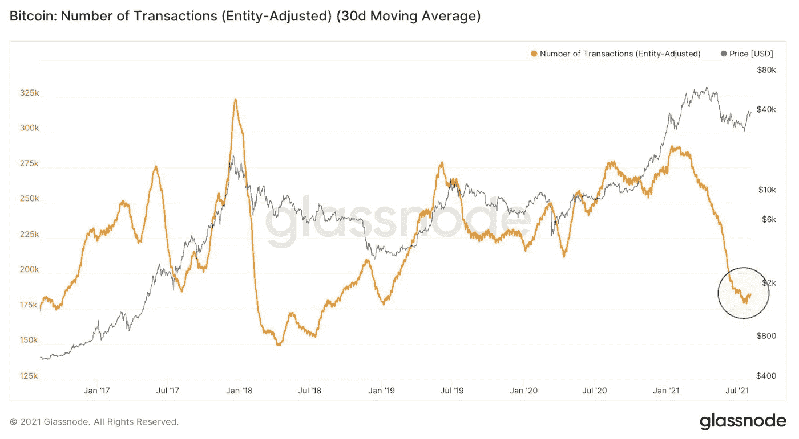
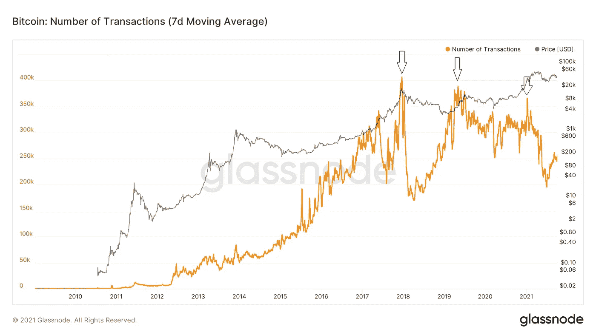
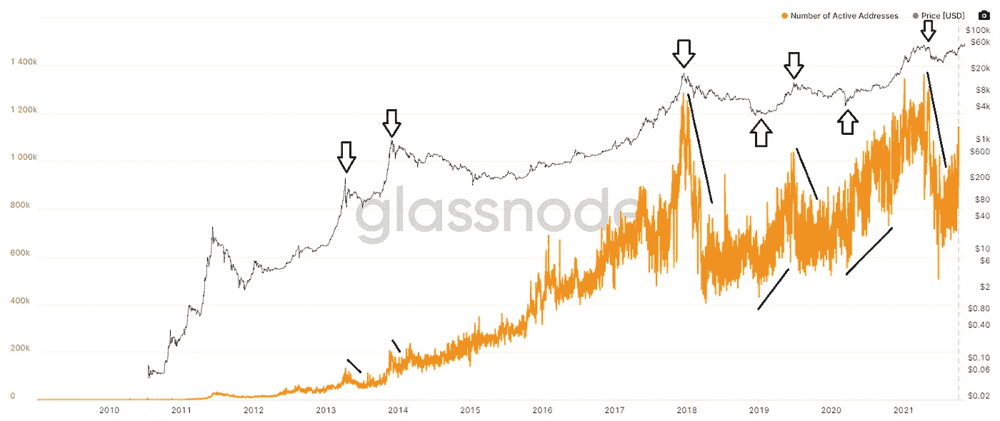

# 链上分析是废话。原因如下。

> 原文：<https://medium.com/coinmonks/on-chain-analysis-is-bullcrap-heres-why-4e967e3f794d?source=collection_archive---------4----------------------->

## 是的，这包括从库存到流动的模式。

如果你对加密和它周围的一切感兴趣，并且你没有生活在岩石下，那么你很可能遇到过“链上分析”这个术语和各种自称的“链上分析师”。但是万一你还没有，让我简单地向你介绍一下这个概念。

链上分析包括提取和深入研究任何给定区块链上公共区块链交易的可用数据(但本文中我们将重点关注比特币)。这有许多不同的用例，但主要是它被许多链上分析师用来尝试和预测未来的市场走势，让我现在告诉你，他们不知道他们在说什么。

当谈到它的其他用例时，它很好，我不认为它有多好，但当所谓的“链上分析师”试图用它来预测未来的价格时，我真的被触发了。

# 背后的逻辑

为了不重复太多，我将用字母“OCA”指代链上分析，用“OCAs”指代链上分析师。

让我们开门见山吧。

## **OCA 是如何预测未来价格的？**

OCA 使用许多指标来创建不同的未来价格预测，其中一些是:

*   活动地址的数量

一个图表，显示已接收或转移的活动钱包数量(在本例中为 BTC)以及与未来价格变动的假定相关性。

Number of active wallets holding BTC.

*   外汇外流

一张图表显示了离开交易所并似乎被冷藏的比特币数量，以及与未来价格走势的假定相关性。

*   交易数量

显示 BTC 区块链发生的交易数量以及与未来价格变动的假定相关性的图表。

Number of Transactions in BTC’s blockchain. (30 day MA)

Historical Number of Transactions in BTC’s blockchain. (7 day MA)

所以…很多数据，但是这些数据有价值吗？在我看来，不，不完全是。

所有这些 OCA 都假设，例如，离开交易所的 BTC 数量上升也意味着未来价格上涨，因为市场上可供购买的报价减少。这是完全错误的，因为他们没有意识到是什么促使人们将 BTC 从交易所撤出，那就是价格。

一旦价格下跌，他们将开始看到 BTC 被送进交易所，在市场上出售。这是因为驱使人们做出这个决定的是他们对未来价格走势的预期。是什么驱动了人们对未来价格走势的预期？实际价格变动。这意味着你可能只是在看 BTC/美元的图表。

原因在于，您试图通过此类指标完成的事情是考虑当前和过去的行为，如发生的交易数量，或交易所之外的 BTC 数量，或区块链上活跃的地址数量，并使用它来预测未来的行为。

这根本**不起作用**，因为这些指标是价格的*结果*，而不是价格的*原因*。

至少可以说，所有这些都是滞后指标，显示了价格变动已经导致的结果。

这里有一个我之前举过的例子:活跃地址的数量，你可以在下面清楚地看到，当价格飙升时，活跃地址的数量上升，当它下降时，它也下降得很厉害。如果金融市场是理性的，由供求关系驱动，这与应该发生的情况正好相反。

# 为什么会这样？

在正常的实物经济市场中，当价格下降时，对产品的需求上升，更多的人想以折扣价购买。当价格上涨时，对同一产品的需求下降，人们不想买昂贵的产品。

就当是鞋店吧。你走进去，看到你最喜欢的打折鞋，你不假思索就买了下来。但如果你走进去，发现它自昨天以来上涨了 100%，你会等着打折，或者干脆不买。

嗯，在金融市场中，由非理性思维驱动，我们看到相反的情况，如上图所示。随着价格飙升，越来越多的人想要购买资产，而随着价格下跌，越来越少的人想要购买资产。

这是因为你在实物市场上寻求的目标是实际获得你所购买的实物的价值，而你在金融市场上的目标是从尽可能低的买入和尽可能高的卖出中获利。

因此，我们可以得出结论，促使人们想在金融市场上购买一项资产的唯一原因是对该资产价格上涨并从中获利的预期。

如果这种期望没有得到满足，这个人就会出售。这正是推动价格的原因。每个人都在对当前价格和未来价格变动的可能性进行个人的、主观的评估。

# 与出价和需求无关

很难相信，我知道。但你从小就被教导这一点，这对金融市场来说是完全错误的。它只适用于经济市场。

真正驱动市场的是大众心理，你不能通过分析资产的当前报价或需求来预测未来的价格行为，因为报价或需求可能会因为价格的剧烈波动而突然发生变化。

不管你的资产是稀缺的还是像比特币一样的固定金额，如果没人想买，它就一文不值。这意味着比特币是否稀缺并不重要，为了让它物有所值，需求必须存在，我们已经看到只有价格上涨时需求才会上升。因此，这意味着每枚比特币的成本是多少，因为人们相信其他人也相信它有价值。

所以，不，在我写这篇文章的时候，并不是稀缺性本身使比特币价值 67000 美元，尽管我确实认为这与它已经走了多远有关。

# 如何预测价格

所以 OCA 不起作用，因为它依赖于未来价格变动的供需论点，那么你如何准确预测未来的市场波动？

我将在以后的文章中详细介绍，但对于这一篇，我将给出简单的答案。

当市场因大众心理而变动时，价格变动的影响会在人们的情绪中表现出来。你可以直接进入 Twitter 查看你的订阅。如果价格上涨，你可能会看到很多人欣喜若狂，如果价格下跌，你可能会看到很多人悲观。

这就是市场心理学发挥作用的地方。价格倾向于抵制极端情绪。也就是说，如果价格已经上涨了一段时间，你开始看到人们在极度兴奋的状态下说着妄想的话，唱着只涨不跌的故事，那就是你应该卖出的时候。

反之亦然。如果价格已经下跌了一段时间，你开始看到人们处于完全的恐慌状态，说着诸如“我们将归零”和世界末日之类的话，那也可能是你应该买入的时候。

今天就到这里，感谢大家的阅读。

yRodos。

> 加入 Coinmonks [电报频道](https://t.me/coincodecap)和 [Youtube 频道](https://www.youtube.com/c/coinmonks/videos)了解加密交易和投资

## 也阅读

*   [Bookmap 评论](https://blog.coincodecap.com/bookmap-review-2021-best-trading-software) | [美国 5 大最佳加密交易所](https://blog.coincodecap.com/crypto-exchange-usa)
*   [如何在 FTX 交易所交易期货](https://blog.coincodecap.com/ftx-futures-trading) | [OKEx vs 币安](https://blog.coincodecap.com/okex-vs-binance)
*   [如何在势不可挡的域名上购买域名？](https://blog.coincodecap.com/buy-domain-on-unstoppable-domains)
*   [印度的秘密税](https://blog.coincodecap.com/crypto-tax-india) | [altFINS 审查](https://blog.coincodecap.com/altfins-review) | [Prokey 审查](/coinmonks/prokey-review-26611173c13c)
*   [区块链 vs 比特币基地](https://blog.coincodecap.com/blockfi-vs-coinbase) | [比特坎评论](https://blog.coincodecap.com/bitkan-review) | [币安评论](/coinmonks/binance-review-ee10d3bf3b6e)
*   [Coldcard 评论](https://blog.coincodecap.com/coldcard-review) | [BOXtradEX 评论](https://blog.coincodecap.com/boxtradex-review)|[uni swap 指南](https://blog.coincodecap.com/uniswap)
*   [阿联酋 5 大最佳加密交易所](https://blog.coincodecap.com/best-crypto-exchanges-in-uae) | [SimpleSwap 评论](https://blog.coincodecap.com/simpleswap-review)
*   购买 Dogecoin 的 7 种最佳方式
*   [iTop VPN 审查](https://blog.coincodecap.com/itop-vpn-review) | [曼陀罗交易所审查](https://blog.coincodecap.com/mandala-exchange-review)
*   [美国最佳加密交易机器人](https://blog.coincodecap.com/crypto-trading-bots-in-the-us) | [经常性回顾](https://blog.coincodecap.com/changelly-review)
*   [A-Ads 审查](https://blog.coincodecap.com/a-ads-review) | [Bingbon 审查](https://blog.coincodecap.com/bingbon-review) | [Mudrex 投资](https://blog.coincodecap.com/mudrex-invest-review-the-best-way-to-invest-in-crypto)
*   [最好的卡达诺钱包](https://blog.coincodecap.com/best-cardano-wallets) | [冰棒副本交易](https://blog.coincodecap.com/bingbon-copy-trading)
*   [印度最佳 P2P 加密交易所](https://blog.coincodecap.com/p2p-crypto-exchanges-in-india) | [柴犬钱包](https://blog.coincodecap.com/baby-shiba-inu-wallets)
*   [八大加密附属计划](https://blog.coincodecap.com/crypto-affiliate-programs) | [eToro vs 比特币基地](https://blog.coincodecap.com/etoro-vs-coinbase)