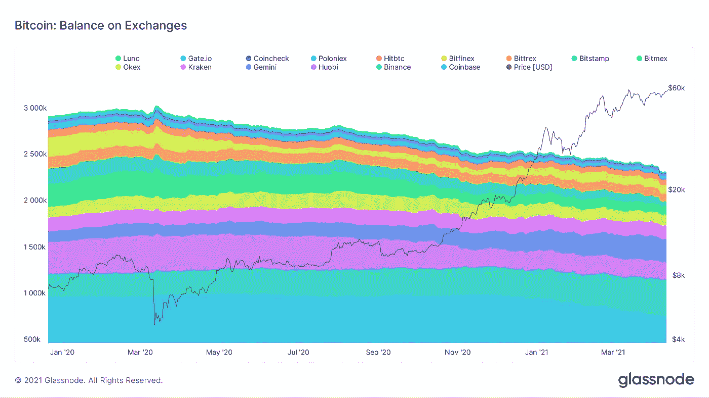
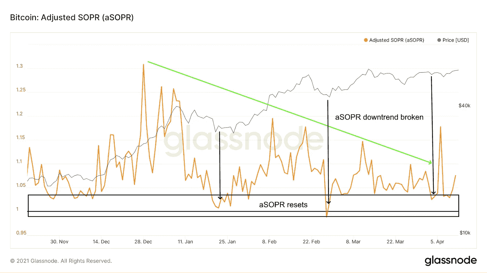
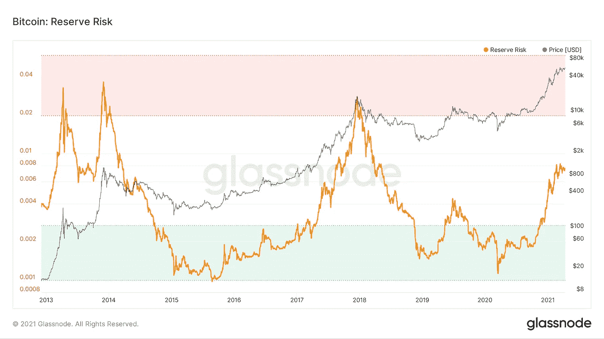

# 环比 BTC 数据显示比特币基地上市在即的市场信心

> 原文：<https://medium.com/coinmonks/on-chain-btc-data-shows-market-confidence-as-coinbase-listing-looms-290b0e3b9104?source=collection_archive---------9----------------------->

随着围绕此次发行的波动性预期增加，所有人都在关注比特币基地的 IPO。与此同时，链上数据显示，比特币仍处于强劲健康的上升趋势。

我们来挖一下。

# 比特币基地 IPO 是秘密资本流入的代理

比特币基地是世界上最受欢迎的交易所之一，将于周三 14 日在纳斯达克上市交易。由于 earning 的数据超出了预期，此次 IPO 是一个重大事件，可以作为加密货币市场的代表。

**数据兴趣点:**

*   比特币基地活跃用户从 2020 年第四季度的 280 万跃升至 2021 年第一季度的 610 万。
*   KYC 账户从 2020 年底的 4300 万增加到 Q1 2021 年的 5600 万。
*   Q1 的交易量达到 3350 亿美元，而 2020 年全年的交易量为 1930 亿美元。
*   比特币基地的总资产环比增长 150%，从 900 亿美元增至 2230 亿美元。

比特币基地的表现本质上是加密市场表现的一个代理指标。正如前面所指出的，该公司在 2021 年第一季度赚了 3350 亿美元，而 2020 年全年赚了 1930 亿美元——这为交易所上市的业绩预期开创了先例。

**查看** [全文点击这里](https://chrisoncrypto.com/blog/f/april-14-coinbase-ipo-to-unlock-next-wave-of-crypto-inflows) **！**

# 技术上来说

## 链上数据更新

在[上一期简讯](https://mailchi.mp/cb58515dd9a4/a-decentralised-application-network-the-case-for-ethereum)中，以太坊封面的技术图片保持不变，因为亚军 crypto 首先达到 2500 美元，此后不久可能达到 3500 美元。同样，随着买家不断涌入，比特币继续向 70，000 美元的水平靠拢。但是链上数据告诉我们什么呢？

**BTC 交易所走势走低**

交易所持有的比特币数量继续下降，显示出“hodl”趋势仍然存在且强劲。

虽然历史不能保证，但比特币通常不会进入抛物线的最后阶段，直到这一趋势发生转变。

## **调整后的 SOPR 显示出增长空间**

在牛市中，调整后的 SOPR 指标提供了对已花硬币实现了多少利润的洞察。如果利润被旧硬币拿走，aSOPR 将趋向更高，反之，当有利可图的硬币没有卖出时，它将趋向更低。

*   更高的 aSOPR 指标意味着更多的利润被拿走。
*   低于 1.0 的 aSOPR 意味着用过的硬币以亏损的方式被合计。

上图显示了两个观察结果:

1.  每当 aSOPR 趋向于一个相对底部时，就会观察到比特币价格的相对底部。
2.  在过去的 3 个月中，连续的峰值都在下降，这表明利润减少，增加了市场的长期信心。然而，趋势观察到最近的峰值，并迅速重置，潜在地打开了趋势转变的大门(这将需要观察)。

## **储备风险显示霍德勒信心仍然很高**

储备风险被定义为价格/HODL 银行。它被用来衡量长期持有者在任何特定时刻对比特币价格的信心。当信心高而价格低时，投资的风险/回报就低(即储备风险)。相反，当价格高且当时的风险/回报没有吸引力时(高储备风险)，信心就低。

关于霍德勒算法的更多信息可以在[这里](https://www.kanaandkatana.com/valuation-depot-contents/2019/5/30/exploration-of-bitcoin-days-destroyed)获得，但是本质上在出版的时候信心仍然很高。

**在游戏的这个阶段**，除了完全重置市场动态的灾难性和意想不到的场景，比特币处于合理和健康的上升趋势中——至少从其历史背景来看是如此。由于该事件的规模，即将到来的比特币基地 IPO 可能会带来一轮波动，但十有八九，上述波动可能会以相同的趋势方向解决——上升(仅)。

公牛领路。

下次再见。

下次再见。

**加入** [电报](https://t.me/chrisoncryptochannel) **频道进行实时更新！
关注我** [推特](https://twitter.com/ChrisOnCrypto1) **&** [多嘴多舌](https://gab.com/chrisoncrypto) **下面还有我的社交门户。**

[https://www.paypal.com/donate?hosted_button_id=C9VRLGTBHQX2N](https://www.paypal.com/donate?hosted_button_id=C9VRLGTBHQX2N)

# 阅读更多:4 月 14 日比特币基地 IPO 开启下一波加密资金流入？

[https://chrisoncrypto.com/blog/f/april-14-coinbase-ipo-to-unlock-next-wave-of-crypto-inflows](https://chrisoncrypto.com/blog/f/april-14-coinbase-ipo-to-unlock-next-wave-of-crypto-inflows)

[http://www.chrisoncrypto.com/](http://www.chrisoncrypto.com/)

你也可以用比特币支持我！
BTC 地址:**3 eydseypjhn 68 axkncuqbb 7 ebqcxrejamr**

最诚挚的问候，
**克里斯托弗·阿塔尔德**
克里斯对加密的创始人
贡献者[www.cityam.com](https://www.cityam.com)
直接接通:[电报](https://t.me/chrisoncrypto)

*原载于*[*https://mailchi . MP*](https://mailchi.mp/2aead448c32d/a-decentralised-application-network-the-case-for-ethereum-10142818?e=[UNIQID])*。*

> 加入 Coinmonks [Telegram group](https://t.me/joinchat/Trz8jaxd6xEsBI4p) 并了解加密交易和投资

## 另外，阅读

*   最好的[密码交易机器人](/coinmonks/crypto-trading-bot-c2ffce8acb2a) | [电网交易机器人](https://blog.coincodecap.com/grid-trading)
*   [加密复制交易平台](/coinmonks/top-10-crypto-copy-trading-platforms-for-beginners-d0c37c7d698c) | [如何在 WazirX 上购买比特币](/coinmonks/buy-bitcoin-on-wazirx-2d12b7989af1)
*   [CoinLoan 点评](/coinmonks/coinloan-review-18128b9badc4)|[Crypto.com 点评](/coinmonks/crypto-com-review-f143dca1f74c) | [火币保证金交易](/coinmonks/huobi-margin-trading-b3b06cdc1519)
*   [尤霍德勒 vs 科恩洛 vs 霍德诺特](/coinmonks/youhodler-vs-coinloan-vs-hodlnaut-b1050acde55a) | [Cryptohopper vs 哈斯博特](https://blog.coincodecap.com/cryptohopper-vs-haasbot)
*   [杠杆代币](/coinmonks/leveraged-token-3f5257808b22) | [最佳密码交易所](/coinmonks/crypto-exchange-dd2f9d6f3769) | [Paxful 点评](/coinmonks/paxful-review-4daf2354ab70)
*   [加密套利](/coinmonks/crypto-arbitrage-guide-how-to-make-money-as-a-beginner-62bfe5c868f6)指南| [如何做空比特币](/coinmonks/how-to-short-bitcoin-568a2d0b4ae5) | [KuCoin 评论](https://blog.coincodecap.com/kucoin-review)
*   [如何在印度购买比特币？](/coinmonks/buy-bitcoin-in-india-feb50ddfef94) | [WazirX 审核](/coinmonks/wazirx-review-5c811b074f5b) | [BitMEX 审核](https://blog.coincodecap.com/bitmex-review)
*   [印度比特币交易所](/coinmonks/bitcoin-exchange-in-india-7f1fe79715c9) | [比特币储蓄账户](/coinmonks/bitcoin-savings-account-e65b13f92451)
*   [币安费用](/coinmonks/binance-fees-8588ec17965) | [僵尸加密审查](/coinmonks/botcrypto-review-2021-build-your-own-trading-bot-coincodecap-6b8332d736c7) | [热点审查](/coinmonks/hotbit-review-cd5bec41dafb)
*   [我的密码副本交易经历](/coinmonks/my-experience-with-crypto-copy-trading-d6feb2ce3ac5) | [购买硬币回顾](https://blog.coincodecap.com/buycoins-review)
*   [Bybit 融资融券交易](/coinmonks/bybit-margin-trading-e5071676244e) | [币安融资融券交易](/coinmonks/binance-margin-trading-c9eb5e9d2116) | [Overbit 审核](/coinmonks/overbit-review-9446ed4f2188)
*   [加密货币储蓄账户](/coinmonks/cryptocurrency-savings-accounts-be3bc0feffbf) | [YoBit 审查](/coinmonks/yobit-review-175464162c62) | [Bitbns 审查](/coinmonks/bitbns-review-38256a07e161)
*   [Botsfolio vs nap bots vs Mudrex](/coinmonks/botsfolio-vs-napbots-vs-mudrex-c81344970c02)|[gate . io 交流回顾](/coinmonks/gate-io-exchange-review-61bf87b7078f)
*   [最佳比特币保证金交易](/coinmonks/bitcoin-margin-trading-exchange-bcbfcbf7b8e3) | [萝莉点评](/coinmonks/lolli-review-e6ddc7895ad8) | [比特币保证金交易](https://blog.coincodecap.com/bityard-margin-trading)
*   [创造并出售你的第一个 NFT](https://blog.coincodecap.com/create-nft) | [本地比特币评论](/coinmonks/localbitcoins-review-6cc001c6ed56)
*   [加密保证金交易交易所](/coinmonks/crypto-margin-trading-exchanges-428b1f7ad108) | [赚取比特币](/coinmonks/earn-bitcoin-6e8bd3c592d9) | [Mudrex 投资](https://blog.coincodecap.com/mudrex-invest-review-the-best-way-to-invest-in-crypto)
*   [如何在印度购买以太坊？](https://blog.coincodecap.com/buy-ethereum-in-india) | [如何在币安购买比特币](https://blog.coincodecap.com/buy-bitcoin-binance)
*   [顶级付费加密货币和区块链课程](https://blog.coincodecap.com/blockchain-courses) | [币安评论](/coinmonks/binance-review-ee10d3bf3b6e)
*   [MXC 交易所评论](/coinmonks/mxc-exchange-review-3af0ec1cba8c) | [Pionex vs 币安](https://blog.coincodecap.com/pionex-vs-binance) | [Pionex 套利机器人](https://blog.coincodecap.com/pionex-arbitrage-bot)
*   [在美国如何使用 BitMEX？](https://blog.coincodecap.com/use-bitmex-in-usa) | [BitMEX 评论](https://blog.coincodecap.com/bitmex-review)