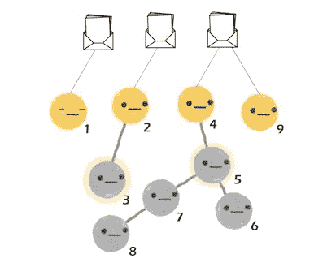
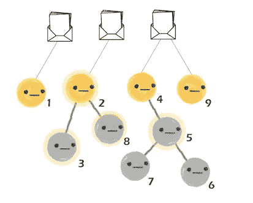

# 链上液体民主

> 原文：<https://medium.com/coinmonks/on-chain-liquid-democracy-c08ed8c07f6e?source=collection_archive---------0----------------------->

健康的互联网是去中心化的。是[开](https://www.mozilla.org/en-US/internet-health/open-innovation/)，[含](https://www.mozilla.org/en-US/internet-health/digital-inclusion/)，空档，安全。然而，我们今天看到的整个互联网体验是由少数几个组织控制的，这些组织通常有经济上的动机，致力于损害互联网互操作性的封闭系统；因此，我们失去了透明度和参与度。这种少数组织闭门造车最终影响我们的互联网体验的想法，在我看来是极权主义的。

# **开/关链治理**

彼得·蔡茨的一篇关于区块链治理的文章摘录。

> 区块链平台见证了协作创新的爆炸式增长，小型独立开发团队创建狭窄的功能层，这些功能层相互交互以创建最终用户体验。目前，我们生态系统中的项目团队正朝着一个共同的目标努力，即构建开放的基础设施，并说服普通用户采用它。

尽管朝着共同的目标努力听起来很奇妙，但它本身带来了一系列全新的挑战，这些挑战围绕着构建这种*开放基础设施*的项目的决策过程。这些决策过程被广泛地归类在一个总括术语下——治理。我发现，围绕区块链治理的讨论尤其引人入胜，因为它们与民族国家的公民允许自己被治理的方式有着惊人的相似之处——在国家政策制定中发挥作用(或者根本不发挥作用)。令人着迷的是，区块链空间中的挑战如何映射到现实生活中的问题——财政、货币、环境影响、治理等等。

# **液态民主**

一个如此完美地映射出区块链空间和生活现实的想法是液体民主的想法。流动民主创造了一个真正民主的投票系统，使选民能够直接就问题进行投票，或者将自己的投票权委托给一个受信任的政党——代表他们投票。如果我们每个人都可以选择自己喜欢的人——*私人代表*——来更紧密地捍卫我们的价值观，会怎么样？这篇文章渴望成为一篇技术文章，所以我将跳过对液态民主本身的讨论——它本身值得几篇文章讨论，并且已经在[21 世纪的真正民主](/organizer-sandbox/liquid-democracy-true-democracy-for-the-21st-century-7c66f5e53b6f)和[透明世界的民主 3.0](/decentfund/democracy-3-0-for-the-transparent-world-5a9f1ffad1ad)中简要讨论过。现在，我想带你看一下这种民主的可靠实现，以下假设你了解液态民主背后的理念。它还试图解决链上液体民主面临的一些公开挑战。

# **坚固性教程**

**步骤 1** 投票发起人将创建`contract LiquidDemocracy`，添加投票人和提案——供投票人讨论。假设州政府发起投票来收集公众意见，看看他们是否愿意花费 4 . 03 亿美元来建造世界上最大的雕像。为了便于说明，我们可以假设人们可以投票决定**赞成**、**反对**或**或许**。

addVoter and newProposal functions

对于这个例子，我们将编写一个测试来添加 3 个提议和 9 个投票者。使用[块菌测试框架](https://truffleframework.com/docs/truffle/testing/testing-your-contracts)编写测试。框架的几个相关特性:

1.  在每个`**contract()**`函数运行之前，契约被重新部署到正在运行的 Ethereum 客户端，因此其中的测试以干净的契约状态运行。
2.  `**contract()**`函数提供了一个由以太坊客户端提供的帐户列表，您可以用它来编写测试。这些帐户在测试中可以作为`accounts`数组访问。

`ganache-cli`默认配置 10 个账户。`accounts[0]`属于赞助商(truffle 用来部署合同的默认帐户)，而`accounts[1], [2]....[9]`将是我们的投票者。该测试看起来像是:

add proposals and voters

现在，选民们可以开始选择他们的代表了。选民 3 知道他们的亲戚(选民 2)精通州的经济政策和基础设施要求，所以他们决定委托他人投票。类似地，其他一些选民决定委托他们认为对这个问题更有见解的人。

Some voters delegate their voting power

尽管 7 号选民是 8 号选民的*代理人*，但在流动民主的架构下，7 号选民可以进一步将他们的全部投票权委托给其他人，如果他们愿意的话——创造一个*超级代理人*。

Voter 7 delegates their combined vote to voter 5

负责代表其他三名选民作出公正的判断；投票人 5 决定最好让投票人 4(他们认为是这方面的主题专家)代表他们 4 人做出最佳判断。

Voter 5 delegates their combined voting power to voter 4

然后，代表和普通选民行使他们的投票权，对提案进行投票——是、否和可能，分别表示为 P0、P1 和 P2。

Voting begins

在投票过程中，8 号投票者看到他们的代表链投了 ***可能是*** 。在关注了这些关于州政府支出的讨论后，8 号选民开始对这个问题有了更强烈的感受，并决定 4 . 03 亿美元的支出可以更好地用于推动该州的发展，并决定委托 2 号选民——他一直在游说反对这座雕像。

Voter 8 changed their delegate

相同的坚固性代码看起来像这样。

函数`delegateTo`中的第 13–15 行将投票人的`(msg.sender)`投票委托给地址`delegate`。`validVoters[]`中地址`delegate`的索引在`voters[delegate].index`。还将表决器的`state`设置为`State.Delegated`。这里的运行时繁重功能是`delegationCycleExists`，它检查委托周期，即`V1`委托给`V2` , `V2`委托给`V3`，然后`V3`试图委托给`V1`。

Delegation cycles have to be avoided

对于`n`选民来说，最糟糕的情况时间复杂度是`O(n)`，然而在真实场景中，我们不太可能看到大型授权链——通常选民会倾向于授权给少数代表或直接投票。

Large delegation chains are unlikely

还有，`vote`的功能很简单:

set .vote and .state in the voter object

对于测试，投票和委托看起来像:

现在，投票即将结束，是时候找出获胜的方案了。为了找到获胜的提议，我使用了深度优先搜索图遍历。

1.  这个想法是循环遍历`validVoters`数组(第 10 行)并遍历委托链，直到我们找到一个直接对提案投票(或者根本没有投票/委托)的投票人——此后称他们为`leaf voters`。
2.  在遍历委托链时，我们为沿途的每个投票人添加投票权(变量`totalVotes`)并将投票人标记为`visited`。
3.  当我们到达`leaf voter`时，将累积的票数加到`leaf voter`投票赞成的提案上。

findWinningProposal

同样，上述最糟糕的情况(大型委托链)时间复杂度是`O(n²)`——因为我们每次都是从投票人*向上*遍历到`leaf voter`以找到他们投票支持的最终提案。为了优化这里，我们可以使用一个调用堆栈来跟踪作为委托周期的一部分被处理的投票人，并回溯以设置每个投票人的提案编号。这样我们就可以通过利用`O(n)`空间来降低`O(n)`的时间复杂度。这种方法类似于[联合查找路径压缩](https://www.geeksforgeeks.org/union-find-algorithm-set-2-union-by-rank/)。

带有断言的完整测试如下所示:

truffle test

希望你喜欢这里提出的想法！如果你想讨论 liquid democracy、实现、路径压缩背后的想法，或者有更好的数据结构可以在这里使用，请前往评论部分。谢谢你读到这里！

我使用[https://ncase.me/crowds/](https://ncase.me/crowds/)沙盒模式来创建可爱的小投票者图表。一定要检验这个非常酷的关于群体智慧(或疯狂)的游戏。另外，我得到了我的[姐姐](https://twitter.com/aditiagarwal891)的帮助来编辑插图。

> [在您的收件箱中直接获得最佳软件交易](https://coincodecap.com/?utm_source=coinmonks)

