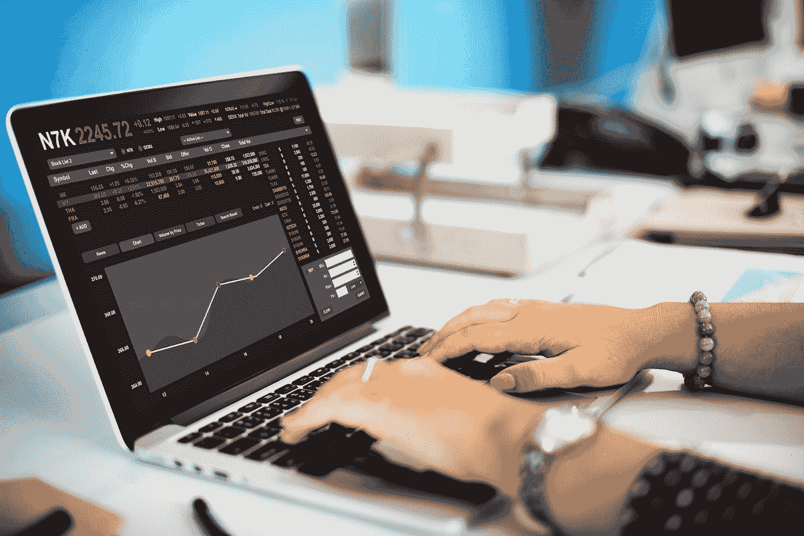

# 链上 v 链下:区块链给交易者带来的变化

> 原文：<https://medium.com/coinmonks/on-chain-v-off-chain-the-difference-blockchain-has-made-for-traders-87c12b859f94?source=collection_archive---------5----------------------->

让我们来谈谈区块链和交易。

区块链是如何改善交易者的命运的？差别真的很明显吗？

分布式账本技术继续在金融界蓬勃发展的一个主要原因是:它有效。

交易者不想花几个小时研究不同的电子表格，等待交易清算，并担心安全问题。

交易者希望获得高质量的信息，并获得符合当今技术的直观的交易平台。

在这篇文章中，我们将讨论区块链最具革命性的五个特征，看看每个方面对交易者有什么影响。

# 特性#1 不变性

多年来[缺乏稳健的加密](https://www.wired.com/story/online-stock-trading-serious-security-holes/)一直是困扰股票交易行业的首要问题之一。然而，区块链似乎已经介入解决这一普遍问题。

分布式分类账技术的不可改变性意味着，一旦记录得到确认，端到端的交易就不可更改。

这对交易者有什么影响？这大大降低了欺诈风险以及任何未经授权的活动。

# 功能#2 标记化

对于参与处理收藏品和珍贵艺术品的特定交易者群体，区块链提供了一种将资产价值转换为可以在分类账内交换或交易的数字代币的方法。

符号化概念的巧妙之处在于，艺术品可以不通过第三方经纪人进行买卖。交易者也可以利用[链上](https://davidstreltsoff.medium.com/understanding-blockchain-how-do-on-chain-transactions-work-f67f216eb88b)或[链下](https://davidstreltsoff.medium.com/understanding-blockchain-how-do-off-chain-transactions-work-b830ae72d3d9)流程来完成交易。

# 特性#3 速度

交易员现在处理交易的速度有多快？嗯，这取决于区块链，但肯定的是，交易结算速度比传统的交易期权要快。

例如，在 [Ripple 区块链](https://letsexchange.io/blog/which-cryptocurrency-has-the-fastest-transaction-time/)上，每秒处理 1500 笔交易，每笔交易的平均审批时间仅为 3 至 5 秒。

以太坊每秒可以支持 10000 笔交易。作为以太坊的竞争对手，EOS 每秒可以处理 2800 次交易。

作为最大的加密技术，比特币的区块链速度是每秒 7 笔交易，结算一笔交易的时间在 10 分钟左右。

很少有正统的交易平台能比得上这些速度。

# 特性#4 可见性

由于每天都有成千上万的交易发生，拥有可见性和轻松跟踪任何有问题交易的能力对交易者来说是一个受欢迎的发展。

如果某笔交易需要进一步分析，只需查看区块链，确定来源和存储在该区块链上的任何信息即可。

# 功能#5 降低了成本

区块链给交易者带来的最大变化之一是降低了整体交易成本。区块链技术使得在交易过程中创造效率成为可能。

保持低水平的不仅仅是个人交易成本，还有清算和结算成本。所有这些加在一起进一步降低了加工成本。

# 底线

区块链为交易者做了很多事情，无论他们是在链上交易[还是在链下交易](https://davidstreltsoff.medium.com/understanding-blockchain-how-do-on-chain-transactions-work-f67f216eb88b)或[交易](https://davidstreltsoff.medium.com/understanding-blockchain-how-do-off-chain-transactions-work-b830ae72d3d9)，使用分类账技术带来的差异是显而易见的。

这篇博客是关于*链 v 链外交易者如何使用区块链*的多系列文章的一部分。要了解交易者在当今市场中如何依赖区块链，请点击[此处。](https://davidstreltsoff.medium.com/chain-v-off-chain-how-traders-are-relying-on-blockchain-in-todays-market-447d28990a63)

> 加入 [Coinmonks 电报频道](https://t.me/coincodecap)，了解加密交易和投资