# 关于高效以太坊地址

> 原文：<https://medium.com/coinmonks/on-efficient-ethereum-addresses-3fef0596e263?source=collection_archive---------0----------------------->

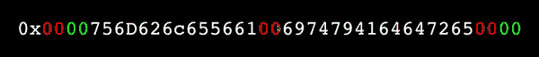

在与区块链打交道时，没有什么是免费的。这就是为什么效率的增加会导致成本的大幅降低，尤其是从长远来看。在以太坊和其他使用 EVM 的区块链上，这通常意味着找到节省天然气成本的方法，要么尽可能完全避免区块链*(例如，反事实实例化和广义状态通道，*[*Rick Sanchez 在此雄辩地解释了*](/spankchain/a-state-channels-adventure-with-counterfactual-rick-part-1-ce68e16252ea)*)，要么在必要时仔细优化链上交易。*

*有一种相对晦涩的技术可以实现这样的增量增益:**根据具体情况，找到一个使用成本更低的地址**。通过使用具有比通常的**多的**零字节**(即，低的* [*汉明权重*](https://en.wikipedia.org/wiki/Hamming_weight) *)* 的地址，并且在某些情况下，在地址的开始处具有更多的零字节，我们可以在许多类型的事务上节省汽油。**

*我已经能猜到你在想什么了:*

> *等等——每笔普通交易都要花费 21，000 美元，不管交易的地址是哪里。此外，我甜蜜的虚荣地址花了很长时间才找到。我需要一些证据来支持你好斗的主张，即我们选择的地址有所不同。*

*按照惯例，答案可以在[黄皮书](http://yellowpaper.io/)中找到。*(哇，大胆的用那个开…)**

*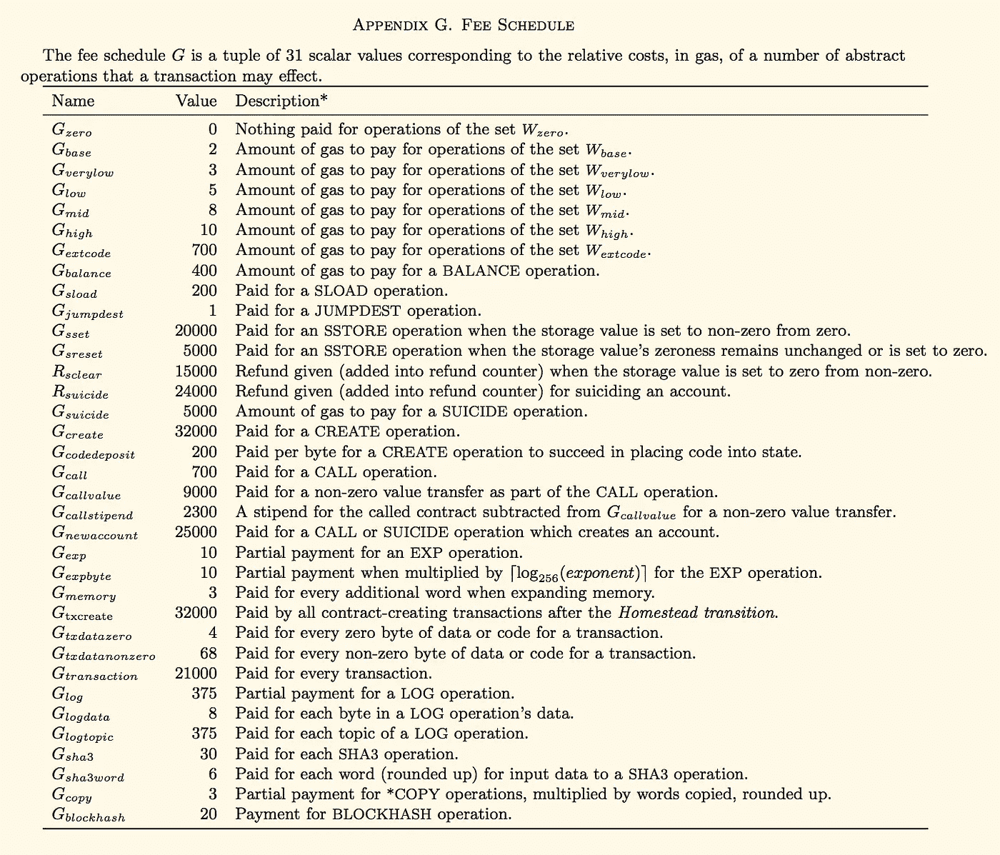*

*Try not to get ***too*** worked up by all these salacious details.*

*我们对其中的几个操作*(以及它们的对应操作)*特别感兴趣:`**G**txdatazero` *(与* `**G**txdatanonzero` *)* 和`**G**sload` + `**G**sset` *(与* ***而不是*** *使用*`**G**sset`*——这整个* `SSTORE` *听起来相当昂贵)*。*

# *呼叫数据、小数据*

*先来看`**G**txdatazero`:交易数据每零字节花费 4 gas。相比之下，`**G**txdatanonzero`的价格是 68 美元，或者说**的价格是**的 17 倍。因此，每次在`msg.data`中用零字节代替非零字节，就节省了 **64 gas** 。关于这一观察，需要记住几件事:*

*   *当查看十六进制形式的字节串时，每对数字**(其中每个字符代表 16 个可能的数字之一)*构成一个字节 *(16 = 2⁸ = 256* *位)*。单个十六进制零或分布在两个不同字节上的相邻零不会降低字节串的汉明权重。**
*   **零字节的排序与从这个*特定的*优化中获得的利益无关，至少与用于替换相应非零字节的零字节总数无关。**

**地址是该属性可以派上用场的一个方面。考虑 ERC20 `transfer()`的情况。`msg.sender`的汉明权重在这里没有什么不同，但是事实证明，作为`transfer`函数的一部分传递给`msg.data`的`_to`参数做了*(顺便说一下，函数选择器也做了)*。**

**使用 [OpenZeppelin 的 StandardToken](https://openzeppelin.org/api/docs/token_ERC20_StandardToken.html) 作为参考实现，一个没有零字节的地址的标准`transfer`花费 51,486 gas。然而，传输到八个零字节的地址只需要 50，974 gas，相差`51486 — 50974 = 512` gas。这也可以表示为`64 * 8`:这正是我们从上面的计算中所期望的。这就像有一张“买一百送一”的卡，所有的代币都转移到这个地址。如果你想知道`transferFrom`(你当然想知道，你这个狡猾的家伙)，猜猜看:如果两个地址都有八个零字节，**每笔交易节省的汽油将是两倍**！**

**有很多其他方法可以依靠这个方法，但是它基本上归结为是否可以使用零字节来代替它们的次等的非零对等物。这个技巧的另一个好处是它是**完全向后兼容的**——你可以用它来节省汽油，即使在调用没有利用它的合同时。**

***(作为题外话，在使用这种方法时你要格外小心，以防受到* ***短地址攻击****[*这里更深入地解释了*](https://vessenes.com/the-erc20-short-address-attack-explained/) *。简而言之，如果一个地址有尾随的零字节，您可以在请求第三方为您构建一些令牌传输时截断它们，如果他们没有正确验证输入，它将从下一个参数* `amount` *中“窃取”额外的字节。然后，你知道吗:我们现在拿回了 256 倍的代币！)****

**接下来考虑`**G**sset` : this 和`**G**sreset`都是处理`SSTORE`操作码，将 32 字节字置为状态，第一次存储任何非零数据都要耗费 2 万 gas*(是啊……如果能避免调用*`SSTORE`*`That_Would_Be_Great.gif`*)*。一旦这个字被存储，每次通过`SLOAD`检索它都要花费另外 200 个气体*，这也不酷。****

**当涉及到具体的地址时，我们可以如下节省一些汽油:如果地址至少有**四个前导零字节** *(或者十六进制编码格式的八个前导零)*，那么每个地址只需要占用 16 个字节。如果你计算一下，在对偏微分方程积分时考虑协方差，并记住携带 7 位，我们发现两个地址可以打包成一个 32 字节的包。*(字。)***

**这种优化的有趣之处在于，你不仅从`**G**txdatazero`的改进中获得了节省，而且由于不必从呼叫数据中读取和写入同样多的字，你甚至节省了*更多的*汽油。关于这种优化的另一个有趣的事情是，利用它的概念验证令牌已经存在——稍后会有更多细节，但它的要点是*(取决于传输方法)*我们可以削减令牌传输总成本的**多达 *5%* 。****

**您还可以通过查看臭名昭著的 [GasToken](/@0age/tpl-architecture-private-draft-1-a64f168a2f88) ，特别是它处理 GST2 的方式，看到这种优化的相关好处。GST2 的地址`0x0000000000b3F879cb30FE243b4Dfee438691c04`仅使用 15 个字节的存储。这样，部署的垃圾合同可以缩短 5 个字节，并且仍然检查`msg.sender`是否与 GST2 合同匹配，以便`selfdestruct`获得汽油回扣，当部署它们时，以每字节 200 汽油节省额外的 5 个字节。如果你打算玩弄天然气系统，用垃圾合同填满存储空间，你最好用正确的方式来做！*(这种围绕工厂合同的优化也在*[*EIP-1167*](https://github.com/ethereum/EIPs/blob/master/EIPS/eip-1167.md)*末尾讨论过)。)***

# **W0000000ah 啊…帮我报名！**

**现在，你可能会说:**

> **好吧，0 岁——你这个零爱怪人——我想我被说服了。但是我怎样才能得到这样一个地址呢？**

**嗯，有几种方法。最直接的选择:基本上，你“挖掘”一个。**

**地址是确定性生成的，或者来自私钥*(参见* [*此处*](https://kobl.one/blog/create-full-ethereum-keypair-and-address/) *了解详细内容的精彩文章)*对于外部拥有的帐户，或者来自调用者的地址和随机数*(调用* `CREATE` *时的计数器，或者调用* `CREATE2` *时任意提供的随机数，君士坦丁堡包含的操作码之一)*无论哪种方式，它都被输入到一个`keccak256`散列中，这意味着，给定输入的变化，每个字节的结果输出几乎是随机的。**

**零字节以由[二项式分布](https://en.wikipedia.org/wiki/Binomial_distribution)描述的频率出现在随机地址中:**

**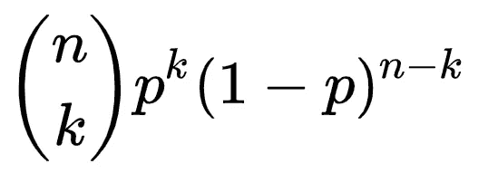**

**The probability mass function for a generalized binomial distribution (blah, blah, blah).**

**用[二项式系数](https://en.wikipedia.org/wiki/Binomial_coefficient)表示为:**

**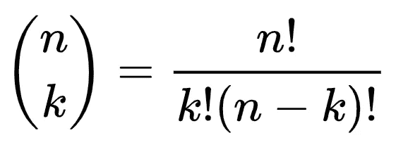**

**The binomial coefficient. The factorial is strong with this one, Obi-wan.**

**在我们的例子中，一个地址中有 1/256 的机会出现 0 字节和 20 字节。利用 ***p*** = (1/256)和 ***k*** = 20:**

**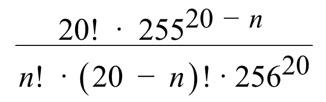**

**The same binomial distribution, applied to an address with twenty bytes.**

**看一下分布*(每条线都是三个数量级——百分之一、千分之一、百万分之一等等。)*:**

**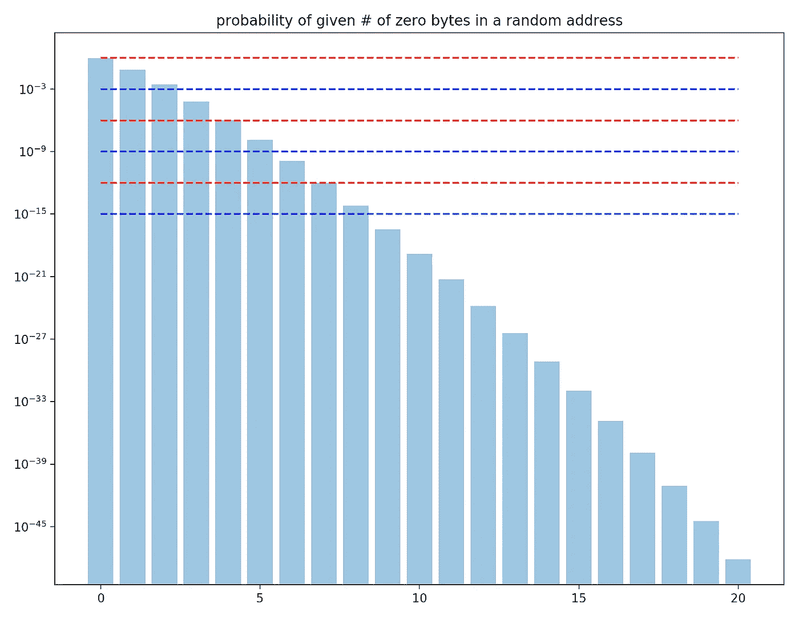**

**Note the logarithmic scale of the y-axis here.**

**你现在看到的是:**

*   **在地址上找到 ***零*** 零字节的几率为 92.47%。**
*   **找到一个零字节的概率是 7.25%。**
*   **0.27%的几率找到两个零字节。**
*   **0.00635%的几率找到三个零字节。**
*   **0.000000106%的几率找到四个，大概是百万分之一。**

**这种地址很容易获得，不需要太多的努力。然而，找到一个有七个零字节*的地址平均需要 978，054，817，444 次尝试——仅次于一万亿次哈希——有 0.000000000010224%的几率在一个地方找到所有七个零字节。***

***只要看一眼这个分布，就能看出从那里开始会变得多么困难。如果你能找到一个十个零字节的，改天我请你喝啤酒；如果你能找到一个有 14 个的，国家安全局会给你买一个。***

***我们再来看看 ***前导*** 零字节的地址。用 ***n*** 前导零字节查找地址的公式要简单得多:***

**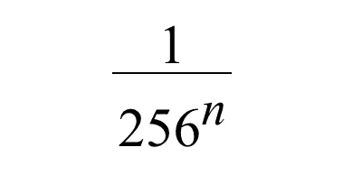**

**Now that’s more like it — math with that ELI5 swagger.**

**这些坏男孩的概率质量分布如下:**

**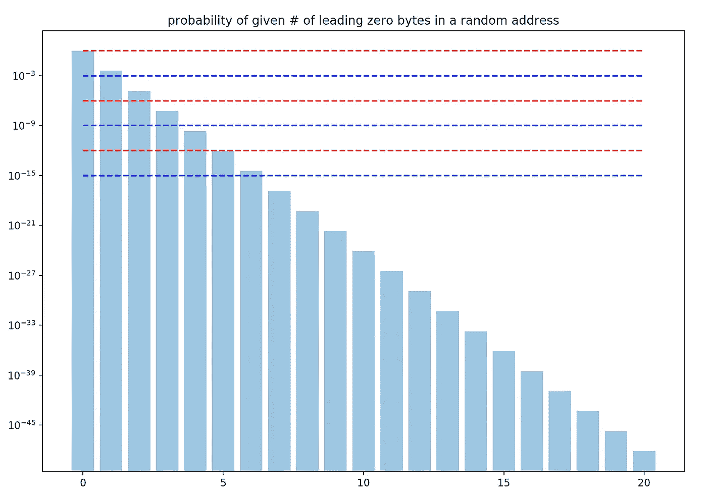**

**Pretty brutal by comparison, eh?**

**在一次尝试中找到有四个前导零字节的地址的几率是 4294967296 分之一。然而，这并不意味着我们可以处理 43 亿次散列，然后就此收工。在特定数量的散列中找到具有四个前导零字节的地址的几率可以从[几何分布](https://en.wikipedia.org/wiki/Geometric_distribution)中导出，其中 ***H*** 表示散列的数量:**

**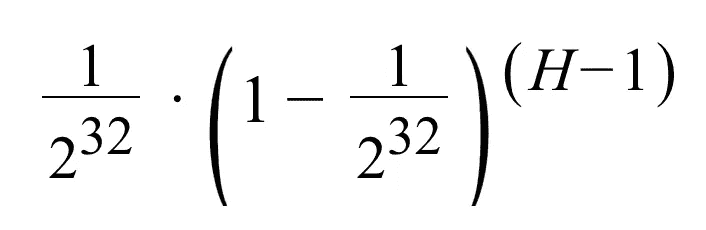**

**I thought we agreed that we were done with long formulas…**

**这种分布的问题在于它的[正偏斜](https://en.wikipedia.org/wiki/Skewness)，尤其是当你有足够的哈希能力找到它的时候。如果运气不好，你可能要等很长时间才能找到一个有足够多零的地址。为工作证明共识机制挖掘池是对这种现象的常见响应，并且服务于“平滑”分布的长尾的主要目的。**

# **“另一条路”**

**如果你一直在关注*(如果是这样，你正式成为一个书呆子)*，你可能记得我提到过有几种方法可以获得这些地址之一。如果你的智能家居设备僵尸网络不能提供你需要的散列能量，你可以让别人为你挖掘一个。这种方法的另一个好处是，他们还将代表您管理您发送到该地址的任何资金，因为他们知道用于生成该地址的私钥。**

**然而，还有另一种方式——这种方式没有分享你的私人钥匙的好处——君士坦丁堡的 hardfork 使之成为可能。`[CREATE2](https://eips.ethereum.org/EIPS/eip-1014)` [操作码](https://eips.ethereum.org/EIPS/eip-1014)让我们部署从`sha3(msg.sender ++ salt ++ init_code)[12:]`派生的契约地址，而不是我们已经知道并喜爱的`CREATE`操作码所使用的通常的`sha3(rlp.encode([msg.sender, nonce]))`。现在，再加上创建**可升级代理**的合同工厂，例如来自 ZeppelinOS 的[adminupgradabilityproxy，我们突然创建了一种机制，通过这种机制，高效的地址可以被大量生成。我说，几十个！](https://docs.zeppelinos.org/docs/upgradeability_AdminUpgradeabilityProxy.html)**

**(值得记住的是，使用代理的开销大约是 1600 gas。也就是说，如果你需要一个可升级的代理，为什么不选择更高效的呢？)**

# **任何东西——甚至任何东西——都有价格**

**让我们沿着这条思路走下去。我们创建了一个名为`Pr000xy`的智能契约，它允许用户在有效的地址创建或声明透明的代理契约。为了让人们真正开始向智能合同提交散列，他们将不得不为麻烦得到一些东西。这意味着**每个地址**都需要有一个合理的价格——理想的价格应该与找到该地址的实际可能性非常接近。我们还想同时考虑零字节的总数和*前导*零字节的总数*(但让我们暂时把前导零放在一边)*。**

**事实证明，公平价格并不是由找到一个特定的零的概率来决定的。最好根据至少有*个特定数量的零的概率来给地址定价。为了找到这一点，首先计算累积分布函数*(或者 sum，对于那些喜欢谈论这类事情而不显得浮夸的人来说)*，所有找到特定数量的零的概率最多为 ***比我们想要的*** 少 1。然后，你只需从 1 中减去这个数，就有了。这也被称为给定二项分布的[生存函数](https://en.wikipedia.org/wiki/Survival_function)。***

**此外，奖励函数应该反映在给定零字节总数的情况下，获得*前导*零字节数的几率。这里有一个方法:给定一些前导零，从零字节总数中减去这个总数，以及从地址中的字节总数中减去这个总数。接下来，使用新的、更小的输入将它输入到生存函数中。最后，将乘以*找到前导零字节的几率，得到零字节和前导零字节的特定“组合”的概率。***

**以这种方式组合两个分布产生在给定随机地址上找到*或更多零字节和 ***s*** 起始字节的概率，如下所述:***

**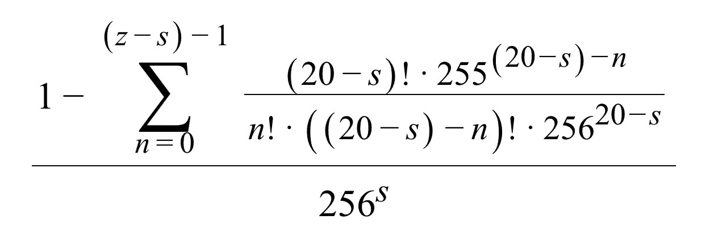**

**Now this is just getting ridiculous.**

**将这一数字转换成代理工厂在创建代理时应该铸造并在申请代理时烧掉的令牌的适当值，只需要两个步骤:找到组合赔率的*的倒数，并通过适当的**比例因子** *(因为大多数地址太普通而不值得支付)*进行调整，将奖励四舍五入为整数值。一个很好的缩放因子是 256 *(或者对于那些有点怪癖的人来说是 2⁴)*，这使得最小的回报大体上可以达到——生成一个有三个前导零字节(即六个前导零)的虚位地址平均需要 16，777，216 次尝试，但是在大多数商用硬件上是完全可行的，假设你有一点耐心。说真的，[不信你自己试试](https://vanity-eth.tk/)。***

**这给我们留下了一个奖励函数 ***R*** ，它给出了创建一个代理的精确值，该代理的地址包含 ***z*** 零字节和 ***s*** 起始字节，计算如下:**

**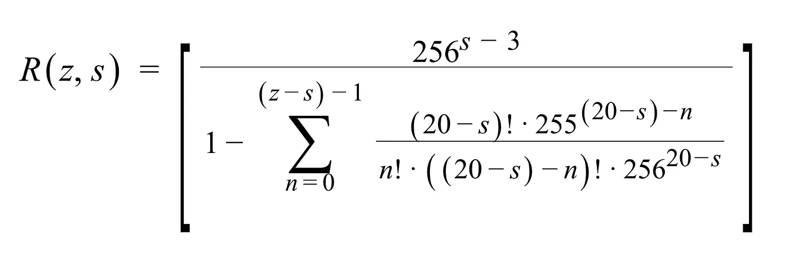**

**It’s beautiful… if you squint at it just right…**

**我现在就打断你，免得你说:**

> **这个表达式产生了一些巨大的数字！到底是什么让我每次想使用代理工厂来节省我的汽油时都要计算这个巨大的链条呢？**

**你知道为什么吗？这是因为**你不需要在链上计算它**。幸运的是，有一个查找表就可以了，因为这个函数只有 200 个有效输入。在处理万亿分之一万亿分之一万亿分之一的概率时，我已经为您解决了不得不排除浮点精度错误的头痛问题。不客气*(其实也没那么差——不客气来* [*查我的作品*](https://gist.github.com/0age/d55d8315c2119adfba3cc90b3f5c15df) *。)***

**在您寻找由`Pr000xy`创建的将产生非零回报的代理地址时，您可以使用这个方便的正则表达式，它将让您知道该地址是否值得任何令牌:**

```
**^0{6}|^0{4}((.{2})*(00)){2}|^((.{2})*(00)){5}**
```

**说完这些，让我们来看一些没有任何公式的奖励函数的图表，供所有视觉学习者参考。**

**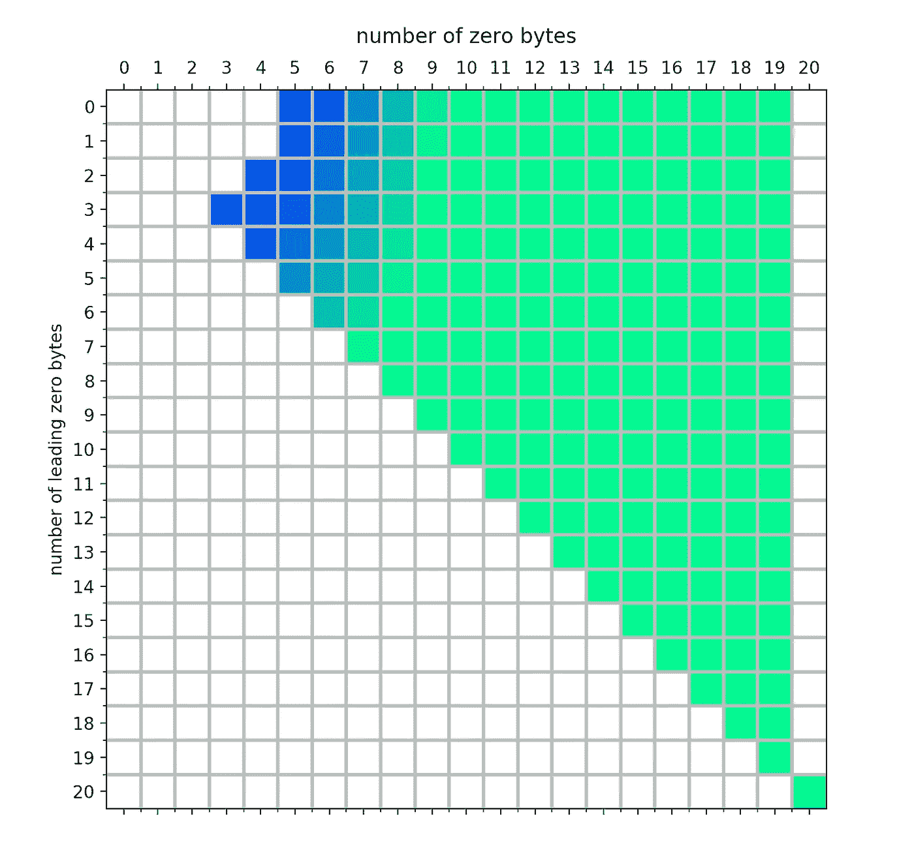**

**Blue cells are in play for mere mortals. White cells are either: a) not worth anything, or b) literally impossible. Cells deep in the Lime Green are both: a) worth an insane amount, and b) figuratively impossible.**

**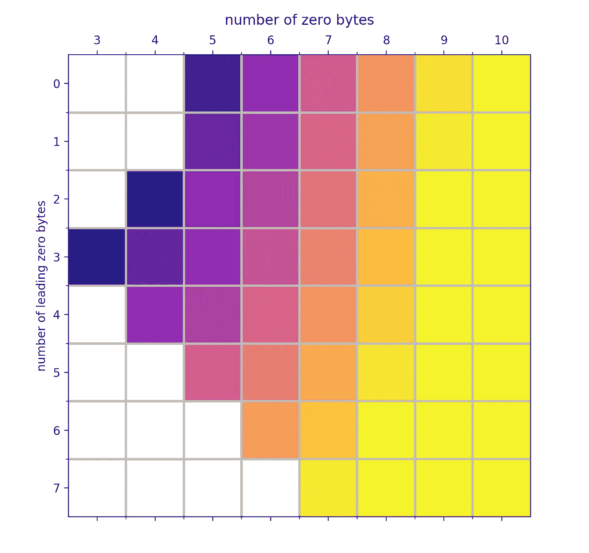**

**Zoomed in to the blue area above, plus a new color gradient called “plasma” which is fun.**

**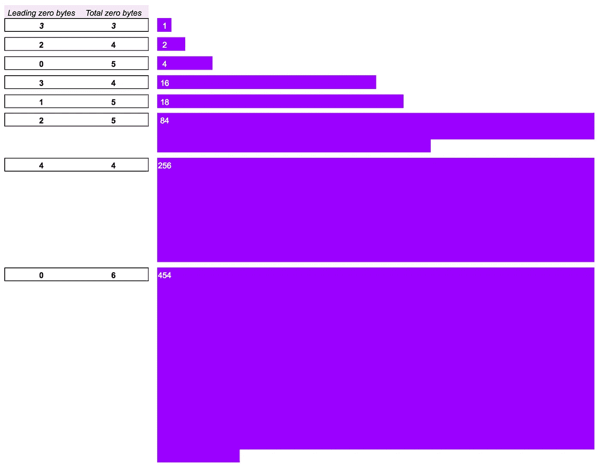**

**A relative comparison of initial reward sizes.**

# **但是等等，还有呢！**

**与简单地以老式方式强行获取地址相比，使用工厂合同为具有高效地址的可升级代理提供了额外的好处。如果我们设计代理，使得提供给`CREATE2`的 salt 来自提交者 的地址 ***和他们提交的随机数，那么可靠的随机性来源不再是生成安全虚名地址的先决条件。简单地逐步通过 nonces 将会起作用，因为只有预期的提交者将能够交付预期的 salt，该 salt 将生成到工厂契约的契约。结合不需要为每次尝试生成密钥对的事实*(更确切地说，对连接的字节串执行* `keccak256` *散列以验证契约地址)*，应该**增加可以用给定量的计算能力检查的地址的数量**。*****

*此外，使用工厂模式还有另一个有趣的好处:**虚地址可以在不可信的环境中安全地挖掘出来**。没有可窃取的私钥，因为将提交 nonce 的地址是作为参数提供的，并且相关的私钥永远不会提供给挖掘虚荣地址的机器。恭喜你——你的可疑网站现在有了一个在后台秘密挖掘密码的新方法！*(开个玩笑——别做那种人。)**

# *如果你建造了它(并放了一个滑水道)，它们就会来了*

*假设存在对具有高效地址的代理的需求，为它们制定工厂合同的诀窍在于激励足够多的矿工进行哈希运算。一个准确的奖励功能有很长的路要走，在不可信的环境中更快地挖掘地址的能力也有所帮助。然而，已经有很多高度优化的工具可以使用传统方式找到虚荣心地址，并且通过工厂合同将需要支付一些额外的费用——考虑到最终目的，这有点讽刺。但是还有一张王牌——即使他们只是在为自己寻找一个虚假地址，他们也可以通过利用他们找到的所有地址来分摊寻找的成本，甚至赚钱。*

*举例来说，假设热门的 new `blockchainBuzzwordSoup`项目想要一个地址至少有八个零字节的代理契约。他们也有自己开采的手段，而且对于他们的口味来说，代币现在有点太贵了，尤其是因为需要 900 万代币来声明他们想要的地址。凭借他们所掌握的散列能力，他们将需要大约两周的时间来找到它——这意味着可能需要**永远**——但是，谢天谢地，他们喝了 Kool-aid 并决定使用`Pr000xy`。*

*一旦他们开始挖掘，他们将开始寻找有效但不太有效的代理地址，他们可以创建代理地址，直到出现符合他们规格的地址，或者直到他们赢得足够的令牌来彻底购买它。前一种情况允许他们**卖掉额外的令牌**并补偿他们的一些额外的电费和相应的对处理器造成的热损害。后一种情况有效地“平滑”了我们上面提到的分布的长尾，保护它们免受显著延迟正匹配的坏运气的打击。*

*为了真正放大这种效果，`Pr000xy`可以让用户**出价购买定制的虚荣心地址**。为此，他们在工厂合同上押了赌注。然后，一旦工厂创建了与请求匹配的代理，任何人都可以调用一个方法来将有效的报价与代理匹配，将赌注资金转移给代理的创建者*(请求者提供寻找匹配的费用)*并将代理的所有权转移给设置报价的用户*(如果地址有足够的零字节，则在该过程中烧掉任何所需的令牌)*。寻找定制虚荣心地址的用户越多，矿工使用代理的动机就越强，定制地址就会越快被找到——这是一个良性的、但大多是虚荣心的循环。*

# *t000 基因组学*

*既然我们已经建立了获取有效地址的方法，让我们来看看如何使用它们。对于 ERC20 令牌的用例，特别是那些愿意稍微“变通一下规则”的令牌，我们可以说，**扩展了**接口。*

*想象一个令牌——姑且称之为 lulz 的`T000ken`——其中只允许带有四个前导零的地址携带余额。假设你有一个满足这些要求的地址，你可以通过锁定 Dai 或类似的东西来制造`T000ken` s，然后你可以使用它们，将它们发送给所有具有零字节地址的好友，如果你愿意，最终可以刻录它们并取回你的 Dai。为了获得大部分的回报，你稍微偏离了标准的 ERC20 方法，在可能的地方打包参数，并使用带有大量零字节的函数选择器。*(哈！你* ***早就知道*** *早先的那个小花絮又要冒出来了。)*提供几个具体的例子:*

*   *在`from`地址中有四个零字节可以节省`64 * 4 = 256`的汽油，如果有额外的零，会节省更多*
*   *将`to`和`from`打包成一个字可以去掉 32 个空字节的通话数据，从而又节省了一笔`32 * 4 = 128`汽油费*
*   *用更高效的`mapping(<packed addresses> => uint256)`替换默认的`allowed`(采用`mapping (address => mapping (address => uint256))`的形式)节省了高达 66 的气体*(其中 7/11 来自从嵌套哈希表中获取值所需的额外的*`sha3`*)**
*   *使用带三个零字节的功能选择器*(你甚至可以用一个带四个！)*保存`64 * 3 = 192`气体*
*   *仔细排列功能选择器——它们是按字母数字顺序排列的——一次可以节省 12 加仑汽油*

*与全新的 [OpenZeppelin ERC20 实现](https://github.com/OpenZeppelin/openzeppelin-solidity/blob/release-v2.0.0/contracts/token/ERC20/ERC20.sol)相比，`T000ken`概念验证实现实际上进展不错:在`transfer`上节省了 3%以上的汽油， ***在`transferFrom`上节省了 5%*** 。即使参考实现使用相同的地址，`T000ken` *仍然为`transfer`提供 2.5%的折扣，为`transferFrom`提供 4%的折扣。**

```
*----------------------- Gas Savings Analysis -----------------------
cost to lock: 41499 (in-only: 56499)   free: 65260    total: 1067591\. T000ken using standard ERC20 methods
                              Transfer    TransferFrom    Approve
   Example (regular address)   36518          44113         30308
   T000ken (ERC20 methods)     36027          42777         30045
   Gas savings:                  491           1336           263
   Percentage savings:         1.34%          3.03%         0.87%Example (compact address)   36262          43601         30052
   T000ken (ERC20 methods)     36027          42777         30045
   Gas savings:                  235            824             7
   Percentage savings:         0.65%          1.89%         0.02%
   Breakeven txs: (in only)      241             69
   Breakeven txs: (in and out)   455            1302\. T000ken using extra-efficient "sort of like ERC20" methods
                              Transfer     TransferFrom    Approve
   Example (regular address)   36518          44113         30308
   T000ken (efficient)         35308          41829         29566
   Gas savings:                 1210           2284           742
   Percentage savings:         3.31%          5.18%         2.45%Example (compact address)      36262          43601         30052
   T000ken (efficient)         35308          41829         29566
   Gas savings:                  954           1772           486
   Percentage savings:         2.63%          4.06%         1.62%
   Breakeven txs: (in only)      241             32
   Breakeven txs: (in and out)   455             60*
```

# *给我看看代码！*

*在这里查看`Pr000xy` [的代码](https://github.com/0age/Pr000xy)或者在 [Ropsten](https://ropsten.etherscan.io/address/0x000000009a9fc3ac5280ba0d3ea852e57dd2ac1b) *上使用它(关于* `T000ken` *的代码仍然非常粗略，但是如果您有兴趣看一看的话，请告诉我)*。甚至有一个[节点脚本](https://github.com/0age/Pr000xy/blob/master/scripts/mine/Pr000xy.js)可以用来挖掘你自己的地址——确保用你控制的地址替换它。如果你不想要一个透明的可升级代理，但仍然希望你的下一个合同有一个高能效的地址，你可以使用`Create2Factory`(代码[这里](https://github.com/0age/Pr000xy/blob/master/contracts/Create2Factory.sol)，部署到 Ropsten [这里](https://ropsten.etherscan.io/address/0xa779284f095ef2eBb8ee26cd8384e49C57b26996))来指定你自己的合同初始化代码，并使用类似于`Pr000xy`所使用的[地址挖掘技术](https://github.com/0age/Pr000xy/blob/master/scripts/mine/create2factory.js)——参见这篇[后续文章](/@0age/deploy-an-efficient-address-contract-a-walkthrough-cb4be4ffbc70)来浏览这个过程。还有一个全新的`Pr000xy` [电报集团](https://t.me/joinchat/AAAAAEgfYEufIMuqEXFNQA)也很希望有你。请记住,`Pr000xy`仍然是高度实验性的,还没有被审计——参与进来并帮助解决这个问题！*

**大拜* [*夏羽·戈塞林*](https://twitter.com/thegostep)*[*康纳斯佩西*](https://twitter.com/c_spelliscy)*[*圣地亚哥·帕拉迪诺*](https://twitter.com/smpalladino)*[*亚历杭德罗·桑坦德*](https://twitter.com/_ajsantander)*[*大卫·布莱兹纳克*](https://twitter.com/bleznak) *，******