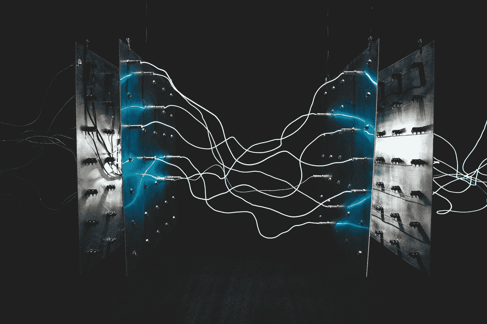
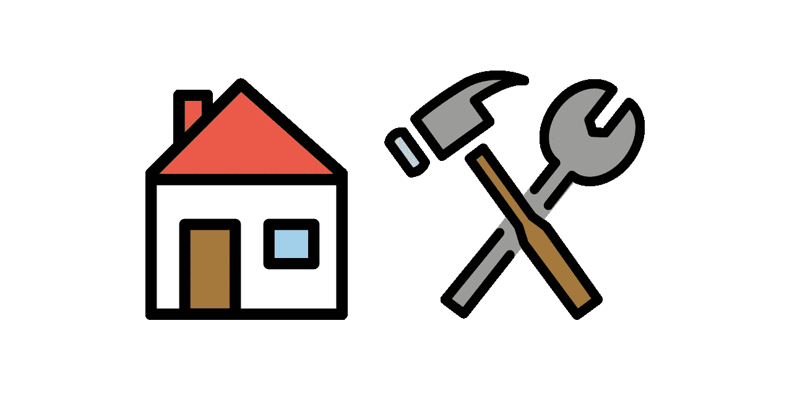

# 论高效以太坊交易

> 原文：<https://medium.com/coinmonks/on-efficient-ethereum-transactions-introducing-homework-6ae4f21801ed?source=collection_archive---------1----------------------->

## &介绍家庭作业🏠🛠️



UNLIMITED…. POWER!!!

*TL；dr —您没有充分发挥自己的潜力与智能合约互动。使用家庭作业，你可以使用没有永久代码的钱包契约来处理交易，将多个操作合并为一个，更一般地说，像专家一样管理你的链上活动。剧透警告:它使用变形契约，当然！*

一开始，聪说:**要有交易**。通过证明知道 1 和 0 的秘密串，并且提交该证明给所有人看和记录而不暴露该秘密，交易的提交者，并且只有该提交者，可以在分布式分类帐上传递特定的状态改变。感觉很好。

接着，萨博&布特林说:**让智能合约**出现。通过将一个由 1 和 0 组成的公共字符串放在一个帐户地址供所有人查看和记录，并允许其他帐户访问该地址并根据其中包含的逻辑和状态传递状态更改，一个新的可能性世界可能会展现出来。这也很好。

但是在这两个独立的领域之间仍然存在着巨大的鸿沟。事务不能利用智能协定可用的许多资源，例如组合多个调用、处理失败、使用条件逻辑、利用回调和保持状态。另一方面，契约缺乏适应不断变化的条件的灵活性，因此必须与潜在的剥削不断斗争，如果它们过时了，就必须被放弃。

合约就像堡垒一样，设计用来抵挡持续的冲击。另一方面，外部拥有的账户只是在数字沙漠中游荡的流浪者。为了弥合这一差距，事务提交者需要一个持久的操作基础，一个释放契约功能但具有轻量级事务灵活性的基础。换句话说，他们需要一个家。


All we need is a humble little spot on the blockchain to call our own.

## 灵活的合同

智能合约的关键特征之一是它们的持久性，通常被称为**不变性**。为了可靠地与契约交互，您必须能够依赖该契约的内容。这个属性非常重要，它被直接编码到契约部署本身的 DNA 中。

Ethereum 虚拟机中契约部署的原始设计按如下方式实施了这一不变量:每个契约的部署地址是通过将部署者的帐户地址与 nonce 相结合而得到的，nonce 在每次成功部署时递增*(或者，在外部拥有的情况下，在每次发生任何事务时递增)*。这确保了**代码只能** **部署一次**到给定的契约地址，并且保持了不变性。


An immutable smart contract, standing firm and protecting the city below.

但是，这也使得在合同实际部署到某个地址之前，很难提前有效地指定该地址。像状态通道这样的用例是通过反事实实例化来实现的，其中**契约只在需要的时候部署**。为了支持这些和其他应用程序，一个新的部署方法 *(* `CREATE2` *)* 被添加到 EVM 中，该方法通过部署者的 nonce 来取消帐户确定，取而代之的是**使用契约的创建代码**和一个可调的 salt 值来导出部署地址。

从表面上看，这种部署方法似乎保留了契约持久性的保证。如果契约的创建代码被更改，部署地址也将更改。但是现在不变性的盔甲上有了一个漏洞— **契约的创建代码可能是不确定的**，这意味着它的执行可能会根据部署时的外部因素而有所不同，即使它的创建代码保持不变。

此外，如果这个契约`SELFDESTRUCT`，那么它可以用新的字节码重新部署到同一个地址。表现出这种行为的契约被称为 [**变形契约**](/@0age/the-promise-and-the-peril-of-metamorphic-contracts-9eb8b8413c5e) ，它们完全拒绝契约不变性的标准原则，尽管如果它们的契约代码缺少`SELFDESTRUCT`的方法或者它们的部署方法不可用，它们可以很容易地在任何时候转换回不可变状态。这些类型的合同为我们提供了从一个持久账户进行更有效交易的手段。


Thus, the methodical deconstruction of your precious contract immutability begins.

## 增强型交易

普通事务在它们自己能够完成的事情上是非常有限的。他们可以向其他客户发送以太网和数据，或者部署新合同。当调用另一个帐户时，数据几乎总是由一个函数选择器和一些参数组成——它不指定，实际上也不能指定要运行的实际操作码。相反，由接收帐户来接收和处理这些参数。

这种范式将交易限制为一次只能与一个帐户进行交互。它还排除了添加被调用的帐户中尚未包含的更高级的逻辑或条件行为。基本上，在进行交易时，您不能包含自己的自定义代码来运行，这是相当令人失望的。*(有趣的是，让你这么做的交易脚本是 Libra / Zuck-Buck 的 Move 语言的一个提议特性。)*

但是如果数据*可以作为代码执行呢？实际上，可以构建一个行为类似于高级事务脚本的事务，调用多个不同的帐户并合并自定义逻辑，如处理异常或将调用分组到一个原子操作中。通过将契约部署到执行所提供的代码然后删除自身的变形地址，我们可以创建具有永久地址但没有永久代码的钱包契约。除了其他用例，这也是**家庭作业**的目的。*

**

*Alternate Article Title: On Efficient Ethereum Emoji.*

*HomeWork 是一个自治的实用程序，可以用来查找一个**主地址**并将*(和重新部署)*合同与任意字节码部署到该地址的帐户。每个本地地址都有一个相应的**键**，带有一个特定的控制器，用于导出部署地址。此外，家庭作业将允许钥匙的控制器**为其相应的家庭地址铸造一个 ERC721 令牌**。然后，NFT 的所有者可以赎回它，以便获得对该地址的部署的控制权。*

*有许多有趣的家庭作业应用程序根本不涉及有效的事务或变质——例如，你可以轻松地部署代码，将它自己的地址作为常数引用，或者找到一个[有效的契约地址](/coinmonks/on-efficient-ethereum-addresses-3fef0596e263)来节省你的汽油。*(在*[*EIP 1167*](http://eips.ethereum.org/EIPS/eip-1167)*中解释了一个很好的例子):如果您正在部署一组引用带有前导零字节的契约的最小代理，那么您将能够在每次部署中每零字节节省 200 gas。)*基本上，您可以**将地址派生与部署**完全解耦。*

*然而，真正的游戏规则改变者是你能用那些*变形的家庭地址做什么。举例来说，考虑这个常见的 UX 难题:许多常见的 ERC20 操作需要两个事务，一个是批准另一个帐户代表您转移令牌，另一个是执行从该帐户的实际转移。让我们假设您正在使用下面的契约来交换两个令牌*(为了简单起见，它只支持 1:1 交换)*:**

```
**// example token swapper contract.
contract TokenSwapper {
    ERC20 tokenA; // gives this token
    ERC20 tokenB; // takes this token

    constructor(ERC20 tokenToSwap) public {
        // create the token to give
        // (mints this contract an initial balance) 
        tokenA = new ERC20(); // assign the token to take
        tokenB = tokenToSwap;
    }

    // swaps one of token A for one of token B.
    function swap() public returns (bool) {
        // take one of token B from the caller (NEEDS APPROVAL)
        tokenB.transferFrom(msg.sender, address(this), 1);

        // give the caller one of token A in return.
        tokenA.transfer(msg.sender, 1);

        return true;
    }
}**
```

**使用一个家庭地址作为钱包契约并在那里保存您的令牌，**这变成了一个单交易操作**，可以通过部署这样的契约来实现:**

```
**interface ITokenSwapper {
    function swap() external returns (bool);
}interface IERC20 {
    function approve(address spender, uint256 amount)
      external returns (bool);
}// deploy this "transaction" contract to the home address.
contract ApproveAndTransferFrom {
    constructor(
        ITokenSwapper tokenSwapper,
        IERC20 tokenToSwap
    ) public {
        // approve the swapper to transfer for you.
        require(tokenToSwap.approve(address(tokenSwapper), 1)); // make the swap.
        require(tokenSwapper.swap()); // clean up the code here so we can use it again...
        // and DO NOT set address(this) as the recipient!!
        selfdestruct(tx.origin);
    }
}**
```

****

**Knight to C8, Bishop to E4, King to A6 in one move. Checkmate, skeptics.**

**因此，如果你使用家庭住址作为钱包合同，你可以通过简单地部署合同、执行一些呼叫或任何事情并销毁它，以非常灵活的方式做大量有趣的事情。你也不需要马上销毁契约——事实上，如果你要重用它，让代码在适当的地方保留一段时间会更有效，这样你就不会招致每次部署它的开销*(只要确保如果你想改变它，它可以被销毁)。*如果`SELFDESTRUCT`让你感到不安，还有一个名为 [exeDAO](https://devpost.com/software/exedao-6r1b4a) 的全新 multisig，它使用了类似于家庭作业的技巧，允许在钱包契约上执行近乎任意的字节码，而无需清除事务之间的状态。**

## **螺母和螺栓**

**有很多不同的方法来创建不确定的契约创建代码，但是作业使用的技术是**变形代理**模式。首先，我们部署一个契约，将我们想要部署的契约的契约 ***创建代码*** 存储为 ***运行时代码*** 。然后，我们可以将带有不确定性创建代码的契约部署到一个已知地址，该地址将`DELEGATECALL`到运行时存储契约中。这样，初始化逻辑将在调用者的上下文中执行，从成功的`DELEGATECALL`返回的字节码可以写入调用者的运行时*(或者在失败的情况下作为回复消息传递)*。**

**有几个原因说明这种模式是对家庭地址进行通用部署的好选择:**

*   **部署的契约可以**使用构造函数**，这对于将它们用作全功能的钱包契约是至关重要的，并且不需要使用初始化函数。**
*   **计算给定密钥的归属地址的步骤可以比通过瞬态变形契约*的两步部署少(即部署与* `CREATE` *的契约，然后立即部署*`SELFDESTRUCT`*【s】*)，这意味着可以更快地找到**有效地址**。**
*   **用于部署变形契约的契约创建代码不需要在每次使用时都进行部署，并且可以选择提前**部署** *(可能在经过审查的库中)*并重用。**

**这项技术还有许多潜在的应用，包括对[运行时存储合同](/coinmonks/on-efficient-ethereum-storage-c76869591add)的可转移写访问，资产篮子和可替换账户的构建，以及使用托管账户和元交易的强大新方法来搭载新用户，但这已经是大量需要消化的新信息了。**

****

**You can probably feel the mental cholesterol seeping from your pores right now.**

**如果你想开始摆弄作业，它被部署到 [Mainnet](https://blockscout.com/eth/mainnet/address/0x0000000000001b84b1cb32787b0d64758d019317/contracts) 、 [Ropsten](https://ropsten.etherscan.io/address/0x0000000000001b84b1cb32787b0d64758d019317) 、 [Rinkeby](https://rinkeby.etherscan.io/address/0x0000000000001b84b1cb32787b0d64758d019317) 、 [Kovan](https://kovan.etherscan.io/address/0x0000000000001b84b1cb32787b0d64758d019317) 和 [Goerli](https://goerli.etherscan.io/address/0x0000000000001b84b1cb32787b0d64758d019317) 上的`0x0000000000001b84b1cb32787B0D64758d019317` *(是的，合同地址有六个前导零字节)*。也可以[在 OpenSea](https://opensea.io/assets/homework) 上交易作业 NFT。欢迎在[作业不和谐服务器](https://discord.gg/Djjr626)或[作业电报频道](https://t.me/ProofOfHomeWork) *分享您的想法和问题(它们也是新界面、工具和其他改进的良好来源)*，并向[作业 Github repo](https://github.com/0age/HomeWork) 提交问题或 PRs。**

## **这里有龙**

**在开始通过作业部署合同之前，请注意一些重要的警告:**

*   **对通过在 block explorers 上的作业部署的合同的验证仍在进行中。如果你想让人们自己验证它，**让他们指向运行时存储契约，用来存储你的契约的创建代码**——它应该匹配从源代码编译的字节码。*(编辑:BlockScout now* [*支持通过*](https://blockscout.com/eth/mainnet/address/0xc12bc097e80de32849552fd550b24f87d854c584/contracts) [*作业*](https://blockscout.com/eth/mainnet/address/0x0000000000001b84b1cb32787b0d64758d019317/contracts) *部署的合同进行合同验证* *！)***
*   **记住**作业是** `**msg.sender**` **对于** *(而不是告诉作业要部署合同的账号)*。**
*   **请注意，家庭作业 NFT 可以被赎回，然后再次与同一个`tokenId`锁定——这意味着如果您购买一个具有它控制的额外资产或权限的 NFT，它应该**首先被放置在包装合同**中，该合同为每个包装的家庭作业 NFT 设置一个新的`tokenId`。**
*   **提醒一下，**如果您想将合同重新部署到家庭住址，您必须先从**`**SELFDESTRUCT**`**。一个家庭作业包装合同的工作正在进行中，它将提供一些额外的保护来防止“不可变性”。在全力以赴使用支持家庭作业的契约事务脚本之前，您可能希望等到一切就绪。****

****不言而喻，但我还是要说——这个工具*(以及可升级合约整体的兴起)*为大家介绍**新的风险要注意**。做*你的*功课比以往任何时候都重要，以免你与之互动的契约从易变的深处召唤新的怪物来报复你。****

********

****Setting sail for new shores… what could possibly go wrong?****

## ****高效交易——外卖****

****不变性并不像它被吹捧的那样，尤其是当它以用户体验为代价的时候。不是所有的合同都需要被确定下来。通过在固定家庭地址使用**临时、灵活的合同来增强交易**，我们可以恢复平衡，并启用一种全新的、更有效的机制来执行与以太坊上智能合同的复杂交互。****

> ****[在您的收件箱中直接获得最佳软件交易](https://coincodecap.com/?utm_source=coinmonks)****

****[](https://coincodecap.com/?utm_source=coinmonks)****

****非常感谢[狄龙·凯拉](https://twitter.com/d1ll0nk)、[马特·切尼克](https://twitter.com/kinrezc)、[查理斯·库珀](https://github.com/charles-cooper)、[雷蒙·普尔弗](https://github.com/raypulver)、[杰米·伊格莱西亚斯](https://github.com/Jaime-Iglesias)、[丹尼尔·维阿](https://medium.com/u/41b8053fe0ea?source=post_page-----6ae4f21801ed--------------------------------)、[亚历克斯·阿塔拉](https://medium.com/u/e7f113633e66?source=post_page-----6ae4f21801ed--------------------------------)、[圣地亚哥·帕拉迪诺](https://medium.com/u/abfab5c96ac6?source=post_page-----6ae4f21801ed--------------------------------)、[康纳·斯普里西](https://twitter.com/c_spelliscy)、[迈克尔·邓沃思](https://twitter.com/michaeldunwort1)以及****