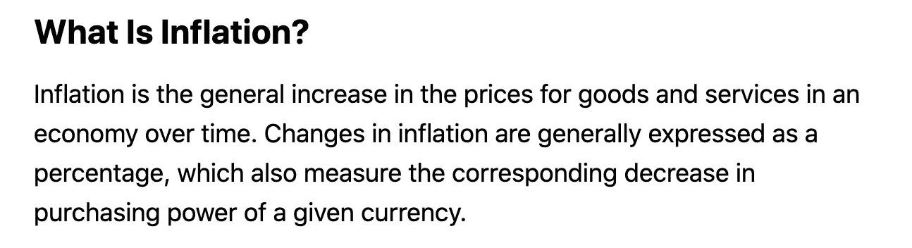
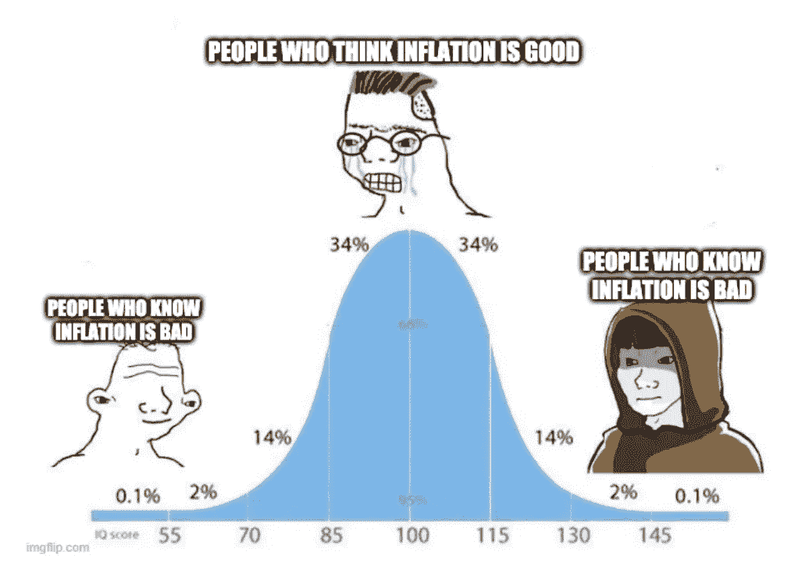

# 论通货膨胀

> 原文：<https://medium.com/coinmonks/on-inflation-9adcb5bbf06d?source=collection_archive---------2----------------------->

## 理解货币供应的外行指南。

通货膨胀是金融媒体中每天都在使用的一个术语。这篇文章会改变你对这个词的认知。大多数关注金融新闻的人每天都会听到或看到这个术语，但讨论总是围绕着政府所谓的消费者价格通胀(CPI)展开。但是通货膨胀到底是什么，为什么会发生，会有什么后果？

下面是一个来自著名财经作者的截图，描述了术语通货膨胀的含义:

这是世界各地的经济学家和记者用来描述这一现象的标准解释，可能类似于你对什么是通货膨胀的想法。但是*为什么*价格在上涨？

“16 世纪，当美洲的金银资源被发现和开发后，大量的贵金属被运往欧洲。这种货币数量增加的结果是欧洲物价上涨的普遍趋势。同样，今天，当政府增加纸币数量时，结果是货币单位的购买力开始下降，因此价格上涨。这被称为*通货膨胀*— [路德维希·冯·米塞斯](https://mises.org/library/inflation)

通货膨胀不是物价上涨，是货币供应量增加！当一个经济体的商品总量不变，但货币量增加时，单位货币能购买的商品量减少。在没有任何金融背景的情况下，阅读这最后两句话，你可能会认为“这听起来不太好”，猜猜是什么？你完全正确。

This is you on the right after reading this article.

为什么我们不断听到一些通货膨胀是好的，但只是不太多，然后就变得不好了？政府总是将“健康的”通胀率作为目标。大声说五遍:

健康的通货膨胀率是不存在的。

金钱不是一种可以单独满足任何人类需求的有用物品。它只是一种交换手段。为了增加特定经济体的繁荣，人们需要增加可用商品和服务的数量。增加一个经济体的货币量并不会神奇地创造出更多的商品供人们消费。如果有可能通过增加货币供应来创造财富和繁荣，并且银行和政府有能力随心所欲地创造更多的货币，为什么这个世界上仍然存在贫困？因为关键在于:无论你的大学经济学讲师或当地财经记者怎么告诉你，增加货币供应是不可能创造财富的。通过货币扩张创造财富的谬论已经被许多学者在过去的时间里从逻辑上证明是错误的，并且已经在过去的世纪里被实践证明是错误的。

## 好的，那么如果通货膨胀没有让我们的社会变得更好，为什么它会存在，它是如何产生的？

我将保持这个很短，详细解释什么是钱，[这本免费的书很棒。](https://mises.org/library/theory-money-and-credit)

在过去的 2000 年里，直到 1900 年左右，黄金是世界上使用最广泛的货币。要解释为什么，请看这个[视频](https://www.youtube.com/watch?v=bgPDW0ZpgJU)或者这个[书](https://saifedean.com/thebitcoinstandard/)。黄金唯一的弱点是/曾经是它的可分割性(很难把一枚金币做得小到足以买一个面包)，以及跨空间的可销售性(把黄金四处转移并支付给不在你身边的人，比如在不同的城市或国家，既困难又昂贵)。解决方案是:银行。银行拿走你的黄金(并把它存在 T4 储备银行)并给你一张收据或一张票据，当你出示收据时，这是一个偿还你黄金的承诺。这解决了前面提到的两个问题。银行可以对收据或票据进行任何金额的命名，无论金额大小，你可以将你的黄金存入一个城市的银行，并要求他们支付给另一个城市或国家的某人。耶！但是谁来阻止银行发行超过其黄金储备的收据呢？政府对吗？肯定应该有法律来阻止他们这样做，对不对？不对。

银行被允许创造比他们持有的存款数量更多的收据，从而凭空创造货币。实际上，这和用印钞机印现金是完全一样的。让我解释一下。

巴尼在歌利亚国家银行(GNB)存放了价值 10，0 00 美元的黄金，GNB 给了他价值 10，0 00 美元的崭新的钞票，可以根据要求兑换成黄金。这被称为 100%储备银行(银行持有 100%的储备发行的纸币)。如果所有现存的 GNB 纸币都被拿回来兑换成黄金，银行将有足够的黄金来支付。
现阶段存在的货币总量:10 000 美元。

现在泰德想买辆新车，他向 GNB 申请 5000 美元的贷款。GNB 印了更多价值 5000 美元的钞票，借给泰德，泰德从经销商处买了辆车。(他们印钞票的方式和印巴尼钞票的方式一样，但泰德没有给他们金子，而是给了 GNB 一个承诺，要他把钞票还给他们，外加利息)。现阶段存在的货币总量:15 000 美元。(巴尼仍然有他的 10 000 美元，经销商有 5000 美元，GNB 的金库里仍然只有价值 10 000 美元的黄金。)

因此，GNB 凭空制造了 50%的通货膨胀。

流通中的 GNB 纸币总值:15 000 美元。GNB 储备的黄金总量为 10 000 美元。

10 000 / 15 000 = 10/15

GNB 储备的货币供应量占总货币供应量的比例为 10/15 或 0.666%，这被称为部分储备银行。(目前的部分准备金率范围为 0.03%至 0.1%)

但是，当汽车经销商和巴尼都拿着他们的钞票回到银行，声称总共价值 15 000 美元的黄金，而我们都知道 GNB 的金库里只有价值 10 000 美元的黄金时，会发生什么呢？这就是所谓的“银行挤兑”，在世界历史上已经发生了数千次，这就是为什么各国“需要”像美国美联储这样的储备银行。“最后贷款人”，美联储和储备银行可以贷款给像 GNB 这样因为无力履行义务而即将破产的银行。是的，政府没有取缔或禁止这种做法，而是选择火上浇油，实际上是告诉银行:“想印多少就印多少，放贷出去，发疯吧。当麻烦不可避免地降临到粉丝头上时，我们会把你保释出来，不承担任何后果。”政府这样做是因为他们自己是最大的贷款人。在第 2 部分中会有更多的介绍。

## 这对社会的影响是如此广泛，以至于人们甚至无法理解，但让我列举几个较大的影响。

不平等。
政府决定谁获得银行牌照，银行决定谁获得贷款。继续上面的例子，当 GNB 借钱给特德时，特德拥有这笔钱，但还没有花掉。在那个阶段，50%的通货膨胀还没有完全发生。只有当“新”货币进入经济流通时，它才会被用来抬高商品价格。这样，特德就可以在通货膨胀导致的价格上涨发生之前的*价格水平上花费这 5000 美元。实际上，一般价格水平可能需要几个月或几年的时间才能相应上涨，但它会上涨。*

假设泰德买了车，经销商付钱给汽车制造商，汽车制造商反过来付钱给钢铁厂，他们付钱给雇用史蒂夫的铁矿。随着新注入的资金在经济中扩散，价格开始上涨。史蒂夫在矿上努力工作，现在也想买辆车，但由于银行贷款给特德，汽车市场被人为地膨胀了，他现在不得不支付 7500 美元买一辆新车，而去年特德只支付了 5000 美元。

经济中的新增资金并没有平等地惠及所有人。你离印钞机越近(你越容易获得融资)，你就越富有。这是因为，在资产人为增值之前，你可以用假钱购买真实资产，从而让你变得更富，让所有无法获得融资的人变得更穷。银行创造并贷给客户和合作伙伴的部分准备金越多，他们就越富有，而牺牲了其他人的利益。这形成了一个自我实现的循环，富人越来越富，穷人越来越穷。然而，问题在于:如果没有资产作为贷款担保，你就无法获得融资，而且你也无法获得资产，因为价格已经如此膨胀，没有融资是不可能的。这被称为坎蒂隆效应，由理查德·坎蒂隆在 1730 年首次描述。这也是西方世界 40 岁以下的人没有能力拥有房产的原因。

迫使人们承担不必要的金融风险。
当一个人努力工作了一个月并收到一份薪水时，如果她愿意，她应该能够把她的劳动成果存起来以备将来使用。没有人会同意在资金进入你的银行账户时就花掉你的工资是个好主意。因为我们储蓄的购买力每年复合下降+-5%,人们不顾一切地只想找到一个可以储存财富的地方。这不正常。在过去 2 000 年中的 1 900 年里，大多数人可以选择仅仅通过持有支付他们的货币来储存财富。今天，我们*被迫*将储蓄投资于风险工具，否则我们的财富将面临大幅贬值。几乎不可能理解这种现象对你的生活和社会的影响。在硬通货体系中永远得不到融资的高风险投资消耗了大量本可以被勤俭使用或节省下来的资本，多年前就应该被置之不理的仿古僵尸公司继续得到廉价宽松货币的支持。人们把他们的收入花在他们根本不需要或使用的不必要的东西上。人们经常因为骗子或其他邪恶的行为者而失去他们的存款，因为他们被迫将他们的存款投资到某个地方。这都是因为持有现金就像拿着一个烫手山芋。

这是我写的关于通货膨胀的系列文章的第一部分。[第二部分](/coinmonks/on-inflation-part-2-cpi-ff48d36643cc)将讨论 CPI，它是什么，不是什么。请在[推特](https://twitter.com/Handrev)或媒体上关注我，以便在新内容发布时得到通知。