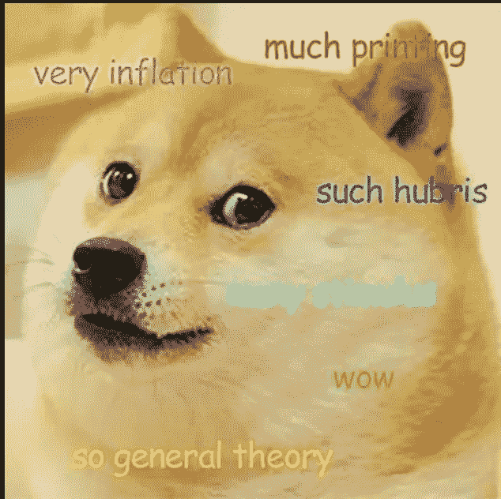
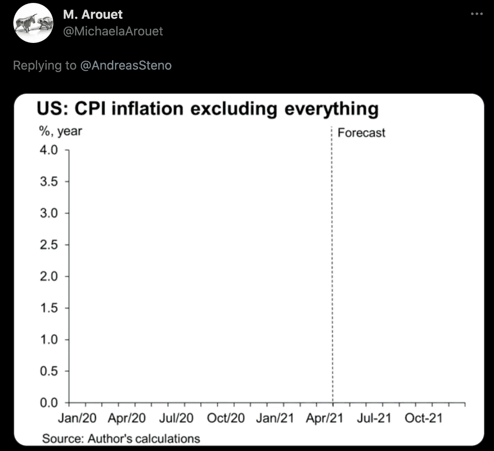
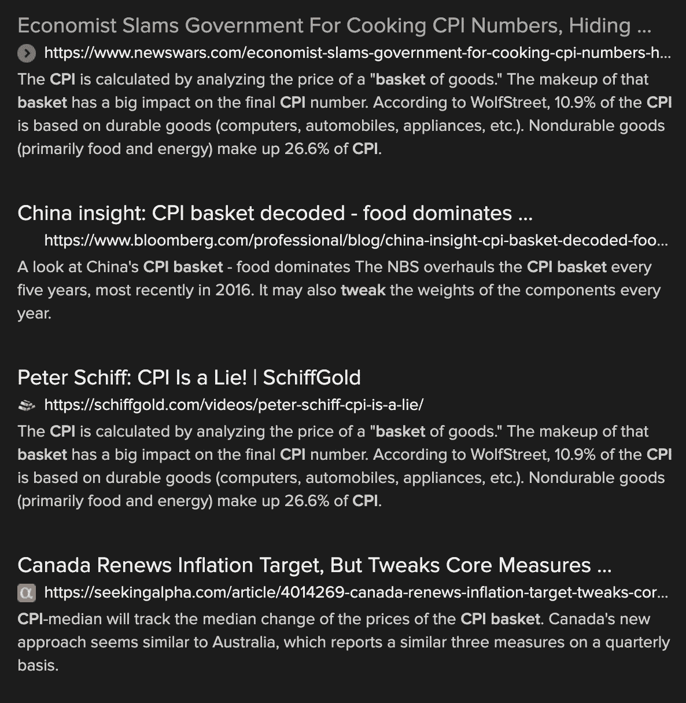

# 通货膨胀:第二部分(消费物价指数)

> 原文：<https://medium.com/coinmonks/on-inflation-part-2-cpi-ff48d36643cc?source=collection_archive---------6----------------------->

## 理解货币供应的外行指南

这是关于通货膨胀的多部分系列的第二部分，恰当地命名为“论通货膨胀”。我的目标是让这个系列的每一部分都足够短，能看 5-8 分钟。这只是为了让读者更容易理解。如果您还没有阅读第 1 部分，您可以在这里阅读。建议先阅读第 1 部分，但这不是必须的。

在第一部分中，我们提到了消费者价格指数(CPI)。本文将对此进行更详细的讨论。

就 99%的经济学家和记者而言，CPI 是通胀的终极目标。无论 CPI 报告什么，那就是通货膨胀率，它总是要么“过高”，要么“在范围内”，要么“过低”。所有这些都是无关紧要的废话，没有一点现实世界中通货膨胀的适用性。让我解释一下:

消费者价格指数追踪由政府决定的商品的 T2 组合。随着时间的推移，这些商品的价格被比较，价格的差异被报告为 CPI 通货膨胀率。到目前为止，一切顺利。

不要！问题出在上述解释的第一句话。是的，你猜对了，“由政府决定”的部分。

政府可以也确实“调整”了 CPI 篮子中的商品。这几乎总是为了让通货膨胀看起来比实际要低。他们主要通过三种方式做到这一点。

1.从 CPI 篮子中剔除通胀“过高”的商品，或者增加非通胀商品。(此处无需过多解释)

2.用劣质品代替商品。
这就是有趣的地方。为了应对消费者的价格抵制，生产商收缩包装，以减少以同样价格出售的产品，或者用质量较低的原料替代，或者要求消费者自己组装产品。这些劣质产品随后被用于消费物价指数的计算过程。
你有生之年有没有发现，一罐可口可乐或者百事可乐原来是 330ml。现在一罐可乐是 200ml(这个大概各国不一样)。跟踪“一罐汽水”的 CPI 衡量标准对这两者没有区别。他们现在只使用 200 毫升的罐子。还可以举出许多其他的例子，比如用 1 磅肉糜代替 1 磅里脊肉牛排，或者用人造黄油代替黄油。

3.改变特定商品在 CPI 篮子中的“权重”。当一件商品的价格大幅上涨时，他们只是降低它在 CPI 等式中的权重。这句话引自美国劳工统计局网站:

记录的价格变化根据物品在相应人群消费模式中的重要性进行加权。精心选择的地理区域、零售机构、商品和服务以及相关权重的组合，给出了在所有地区所有商店中所有商品的价格变化的加权衡量。

用外行人的话来说，这意味着:“我们按照自己喜欢的方式决定每个项目的权重。”

考虑到这一切，很明显 CPI 被操纵成政府想要的样子。如果政府愿意，他们可以让 CPI 看起来像这样:

这不是我个人的看法。我只是在解释这一切是如何运作的。我上面提到的没有任何人质疑。如果你不相信我，只需在谷歌上搜索“CPI 篮子调整”，或者看看你可以在这里看到什么:

Dear god I agree with Peter Schiff 😱

概括并结束这一部分:CPI 没有任何意义，也不是衡量任何事情的标准。(如果你正在寻找一篇好的 twitter 帖子，请随意使用这句话)

可以有把握地假设，无论编造的 CPI 数字是多少，实际通胀率都远高于这个数字。但是，还有比这更糟糕的。

这同样来自 [USBLS](https://www.bls.gov/cpi/questions-and-answers.htm#Question_10) 网站:

*“CPI 也不包括投资项目，如股票、债券、房地产和人寿保险，因为这些项目涉及储蓄，而不是日常消费支出。”*

“B *因为这些项目与储蓄相关*不是在通货膨胀计算中排除资产的有效理由。

房子和“其他投资项目”是我打算购买的东西。事实上，几年后它的价格会上涨，这和其他价格上涨一样影响着我的生活。让我们来看看资产被排除在 CPI 之外的真正原因。

货币供应量的增加对所有商品的价格产生不同的影响。这种差异主要是由于稀缺而产生的。当像面包这样的东西价格上涨时(双关语)，供应商和生产商很容易分配更多的资源来生产更多的面包。从短期来看，更多的谷物和面粉可以从其他用途中分配出来用于生产面包，从中期来看，更多的农业用地可以用于种植谷物。这将增加面包的供应，从而抑制价格。任何可以容易且廉价复制的商品都较少受到货币扩张导致的价格上涨的影响。

随着对这种商品需求的增加，不容易复制的东西价格会迅速上涨。黄金房地产就是一个很好的例子。在你当地受欢迎的度假小镇，海滨房产的数量不能随意增加。因此，随着这些优质房产价格的上涨，供应量保持不变。因为供给的增加不可能抑制价格，这些价格上涨的速度比廉价的可再生商品要高。重要的是要记住，供应不足可能是由许多因素造成的，包括政府的限制或法规。

随函附上一份稀缺商品清单。在过去的 20 年里，你自己决定获得这些东西的价格是高于还是低于消费物价指数:
黄金房地产，大学学位，医疗保健，蓝筹股，高端艺术品。法官大人，我的案子到此为止。

总结一下:政府在计算通货膨胀时，公然排除了几乎所有价格上涨的因素，然后操纵他们选择包含的任何因素的比率和质量。可以有把握地假设，实际通胀率远高于政府试图用虚假的 CPI 数据欺骗你的通胀率。

这是我写的关于通货膨胀的系列文章的第二部分。请通过媒体或[推特](https://twitter.com/Handrev)关注我，当第三部分发布时会通知我。

## 也阅读

 [## 2021 年 17 款最佳加密交易机器人(免费和付费)

### 2021 年币安、比特币基地、库币和其他密码交易所的最佳密码交易机器人。四进制，位间隙…

medium.com](/coinmonks/crypto-trading-bot-c2ffce8acb2a)