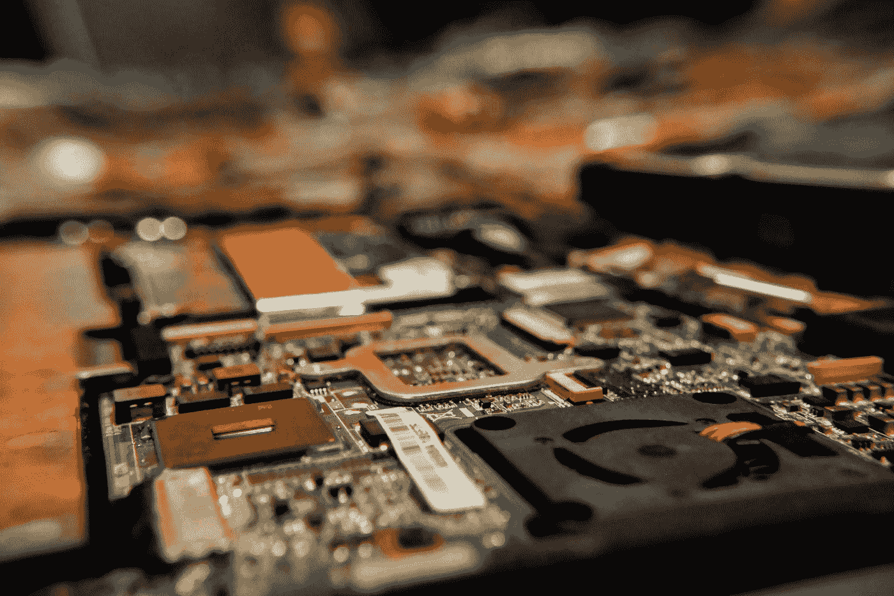

# 论抽象的层次

> 原文：<https://medium.com/coinmonks/on-layers-of-abstraction-bed08336a309?source=collection_archive---------1----------------------->

> 从头开始思考事情…

Photo by [Malachi Brooks](https://unsplash.com/@mebrooks01?utm_source=medium&utm_medium=referral) on [Unsplash](https://unsplash.com?utm_source=medium&utm_medium=referral)

我们生活在一个这么多事情同时发生的世界里，很容易就能轻松理解概念和想法。把事情做好甚至更容易，一个人不必从零开始建造东西。就像软件工程中的库、框架和 API 一样，您不必编写二进制或十六进制代码来构建应用程序。这种抽象层的层次结构允许我们在不知道后台发生了什么的情况下完成事情。这是有充分理由的，没有人想用汇编语言来构建软件。😂

在大多数情况下，这些抽象层足够强大，它们是开发的良好基础，允许我们快速构建和扩展事物。如果每个人每次都得从头开始，那就惨了，我们也不会有那么大的进步。你还必须担心平台独立性(例如，让你的应用程序在任何机器上运行)和互操作性(确保你的软件可以与其他软件正确集成)。

H 然而，在某些情况下，要想在工作和生活中真正有效，了解幕后发生的事情是很重要的。基本面的工作知识可以挽救你的职业生涯(我敢说**挽救你的生命**)。对基础知识的无知通常会导致问题发生时看不到眼前的东西。

# 为什么要为基础费心呢？

这个世界竞争激烈，但事情很容易被接受。但是，如果你仔细想想，形成基础的许多概念和想法都是基于当时的经验，它们可能是有缺陷的，可能需要更新。

*   例如，艾萨克·牛顿描述的运动定律对我们非常有效，直到我们开始观察接近光速的运动。我们需要一个更精确的宇宙描述，这正是狭义相对论(根据爱因斯坦)帮助我们的。如果你用牛顿物理学建立一个系统，它在某些情况下会失败(例如，在光速附近)。

> 要想真正伟大，我们必须善于观察，不断更新我们的知识和信念，了解我们认为是根本的东西。我们必须测试我们的假设，让他们面对新的问题。
> 越理解，宇宙越美好。

*还不相信自己需要了解基础？为了向你展示理解大多数事物的基本概念是多么重要，我将分享三个例子，说明抽象层在我们的生活中扮演着重要的角色。*

## 示例 1 —计算机与宇宙射线

所以你已经建立了一个应用程序，它是一个你使用 Spring Boot 用 Java 编写的微服务。它在你放在家里办公室的服务器上运行良好。你的应用为银行处理交易(不要在家里尝试)。

有一天，发生了一场流星雨，您意识到您的应用程序运行不正常，您正在经历许多逻辑错误，并且您的客户不满意。以下是你寻找根本原因的方法:

*   您仔细查看了代码，没有发现任何错误。
*   你检查 Spring Boot 的执行逻辑，没有错误。
*   您检查您的应用程序二进制文件，什么也没有发现。
*   你继续检查操作系统，硬件，什么也没发现。
*   然后，使用调试器更深入地观察应用程序在工作内存中的执行情况，并观察到有一位从 0 变为 1。

这是怎么发生的？会出什么问题呢？为了解释这一点，让我们通过抽象层次来描述你的应用程序是如何产生的。

> **你的 APP** → Spring → Java/JDK →操作系统→ CPU 等硬件→逻辑门→晶体管→粒子和电荷。

这只是不同级别的重点，这里跳过了许多中间级别，例如网络和数据库层。您可以想象，层次结构的每一层本身都是更进一步抽象的内部层的层次结构。

可能有这样的情况，一个宇宙粒子击中了你的机器，并设法将寄存器中的一位从 0 翻转到 1，这对计算产生了负面影响。🤯
在大型且对时间敏感的应用中，失败是不可容忍的，这可能是一个非常灾难性的事件。

信不信由你，以前也发生过非常类似的事故，影响了一次选举的结果。看看这个真实的例子:

如果你想知道为什么云提供商花费大量资金来保护他们的数据中心免受电磁信号的影响，这是一个主要原因。这是一个罕见的事件，但它的后果可能是灾难性的，发生的频率比你想象的要高。你有过无缘无故重启笔记本电脑的经历吗？👀 👀

## 示例 2 —组织

如果你可以选择一个地方工作，大多数人会选择在 FAANG 工作。这是因为随着时间的推移，这些组织已经为自己创造了成功。因此，他们很有吸引力，通常被认为是所在行业的权威。他们的商业实践和解决问题的方法被视为解决行业内问题的**框架**。

作为一个初创公司的创始人，尝试复制这些业务流程和解决问题的方法是非常诱人的。尽管你很想复制他们的成功，但你也应该想想，在我们这个时代，在你所处的气候 下，究竟是什么让一家公司取得了成功。仅仅使用(复制和粘贴)对他们有效的系统和实践对你的组织来说可能是非常危险的。

导致这些公司成功的事件和环境与你现在所处的不一样，事情已经改变了，并且在不断地改变。仔细分析和研究你公司的环境和情况可能会改变你的想法。

适用于谷歌的不一定适用于你。🥺

## 示例 3 —生物生命

如果你思考生物生命是如何产生的，你可能会认为下面的**非常** **粗略** **描述**:

*   基本粒子存在。
*   它们被像玻色子一样的结合粒子结合在一起。
*   原子结合形成分子和其他化合物。
*   分子形成了细胞。
*   正如我们今天所知，细胞形成了构成生物生命的器官和系统。

这是一个非常粗略和不准确的描述，许多人会不同意，但它有助于思考复杂的结构如何从非常简单的基本事物中出现，比如细胞自动机。😀

如你所见，基础知识对于帮助我们重新思考许多我们认为已经知道的事情非常重要。它帮助我们验证/否定我们做出的许多假设，从而帮助我们消除事物的歧义。它还帮助我们处理当前可用层无法处理的边缘情况。

# 了解基础

希望你现在确信你需要理解基本面。但是一个人如何去理解基本原理呢？简单回答，学习！！！

**简单吗？是
容易吗？没有
但是这重要吗？是**

如果你对学习基础知识感兴趣，那么考虑以下几点:

*   数学是宇宙的语言，通过它我们能够概念化我们的世界。我一直认为，如果我们遇到任何外星人，数学将是与他们交流的最佳方式。数学的实用知识可以大大帮助我们理解我们用来描述世界的物理学。它是许多课题的基础，从物理到计算机科学，从机器学习到工程学。
    **所以学习数学。**
*   物理学帮助我们描述我们生活的世界。没有物理学，我们就无法理解我们的世界是如何运作的。物理学是科学和工程中许多创新形式的基础。我们使用的许多奇妙的小玩意都是由物理学家们想出的美丽点子创造出来的。
    **所以研究物理。**
*   **哲学:**下面是哲学的字典定义:

> 哲学是对知识、现实和存在的基本性质的研究，尤其是当被认为是一门学术学科时。

哲学提出(并回答)的问题本质上是存在主义的，它们迫使我们思考我们在宇宙中的角色，我们为什么在这里，等等。有些人可能会说，哲学甚至比数学和物理更重要。哲学在几个领域都有用，从科学到社会科学和艺术。 **所以学习哲学**

# 速度与质量

考虑以下两种解决问题的方法:

**速度**:这包括跳过基础，使用现成的基础工具来解决问题或制造产品。在这里，你可以毫不费力地快速解决问题。

**质量**:在这个场景中，你正在研究基础，重新思考基础，并且已经“建立”(注意到引号)了构成基础的概念和想法。你能够生产更强、更快、更可扩展的产品。

现在考虑两个团队，姑且称之为**团队速度**和**团队质量**。两个团队都在竞争交付一种产品。你认为他们的结果会是什么？您可能认为团队速度会交付得更快，但是质量会降低，而团队质量会交付得更慢，但是质量会好得多。

> 有人可能认为这些(速度和质量)是解决问题的两种相反的方式，但这与事实相去甚远。

现在考虑第三个团队，我们称他们为**团队质量🤪他们有一个聪明的方法来实现 T21 速度和质量。因此，他们能够按时交付高质量的结果。**

与流行的观点相反，速度和质量并不是解决问题的对立方法，事实上它们可以互补。但是我们改天再谈这个吧…

感谢您阅读至此。如果你喜欢你刚刚读到的，请鼓掌。👏🏽
你也可以在推特上关注:[@ iatemibabs](https://twitter.com/iamtemibabs)

> 加入 Coinmonks [电报频道](https://t.me/coincodecap)和 [Youtube 频道](https://www.youtube.com/c/coinmonks/videos)了解加密交易和投资

# 另外，阅读

*   [CBET 点评](https://coincodecap.com/cbet-casino-review) | [库币 vs 比特币基地](https://coincodecap.com/kucoin-vs-coinbase)
*   [折叠 App 审核](https://coincodecap.com/fold-app-review) | [Kucoin 交易机器人](/coinmonks/kucoin-trading-bot-automate-your-trades-8cf0ca2138e0) | [Probit 审核](https://coincodecap.com/probit-review)
*   [如何匿名购买比特币](https://coincodecap.com/buy-bitcoin-anonymously) | [比特币现金钱包](https://coincodecap.com/bitcoin-cash-wallets)
*   [币安 vs FTX](https://coincodecap.com/binance-vs-ftx) | [最佳(索尔)索拉纳钱包](https://coincodecap.com/solana-wallets)
*   [比诺莫评论](https://coincodecap.com/binomo-review) | [斯多葛派 vs 3Commas vs TradeSanta](https://coincodecap.com/stoic-vs-3commas-vs-tradesanta)