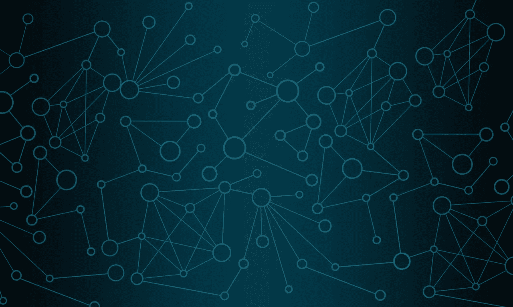
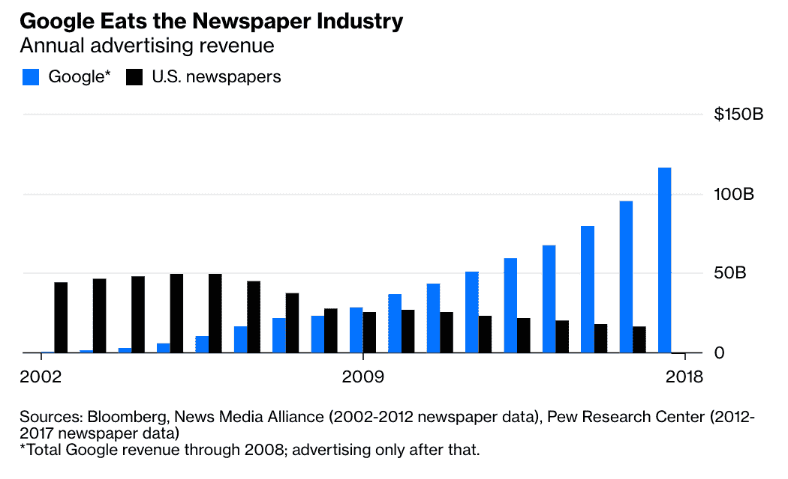

# 论激励与信息管理

> 原文：<https://medium.com/coinmonks/on-the-incentive-structure-of-information-curation-171a2ddd45d3?source=collection_archive---------0----------------------->

## 从报纸到秘密经济网络

Source: [Pixabay](https://pixabay.com/)

## TL；速度三角形定位法(dead reckoning)

我们消费的信息决定了我们个人和集体的决策。以市场为基础的资本主义经济能够有效地分配资源，但其代价往往是市场激励和社会价值观的错位。在我们的信息饮食中有这方面的明显例子。我们能否设计一个系统，利用现有系统的优势，同时提供信息监管，其新兴的集体行为符合我们的社会价值观？

我们开始吧。

> "对自然的热爱不会让工厂忙个不停。"
> 阿尔多斯·赫胥黎

在反乌托邦小说《美丽新世界》中，大众被三个精心制作的口号所操纵是有原因的:“战争就是和平。自由就是奴役。无知就是力量”。**就像饮食会影响我们的外表一样，我们的信息饮食也会影响我们的思维和行为。**虽然施加痛苦是控制人的一种方式，但施加快乐或者更广泛地说，针对我们最原始的冲动也是如此。

信息管理员，作为真理的仲裁者，决定了我们被给予的信息。如果我们理性地、可预测地行事，就像我们在经济理论中经常被模仿的那样，这就不会是一个问题。我们所有人都会汇聚到对我们最有利的信息上，不管是什么信息。但是人的因素在有限理性中发挥了作用，随之而来的是我们集体行为中涌现出来的、通常令人惊讶的性质。我们消费的信息可能会分裂我们，而不是团结我们。这可能会让我们有更多的理由焦虑，而不是让我们对目前的生活状态充满感激。

在这篇文章中，我将重点关注这些强大的角色在过去几十年中如何因技术的发展而发生变化。据此，我将展示旧媒体(报纸业务)和新媒体(技术业务)的机制，以及市场激励如何影响这些参与者对信息的管理。

> "我们有旧石器时代的情感、中世纪的制度和神圣的技术."
> 
> 艾德华·奥斯伯·威尔森

过去 30 年技术进步的副产品之一是复制信息的成本几乎为零。虽然这意味着访问大量的信息，但也意味着随着时间的推移，对这些大量产生的信息的管理变得越来越重要。这是从稀缺范式到丰富范式的转变，我们在进化上并不适应。

在过去，报纸是信息管理的主要来源，并以物理形式传播信息。这里有一个清晰的商业机制:策划和发布信息，在报纸制作成本的基础上收取加价，并用报纸广告产生的收入作为补充。虽然报纸业务经历了从 20 世纪 50 年代到 90 年代的增长，但增长迅速下降。进入万维网。由此，谷歌、脸书和其他科技公司激增，并从广告和信息分发/监管业务中分一杯羹。这些“其他公司”只占市场份额的很小一部分，因为谷歌和脸书占了全球广告收入的 80%以上，形成了事实上的双头垄断。

[Source](https://www.bloomberg.com/opinion/articles/2019-02-12/google-keeps-eating-the-newspaper-industry)

报纸行业被迫适应不断变化的形势，同时以某种方式保持相关性。他们开始更加关注他们的在线形象，因为很明显，这是消费者的注意力(和金钱)所在。我们不再通过边吃早餐边看报纸来获取信息。现在，我们经常只是浏览我们的社交媒体，阅读有趣的东西，但不一定是有益的。这不是一个道德主义的立场，因为每种类型的内容都有一个目的，无论是 9GAG 上的模因还是《经济学人》的文章。

在过去，传统的大众媒体依赖其品牌认知度、消费者忠诚度和进入壁垒作为高利润的主要杠杆(这是缺乏[需求弹性](https://en.wikipedia.org/wiki/Price_elasticity_of_demand)所带来的经验定价能力的结果)。这随着 Web 2.0 而改变，尤其是随着社交平台的激增。它变得更多的是娱乐和优化转化率，而不是真正提供他们认为对读者有用的信息。一切都变得可以直接衡量了(远离了喷雾和祈祷广告),浏览量越多，收入越高。

随着激励结构的这种转变，旧的信息共享业务需要采取行动以保持盈利。即使是最有声望的报纸也不得不适应针对多巴胺反应的信息。

激励结构改变的一阶效应，以及随之而来的商业策略是短期收入的可能性。作为市场压力的副产品，二阶效应正在逐渐削弱人们对报业的信任。这样一来，结果将是长期收入下降。这是公地悲剧的一个明显例子(在追求个体代理人自身利益的过程中，整个生态系统受到损害)。纳西姆·塔勒布的话说得很清楚:“生存第一，真理、理解、科学第二。”报纸业务也不例外，当生存和高质量的内容变得相互排斥时，很明显哪一个将被优先考虑。

谁是在市场上获得竞争优势的信息管理者？当然是针对我们最原始的冲动。一个明显的例子是点击诱饵标题产生高流量，这转化为收入。这是商业模式依赖于广告的激励结构的自然结果。

此外，这些平台正通过[网络效应](https://en.wikipedia.org/wiki/Network_effect)获得越来越多的力量，那里经常有[赢家通吃](https://en.wikipedia.org/wiki/Winner-take-all_market)的动态。(集中式)企业使用的信息监管方法是设计算法，针对与未来企业收入产生一致的用户参与度的最佳[代理指标](https://en.wikipedia.org/wiki/Proxy_(statistics))进行优化。**用户参与产生用户价值，用户价值产生收入**。

除此之外，旧媒体经常是审查和控制的工具。虽然随着时间的推移，这种情况越来越少，但仍然有一些参与者有能力这样做。不仅如此，开放的信息给我们带来了不同的挑战，如更多的意识形态[两极分化](https://www.businessinsider.com/us-politics-polarization-data-2016-2016-6?international=true&r=US&IR=T)、[过滤泡沫](https://en.wikipedia.org/wiki/Filter_bubble)、[假新闻](https://en.wikipedia.org/wiki/Fake_news)以及其他问题，随着时间的推移，我们将不得不学会管理这些问题。

关于信息监管的问题本质上更多的是哲学问题，而不是技术问题。一个平台在多大程度上优先考虑言论自由，而不是保护用户免受仇恨言论的侵害？这些可以互斥吗？这些问题没有快速简单的答案。最后，实际上谁控制新平台并不重要，重要的是信息监管是由专门从事建立未来现金流最大化的技术业务的人来做的，而不是为了公众的利益而做的。这个任务可能太大了，任何人都无法承担，无论是个人还是组织。人们很容易陷入下意识反应的陷阱，只是审查任何冒犯足够多的人的东西。这是一个滑向**群体思维的制度趋同的滑坡，没有任何偏离公认思维方式的能力**。从言论自由到思想安全的转变。

话虽如此，但并非一切都像听起来那么悲观。技术很少具有双重性，要么对社会只有正面影响，要么只有负面影响。Web 2.0 的一个明显好处是，今天每个人都可以广播自己的信息。这显然很重要，因为进入信息行业的障碍已经减少。

Medium 和 YouTube 是很大程度上未经许可的媒体平台的例子。很大程度上是因为它们仍然由管理与其业务模型相一致的信息的集中化组织所拥有。

过去几年出现的另一个现象是 Instagram 和 YouTube 等平台上的影响者信息监管模式。它们让不同的品牌能够通过利用影响者与特定的客户群对话来获得客户的信任。对影响者营销的信任是建立声誉的结果，也是影响者的核心区别。这是在游戏中对责任和[皮肤的有效利用。如果影响者没有为客户进行有效的过滤，他们就会失去作为可靠的信息监管来源的声誉。](https://en.wikipedia.org/wiki/Skin_in_the_game_(phrase))

乔·罗根、山姆·哈里斯、乔丹·皮特森和许多其他人利用 Web 2.0 来扩大他们的受众。他们还开始回复到以前不可能的长格式信息。从历史上看，知识分子向公众展示自己想法的时间极其有限，这是旧信息媒体空间不足的副产品。现在情况不再是这样了。不管某个领域有多小众，通常总有一部分人会看重内容([长尾](https://en.wikipedia.org/wiki/Long_tail))。通过近乎零的复制边际成本，媒体成为了财富的杠杆，甚至比过去更是如此。这样做的代价是需要承担责任。

那么分布长形式信息的可能性的二阶效应是什么呢？传统媒体失去了它的力量。在过去，信息更有可能被传统媒体歪曲或断章取义，然而，现在权力掌握在人们手中，他们可以表达自己的想法。观众可以自己决定他们相信什么。这就是新媒体的力量。

随着时间的推移，信息监管过程的变化方式显然有利有弊。我们能否在解决负面后果的同时进一步改善这一点？我在[以前的一篇关于秘密经济网络的文章](/hackernoon/crypto-economic-networks-as-technological-enablers-of-scalable-tribe-like-collaboration-6ab197d60337)中提到过**市场激励经常与社会价值观**不一致。这表现在当今存在的信息监管效果的例子中。有了秘密经济网络，我们可以将这些联系在一起。这就提出了一个问题:作为一个社会，我们能在没有任何中央权威机构为我们管理的情况下管理信息吗？相反，我们能激励人们自己管理信息吗？有了这些，我们能从自上而下转向自下而上的信息监管系统吗？

这正日益成为现实。[加密经济原语](https://blog.coinbase.com/the-emergence-of-cryptoeconomic-primitives-14ef3300cc10)是用于设计这些网络的组件之一，并作为网络激励结构的构建模块。[监管市场](/@simondlr/introducing-curation-markets-trade-popularity-of-memes-information-with-code-70bf6fed9881)是在实践中实施的这些[的一个例子](https://blog.oceanprotocol.com/curated-proofs-markets-a-walk-through-of-oceans-core-token-mechanics-3d50851a8005)，并且被用来表示某项资产可能有多相关。也就是说，管理一个秘密经济网络意味着管理一个人机交互系统，这个系统从定义上来说是复杂的。这样，在实践中实施和“在野外”测试的越多，我们得到的反馈就越多，这些反馈可以用来设计和管理具有理想属性的网络(通过[令牌工程](http://tokenengineering.net/))。这些都有可能以符合我们社会价值观的方式改变我们相互交往的方式。

> [直接在您的收件箱中获得最佳软件交易](https://coincodecap.com/?utm_source=coinmonks)

