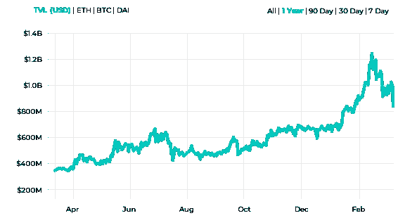
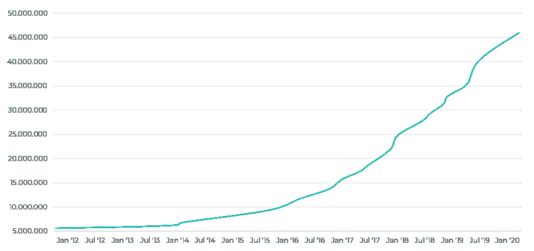
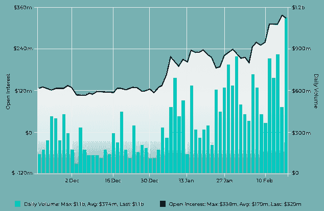
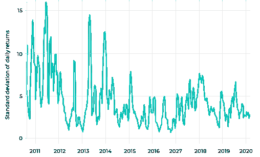

# 分散财务中的采用状态

> 原文：<https://medium.com/coinmonks/on-the-state-of-adoption-in-decentralised-finance-4a46a69a1fbd?source=collection_archive---------1----------------------->

在去中心化的点对点网络上提供金融解决方案的科技企业的崛起引起了媒体的广泛关注。去中心化金融(DeFi)是一个新生事物吗？市场趋势是什么？

由 Michael Guzik， [area2Invest](https://www.area2invest.com/) 的首席执行官 Max J. Heinzle 和 [Instimatch Global](https://www.instimatch.ch/) 的创始人 Hugh MacMillen 撰写

## **执行摘要**

DeFi 正在出现，第一批增长数据将聚光灯对准了一个新的金融市场体系。截至 2020 年 2 月，用户在 [DeFi 应用](https://coincodecap.com)中锁定的价值短暂超过 10 亿美元，而截至 2020 年 3 月中旬，该价值暂时降至约 6.5 亿美元。从 2017 年到 2020 年，全球在 DeFi 应用和协议方面的累计投资已超过 2.9 亿美元。然而，目前的 DeFi 用户增长率令人失望。

令人惊讶的是，主要的 DeFi 应用程序是跨基础设施、市场和协议开发的，用户基础有限。采用的主要障碍是加密货币的高波动性(缺乏受监管的[稳定货币](https://blog.coincodecap.com/tag/stable-coins/))、不稳定的市场基础设施、共识机制的证明、用户体验不足以及缺乏监管确定性。

展望未来，传统金融和分散金融这两股市场力量正在融合，并将带来更大的监管清晰度和市场弹性。一旦围绕稳定债券的概念继续成熟，波动性将会降低，从而促进市场对专业和机构买方和卖方的采用。

监管变化助长了破坏；区块链被英国金融行为监管局接纳为监管沙箱内的独立第三方。因此，持牌金融中介机构(例如中央证券存管机构)在区块链轮流扮演的角色正成为一个更重要的问号。

## **简介**

在无限制量化宽松和来自所谓金融科技公司的竞争日益激烈的时代，银行和中介机构正面临严峻压力。央行实施的负利率和严格的合规要求恶化了银行和金融中介的价值定位和成本结构。金融科技通过提供更快、更便宜的解决方案，或者仅仅因为它们提供了更好的用户体验，吃掉了现有银行的市场份额。在客户方面，除非投资者的风险敞口显著增加，否则在全球金融危机风险不断增加的情况下，寻找替代储蓄和投资选择以实现财富保值和增长将成为一项挑战。

如果传统储蓄账户的收益率看起来如此糟糕，难怪我们的 Y 一代会寻找替代解决方案。例如，瑞银为其“年轻人瑞士法郎瑞银储蓄账户”提供的利率仅为 0.25%。

其中，这些宏观和微观经济的发展正在引发关于另类金融市场体系和另类投资的辩论。特别是，[分散化的金融](https://blog.coincodecap.com/the-ultimate-guide-to-defi-decentralized-finance/)正在从我们集中的金融市场体系的灰烬中浮现。区块链作为新的可信任的第三方，提供不可改变的透明的交易历史，这种点对点网络的前景是无限的。

通常被称为一个新的开放金融生态系统，其中资产的控制权从银行转移到客户，利息和市场增长的急剧增加是显着的。应用涵盖市场、基础设施、赌注机制和稳定资本；开放金融生态系统正在各个层面蓬勃发展。

就在 2020 年 2 月，分散融资锁定的总价值超过 10 亿美元，其中 MakerDAO、Compound 和 EOSREX 等贷款平台占 ca。总市值的 80%。这个数字表明，用户对替代金融解决方案有着不可否认的兴趣。如果像 Compound 这样的借贷平台以平均 4-8%的诱人年借贷百分比收益率吸引用户，这就不足为奇了。

*Source: Defi Pulse: Total Value Locked (USD) In Defi*

虽然锁定的总价值代表了令人印象深刻的增长，但每月独立 DeFi 用户的总数仍然少得惊人。仅在 2019 年，全球每月独立 DeFi 用户的平均数量在 40，000 到 60，000 之间，并且没有增长率。

*Source: Binance Research*

相比之下，仅在 2019 年 5 月，非托管钱包提供商 Metamask(通常被用作 [DeFi 应用](https://coincodecap.com)的网关)就拥有超过 25 万名月活跃用户，同期估计交易量为 150 万笔。然而，如果我们深入研究 2017-2020 年期间的投资数量，在此期间，全球范围内对 DeFi 初创企业的累计投资已超过 2.9 亿美元。与极具吸引力的金融科技行业“银行即服务”的 3.36 亿美元累计融资相比，这标志着投资者的承诺令人印象深刻。

总之，与 2020 年 3 月中旬价值 1600 亿美元的所有加密货币的总市值相比，加密货币市场内分散化金融应用的绝对市场采用率看起来仍然适中。6 然而，相比之下，部署到 DeFi 的风险资本代表了投资者不可忽视的关注。为了更好地理解媒体对 DeFi 的广泛关注背后的原因，本文介绍了分散化金融市场的三个趋势，这将导致金融基础设施和金融解决方案的巨大变化。我们将深入探讨每个解决方案，并解释其潜在的破坏性。

## **DeFi I I:从银行账户到非保管钱包的转变**

*   加密货币钱包是未来 DeFi 应用的基础设施
*   由于成本和所有权的原因，非保管式[钱包](https://coincodecap.com/category/wallets)比保管式钱包更受密码市场青睐
*   第三方保管人确保资金的安全，因为非保管钱包目前不满足安全标准
*   一个新的金融市场正在形成，资产所有权正从银行转移到最终消费者手中

DeFi 中最被低估的基础设施革命之一是加密货币钱包，它允许存储和管理加密货币或任何形式的令牌化资产。大多数区块链和加密用户在阅读这一定义趋势时可能会翻白眼，因为钱包并不新鲜。然而，加密货币钱包对传统金融市场体系的冲击是前所未有的。互联网用户已经获得了开源工具，可以为比特币、以太、Stellar Lumen、EOS 或任何其他基于协议的令牌生成钱包，以自行管理他们的数字货币和数字资产。

如果我们认为钱包是未来的下一代银行账户，建立新的金融市场基础设施的梦想可能会实现。开源加密钱包中的稳定硬币和令牌化证券已经是范式转变的第一个迹象，在这种情况下，现金和证券等受到严格监管的金融资产可以由最终用户个人存储和管理在钱包中，而不是在银行账户中。

更进一步说，非监禁解决方案正得到广泛关注。简而言之，非托管钱包解决方案意味着没有第三方提供商监督用户的资金，并最终将资产的责任直接放在钱包所有者身上。非保管钱包在市场上的增长是显著的。八年来，仅 Blockchain.info 上的钱包就有超过 4600 万个，自 2019 年以来，平均每月增加 100 万个。

*Source: Blockchain.com, Blockchain Wallet Users 2012–2020*

然而，非保管钱包已经成为黑客难以置信的吸引目标。截至 2019 年 8 月，全球已有超过 40 亿美元的加密货币被盗。这个数字无疑是区块链基础设施不成熟的直接表现，因为钱包的安全性还没有达到大众市场的信任水平。因此，企业托管提供商的新行业已经出现，以增加第三方解决方案提供商对加密资产的安全保护级别。到 2020 年 2 月，已有 40 多家银行向德国金融监管机构 BaFin 申请托管许可证，以便代表客户进入保管加密货币和数字资产的市场。

然而，问题仍然是，从长远来看，收取资金保护费的第三方托管机构的价值是否会超过开源和免费钱包提供商的发展。例如，Metamask 钱包中的“死亡的人开关”概念允许用户创建一个智能合约钱包作为附加帐户，每当用户停止使用他们的原始帐户(即在丢失钥匙或密码的情况下)，资金可以自动发送到预定义的钱包。对于这种特殊情况，不需要第三方托管人。

> "**…如果我们的目标是让我们的祖母使用加密，我们可能希望专注于开源账本技术，以及我们需要做些什么来使它成熟。我们的目标应该是，任何客户，无论是私人还是机构，都不必处理密钥和安全……***Marc Fleury 博士，开源先锋*

然而，在这个时候，使用非保管钱包带来的学习曲线和责任仍然太高，难以促进大规模采用。应用程序中的用户体验将成为钱包生成、管理和恢复变得易于处理的关键。

总之，钱包的出现将在未来给银行和金融中介带来进一步的压力，因为权力将继续向最终用户转移。从今天的银行账户到用户钱包的转变是通过去中心化的未来实现的新范式转变；然而，只有在监管和法律确定性增加的情况下，它才会逐步取得进展。尽管如此，也许正是因为这些原因，钱包将成为真正的去中心化金融应用的主要催化剂。

## **DeFi II:算法货币市场——贷款&通过抵押一切来借款**

*   由于过时的 SWIFT 支付网络、KYC 程序和人工方法，传统货币市场在资本分配方面效率极低
*   算法抵押品比率强制规定，每个账户的余额必须超过未偿还的借款金额，从而消除了交易对手风险
*   市场提供算法货币市场，自动匹配借款人和贷款人
*   借款人可以在任何时间提取资金，而无需等待特定贷款到期
*   DeFi 为“万物抵押”开辟了新的机会。

如今的货币市场主要由银行、大型企业和基金管理公司主导。过时的 SWIFT 网络系统用于银行间支付，而交易是通过彭博和路透社的聊天、语音经纪人和其他人工方式进行的。银行间货币市场中最短的交易期限是隔夜(1 天期限)，世界各地的支付有不同的截止点。三个月存款等固定日期通常在 T+2 交易，以适应缓慢而繁琐的支付系统。

除了过时的支付系统之外，由于这些交易通常是场外交易，本质上是无担保的，因此在交易发生之前，潜在交易方之间必须执行漫长的 KYC(了解你的客户)过程。在某些情况下，这个过程可能需要几周甚至几个月。由于上述限制，跨境交易不太常见。交易对手倾向于留在他们的边界内，因为他们彼此更加了解。

除了过时的支付系统之外，由于这些交易通常是场外交易，本质上是无担保的，因此在交易发生之前，潜在交易方之间必须执行漫长的 KYC(了解你的客户)过程。在某些情况下，这个过程可能需要几周甚至几个月。由于上述限制，跨境交易不太常见。交易对手倾向于留在他们的边界内，因为他们彼此更加了解。

使用区块链支付系统的货币市场平台正在出现。以公司[**insti match Global**](https://www.instimatch.ch/)**为例，该公司通过创建借贷者网络，将社交媒体方法与通过其平台的交易界面相结合，开始破坏传统的货币市场。 [**Instimatch Global**](https://www.instimatch.ch/) 的目标是通过邀请世界各地的银行、企业、家族理财室、城市和自治市等交易方参与这个市场，积极发展社区。[**insti match Global**](https://www.instimatch.ch/)**旨在通过让交易对手会面并交流了解客户的信息，然后在一个场所的货币市场的所有领域进行交易，降低跨境交易的壁垒。****

****它们推动货币市场变革的主要因素是基础支付系统，以及一个撮合借贷双方的平台。如果一个大型机构参与者社区可以使用区块链或分布式账本技术(DLT)在社区内即时交换支付流，那么与使用 SSIs 的 SWIFT 系统相比，可以节省大量 nostro/vostro 成本。这种内部支付网络将允许当日借贷发生，因为支付时间不到三秒钟。****

****添加 [R3](https://www.r3.com/) 财团和作为可信第三方的公证人的保证金机制，将促进新的证券借贷方法和 Lombard 信用类型方法。许多较小的银行持有的证券太小(如私募)，不容易用作抵押品。根据[**insti match Global**](https://www.instimatch.ch/)的说法，通过使用 DLT 方法，可以很容易地将信任添加到网络中。当试图解决货币市场的这些弱点时，分散化的金融市场甚至更进一步。他们通过市场自动汇集和分发加密货币的能力解决了当今传统货币市场的问题，而不需要任何可信的第三方。****

****2020 年 2 月，此类 DeFi 市场的贷款总额超过了 8 . 5 亿美元，这些应用包括[制造商](https://makerdao.com/)、[复利](https://compound.finance/)、 [InstaDApp](https://instadapp.io/) 或[dYdX](https://dydx.exchange/)。10 复利等 DeFi 应用是机构和零售贷款人以及建立算法货币市场的加密货币借款人的市场。这些是加密货币池，利率由算法得出，并基于此类货币的供求关系。一种货币的贷款人和借款人直接与市场互动，赚取和支付浮动利率，而不需要与同行或交易对手手动协商利率、到期日或抵押品等条款。每种加密货币的货币市场都是独特的，因为每种货币都有自己的抵押率，主要取决于其波动性。在下面的段落中，我们将描述这种算法货币市场的机制和由此带来的优势。****

## *****提供加密货币*****

****与用户的加密货币被匹配并借给另一个用户的加密货币交易所不同，这种货币市场协议汇集了每个贷方的供应。当用户向市场提供或借出加密货币时，它就成为一种可替代的资产。这种算法能够显著提高流动性，因为借款人可以在任何时间点提取加密货币，而不必等待特定贷款到期。这种流动性是一个强大的好处，因为在今天的传统货币市场中，参与者必须设定到期日，因此不能在不同的时间提取现金。****

****根据复合白皮书，货币市场中的余额根据该资产特有的供给利率计息。用户可以实时查看他们的余额(包括应计利息)；当用户进行更新其余额的交易(提供、转账或提取加密货币)时，应计利息被转换为本金并贷记给用户。****

## *****借入资产*****

****算法货币市场允许任何加入 Compound 等市场的用户，在抵押品被锁定的情况下，直接从加密货币池中借入加密货币。如 marketplace Compound 所述，从这种市场借款只需要用户从加密货币列表中选择所需资产并锁定抵押品。由于智能合约通过算法设定了合约框架，因此无需就交易条款进行双边谈判。当借入资产时，每个货币市场都有一个浮动利率，该利率决定了每种加密货币的借贷成本。****

****这些市场建立了一个算法担保品管理系统，该系统强制规定每个账户的余额必须超过未偿还的借款金额。这一规则被称为抵押品比率，用户不能采取任何行动(如借款或提款)使其价值低于期望的比率。用户可以随时自由偿还全部或部分借来的资产。在这种市场中持有的余额，即使被用作抵押品，也会像往常一样继续计息。****

## *****风险&清算*****

****如果用户所提供资产的价值除以其未偿还借款的价值，低于抵押品比率，则用户的抵押品可用于以当前市场价格减去清算折扣进行购买(使用借入资产)。11 这种算法设置的清算功能允许市场参与者随时终止交易，并降低提供资产时的风险。在违约情况下，借款人的抵押品将自动转移给贷款人，因为货币市场协议强制执行此类交易。由于智能合约锁定和释放抵押品，交易对手风险问题得以消除，因此这种清算事件实现了无摩擦市场。在当今世界，可信的金融中介的角色已经过时。****

****这些机制揭示了“万物抵押”这一更为强大的理念。通过可替代资产结算，任何加密资产都可以抵押，以便能够借贷。每个加密资产将拥有自己的浮动抵押率。如果去中心化的金融市场将允许市场参与者用他们象征性的手表或象征性的财产来抵押短期贷款，那会怎样？这类市场的机会是无限的。****

> ******“自上一轮牛市开始以来，我们已经看到稳定的货币贷款大幅增加，随后是更多不同密码的存款——这强烈表明我们的借款人正在使用我们的产品作为多样化和对冲的手段。自 2020 年初以来，这一趋势有所加剧，新增储户增加了 41.9%。一旦用户加入，留存率就会非常高，储户平均每月会将现有余额增加 1.5 倍。”***s·丹尼尔·莱昂，摄氏网*****

****总之，今天的算法货币市场描绘了金融市场未来的乌托邦世界，因为 DeFi 应用程序已经解决了我们在今天的金融行业中遇到的大多数摩擦。借贷中的交易对手风险被消除；借款人和贷款人可以在任何时间退出合同；最后，全球流动性池正在建立，这将消除分散的市场。随着资本分配变得无摩擦、高效，这种货币市场将成为 DeFi 大规模采用的主要催化剂之一，并将为进一步的 DeFi 应用促进日益增长的流动性资产市场。然而，关键的采用将从基于区块链或 DLT 的支付系统开始。****

## ******DeFi III:合成资产将打开一个未开发的衍生品市场******

*   ****合成资产是 DeFi 市场基础设施能够成熟并增加流动性广度和深度的关键组成部分****
*   ****由于新的资产基础，新类型的衍生产品/合成资产将会出现****
*   ****合成资产承诺降低发起成本，同时消除衍生品市场中的交易对手风险****

****传统金融衍生品市场的价值估计约为**12 万亿**美元，是全球国内生产总值的十倍以上。12 难怪分散金融运动发现了这一市场机遇，并利用与加密相关的基础资产创建了金融工具。然而，衍生品对加密市场来说并不新鲜。早在 2014 年，BitMEX 是首批向其交易员提供基于加密的期货合约的交易所之一，币安、火币网(Huobi)等领先的加密交易所，甚至 CME Group 等企业也紧随其后。****

********

*****Source: skew., CME Bitcoin Futures –
Total Open Interest & Volumes (USD)*****

****2 月份，CME 比特币期货合约总量日均交易量超过**10 亿**美元，同时在 2020 年 2 月 18 日记录了 23000 份期货合约。****

****在交易所交易的此类衍生品的运作方式与传统衍生品几乎相同。经纪人提供合同和杠杆。然后，这些合同可以在交易所交易。在 BitMEX 和 CME 集团的案例中，这些中介机构既是经纪人又是交易所。****

****然而，DeFi 的目标是引入可编程衍生品合约，即合成资产(synthetics)，这种合约不需要经纪人等中介。该承诺不仅降低了发起成本，还消除了交易对手风险。相反，合同条款可以在智能合同中定义，使得第三方在交易中变得多余。当合同条款得到履行时，使用区块链作为信任源自动进行结算。因此，去中心化的智能合约促成了一个巨大的、无限的衍生品世界，几乎可以为任何基础资产创造衍生品。****

****像算法货币市场一样，合成资产是整个 DeFi 行业的关键部分。原因很简单。合成不仅有助于投资者和交易者对冲风险和分散投资组合，而且有助于分散和对冲加密资产的通货膨胀和通货紧缩。只有当大量流动性提供基础资产时，这种经济学才会发展。否则，如果市场流动性太差，创建分散化衍生/合成资产的经济效益将会下降。17 另一方面，表现良好的合成市场将进一步向市场注入流动性，促进 DeFi 应用的采用。然而，这种发展不会在一夜之间出现。传统金融领域的衍生品花了几十年才发展到如此高度，而 DeFi 合成资产量在过去几年才刚刚出现。****

****这些新资产背后的关键价格驱动因素是投机；然而，这过去是，现在仍然是当今传统金融市场的关键基础。DeFi 行业已经以代币的形式创造了新的资产类别，代币被证明是成功的价值储存手段。比特币、以太网、Tezos 和其他代币已经证明了其能力，在这些代币中，网络参与者通过工作证明、利益证明或其他共识算法在经济上受到激励来托管和/或维护节点。因此，新的虚拟资产正在出现，这是我们从未想到的。因此，现在可以从可编程资产构建合成资产，而无需经纪人等第三方的帮助。****

****总之，对风险分散和对冲的需求日益增长，表明加密市场正在成熟，合成将进一步发展成为分散化金融基础设施的关键组成部分。简化发起流程，同时消除交易对手风险，在一个纯粹去中心化的金融市场基础设施中推动合成的愿景。****

## ****是什么阻碍了 DeFi 的大规模采用？****

****该白皮书介绍了分散化金融的新兴趋势。尽管原始数据看起来很有希望，但上述 DeFi 趋势也揭示出，新的去中心化金融基础设施的基本构件还没有完全建立起来。这一趋势为新企业提供了前所未有的机遇，但也给试图进入密码市场的传统金融业带来了风险。****

*****基础设施不稳定*****

****在过去的几年里，许多区块链企业已经成立，为 DeFi 市场构建基于人群、点对点或自主的应用和基础设施。虽然商业模式的颠覆性潜力是巨大的，但大多数区块链协议层仍处于起步阶段。密码工业仍在努力解决将 DeFi 建立在哪个基础协议上的问题。虽然以太坊已经在 DeFi 市场上证明了自己是市场领先的协议，但这个区块链仍处于向以太坊 2.0 过渡的关键过渡阶段。与此同时，我们目前有 Tezos、Stellar、EOS、Cardano 和 Tron 等区块链相互竞争，成为未来“价值互联网”的基础层，或者至少成为 DeFi 细分市场中的利基协议。到目前为止，以太坊赢得了成为终极基础协议的战斗；然而，由于其隐含的治理过程，以太坊很难满足开发期限。****

****其次，从货币市场、合成资产到分散化交易所，各种 DeFi 协议正在构建我们当前传统金融市场体系的乌托邦版本。然而，这样的协议离成熟等级还太远，不足以每天处理数十亿甚至数万亿美元。就在最近，分散式贷款协议 bzx 由于基础资产的价格操纵而两次受损。18 即使是 DeFi 最大的项目之一 MakerDAO 也面临紧急关闭，其与美元挂钩的 Dai stablecoin 中有 400 万美元没有基础加密资产的支持。19 然而，此类事件并不是 DeFi 协议开发中的缺陷，而只是描述了市场成熟度的当前状态。****

## *****波动性仍然是采用的障碍*****

****在过去几年中，加密市场上出现了超过 5134 种加密货币，每种货币都有自己的参考价格和总市值。这些加密货币目前在大约 314 个交易所中有超过 20，737 个交易对。20 交易的主要参考货币仍然是比特币和以太网。然而，根本问题是人民币对美元的价格波动。****

********

*****Source: Bitcoin Volatility Time Series 2011–2020*****

****虽然根据 2020 年 3 月 13 日的 30 天估计，比特币以美元计算的平均价格波动平滑至 3.32%，但这种价格波动在日常交易、密码借贷或其他 DeFi 应用中仍是一个问题。作为回应，出现了所谓的菲亚特支持的 stablecoins，如 Tether (USDT)、USD Coin (USDC)、Gemini USD (GUSD)，以提供价格稳定的交易对作为可行的替代方案。****

****虽然根据 2020 年 3 月 13 日的 30 天估计，比特币以美元计算的平均价格波动平滑至 3.32%，但这种价格波动在日常交易、密码借贷或其他 DeFi 应用中仍是一个问题。作为回应，出现了所谓的菲亚特支持的 stablecoins，如 Tether (USDT)、USD Coin (USDC)、Gemini USD (GUSD)，以提供价格稳定的交易对作为可行的替代方案。****

****尽管这些举措为整个市场的问题提供了一个解决方案，但去中心化和集权化世界之间的持续斗争依然存在。虽然 DeFi 承诺通过消除中介机构来降低交易对手风险，但上述由菲亚特支持的 stablecoins 都是由一个可能值得信任的第三方作为交易对手发行的。作为回应，出现了其他密码概念，如密码支持或算法支持的稳定密码。然而，这些还没有获得广泛的市场采用。原因很简单，因为这种不成熟的货币概念目前不能满足受监管的金融业。****

> ****“在区块链变得更加成熟、监管框架到位之前，价值互联网的主流应用不会到来，为了实现这一点，我们需要更好地理解去中心化意味着什么，它的影响是什么，以及我们如何衡量它。”
> *佩德罗·洛佩斯-贝尔蒙特，区块链先驱历峰*****

****在 DeFi 市场之外，目前正在探索和开发大约三类稳定币概念，例如中央银行发行的数字货币(中国数字元)、银行发行的结算币(例如 Fnality、JP 摩根数字币)或企业发行的稳定币(Libra ),以受益于使用分布式分类账的点对点支付系统的优势。Instimatch Global 的创始人休·麦克米伦(Hugh MacMillen)表示，然而，只有拥有数字/令牌化现金的受监管支付网络能够进入 DeFi 生态系统，去中心化金融的大规模采用才会发生。****

****展望未来，加密市场仍处于变革阶段，为 DeFi 寻找合适的分散稳定币以减少市场波动。目前，中央发行的法定支持的稳定货币(如 Tether)以及加密货币(如比特币和以太)正在主导加密交易所。然而，比特币和以太尚未证明自己是一种可靠的储备货币。我们能期待 DeFi 市场进一步的集中解决方案吗？还是我们将看到一种新的分散式互联网货币，它将充当稳定的货币？****

## *****金融监管只针对金融中介*****

****区块链作为一个单一的去中心化的真理来源，在某种程度上前所未有地动摇了传统金融行业，这与其他新兴技术不同。根据规定，今天的金融中介机构旨在减少任何类型的金融和稳定风险。随着去中心化金融的介入，这些中介机构现在应该被在散列链接的区块链上执行的简单代码淘汰。密码行业无可否认地证明了，金融市场在没有受监管的金融中介机构干预的情况下，基本上可以正常运转。交易对手风险显著降低，欺诈活动(如在 ICO 中)通过市场力量有机减少，黑客不断加强分散的金融基础设施。****

****然而，监管仍然是不受监管的密码世界和受监管的金融市场之间的重要桥梁。只要加密货币可以在我们当前的货币体系中兑换，金融监管机构就会对所有 DeFi 风险企业实施明确的规则。然而，监管框架正开始发生根本性的变化。列支敦士登政府通过了区块链法案，称为“代币和 TT 服务提供者法”，以便为希望从事区块链相关业务的所有有关各方建立一个健全的法律框架。****

****2017 年底，风险公司 [Nivaura](https://www.nivaura.com/) 协助发行了世界上首个以加密货币计价的区块链为 [Luxdeco](https://www.luxdeco.com/?utm_source=google&utm_medium=cpc&utm_campaign=Conversion%20|%20(EU)%20Brand%20Name%20Only&utm_network=search&utm_content=414074012611&utm_term=luxdeco&gclid=CjwKCAjw7LX0BRBiEiwA__gNw3fw5j6mqu0opN56yRSlGJjK8_o8SDoryv-uTN5-LwWvaL-b5G8fShoCnYIQAvD_BwE) 结算债券，后者是一家奢侈品家具在线零售商，在英国 FCA 金融监管机构的监管下，在一个封闭的监管沙盒内。结果是突破性的。从监管的角度来看，区块链是一个独立的第三方，符合第三方核对登记册的要求。这一立场背后的原因是，Nivaura 没有直接控制该登记册上的资产和资金的分配。****

****如果区块链满足了独立第三方的要求，那么将在中央证券存管许可证下运营的金融中介机构的未来角色是什么？区块链将来会让某些许可证过时吗？无论如何，向真正分散化金融的转变已经开始，但不会一蹴而就。****

# ****参考****

1.  ****【https://www.ubs.com/ch/en/private/interest-rates.html】T5[T6](https://www.ubs.com/ch/en/private/interest-rates.html)****
2.  ****[*https://compound.finance/markets*](https://compound.finance/markets)****
3.  *****https://research . binance . com/analysis/2020-无边界定义状态*****
4.  *****https://defirate.com/metamask/*****
5.  *****基于手册数据的分析*****
6.  ****[*https://coinmarketcap.com/*](https://coinmarketcap.com/)****
7.  *****https://www.blockchain.com/charts/my-wallet-n-users?timespan=all*****
8.  *****https://coin geek . com/40-german-banks-apply-to-offer-crypto-deputy/*****
9.  ****[*https://devpost.com/software/dc-wallet*](https://devpost.com/software/dc-wallet)****
10.  ****[*https://defi.dapp.review/*](https://defi.dapp.review/)****
11.  ****[*https://compound.finance/documents/Compound.Whitepaper.pdf*](https://compound.finance/documents/Compound.Whitepaper.pdf)****
12.  ****[*https://www . investopedia . com/ask/answers/052715/how-big-derives-market . ASP*](https://www.investopedia.com/ask/answers/052715/how-big-derivatives-market.asp)****
13.  ****[*https://crypto potato . com/CME-bit coin-futures-records-over-1b-in-daily-volume-as-the-interest-surges/*](https://cryptopotato.com/cme-bitcoin-futures-records-over-1b-in-daily-volume-as-the-interest-surges/)****
14.  ****[*https://www . CME group . com/trading/equity-index/us-index/bit coin _ quotes _ volume _ voi . html # trade date = 2020 02 18*](https://www.cmegroup.com/trading/equity-index/us-index/bitcoin_quotes_volume_voi.html#tradeDate=20200218)****
15.  *****https://crypto briefing . com/decentralized-derivatives % E2 % 81% A0-初学者指南/*****
16.  ****[*https://medium . com/zenith-ventures/synthetic-assets-in-defi-use-cases-opportunities-19b 11 f 57 a 776*](/zenith-ventures/synthetic-assets-in-defi-use-cases-opportunities-19b11f57a776)****
17.  ****[*https://www . crowd funding sider . com/2020/02/157506-多百万美元-去中心化-金融-协议-bzx-已被开发-报告/*](https://www.crowdfundinsider.com/2020/02/157506-multi-million-dollar-decentralized-finance-protocol-bzx-has-been-exploited-report/)****
18.  *****https://www . coin desk . com/defi-leader-maker Dao-weights-emergency-shut down-following-eth-price-drop*****
19.  ****[*https://coinmarketcap.com/*](https://coinmarketcap.com/)****
20.  ****[*https://www.buybitcoinworldwide.com/volatility-index*](https://www.buybitcoinworldwide.com/volatility-index)****
21.  *****Cohen，Smith 2018:“证券发行中的自动化和区块链”*****

> ****[直接在您的收件箱中获得最佳软件交易](https://coincodecap.com/?utm_source=coinmonks)****

********