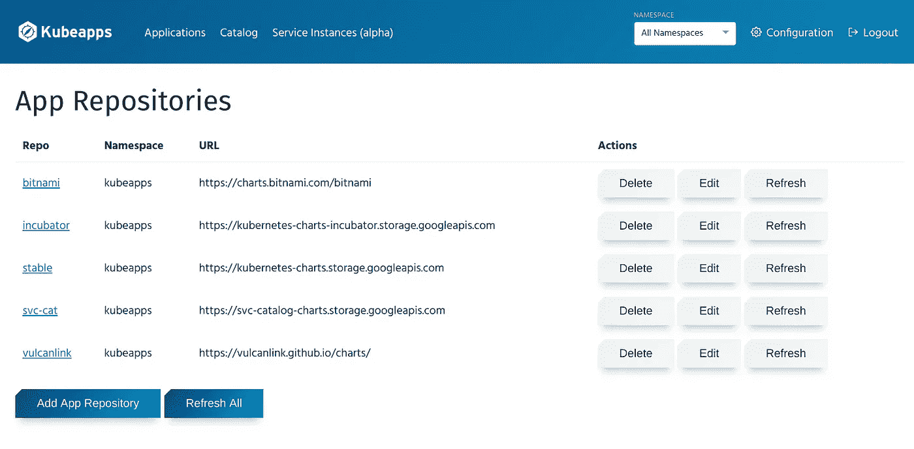
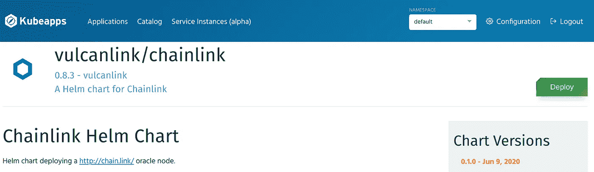

# ；一键链接部署

> 原文：<https://medium.com/coinmonks/one-click-chainlink-deployment-9cd39833d72d?source=collection_archive---------0----------------------->


Quickly deploy a Chainlink node using the KubeApps user interface.

# 链环

通过使用 Chainlink 节点，Chainlink 将区块链智能合同与外部数据(如价格、身份或 API 请求)连接起来。节点监视以太坊区块链的 oracle 请求，并在更新链上数据的链接中获得补偿。一个核心用途是开发分散的价格提要，您可以在 [https://feeds.link](https://feeds.link) 上浏览

# 在你读这个之前

在本指南中，我们将通过单击按钮将 Chainlink 节点部署到 Kubernetes 集群。如果你只想使用 Docker 运行一个独立的 Chainlink 节点，我们推荐官方的[文档](https://docs.chain.link/docs/running-a-chainlink-node)。

虽然许多现有的官方运营商使用 Kubernetes 进行容器编排，但我们的部署将有所不同，在我们的集群上使用 KubeApps 来实现 Chainlink 节点的一键式部署。从长远来看，运行 KubeApps 可以轻松升级到较新的 Chainlink 版本，还可以帮助我们部署附加组件，如外部 Chainlink Gas Updater 或 Chainlink GraphQL API。

# 要求/工具

好吧，所以我们可能撒了一个小小的谎:这个指南将帮助你通过点击一个按钮来部署一个 Chainlink 节点，但是**只是在你运行 KubeApps 之后。然而，一旦你这样做了，你也将能够升级到未来的版本和安装插件与简单的点击按钮**。****

这里是我们将用来部署我们的 Chainlink 节点的一些组件。如果你错过了任何一个，请继续阅读，因为我们会为你提供每一个设置的建议。如果您已经设置了这些组件，那么您可以跳到“KubeApps Chainlink 部署”一节，了解如何使用 GUI 部署 Chainlink 节点。

*   以太坊节点
*   PostgreSQL 数据库
*   Kubernetes (K8s)星团
*   [舵](https://helm.sh/)配置 K8s 集群
*   [K8s 集群上的 KubeApps](https://kubeapps.com/) 部署

## 以太坊节点

您的 Chainlink 节点将需要一个以太坊节点来监视和完成区块链上的 oracle 请求。如果希望创建一个简单的部署，我们推荐一个服务，如 [infura.io](http://infura.io) 或 [fiews.io](http://fiews.io/) ，这两个服务都提供免费层，让您可以访问 JSON-RPC 请求。如果希望最大限度地提高安全性，运行自己的节点总是更好的解决方案。多亏了 https://github.com/OracleFinder/ChainlinkEthFailover 的[，你甚至可以将内部以太坊节点与节点即服务(NaaS)结合起来](https://github.com/OracleFinder/ChainlinkEthFailover)

## PostgreSQL 服务器

Chainlink 节点使用外部 PostgreSQL 数据库来跟踪 oracle 请求执行所需的事务、请求和其他重要数据。如果您已经有一个 PostgreSQL 服务器，只需创建一个名为“chainlink”的新数据库。如果没有 PostgreSQL 服务器，可以使用 AWS RDS 之类的服务来设置数据库，或者使用 KubeApps 来部署 PostgreSQL 图表(参见后面关于 KubeApps 的部分)。

## Kubernetes (K8s)星团

K8s 支持容器编排。容器编排是对容器集群的动态管理。一旦集群启动并运行，您将能够部署多个独立的 docker 容器。虽然您可以使用 K8s API 直接部署 PostgreSQL 和 Chainlink docker 容器，但 Helm 和 KubeApps 将通过存储我们的配置和添加 UI 层来大大简化这一过程。

如果你没有 K8s 集群，你可以使用云服务，比如 AWS EKS，或者如果你正在为你自己的服务器寻找一个轻量级的解决方案，你可以使用 MicroK8s https://microk8s.io/

## 舵

一旦你有你的 K8s 集群运行，我们将安装头盔。Helm 使用“图表”来存储软件 K8s 部署架构的配置。然后可以通过存储库共享图表。

使用 Helm [快速入门指南](https://helm.sh/docs/intro/quickstart/)在 K8s 集群上安装 Helm v3。

你可以在 https://github.com/vulcanlink/charts 的[找到火神链接图(正在开发中)。虽然您可以使用 Helm CLI 来部署这些图表，但是 KubeApps](https://github.com/vulcanlink/charts) 将允许您使用更直观的前端来部署这些图表。

## KubeApps

KubeApps 是 Bitnami 开发的开源 UI 前端，旨在帮助您管理 K8s 部署。一旦 KubeApps 部署到您的 K8s 集群上，您将能够通过点击一个按钮来部署舵图表。按照[快速入门指南](https://github.com/kubeapps/kubeapps/blob/master/docs/user/getting-started.md)使用 Helm v3 在 K8s 集群上安装 KubeApps。

# KubeApps Chainlink 部署

## 使用 KubeApps

现在 KubeApps 正在运行，这就是奇迹发生的地方。如果你遵循 KubeApps 入门指南，你应该可以在 [http://localhost:8080](http://localhost:8080) 访问 KubeApps。

如果不能，请确保您正在端口转发 kubeapps 服务。

```
kubectl port-forward -n kubeapps svc/kubeapps 8080:80
```

“应用程序”页面将向您显示当前在您的集群上部署的舵图表。


KubeApps deployed charts

“Catalog”页面列出了您可以选择在集群上部署的图表，这是一种用于 K8s 部署的应用程序商店。


KubeApps chart catalog

如果希望在 K8s 集群上部署 PostgreSQL 服务器，可以通过搜索 PostgreSQL 并部署相应的图表来实现。请继续阅读，因为其步骤与我们部署 Chainlink 节点的步骤相似。

在右上角，您可以在集群上的不同名称空间之间切换。一般来说，只需为您的部署使用“默认”名称空间。

## 添加 Vulcan 连接图报告

链接节点不是目录的一部分，因为“@stable”储存库不包含链接图表。然而，Vulcan Link 已经为 Chainlink 创建了一个头盔图，并将其部署到我们自己的独立头盔库中，托管在 GitHub 上。

要添加 Vulcan Link repo，首先将名称空间更改为“All Namespaces ”,以便将 repo 添加到所有名称空间。转到“配置>应用程序存储库”。



Add an Helm Chart Repository to KubeApps

单击“添加应用程序存储库”并使用这些值:

```
name: vulcanlink
url: [https://vulcanlink.github.io/charts/](https://vulcanlink.github.io/charts/)
```

现在，您应该能够在目录页面上查看 Vulcan 链路图表。要测试这一点，只需在目录搜索栏中键入“vulcanlink”。


## 部署链节节点

将名称空间切换回“默认”，选择“chainlink”图表，然后单击“部署”。



现在可以使用该表单输入环境变量，比如以太坊节点和 PostgreSQL 数据库的 URL。您还可以通过编辑 Values 部分下的 config 键来添加其他环境变量。


单击 submit 后，您的 Chainlink 部署应该会在“Applications”部分弹出。


当然，CLI 命令还应该显示 Chainlink 节点已经正确部署。

```
kubectl get deployments    #Using K8s API
helm ls                    #Using Helm
```

要访问 Chainlink UI，请遵循“Notes”中的命令:

```
1\. Get the application URL by running these commands:
  export POD_NAME=$(kubectl get pods --namespace default -l "app.kubernetes.io/name=chainlink,app.kubernetes.io/instance=panoramic-shape" -o jsonpath="{.items[0].metadata.name}")
  echo "Visit http://127.0.0.1:8080 to use your application"
  kubectl --namespace default port-forward $POD_NAME 8080:6688
```

*如果你已经在 8080* 上使用 KubeApps，你可能需要将 8080 端口改为 8081

您现在应该能够访问位于 [http://localhost:8080](http://localhost:8080) 的 Chainlink 节点仪表板

# 剧终

就是这样！您的链接节点已部署！现在剩下要做的就是建立一个链上 Oracle 契约，并为您的节点提供资金，以开始[满足请求](https://docs.chain.link/docs/fulfilling-requests)。

# 关于瓦肯链接

我们是一家总部位于巴黎的 Chainlink node 运营商，致力于积极维护 30 多种可靠的数据馈送，并开发分散式应用程序，利用智能合约处理外部数据。我们相信通过为开源项目做贡献来建立信任。如果您希望我们向 [feeds.link](http://feeds.link/) 添加其他数据，请随时通过下面的链接联系我们！

在 [vulcan.link](http://vulcan.link/) 找到我们

在 Twitter[**@ Vulcan link**](https://twitter.com/vulcanlink)上关注我们，了解像这样的新项目的更新。

如果你愿意投稿，请加入我们的 [**电报**](https://t.me/vulcanlink) 和 [**不和**](https://discord.gg/uGwqJJH)

> [直接在您的收件箱中获得最佳软件交易](https://coincodecap.com/?utm_source=coinmonks)

[](https://coincodecap.com/?utm_source=coinmonks)