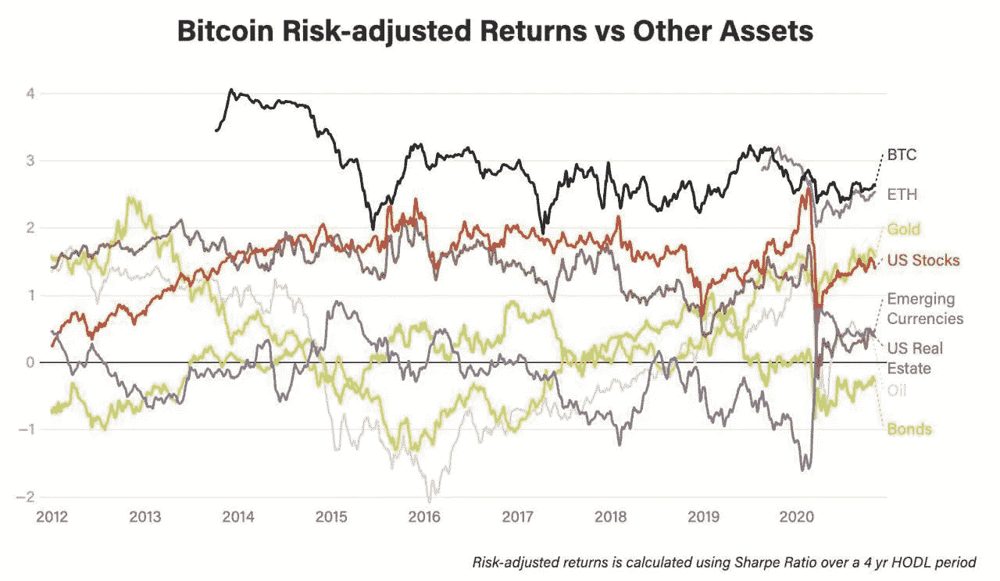

# 密码市场中最重要的关键指标之一

> 原文：<https://medium.com/coinmonks/one-of-the-most-important-key-indicators-in-the-cryptomarket-937363346922?source=collection_archive---------1----------------------->

今天，我们来看看另一个流行的比率，它也可以用于加密市场…所谓的夏普比率:

▶️The 夏普比率表明一项投资与无风险投资(如美国政府债券)的回报相比有多好。

可以说，▶️It 决定了回报的质量，因为你不会在…