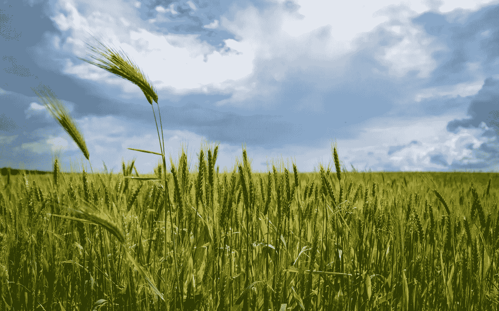

# 关于高产农业需要了解的一件事

> 原文：<https://medium.com/coinmonks/one-thing-to-understand-about-yield-farming-22db9e49217f?source=collection_archive---------1----------------------->

## 如果你了解套利，你就为高产农业打下了良好的基础。

[Image Credit to Anton Atanasov via Pexels](https://www.pexels.com/@blooddrainer?utm_content=attributionCopyText&utm_medium=referral&utm_source=pexels)

高产农业。

随着 DeFi 越来越受欢迎，它仍然是有事业心、有技术头脑的交易者的赚钱机器。另一方面，如果你是一个普通的密码爱好者，通读《产量农业解释者》可能会让你沮丧地抓耳挠腮，问自己这样的问题:

不精通所有事情的人怎么能指望[了解高产农业](https://blog.coincodecap.com/defi-yield-farming-and-liquidity-mining)？

事实上，这一切都归结于把正确的部分放在一起，就像 DeFi 项目可以被概念化为乐高，当连接起来时，形成越来越大的财务结构。

## **从套利开始**

理解产量农业意味着熟悉套利交易的基础知识。如果你不是，那么普遍的观点是你已经处于劣势了。

在加密货币的背景下，套利交易是指在一个交易所(市场)购买加密货币，并在另一个交易所以更高的价格出售。历史上，加密货币在不同的加密货币交易所往往具有不同的价值，这一事实使之成为可能。

虽然很难准确解释为什么会这样，但一般来说，供求差异以及交易行为使得加密套利机会成为可能。

更简单地说，正如 Cointelegraph 指出的，“这种低效率通常出现在对加密需求高的地区。”这意味着，举例来说，比特币在委内瑞拉的价格可能会高得多，委内瑞拉的法定通胀率远高于美国，而美国在这方面的情况更稳定。

套利交易者利用这些低效率，通常是在大量交易中，从一个市场到另一个市场，低买高卖。

## 【DeFi 与套利有什么关系？【产量农业】

随着 DeFi 的诞生，一种新的套利形式出现了，这就是通常所说的“产量农业”。

在基本层面上，为了“提高产量”，你可以在像 [Compound](/@leviness.ian/what-is-compound-and-how-does-borrowing-on-it-work-95098fbbabf9?source=friends_link&sk=1466fbee3554cd0c45ef7024e6997a8f) 或 [Aave](/coinmonks/what-is-aave-and-why-should-i-care-784995a0b81f?source=friends_link&sk=cb92201f1da991a631c16e4848eccc22) 这样的平台上下注一个代币，这些平台对贷方(下注者)来说有最高的 APY。

例如，目前，Compound 的市场页面列出了戴供应 APY(DAI supply ),其收益率为 [3.48%](https://compound.finance/markets) ，其他受支持的资产远远落后。另一方面，通过 Aave， [Synthetix 平台的](/the-capital/synthetix-and-binary-options-what-it-all-means-109baac2709?source=friends_link&sk=d79b948f36267033fe454e3f2e63f125) SNX 代币目前向[提供 10.21%的 APY](https://app.aave.com/home) 。基本上，如果你是一个收益率农民，你会使用这些值以及所有其他 DeFi 贷款平台的值，如 [MakerDAO](/coinmonks/why-defi-lending-improves-global-lending-d1046158af20?source=friends_link&sk=87e13e953dfb1d34d932c42a3aa8596a) 等，然后将理想的大量代币存入提供最高收益率的平台和资产(APY)。

要成为一个真正的高产农民，你需要在产量下降时改变你的下注地点，并再次转移到一个高产的地方(包括转移到一个新的平台)。

总而言之，你是贷款人，你总是在任何给定的时间里寻找存款资本的最高可能收益。

因此，收益农业可以被称为“借贷平台套利”

是的，随着你越深入，这个过程变得越复杂，但是现在，让我们坚持最基本的。

## **产量养殖有哪些风险？**

不管一个特定的 DeFi 项目的开发者告诉你什么，在很大程度上，产量农业所涉及的利率可以随时改变。这意味着，尽管乍看起来可能不像，但高产农业本质上是一种高频交易。因此，成为一名高产农民意味着“永远在线”。

换句话说，如果你想掌握全局，你不会从交易中得到很多休息，这就是为什么许多农民可能试图尽可能多地用交易机器人来自动化这个过程。虽然我计划在以后的文章中更深入地探讨这一点，但现在可以说这是指随着利率的变化建立自动买卖。

最后，我希望这个套利和收益农业的介绍能在你的 DeFi 之旅中对你有所帮助。一如既往，如果你喜欢这篇文章，请在下面和 Twitter 上告诉我[。](https://twitter.com/ExpatCrypto3)在我的下一篇文章中，我将继续探究 DeFi(当然还有 DeFi 贷款)的风险和回报。在那之前，敬你们所有人，因为任何读到这篇文章的人仍然是 crypto 的早期采用者！

最后，我的大部分空闲时间都花在了我的时事通讯上，这是完全免费的，关注的是元宇宙的崛起如何改善每个人的生活。[此处短接](https://www.getrevue.co/profile/blockdemiclab)。

*免责声明:这些都不是财务建议。自 2016 年以来，我一直在研究和工作 crypto，我的目标只是教育人们各种项目和市场本身的利弊。此外，我是一名学生，就像我们所有人一样。因此，随着我对项目了解的越来越多，我对项目的想法也会随着时间自然发展。最后但并非最不重要的是，除非另有说明，这些帖子都不代表 NBX 的思想，这包括在此之前的所有帖子。*