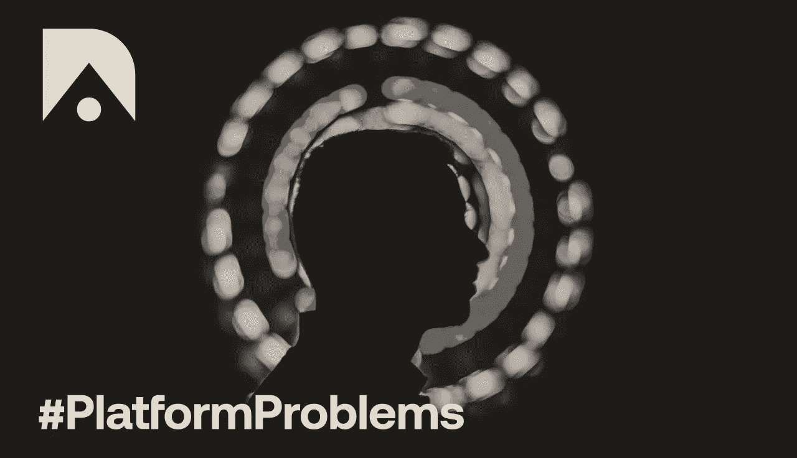

# 开放应用和解决平台经济的未来

> 原文：<https://medium.com/coinmonks/open-applications-and-solving-the-future-of-platform-economics-284cf6ac91fe?source=collection_archive---------4----------------------->

Source: [The Open Application Network (OAN)](https://theoan.com/)

在整个 2019 年，我们见证了[区块链格局](https://www.linkedin.com/posts/kyleellicott_dapps-defi-blockchain-activity-6585590890272825344-Hrui)从强烈关注企业用例转向在不断发展的“堆栈”中引入新的技术层，再到现在分散化应用(dApps)的兴起。作为这一领域扩展的一部分，进一步的关注点围绕着数据、隐私和未来经济模型的挑战，这些挑战将推动未来的应用。

随着许多世界上最有影响力的公司开发小企业赖以生存的平台，这些话题变得非常重要。当前的平台经济给用户和依赖它们的公司带来了越来越多意想不到的后果。我们已经看到平台单方面决定和改变他们是否拥有支付、用户数据和合规性，从而使企业在安全和用户隐私方面依赖于这些平台。在其他情况下，公司可以在任何时候被扔出平台，关闭，或被平台埋葬，无论是有意还是无意，迫使无回应的关闭和失去客户。

直到最近，平台还没有被激励去构建让公司更容易独立的产品和工具。现在这种情况正在改变，因为我们看到用户希望能够自由获取他们的数据(浏览量、积分、声誉等)。)轻松地从一个应用程序转移到另一个应用程序。此外，公司正在努力不通过平台中介直接与客户进行交易和工作，甚至为任何利益相关者做出任何决定创建一个简单的投票机制。

[Aion](https://medium.com/u/77eb9d503854?source=post_page-----284cf6ac91fe--------------------------------) 网络，即现在的[开放应用网络](https://medium.com/u/26219f78865e?source=post_page-----284cf6ac91fe--------------------------------)([OAN](https://theoan.com/))，在本周宣布了其计划，专注于今天的平台经济所面临的这些新出现的重大挑战，同时为明天奠定基础。开放应用网络的联合创始人兼首席执行官 Matthew speak 表示:“当前的平台生态系统并没有以应有的方式让企业受益。”。“明天的成功故事不会建立在昨天的平台上，相反，它们将变得开放，并将在设计时考虑用户的兴趣。今天的平台可以通过新的工具实现这一新的设计空间，以访问扩展这些重要生态系统功能的开放应用。我很高兴开放应用网络有机会拥有这个空间，并开始为这些企业构建解决方案。”

在谈到区块链景观中的分散应用(dapp)部分时，[谈到](https://www.linkedin.com/in/matthewspoke/)补充道，“虽然技术上很有趣，但 dapp 未能找到产品市场的契合点，可能有少数例外。开放应用网络的推出是找到相关叙事和走向市场战略的第一步，我们可以将其带到硅谷，并用于影响公司未来的运营和建设方式。平台经济正在增长，并导致意想不到的负面结果。通过使用增强这些重要生态系统的开放应用，我们有机会改变在线企业与其用户和利益相关者互动的轨迹。”

OAN 将把其工程中有意义的一部分转向构建必要的工具和库，称为[开放工具包](https://developer.theoan.com/docs/getting-started)，这将为开发者提供构建开放应用的自然途径。OAN 是一个开源的公共基础设施，为开放应用程序创造了一个新的设计空间。开放应用程序是将用户重新置于控制之下的程序，可以跨平台通用。使用开放应用的开发者可以接入现有平台，如优步、Shopify、Twitch 等。创造新的体验。

OAN 团队已经开始着手开发它的第一个开放套件——开放经济。开放经济允许开发人员将功能集成到他们的应用程序中，从而创建他们自己的微观经济——为他们的用户创建奖励、徽章或其他激励计划，以便在各种平台内外使用。

OAN 的合作伙伴[维罗奇亚](https://www.velocia.io/)，已经[整合了一些开放经济的特色](/theoan/open-app-example-velocia-f7b24df9880f)。Velocia 正致力于通过激励人们获得更好、更健康、更清洁的通勤方式来改变人们在城市中的出行方式。它通过一个合作伙伴网络来实现这一目标，包括 SwiftSeat、GetAround、Bolt、Citi Bike Miami 和 Miami Dade County。Velocia 用户在迈阿密和南弗洛里迪亚迅速扩大，通过合作伙伴网络赢取和兑换 VELOS。OAN 为 Velocia 提供了一个公共基础设施，以将 VELOS 的使用集成和扩展到不同的平台和其他开放应用程序中。

“我们相信这是平台经济的未来——为企业和个人提供从平台中受益的能力，同时让他们的工作、数据和关系可以普遍访问，”斯凯说。“我们希望开放应用和开放应用网络成为企业以用户为中心扩展能力和设计产品的最快、最简单、最有效的方式。软件正变得越来越开放，长期成功的公司将走在这一趋势的前面。”

开放经济目前通过与 OAN 的合作伙伴关系提供，该 API 将于 2019 年晚些时候公开发布。2020 年，其他开放套件，如开放治理、开放身份和开放资金，将可用于集成和 API 发布。

“解决我们今天看到的特定平台挑战可以通过技术来实现，但不能通过最初产生问题的技术来实现。Aion 和开放应用网络很高兴成为新范例的一部分，为共同利益建立真正开放的系统和经济；一个可以开发真正开放的应用程序的地方，这些应用程序超越了这些过度主导的平台公司的界限和经济利益。

**关于开放应用网络**

[开放应用网络](https://medium.com/u/26219f78865e?source=post_page-----284cf6ac91fe--------------------------------)解决了平台经济带来的意想不到的后果。OAN 是一个用于创建和托管开放应用程序的开源公共基础设施。开放应用程序是让用户重新获得控制权的程序，可以跨平台通用。OAN 建立在开放标准之上，由使用它的每个人拥有。想了解更多信息和更新，请在推特上关注 OAN[@ openapp network](https://twitter.com/OpenAppNetwork)

**关于永恒之塔**

[Aion](https://medium.com/u/77eb9d503854?source=post_page-----284cf6ac91fe--------------------------------) 是开放应用网络的数字资产。Aion 用于保护和访问 OAN。作为公共基础设施，由个人、软件公司和机构组成的全球社区保护和维护着 OAN 的运行。使用 Aion 可以启用和激励这些关键功能。

*注:文章原载于*[*ReadWrite.com*](https://readwrite.com/2019/11/05/open-applications-and-solving-the-future-of-platform-economics/)

> [直接在您的收件箱中获得最佳软件交易](https://coincodecap.com/?utm_source=coinmonks)

