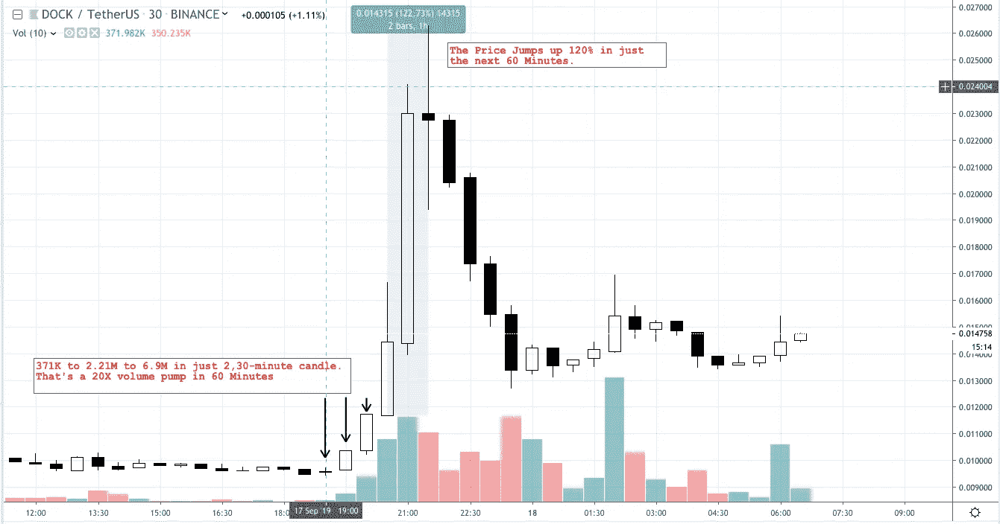
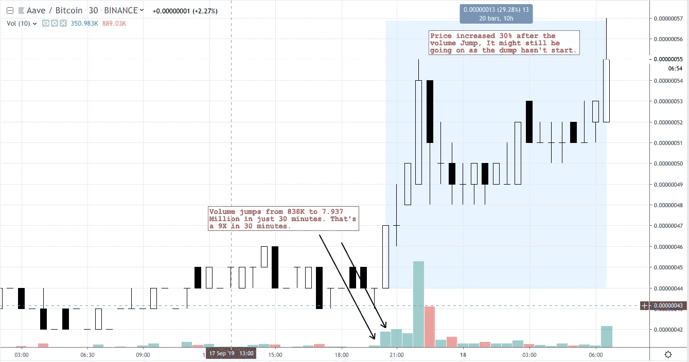

# 交易密码的公开秘密

> 原文：<https://medium.com/coinmonks/open-secret-for-crypto-traders-aacbae27ba68?source=collection_archive---------0----------------------->

TL；博士版:其卷，欲知下文为何读。

如果你观察到一件交易密码的事情，那就是密码非常不稳定。高度大写的“H”。

对于许多替代硬币来说，100%的上涨并不反常，在大多数价格上涨后，50%或更多的价格下跌是事实。

每一次涨价或降价的背后，都有一个故事。与传统市场不同，加密是所有交易资产中的狂野西部。不可否认，市场被高度操纵。

> 几条鲸鱼可以制造一个波浪，带走所有的鲸鱼。

那么你能做些什么呢？加入鲸鱼？你有那么多钱吗？或者他们会相信你会告诉你他们打算什么时候投哪一枚硬币吗？你怎么能把自己辛苦赚来的钱托付给别人呢？

解决方法！

> 忽略噪音，专注于价格。

关于海啸有一个鲜为人知的事实。在海啸到来并淹没海滩和内陆之前，海滩水位首先开始[停留](https://www.americangeosciences.org/critical-issues/faq/what-are-natural-warning-signs-tsunami)。

如果你能被告知海滩水的异常情况，那就是海啸即将来临的早期信号。

我将海啸与加密泵进行比较的原因是，总有一些迹象表明所有泵都在指示。问题是找到这些指标，然后跟踪这些指标，以了解海啸何时到来。

对于第一部分，

> 数量总是领先于价格，总是以大写字母“A”开头

价格需要买方上涨，买方需要卖方购买，卖方需要更好的价格出售他们的资产，因此他们提高价格，…故事不断重复，直到价格泵结束。

当一个泵即将发生时，交易量特别高的原因是因为买方以市场提供的任何价格购买。一旦一个价格的所有硬币被卖出，买家开始购买下一个价格水平。

使音量变得关键的是在一个较低的时间框架内音量增加的速率，如 5 分钟或 30 分钟烛光。

第二部分，

价格变化，更准确地说是价格的变化率，理解起来非常重要。

> 1%的变化是一天没什么大不了的，
> 
> 1 小时内 1%的变化可能是有趣的
> 
> 1 分钟内 1%的变化是不正常的

足够的文本，让我给你看一些例子

The price increase following the Volume increase.

上面的例子是多克/USDT，在短短的 30 分钟的两支蜡烛里，成交量跃升了近 20 倍。这些是大自然创造的泵，但数量和价格是事实。

9X Volume followed by 30% Price increase

另一个贷款/BTC 的例子显示了同样的异常量增长，随后是价格暴涨。

你可以自己动手，只要去币安或任何一个交易所看看价格涨幅最大的硬币就行了。只要看一下 30 分钟和 5 分钟蜡烛图，你会发现在价格开始上涨之前有一个巨大的成交量峰值。

最大的问题是，我怎么知道什么时候会发生这种情况，我和你不可能每 5 或 30 分钟坐在那里 24/7 监控每一枚硬币。

这是我正在构建的一个工具，如图*。*

*这是一个简单的应用程序，当你在市场上寻找的东西或任何硬币发生加密的体积跳跃或 MACD 交叉时，它会进行筛选并通知你。看看吧，让我们知道你的想法。*

*有一点我没有涉及到，就是如何知道成交量的增加是正的还是负的。很简单，如果 10 倍左右的成交量导致价格上涨，如果成交量导致红烛那么糟糕。成交量和价格是直接相关的。*

* [## 你怎么知道一个 175%价格的泵提前 1 小时就来了。

### 昨天燃料/BTC 价格在下跌前的 6 个小时内上涨了近 175%。在这篇简短的帖子中，我试图分享你…

medium.com](/@shakks/how-do-you-know-a-175-price-pump-is-coming-1-hour-in-advance-63bf25ba7dcc)  [## 你是如何发现 WPR/联邦理工学院 30%的收益的？

### 在每次价格变动之前，通常会有微妙的变化，这些变化可以通过各种技术指标来检测。的…

medium.com](/tradeplan-io/how-you-could-have-found-the-wpr-eths-30-gain-1d58594383b2)  [## 85 分钟内逆向工程 LINK/ETH 的 50%。

### 密码的波动性是吸引许多交易者到密码市场的主要因素。

medium.com](/@shakks/reverse-engineering-link-eths-50-in-85-minutes-a28ad089aa0b)  [## SMA(简单移动平均线)—交易指标 101

### 简单移动平均线是一个技术指标，被全世界的交易者用于每一种可能的资产，例如…

medium.com](/coinmonks/sma-simple-moving-average-trading-indicator-101-99a84849899f) 

请随时通过@ [shakks](https://twitter.com/shakks) 与我联系

> [直接在您的收件箱中获得最佳软件交易](https://coincodecap.com/?utm_source=coinmonks)

*