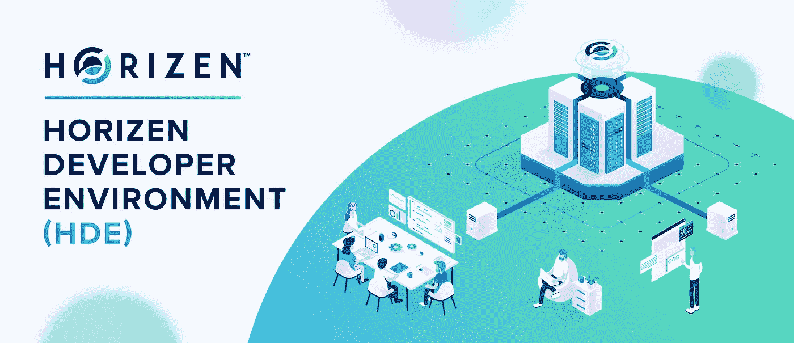
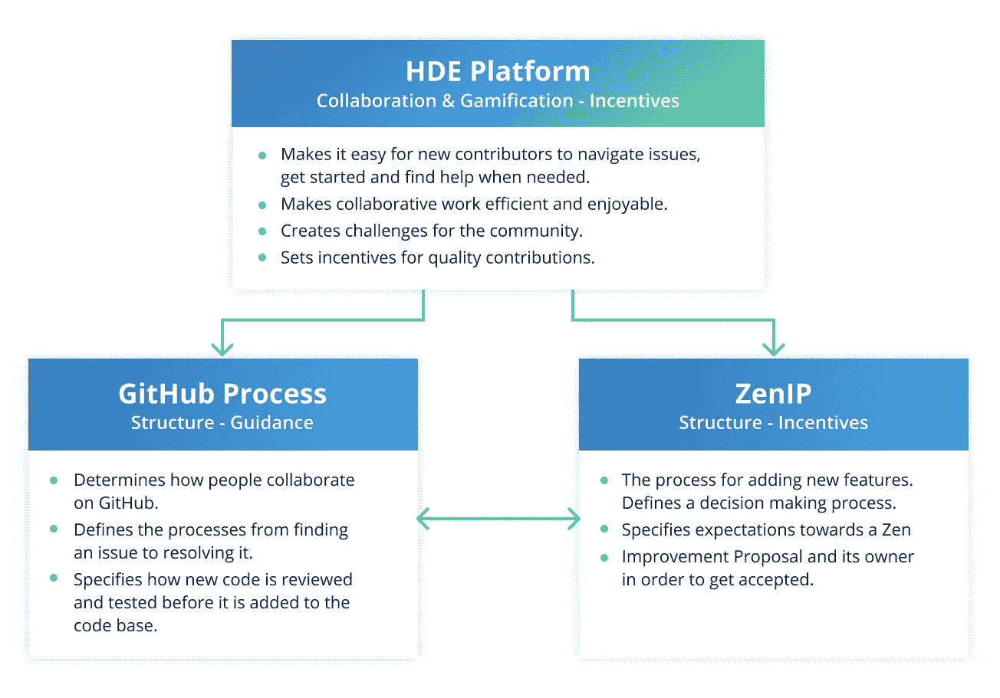
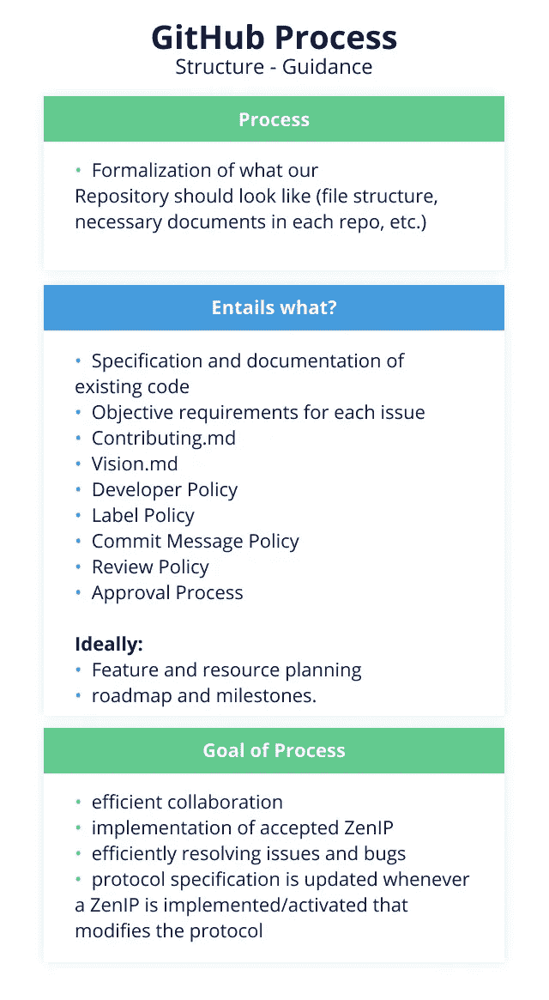
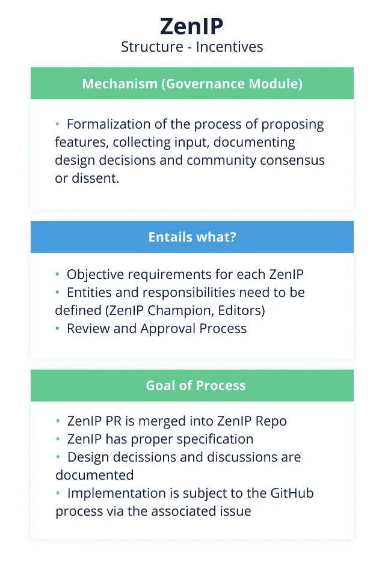
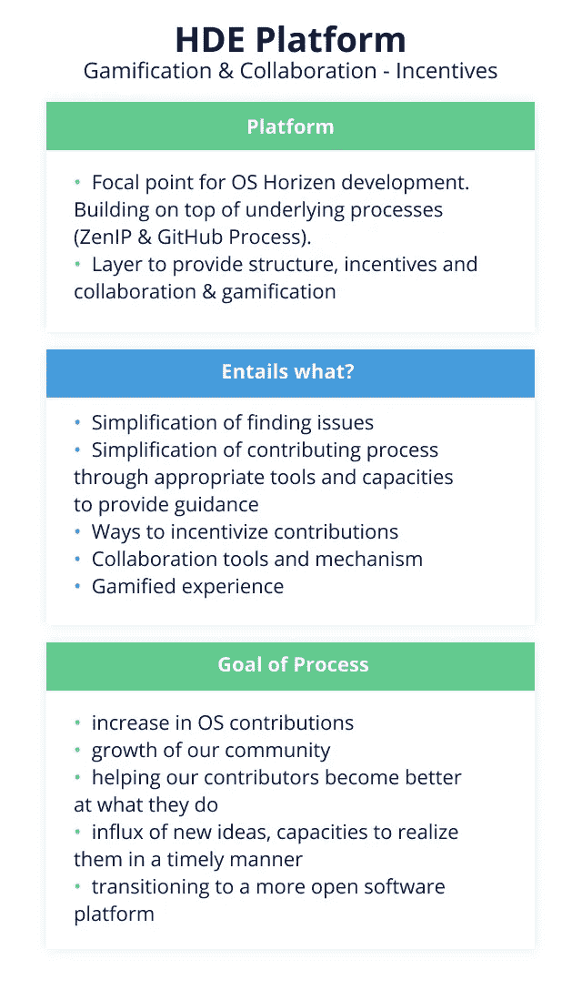
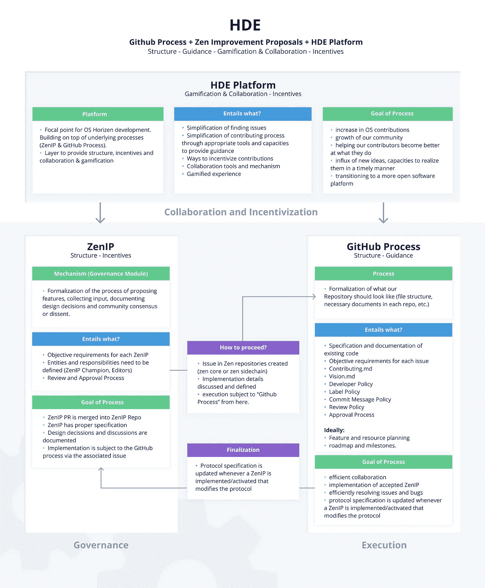

# 开源贡献者的新家 HDE

> 原文：<https://medium.com/coinmonks/open-source-contributors-new-home-the-hde-a91a1b5376df?source=collection_archive---------0----------------------->

Thanks, Marko! :)

## 关注趋势，为开源开发者和开源软件项目创造双赢的局面。

软件正在吞噬世界，而且速度越来越快。不是每个人都需要成为一名开发人员，但肯定有更多的理由支持而不是反对能够自信地在数字领域导航。

这个世界不仅需要开发人员，还需要对软件如何工作、如何构建以及构建软件会遇到哪些挑战有信心的人。了解软件开发意味着什么的一个很好的方法是参与开源软件(OSS)开发的世界。这个世界隐藏在众目睽睽之下——在 GitHub 上，很少有非技术人员会去那里…

虽然许多人从未参观过这个地方，但是[比以往任何时候都有更多的人在 OSS 项目上合作。这是有充分理由的。](https://octoverse.github.com/)

如果你刚刚开始软件开发，这是一个学习和寻找志同道合者的好方法。你有一个提问的地方，你会很快明白，人们希望你积极主动，但如果他们看到你愿意学习，他们会非常有帮助和支持。

> “知道的人，做吧。明白者，教之。”― **亚里斯多德**

如果你是一个有经验的开发者，OSS 项目对你来说同样有价值。这是你建立“投资组合”的一种方式，可以帮助你找到一份新工作。您还可以提高您的指导技能，并帮助经验较少的开发人员。这听起来可能不是很吸引人，但帮助别人可能是一种非常有益的消遣。(我的一些)老师曾经告诉我，教书是最令人满意的事情之一。在为当地大学工作了近六年后，我只能表示我完全同意。

# 创造双赢的局面

Horizen 是一个开源的区块链平台。[我们的代码](https://github.com/ZencashOfficial)存在于 GitHub 上。你可以自由探索它，参与它的发展。然而，今天开始 OSS 开发有一个问题:即使对于了解 GitHub 代码的人来说，第一次浏览 GitHub 也是令人生畏的。尽管有许多[优秀的指南](https://opensource.guide/how-to-contribute/)、教程和帮助页面，但要掌握它们的结构、[工作流程](https://guides.github.com/introduction/flow/)、约定和交流方式确实需要一些时间。存储库、问题、分支、分叉和合并——提交和拉取请求——需要一些时间来适应。

在 OSS 上工作总会有一定程度的复杂性，但是我们相信我们可以把它抽象出来，让开发者更容易开始。一旦你有了一个起点，只要坚持下去，你就会很容易学会剩下的部分。

# 你好 HDE

Horizen Developer Environment(HDE)旨在让开发者更容易开始他们的第一个开源项目，并体验加入志同道合者社区的好处。

同时，这将有助于 Horizen 平台的发展。一个在区块链世界反复出现的主题适用于——数字上的权限。

数量上的优势——或者说“数量上的优势”——适用于开放源码软件项目，也适用于大多数其他项目。你越多，你能实现的就越多——假设一个关键条件得到满足:提供一定水平的结构！

## 高层结构

在 HDE 的例子中，这种结构是多重的。Horizen 开发者环境平台将致力于实现协作，让我们的项目变得有趣，并增加对高质量贡献的激励。

Thanks, Linda! :)

它将建立在两个支柱上:GitHub 流程将为 GitHub 和 Zen 改进提案(ZenIPs)上的合作增加更多的结构，ZenIPs 是一个决策制定流程和治理机制，将应用于新功能请求和提议的协议更改。这是许多大型区块链项目的既定流程。

## GitHub 流程

第一步将是完善我们的 GitHub 流程(GHP)。GHP 将适用于我们在 GitHub 仓库中完成的所有工作。首先是一些关于我们期望贡献者如何合作和讨论的一般指导方针。GitHub 上的每个项目都有一个 [*自述*](https://github.com/ZencashOfficial/zen/blob/master/README.md) 文件，该文件概述了项目的内容，并为有经验的 OSS 贡献者提供了入门的最基本信息。

接下来，你通常会找到一个 [*贡献的*](https://github.com/ZencashOfficial/zen/blob/master/CONTRIBUTING.md) 文件。它包含了一些关于人们应该如何为项目做贡献以及一般范围是什么的指导方针。它服务于贡献者和维护者。虽然贡献者有办法验证他们正在提交适当的[拉请求](https://help.github.com/en/articles/about-pull-requests)并且正在打开有用的[问题](https://help.github.com/en/articles/about-issues)，但是维护者在拒绝拉请求或问题时有一个参考文档。与其花很长时间讨论为什么一篇文章不合适，不如用这篇文章作为参考。

在我们的 GitHub 流程中还会定义一些东西，比如如何编写合适的[提交消息](https://chris.beams.io/posts/git-commit/)以及什么是好的文档。

另一个关键步骤将是增加 Zen 区块链基金会的容量。我们希望能够为开发我们代码库的新老开发者提供指导。当人们遇到困难时，我们不仅会尽力帮助他们，而且我们也希望支持有技能的贡献者成长为领导角色。知识库维护和社区管理对 GHP 至关重要。

## Zen 改进建议— ZenIPs

协议改进提案是一种既定的机制，用于决定许多区块链项目中的新功能和核心协议变更，如比特币( [BIPs](https://github.com/bitcoin/bips) )、以太坊( [EIPs](https://github.com/ethereum/EIPs) )或 Zcash ( [ZIPs](https://github.com/zcash/zips) )。我们认为没有必要重新发明轮子，所以我们将采用我们自己版本的改进建议系统—ZenIPs—作为治理机制。你能想到更好的名字吗？请评论；)

ZenIP 本身就是一个描述新特性的文档。它解释了提出的特性背后的基本原理，并详细说明了为什么要做出某些设计决策。

ZenIP 流程始于所有者或作者以 ZenIP 的形式提出一个新特性。社区现在讨论提案，并就如何改进提出建议。

一旦起草阶段完成，ZenIP 被接受，它将被添加到所有要实现的 ZenIP 的指定存储库中。

一个被接受的 ZenIP 的实现将服从前面描述的 GitHub 过程。问题或项目将在适当的存储库中创建，并在那里完成。如果 ZenIP 对核心协议进行了修改，那么在代码被合并并投入使用之前，协议的规范也需要进行相应的修改。

到目前为止，没有什么引人注目的，但是简单描述一下治理机制以及执行过程为 HDE 平台设置了场景。

## HDE 平台

Horizen 开发者环境平台将成为 Horizen 生态系统开发的焦点。

首先，我们希望让那些愿意为寻找推动项目前进的任务做出贡献的人尽可能地容易。大约一年半前，我自己也处于这种境地:我联系了 back-than ZenCash 团队，想知道作为一名非开发人员，我能做些什么来帮助他们——现在，我自己也是 Zen Blockchain 基金会的一员。我们从第一手资料中了解到，许多人都愿意伸出援手，但我们迄今为止还没有做好让这一切变得容易开始的工作。

HDE 平台将帮助所有积极参与的社区成员找到适合他们的任务。GitHub 对于开发者来说是一个很好的平台，但是对于不太懂技术的人来说就不那么好了。社区成员可以做的一些与代码无关的事情是策划活动、提供设计、提供翻译以及撰写文章或教程。我们相信，只要强调人们可以参与的许多方式，我们就会看到大量的援助之手。

开发人员也可以从更结构化的方法中获益，发现适合他们的问题。这涉及到一个明确定义的[标签](https://help.github.com/en/articles/about-labels)策略，它是 GitHub 流程的一部分，但可以扩展到它之外。

开源开发自然基于协作，我们认为我们可以通过团队请求等功能来改善我们社区的协作体验。

如果你发现一个你想解决的问题，但你没有信心独自解决，你可以给它添加一个*团队旗帜*，这样其他处于相同情况的贡献者可以伸出手来与你一起开始解决它。到目前为止，有许多想法在流传，我们才刚刚开始这个巨大的努力，但我们很高兴在这一点上与你们分享我们的愿景。

# 摘要

HDE 包括三个主要的工作流程:定义 GitHub 流程，建立 Zen 改进提案决策流程，以及构建一个高效协作和激励贡献者的平台。整体而言，这似乎是一项艰巨的任务。但是我会尽我最大的努力使这个愿景尽快成为现实。

我认为这个项目不仅是改进 Horizen 的重要一步，也是为整个开源软件社区树立一个先例的机会，告诉他们如何增加社区参与，开发者和项目本身都可以从中受益。

并不是迈向 HDE 的每一步都会伴随着一篇中型文章(虽然我会试着做其中的几篇)，所以如果你想保持在圈子里，你可能会想在 Twitter 上关注[Horizen](https://twitter.com/horizenglobal)。我也很欣赏在 twitter 上的关注，所以[觉得自由](https://twitter.com/SLebur)；)

> [直接在您的收件箱中获得最佳软件交易](https://coincodecap.com/?utm_source=coinmonks)

