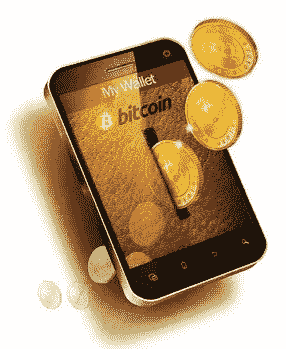

# 加密货币钱包的开源与闭源

> 原文：<https://medium.com/coinmonks/open-source-vs-closed-source-for-cryptocurrency-wallets-8ae948bb84c2?source=collection_archive---------0----------------------->

许多人认为所有的加密货币钱包都应该开源，尽管目前加密货币开源的性质，这可能不是最好的选择。让我们研究一下其中涉及的一些问题。

开源编码无疑极大地帮助了加密货币运动。对于没有复杂数学背景的普通软件程序员来说，加密货币很难理解，并且由于需要开发人员编写自己的加密库，如果没有开源，进展会慢得多。

虽然在实践中布置数学很简单，但是编写代码实现它仍然是很重要的。由于开源，由编码错误导致的错误和漏洞可能比其他情况下要少。

人们喜欢开源的另一个原因是，任何人都可以检查代码本身是否有“后门”、“间谍软件”或其他恶意软件。

虽然这在理论上也很棒，但它并不能 100%保证不会出现问题。为什么？嗯，因为 99.9%使用软件的人不会检查代码，事实上他们依赖其他人来完成。即使其他人真的检查了，问题也很容易被忽略。

最近一个人们依赖开源代码而遭受损失的例子是最近的 Etherium [hack](http://www.coindesk.com/understanding-dao-hack-journalists/) ，一个流氓程序员建立了一个聪明的合同，有效地为自己榨干了 360 万 ether。在那种情况下，代码是开源的，事实上被许多人仔细研究过。

一些人如此相信开源，以至于你经常会发现特定加密货币的“核心”团队成员警告人们不要使用不是由“核心”本身产生的代码(参见[这里](https://www.reddit.com/r/dashpay/comments/57vis9/ready_to_go_dash_mobile/)的例子)。然而，他们期望你 100%信任“核心”，而事实上“核心”团队本身通常是没有任何固有责任的匿名团体。事实上，大多数“黑客”通常是“监守自盗”。前面提到的 Etherium 黑客被认为是监守自盗(见[这里](https://www.cryptocoinsnews.com/source-ethereum-insiders-believe-dao-hack-inside-job/))，就像变形黑客(见[这里](https://news.bitcoin.com/looting-fox-sabotage-shapeshift/))一样，当然我假设大多数读者都熟悉 Mt. Gox。虽然 Shapeshift 和 Mt Gox 不是开源代码库，但 Etherium 事件表明开源模型并不能 100%避免问题。

嗯，你可能会说，我们仍然需要开源，因为比特币和加密货币的全部意义在于避免信任第三方实体。就是“做自己的银行”，不要依赖交易对手。虽然这是真的，但大多数人都没有能力编写自己的软件，甚至没有能力审查开源代码，然后构建自己的应用程序。

因此，考虑到这一点，大多数人将依赖于从其他地方获得软件。

让我们来看看各种选项

> 1 编写自己的软件
> 
> 2.下载开源代码，审查和编译应用程序
> 
> 3 从一个“核心”团队下载预打包的软件，据说是基于 100%开源的
> 
> 4 从外部或“第三方”公司下载软件，据说是基于开源的
> 
> 5 从“封闭”来源的外部公司下载软件

虽然 1 和 2 对于 99.99%的人来说是不可能的，但它们是唯一 100%安全的选择。

鉴于此，还有什么其他挑战？让我们来看看每一个案例。

第三次。大多数核心团队将为 Windows、Mac、Linux 甚至 Android 等几个平台提供可下载的预打包软件。他们甚至可能在同一个网站上有一个开源代码库，比如 github.com。然而，通常主要的开发人员并不是将二进制文件放在一起的同一批人，特别是考虑到大多数开发人员倾向于偏爱一个平台而不是其他平台，他们可能会将构建软件包的工作外包给其他人。有一个自动化的过程来构建各种二进制文件可以解决这个问题，但是设置起来很耗时，而且经常被跳过。鉴于此，对于一个人来说，在最终发布的版本中插入一些流氓代码并不困难。虽然人们可能认为这个人最终会被发现，但这可能不会让短期内赔钱的人感到安慰，而且鉴于许多核心团队都是匿名的，罪犯可能永远不会被追踪到并追究责任。

现在我们来看 4。在所使用的过程类似于 3 的情况下，我们有相同的问题，但是可能比 3 中的情况信任度更低。也就是说，“核心”团队可能不想损害他们的声誉或硬币本身的声誉，而对于第三方来说，他们可能两者都不在乎。另一方面，如果他们是一家有限公司或个人，拥有公开的名称和可追溯性，那么事实上他们的声誉可能比核心团队更重要，因为这可能是他们生活的基础，如果出现问题，他们可能会受到诉讼。

如果 4 的过程与 3 的过程不相似，那么人们验证下载的代码实际上是来自开源的能力就变得不可能，除非所有的事情都被记录下来，并且可以被独立的来源验证。然而，像以前的流量一样，开发商的声誉仍然岌岌可危。

此外，对于 IOS 等特定平台，独立方没有办法在不破解设备的情况下检查他们获得的应用程序是否与独立构建的应用程序完全相同。即使这样做也有些困难，除非所有的东西都被很好地记录下来，因为 Xcode 版本等的差异仍然存在。如果你的设备上有加密货币，你可能不想越狱你自己的设备，因为它取消了应用程序沙箱的保护。

现在来看案例 5。责任和信誉模型本质上与 4 相同，但是对最终用户来说可能有间接的好处吗？

是的，事实上我相信有。由于 2、3 和 4 都提供了代码，任何人都可以下载它，修改几行以添加一些恶意代码，然后以 2-5 的任何形式提供给公众。

由于恶意的加密软件可以在很大程度上合法地运行，它可以很容易地表现出无限期地值得信任。然而，可以编写代码，例如等待未来的特定日期，并在那时将所有硬币转移到应用程序的所有已安装实例的特定地址。仅仅通过查看可执行代码来检查这种代码是不可能的，因此等到发现问题时已经太晚了。

虽然我不知道一些特定的比特币钱包是如何做类似的事情的，但有报道称 AppStore 上有几个“诈骗”钱包。有一个例子，一个人通过提供一个叫做“面包钱包”的应用程序来模仿众所周知的“面包钱包”(即只是小写的 b 而不是大写)。这甚至比仅仅生产一个不同名称的诈骗钱包更危险，因为许多人可能会对其他人说，“是的，使用 B(b)readwallet，它是可靠的！”

一些和我讨论过这个话题的人说，“这就是 AppStore 上的评级/评论系统的作用”。我们应该相信这一点，因为欺诈钱包将获得糟糕的评级，甚至从 AppStore 中删除，而好钱包将获得良好的评级。我希望你能看到这里的陷阱——任何骗局钱包都可以在任何时期看起来完全合法。事实上，一个开发者可以多次更新一个合法的钱包，每次都添加改进，从而获得越来越好的评论。然后，一旦他实现了他的声誉目标，他就通过应用程序更新插入他的恶意代码，然后砰！他立刻把所有的钱包都转移到自己的地址。

此外，对于 AppStore，虽然苹果可以求助于开发者的信息，但对于已经存在的欺诈钱包案例，他们是如何处理的还不清楚(最好能得到苹果对此的评论！).这里的法律到底是什么？无论原始应用程序是从哪个国家上传的，执法部门都会采取行动吗？假身份也有可能被用来创建开发者账户。所以你可以看到，对评级系统过于信任会有潜在的问题。

因此，正如你所看到的，假冒或欺诈加密货币钱包存在严重问题。在这一点上，你可能会说，我们需要开始规范这些钱包和企业。嗯，我相信这最终会发生，但与此同时，在这类问题上，监管行动缓慢。

鉴于所有这些，我认为最好避免为加密货币钱包推出完整的开源包——以易于构建和打包的应用程序的形式。我的意思是，为什么要让它对骗子来说太容易了呢(事实上，我可能会在这篇文章之后一步一步地说明它有多容易)？

你可能会说“通过模糊获得安全？”。是的，这可能是真的，但可能实现完全安全的唯一方法是自己编写所有的软件，即使这样，您仍然有可能暴露于您所在的特定平台的漏洞(但由于这在所有情况下都是真的，所以我们忽略这一点)。所以，本质上，你必须信任某人。

所以在这一点上，你更愿意相信谁？a)匿名核心团队，b)匿名第三方开发人员，c)可识别的个人和/或 d)有限公司。

我会投票赞成 c)和 d)。虽然我不知道有多少个人提供加密货币钱包，但我知道有一些公司提供。提供优秀软件的公司的两个例子是 1) [Exodus](https://www.exodus.io/) 和 2) [分散](https://jaxx.io/)(Jaxx 钱包的提供者)。此外，它们都提供跨多个平台的解决方案，并允许您使用密钥来通过其他钱包访问您的资金。

在这一点上，还值得一提的是，之前提到的“面包钱包”比特币钱包背后的人，有一家名为“面包钱包”的公司，他们在 AppStore 上的钱包不再声称是开源的。

我和这些公司没有任何关系，但是我使用过他们的软件，和他们的开发者聊过天(比如 Exodus 和 dec oll ),并且觉得信任他们很舒服。

希望听到您的反馈。

> 加入 Coinmonks [电报频道](https://t.me/coincodecap)和 [Youtube 频道](https://www.youtube.com/c/coinmonks/videos)获取每日[加密新闻](http://coincodecap.com/)

## 另外，阅读

*   [复制交易](/coinmonks/top-10-crypto-copy-trading-platforms-for-beginners-d0c37c7d698c) | [加密税务软件](/coinmonks/crypto-tax-software-ed4b4810e338)
*   [网格交易](https://coincodecap.com/grid-trading) | [加密硬件钱包](/coinmonks/the-best-cryptocurrency-hardware-wallets-of-2020-e28b1c124069)
*   [密码电报信号](http://Top 4 Telegram Channels for Crypto Traders) | [密码交易机器人](/coinmonks/crypto-trading-bot-c2ffce8acb2a)
*   [最佳加密交易所](/coinmonks/crypto-exchange-dd2f9d6f3769) | [印度最佳加密交易所](/coinmonks/bitcoin-exchange-in-india-7f1fe79715c9)
*   [币安 vs 比特邮票](https://coincodecap.com/binance-vs-bitstamp) | [比特熊猫 vs 比特币基地 vs Coinsbit](https://coincodecap.com/bitpanda-coinbase-coinsbit)
*   [如何购买 Ripple (XRP)](https://coincodecap.com/buy-ripple-india) | [非洲最好的加密交易所](https://coincodecap.com/crypto-exchange-africa)
*   [非洲最佳加密交易所](https://coincodecap.com/crypto-exchange-africa) | [胡交易所评论](https://coincodecap.com/hoo-exchange-review)
*   [eToro vs robin hood](https://coincodecap.com/etoro-robinhood)|[MoonXBT vs by bit vs Bityard](https://coincodecap.com/bybit-bityard-moonxbt)
*   [面向开发者的最佳加密 API](/coinmonks/best-crypto-apis-for-developers-5efe3a597a9f)
*   最佳[密码借贷平台](/coinmonks/top-5-crypto-lending-platforms-in-2020-that-you-need-to-know-a1b675cec3fa)
*   [免费加密信号](/coinmonks/free-crypto-signals-48b25e61a8da) | [加密交易机器人](/coinmonks/crypto-trading-bot-c2ffce8acb2a)
*   [杠杆代币的终极指南](/coinmonks/leveraged-token-3f5257808b22)