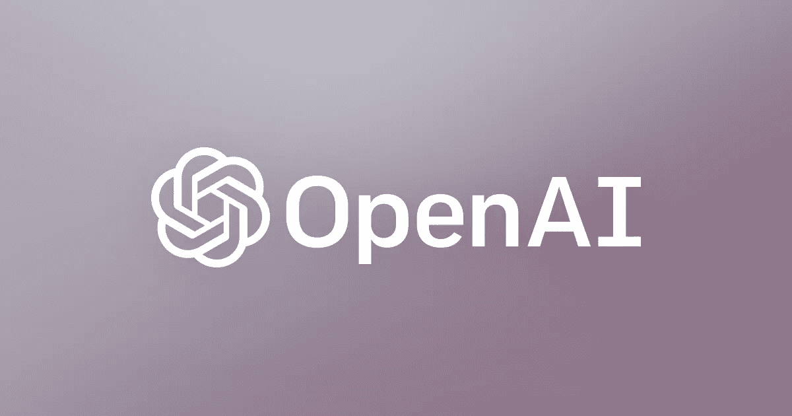
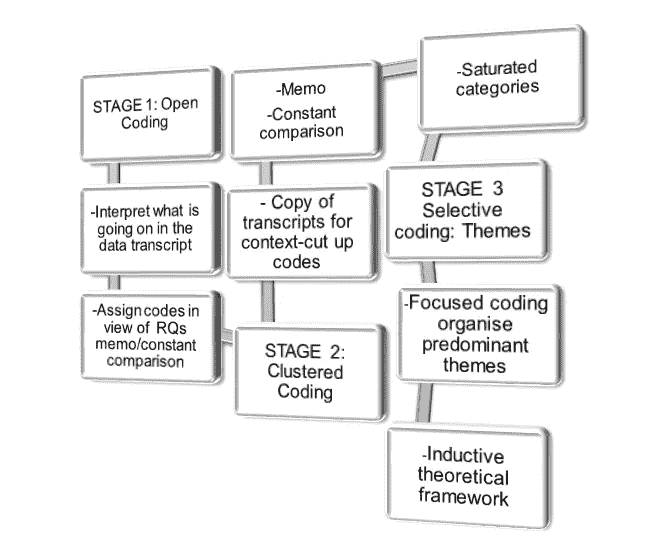
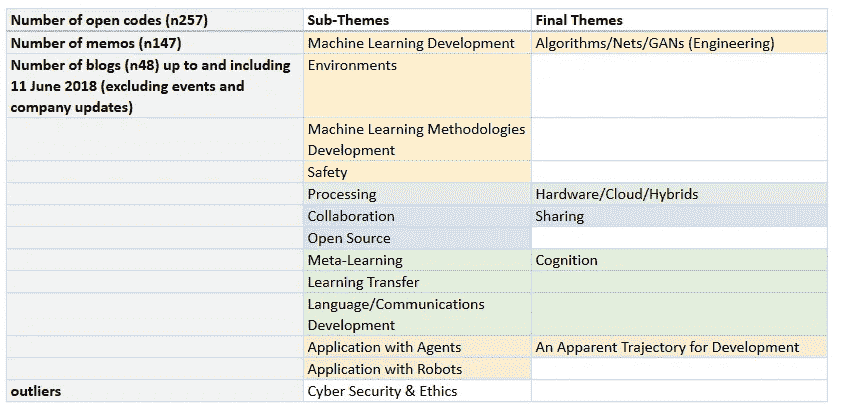
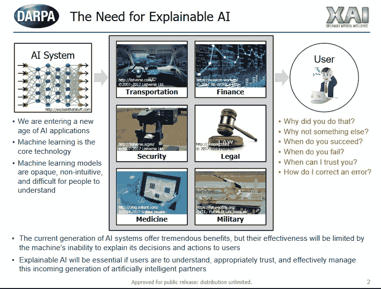
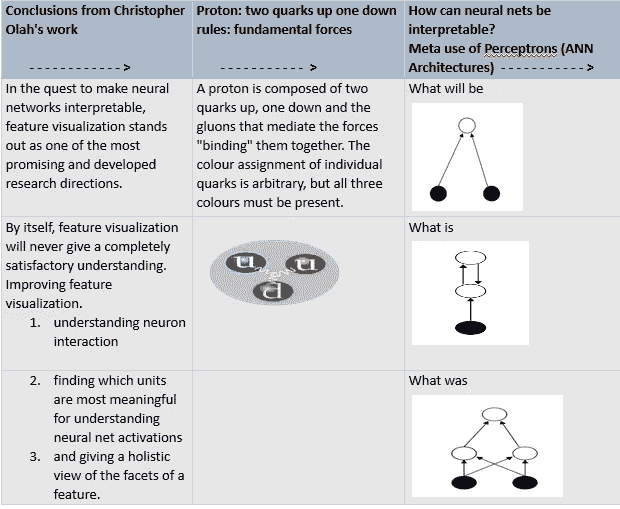
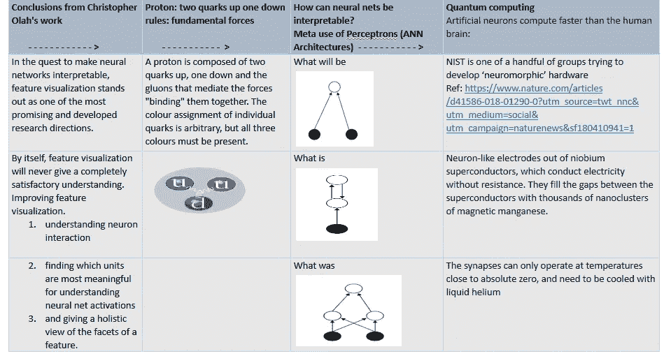
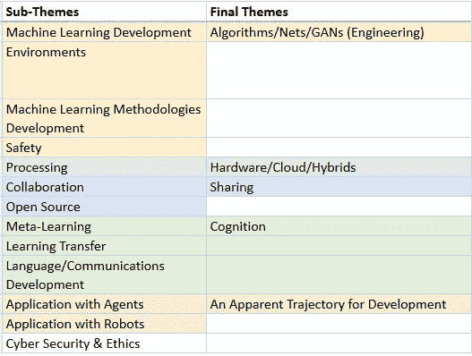

# OpenAI 博客:微观事件分析

> 原文：<https://medium.com/coinmonks/openai-blogs-a-micro-event-analysis-e15e98cfbca1?source=collection_archive---------4----------------------->

[source Image](https://www.google.co.in/url?sa=i&rct=j&q=&esrc=s&source=images&cd=&cad=rja&uact=8&ved=2ahUKEwjviP7Gy4PdAhUKro8KHZhmDcwQjxx6BAgBEAI&url=http%3A%2F%2Fopenai.com%2F&psig=AOvVaw0pLyZiy2jDJdBYTpZRoXa8&ust=1535127886527495)

在过去的几个月里，我一直在阅读 OpenAI 计划中的大量工作。这个研究基地有许多成果；无论是新设计的平台、引擎、算法、模拟环境还是机器人应用。这项工作通过三种方式传播:Github 上的开源代码、研究论文和定期博客。

**简介**

本文的目的是提供一个我做的微事件分析的概述，重点是 OpenAI 博客。目的是用这种分析综合相关的工作和文献；为了提出对人工智能(AI)和人工一般智能(AGI)发展的考虑。首先，我将简要描述分析框架和结果。其余部分提供了来自 OpenAI 数据的证据，以阐述总体主题，并得到相应子主题的支持。总之，将考虑网络安全和伦理。

**分析和结果**

这项研究共分析了(n48)个博客；截至 2018 年 6 月 11 日，第一篇博客可追溯至 2015 年 12 月 11 日。这些博客用三阶段定性分析框架进行分析。首先，在初步阅读相关文献后，数据被公开编码。第二，开放代码被映射到画布上，轴向编码使得集群能够被组织起来。第三，确定了次主题，为总主题提供信息。与此同时，备忘录活动支持跨分析的持续比较。在下图中，您可以看到所采取的流程。

Micro-Event Analysis Framework

总的来说，公开编码产生了 257 个代码和 147 个相应的备忘录。下表显示了子主题、最终主题和异常值；微观事件分析的结果。

我们可以从考虑第一个主题开始:算法/网络/GANs(工程)和相应的子主题:机器学习开发、环境、机器学习方法和安全。

**主题一:算法/网络/GANs(工程)**

对 OpenAI 博客的分析表明，为代理人/演员/机器人行为开发算法的工作和围绕环境的工作(我稍后将回到这个子主题)之间有着明确的界限。这种对行为的关注在 [OpenAI 健身房中显而易见，例如](https://gym.openai.com/)由 [OpenAI 于 2016 年 4 月](https://blog.openai.com/openai-gym-beta/)推出，旨在发展强化学习，其中规定:

强化学习(RL)是与决策和运动控制相关的机器学习的子领域。它研究代理人如何学习如何在复杂、不确定的环境中实现目标

推论是 RL 算法的不断改进，随着深度学习的进步，减少了对大量特定问题工程的关注。

来自 OpenAI 博客数据分析的一个很好的例子([论文在此](https://arxiv.org/abs/1706.02275))是[学习合作、竞争和交流，](https://blog.openai.com/learning-to-cooperate-compete-and-communicate/)其中提到强化学习(RL)与深度学习(复杂的视觉输入)相结合，以实现机器学习算法的开发。

*‘代理不需要在测试时访问中央评论家；“他们根据自己的观察结合对其他代理行为的预测采取行动……**深度学习让我们处理复杂的视觉输入，而 RL 为我们提供了长时间学习行为的工具。”*

来自原始数据的另一个好例子，它强调了对 RL 算法开发的持续关注；机器学习开发，在博文中:[近端策略优化](https://blog.openai.com/openai-baselines-ppo/)(2017 . 7 . 20)。这显示了 15 个月的时间跨度；pacey 开发，最终出现了 OpenAI 采用的默认算法。

既然我们已经建立了算法开发和/或增强的一般运动，就行为的强化学习而言，现在是时候来看看 Nets(神经网络)和 GANs(生成对抗网络)的作用了。

这一部分再次与子主题:机器学习开发联系在一起，但这一次子主题:环境和安全被包含在内，并与第一个总主题(算法、网络、GANs =工程)相对应。为了保持一致，下面的内容也得到代表性例子的支持，作为微事件分析的结果，追溯到原始数据(开放编码、集群/轴向编码和备忘录)。

人工神经网络由节点和层组成。它们的设计很像人类大脑的架构，(有关模拟和分析网络通信动态以刺激大脑功能连接的网络科学方法的更多信息，请参见[这篇自然杂志文章](https://www.nature.com/articles/nrn.2017.149.epdf?shared_access_token=6XoVolgu-hIOIq0HNCYaqtRgN0jAjWel9jnR3ZoTv0Os5Nn9WSjuM9zu5pLHr4rEEijXOmFUslTGG5TVBkVmnGFg6D27yQ_sxUgJGWrT9qeoDzOIKmm8F3fROyUpXU6SDZ7o8b3BQyjh8PdjSfjWOJTBAOUuXcQ2mZaCgHLWlB8%3D)，例如)并产生可用于解决机器构建的问题的模型。单个神经元称为感知器；当有更多的神经元被编程时，这些信号/或不支持分层连接的网络。

今天的一个主要问题是，如何解释神经网络。顺便说一句， [DARPA 的](https://www.darpa.mil/attachments/XAIProgramUpdate.pdf)关于可解释人工智能(XAI)的工作旨在解决透明人工智能的开发，例如:

在下表中，我试图通过引用 Christopher Olah 的工作(在谷歌人工智能)来说明这一困境。本质上，简而言之，它是关于处理速度，神经活动之间发生的事情——通过网络，以及缩小输入和输出功能之间的差距。

通过来自微事件分析的 OpenAI 结果，很明显，已经开发了工具来提供模拟环境，以使用神经网络来测试 RL 算法。来自数据分析的一个代表性例子:[宇宙](https://blog.openai.com/universe/)，显示了进展如何导致神经网络每一层激活的明显记录。为什么这很重要？它之所以重要，是因为按照 OpenAI 的说法，宇宙发展的目标是:

“我们的目标是开发一个单一的人工智能代理，它可以灵活地将其过去在宇宙环境中的经验应用于快速掌握不熟悉的、困难的环境，这将是迈向一般智能的一大步。”

在 OpenAI 分析中，博文:[深度学习的基础设施](https://blog.openai.com/infrastructure-for-deep-learning/)定义了 GANs 关键架构的角色:

GANs 由一个发生器和一个鉴别器网络组成。生成器试图欺骗鉴别器，鉴别器试图区分生成的数据和真实的数据。直观上，一个能骗过每个鉴别器的生成器就相当不错了。但是有一种很难修复的故障模式:生成器可以通过总是输出完全相同的内容而“崩溃”(看起来很真实！)样本。

很明显，甘的博客文章(相关论文为[此处](https://arxiv.org/abs/1406.2661)):【生成模型】解释道:

*‘生成敌对网络(GANs)…将训练过程视为两个独立网络之间的游戏:一个生成器网络和第二个判别网络，该网络试图将样本分类为来自真实分布 p(x)或模型分布^p(x).“每次鉴别器注意到两个分布之间的差异时，生成器都会稍微调整其参数以使其消失，直到最后(理论上)生成器精确地再现真实的数据分布，而鉴别器只是随机猜测，无法找到差异。”*

如果我们花一点时间，在这一点上，想想到目前为止已经建立了什么，你将能够知道一个可识别的，迭代的立场在 OpenAI 的工作中是显而易见的。源于，用强化学习算法完成的研究，教导代理人(在机器中)的行为，以及与包括神经网络和 GANs 应用在内的环境一起工作。

这种混合物提供了媒介和环境之间的相互作用；这是互惠的纽带，代理通过奖励系统学习它的环境，随着时间的推移，奖励系统被带走以支持自给自足的代理行为/响应。例如，博客文章:[生成模型](https://blog.openai.com/generative-models/)声称，甘的《使知识和理解发展关于世界是由什么组成的:

*“诀窍在于，我们用作生成模型的神经网络的参数数量远小于我们训练它们的数据量，因此这些模型被迫发现并有效地内在化数据的本质，以便生成数据。”*

假设强调使用神经网络进行机器学习；从上面的例子可以看出，GANs 植根于使用这种网络进行深度学习的模型，这一点很重要，因为机器学习工具已经非常迅速地实现了广泛的普及。例如，根据 [Denny Britz](http://www.wildml.com/2017/12/ai-and-deep-learning-in-2017-a-year-in-review/) 的说法，在 2017 年，任何人都可以访问的深度学习框架激增:

*'* ***【脸书】*** *凭借*[*py torch*](http://pytorch.org/)*……*[*tensor flow 1.0*](https://github.com/tensorflow/tensorflow/releases/tag/v1.0.0)*凭借稳定且向后兼容的 API 于 2 月发布。目前，Tensorflow 的版本是 1.4.1。除了主框架，还发布了几个 Tensorflow 的配套库，包括用于动态计算图形的*[*tensor flow Fold*](https://research.googleblog.com/2017/02/announcing-tensorflow-fold-deep.html)*，用于数据输入管道的*[*tensor flow Transform*](https://research.googleblog.com/2017/02/preprocessing-for-machine-learning-with.html)*，以及* [***DeepMind 的*** *更高级的十四行诗库*](https://deepmind.com/blog/open-sourcing-sonnet/) *。Tensorflow 团队还宣布了一个新的* [*热切执行*](https://research.googleblog.com/2017/10/eager-execution-imperative-define-by.html) *模式，其工作方式类似于 PyTorch 的动态计算图……除了* ***谷歌和脸书*** *之外，许多其他公司也加入了机器学习框架的行列:* ***苹果*** *宣布了其*[*CoreML***一个团队在 ***【优步】*** *发布了***](https://developer.apple.com/machine-learning/)**[*Pyro*](https://eng.uber.com/pyro/)*，一种深度概率编程语言。* ***亚马逊*** *宣布*[*glon*](https://github.com/gluon-api/gluon-api/)*，MXNet 中可用的更高级 API。优步公布了关于其内部* [*米开朗基罗*](https://eng.uber.com/michelangelo/) *机器学习基础平台的细节。而因为框架的数量越来越失控，* ***脸书和微软*** *宣布了*[*ONNX*](https://onnx.ai/)*开放格式跨框架共享深度学习模型。例如，你可以在一个框架中训练你的模型，但在另一个框架中却可以用于生产。***

正如你所看到的，许多主要球员的名字都在这个阵容中。那么，在让所有人都可以使用深度学习框架方面，这个游戏的目标是什么呢？

在这一点上，这是一个很好的地方，根据子主题:机器学习方法的开发来回答上面的问题。OpenAI 分析结果揭示了一个常数，即方法学的创建包括了规模的概念，例如 paper 在这里是:而在相应的博客中，[open ai Baselines:ACKTR&A2C](https://blog.openai.com/baselines-acktr-a2c/)写道:

*‘我们用克罗内克分解的信赖域(ACKTR)来称呼我们的方法 Actor Critic。据我们所知，这是演员-评论家方法的第一个可扩展的信赖域自然梯度方法。*

要缩放，是否在机器中有数据；如 ACKTR 或物理工作原型/概念努力的设计，它意味着广泛延伸。在技术世界中，它通常可以通过目标/处理范围来设置，以实际表示某种东西已经扩展。看待规模的另一种方式是从‘我们已经有了一件东西——小规模且有效，让我们重复它’的角度来考虑它。

很明显，这种方法存在于整个 OpenAI 博客——数据分析中，一个很好的代表性例子是:[深度线性网络中的非线性计算](https://blog.openai.com/nonlinear-computation-in-linear-networks/)，其中该方法指出，

*强大的非线性允许任何层生成新特征，这些新特征是较低层特征的非线性组合。*

OpenAI 数据引用了许多方法；测试人工智能的新方法，正是这个因素引起了所有利益相关者的兴趣，从物联网(IoT)的应用，到自动驾驶汽车的制造，再到 Sophia (Hanson Robotics)等机器人技术。具体来说，OpenAI 博客中的一个数据示例说明了这种驱动力:[物理世界中的垃圾邮件检测，](https://blog.openai.com/spam-detection-in-the-physical-world/)本文是[这里，](https://arxiv.org/pdf/1703.06907.pdf)测试了假设:

*如果模拟中的可变性足够大，模拟中训练的模型将推广到真实世界，无需额外训练’*

最终，博客中概述的研究结果证明，完全在模拟中训练的人工智能能够部署在物理机器人上。这不仅强调了模拟研究如何迅速转向机器人应用，还展示了规模如何同步发展。

就应用而言，另一个例子是，你可以让一辆自动驾驶汽车运行一个局部系统，也许让两辆汽车共享一个并行处理系统；但是要扩大到数千辆汽车，你需要更多的能量来做到这一点。然而，这并不意味着它不能大规模扩展，如果人工智能运行在一个本地化的系统/云中，它是存在的，因此它可以通过更强大的处理来扩展(稍后将详细讨论处理)。

我想谈谈次主题:安全，接下来，主题的一部分:算法，网络，GANs(工程)。事实上，所有的软件开发都存在代码出错的风险。OpenAI 数据分析结果显示，错误检测也可能是人工智能开发中的一个问题，数据中的一个代表性例子可以在博客帖子中查看: [OpenAI 基线:DQN:](https://blog.openai.com/openai-baselines-dqn/)

*“这篇文章中的大多数错误都是通过反复检查代码，仔细思考每行可能出错的地方而发现的。事后看来，每个错误似乎都很明显，但即使是经验丰富的研究人员也往往会低估在一个实现中找到所有错误所需的代码检查次数。*

与搜索 bug 的需求相关的一个安全方面是在已经发展的软件开发文化中；过度依赖第三方代码，这似乎是上面 OpenAI 数据突出显示的例子中的情况。

此外，OpenAI 数据分析产生了一组开放代码，有助于次主题:安全，其中提到了[用对立的例子攻击机器学习，](https://blog.openai.com/adversarial-example-research/)

*‘对机器学习模型的输入，攻击者有意设计这些输入以使模型出错；“它们就像机器的视错觉……保护系统免受它们的攻击可能很困难，”*

此外，OpenAI 博客包括创建图像的工作，当从不同的尺度和角度观察时，这些图像可靠地愚弄了神经网络分类器，[健壮的对抗示例](https://blog.openai.com/robust-adversarial-inputs/)，([相关研究论文在此](https://arxiv.org/pdf/1707.07397.pdf))并且该研究论文指出:

结果表明，对立的例子和对象是现实世界系统的一个实际问题，即使是从不同的角度和观点来看这些例子

为了证实这一点，在构建上述数据分析结果时，我已经考虑到 OpenAI 的明显目标，即通过 AI 的发展来发展自治的 AGI，来表示这些数据。在这个关头，我们能够推测机器学习算法发展的真正转变；使用包含神经网络的 GANs 进行深度学习，需要一个基本变量来扩展，包括机器人技术中模型和方法的应用/转移，这就是计算能力。

一个很好的例子，来自 OpenAI 的数据分析，提出了对高强度内存和计算能力的需求的问题是博客:[学习模拟其他思维，](https://blog.openai.com/learning-to-model-other-minds/) ( [研究论文在这里](https://arxiv.org/pdf/1709.04326.pdf))。本质上，研究集中在算法的开发上:*带对手学习意识的学习* (LOLA)。这项工作最显著的特点是开发了一个学习规则，它考虑了一个智能体的参数更新对其他智能体的学习步骤的影响，以产生互惠，实现自我获益以及协作行为。

虽然值得注意，但该博客强调了 LOLAs 的局限性:

*“LOLA 在使用大批量和全面铺开以减少差异时效果最佳。这意味着该方法是内存和计算密集型的。此外，在对手模式下，LOLA 可能会表现出不稳定性，我们希望通过未来的改进来解决这一问题。*

**主题二:硬件、云&混合动力车**

本节指的是 OpenAI 数据分析中关于处理的聚类编码。重申一下，我前面提到过，为了扩展(达到更广的覆盖范围)，需要大量的内存消耗和计算能力。以及不稳定性的概念，其中当复制第三方代码时可以设计算法，包括错误，并且影响是例如代理行为倾向于过度概括。

我所说的过度概括是在两个层面上。首先，作为固有偏见和/或习得性过度概括结果的行为，例如我们在面部识别技术中看到的。其次，延迟是信息在网络中传播/处理的速度。如果我们将这两者结合起来，低效的算法和高延迟会导致较差的计算处理。

OpenAI 数据分析显示，工作的重点是处理；具体来说，在硬件使用中将 GPU 计算作为优先事项，例如使用 [MujoCo 引擎](http://www.mujoco.org/changelist.html)进行移植(引擎是一种具有多组配置的特定类型的数据库，这些配置是已经硬编码的信息，可以响应 API 调用、聚合和响应输入之间的双向迭代，以形成输出)。

解释 MujoCo 引擎如何在现实中工作的更好的方法可以在 OpenAI 博客中找到:[Python 中的更快物理](https://blog.openai.com/faster-robot-simulation-in-python/)，其中建议 GPU 渲染比 CPU 具有更快的处理速度，因此根据定义，用户可以期待更低的延迟。此外，依赖于 GPU 硬件的开发工作的其他示例可以在博客中找到:[【最接近的策略优化】](https://blog.openai.com/openai-baselines-ppo/)，其中声明:

*‘我们还发布了一个支持 GPU 的 PPO 实现，名为 PPO2。这比 Atari 上当前的 PPO 基线快了大约 3 倍。*

在 OpenAI 博客的另一个例子中——分析:[关于 Dota 2](https://blog.openai.com/more-on-dota-2/) 的更多信息，我们看到了包括在 GPU 处理的云中工作的开发，同样是为了改善规模和延迟:

*“项目的第一步是弄清楚如何在物理 GPU 上运行 Dota 2…**Dota 当时不支持定制的专用服务器，这意味着在没有 GPU 的情况下运行 Dota 2 只能通过非常慢的软件渲染来实现。”*

这里值得一提的是，在我开始编写 OpenAI 数据之前，我对有关 AI 的相关文献进行了简单的浏览。这一小型范围界定活动中出现的一个主题是:云战争。

根据[微软的说法，](https://azure.microsoft.com/en-gb/overview/what-is-cloud-computing/)云计算:

*‘是指通过互联网(“云”)交付计算服务——服务器、存储、数据库、网络、软件、分析等。提供这些计算服务的公司被称为云提供商，通常会根据使用情况对云计算服务收费，就像你在家里支付煤气费或电费一样。*

所谓的云战争是关于计算速度、规模的改进，以及最小化本地服务器/台式机的体积等等。游戏的名字是提高效率。这里不一一列举所有可用的云服务，虽然有很多，但有几个可以作为例子。[亚马逊文档](https://docs.aws.amazon.com/AmazonS3/latest/dev/Introduction.html)声明，

*“亚马逊 S3 有一个简单的网络服务界面，你可以用它在任何时间从网络上的任何地方存储和检索任何数量的数据。”*

微软云 [(Azure)](https://docs.microsoft.com/en-us/azure/#pivot=architecture&panel=architecture1) ，架构包括:

*'在 Microsoft Azure 上构建端到端解决方案的指南。在这里，您可以找到参考架构、最佳实践、设计模式、场景指南和参考实现。*

[谷歌云平台](https://cloud.google.com/docs/overview/)，(GCP)

*由一组物理资产(如计算机和硬盘驱动器)和虚拟资源(如虚拟机)组成，这些资源包含在* [*谷歌遍布全球的数据中心*](https://www.google.com/about/datacenters/) *中。每个数据中心位置都在一个全球区域内…这种资源分布提供了多种好处，包括在出现故障时提供冗余，以及通过将资源放置在更靠近客户端的位置来减少延迟*

在我之前提出的关于规模和延迟的观点基础上， [Kubernetes](https://kubernetes.io/docs/concepts/overview/what-is-kubernetes/) 是一个很好的平台设计示例，它也提供混合处理。在 OpenAI 数据分析中，很明显 Kubernetes 是扩展和改善延迟的有用工具，例如，参见博客:[将 Kubernetes 扩展到 2500 个节点。](https://blog.openai.com/scaling-kubernetes-to-2500-nodes/)

总结这一节到目前为止，按照 OpenAI 的数据分析，可以参考博客: [AI 和 Compute](https://blog.openai.com/ai-and-compute/)

“三个因素推动了人工智能的进步:算法创新、数据(可以是监督数据，也可以是交互环境)以及可用于训练的计算量……我们认为相关的数字不是单个 GPU 的速度，也不是最大数据中心的容量，而是用于训练单个模型的计算量——这是最有可能与我们最好的模型有多强大相关的数字。”

主要的推论是计算是如何定义的，这意味着计算不能仅仅依靠旧的方式，特别是依靠数学。例如，博客:[深度线性网络中的非线性计算，](https://blog.openai.com/nonlinear-computation-in-linear-networks/)指出:

*‘可能会导致一些奇怪的效果，熟悉的数学规则不再适用……’*

为了结束这一节，我想包括一个明显的文学相关主题的简要综合；与处理相关，显示了从云计算/混合计算(高性能计算)到神经形态计算和量子计算的移动，因为建议的需要。William Vorhies (2017 年)在这里提供了一个简洁的概述[，](https://www.datasciencecentral.com/profiles/blogs/the-three-way-race-to-the-future-of-ai-quantum-vs-neuromorphic-vs)他指出:

我们看到的是一场基于完全不同技术的人工智能未来的三方竞赛。这些是:

1.  *高性能计算(HPC)*
2.  *神经形态计算*
3.  *量子计算(QC)。*

根据[英特尔](https://newsroom.intel.com/editorials/intels-new-self-learning-chip-promises-accelerate-artificial-intelligence/)提供的信息:

*“从高度动态和非结构化的自然数据中收集、分析和决策的需求日益增长，推动了对计算的需求，这种需求可能会超过传统的 CPU 和 GPU 架构。为了跟上技术发展的步伐，并推动电脑和服务器之外的计算，英特尔在过去六年中一直致力于开发能够加速传统计算平台的专业架构。英特尔最近还在人工智能和神经形态计算方面进行了高级投资和研发...“这是一个机器人更加自主、工作效率大幅提高的未来。”*

同样，也是在 2013 年，DARPA 分享了他们关于[突触](http://www.artificialbrains.com/darpa-synapse-program) **:** 的工作

*一个* [*DARPA*](http://en.wikipedia.org/wiki/DARPA) *资助的项目开发电子* [*神经形态*](http://en.wikipedia.org/wiki/Neuromorphic_engineering) *机器技术，可扩展到生物水平。更简单地说，就是试图建造一种与* [*哺乳动物大脑*](http://en.wikipedia.org/wiki/Brain) *具有相似形态和功能的新型计算机。这种人工大脑将被用来制造智能与老鼠和猫相当的机器人。*

本质上，当我早些时候提到关于计算不仅仅依赖于数学的概念时，参考 OpenAI 博客:[深度线性网络中的非线性计算，](https://blog.openai.com/nonlinear-computation-in-linear-networks/)指出:

*‘会导致一些奇怪的效果，在那里熟悉的数学规则不再适用……’*

基本上，神经形态处理转移到模拟电路设计；结合物理和电路理论、控制和反馈的半导体技术。有趣的是，[来自日本的一个团队](https://www.semanticscholar.org/paper/A-Neuromorphic-Chip-Optimized-for-Deep-Learning-and-Miyashita-Kousai/7f74f0da8dd807901e9b17d85389ba81dd9f5075)展示了他们在探索时域神经网络(TDNN)的工作中的概念证明，该网络采用了时域模拟和数字混合信号处理(TDAMS)，该处理使用延迟时间作为模拟信号。此外，位于科罗拉多州博尔德的国家标准与技术研究所(NIST)也致力于开发模仿人脑的“神经形态”硬件。

在下表中，我将 Christopher Olah 的工作与质子的比较相结合，解释了神经网络和关联的量子计算/神经形态硬件开发，作为一种概念图，将我之前建立的那些联系联系起来。

此外，根据这篇[自然论文](https://www.nature.com/articles/d41586-018-01290-0?utm_source=twt_nnc&utm_medium=social&utm_campaign=naturenews&sf180410941=1):

在传统的电子系统中，晶体管以固定的间隔和精确的数量处理信息——1 位或 0 位。但是神经形态设备可以从多个来源积累少量信息，改变它以产生不同类型的信号，并只在需要时发出一股电流——就像生物神经元一样。因此，神经形态设备运行所需的能量更少。

在这一点上值得记住的是，当我说它是关于减轻体积时，这符合增强处理架构的概念，即芯片中包含的简化方法，以实现速度和延迟。

关于量子计算的文献很少。我不会在这个介质文档中列出所有链接，我将包括最近的概述:[NISQ 时代及以后的量子计算(Preskill，2018)，](https://arxiv.org/pdf/1801.00862.pdf)，其中包括:

*“我们可能对量子技术将在未来几十年对社会产生重大影响充满信心，但我们对量子技术在短期内的商业潜力却不那么有信心，比如未来五到十年。”*

可以认为，Preskill 的论点似乎证实了迄今为止人工智能开发过程中关注和进展的及时性，包括 OpenAi 分析的子主题/主题——特别是主题:共享(接下来)。因此，我们看到在市场的创造和可持续性方面的尝试；消费主义的持久性，但矛盾的是，量子处理需要改变，才能真正创新未来的人工智能/AGI 发展。

**主题三:分享**

从 OpenAI 数据分析中可以看出，次主题:协作和开源构成了主题:共享。OpenAI 数据包含与私营部门、大学、公共政策智库和国际非营利数字权利组织的合作参考。

第一个有代表性的例子，证明研究人员在继续提高规模和速度，见: [OpenAI 和微软，](https://blog.openai.com/openai-and-microsoft/)

“我们正与微软合作，开始在 Azure 上运行我们的大部分大规模实验。这将使 Azure 成为 OpenAI 用于深度学习和人工智能的主要云平台……加速我们进步的最重要因素之一是访问更多更快的计算机。

追求使命的另一个例子可以在博客 [Universe](https://blog.openai.com/universe/) 中看到，这是一个与私营部门合作推动 AGI 发展的平台——博彩业:

这是一个平台，能够在世界各地的游戏、网站和其他应用程序中测量和训练人工智能的一般智能...“Universe 让我们训练单个智能体完成人类可以用计算机完成的任何任务，”

这项工作得到了 EA，微软工作室，Valve，Wolfram 的支持。使宇宙人工智能代理能够自由访问游戏和应用程序，如门户网站，寓言周年纪念，咕的世界，边缘世界，粘液牧场主，铲子骑士，太空化学，中校三，命令与征服:红色警报 2，辛迪加，魔毯，镜子的边缘，席德·梅尔的阿尔法半人马座，和 Wolfram Mathematica。

此外，OpenAI 数据分析的结果显示了与大学和谷歌大脑研究人员的合作，这些研究人员调查了安全性:[具体的 AI 安全问题，](https://blog.openai.com/concrete-ai-safety-problems/)包括机器学习的操作程序。而其他合作的例子，比如与 Deepmind 合作:[从人类偏好中学习，](https://blog.openai.com/deep-reinforcement-learning-from-human-preferences/)(此处为[论文)，](https://arxiv.org/pdf/1706.03741.pdf)则侧重于监督学习对于设计过程中安全考虑的价值。

除了协作之外，主题“共享”还包含了一组名为“开放源代码”的开放编码。

OpenAI 的大部分工作都可以在 Github 上获得；这样做的目的是为了使人工智能的开发民主化，如果我们要将深度学习开发与 AGI 结合，那么这种开发的工作也是在同一个开放的存储系统上进行的。支持这一发现的代表性例子在博客中:[深度学习的基础设施](https://blog.openai.com/infrastructure-for-deep-learning/):

深度学习是一门实证科学，一个团队基础设施的质量是进步的倍增器。幸运的是，今天的开源生态系统使任何人都有可能建立伟大的深度学习基础设施。

分享似乎也包括代码库，这在 Python 的[更快的物理学](https://blog.openai.com/faster-robot-simulation-in-python/)博客中显而易见；使用 [MuJoCo](http://www.mujoco.org/changelist.html) 引擎的机器人模拟库:

*‘这个库是我们深度学习的核心工具之一* [*机器人研究*](https://blog.openai.com/robots-that-learn/)*’*

以及 [Github](https://github.com/openai/baselines) 上的强化学习算法，如[OpenAI Baselines:ACKTR&A2C](https://blog.openai.com/baselines-acktr-a2c/):

*‘作者* [*使用*](https://arxiv.org/abs/1708.05144) *ACKTR 来学习模拟机器人(以像素作为输入和连续动作空间)和 Atari 代理(以像素作为输入和离散动作空间)的控制策略。’*

在继续讨论主题四:认知之前，我们先来回顾一下到目前为止讨论过的次主题和相应的主题，以及接下来的主题。

**主题四:认知**

第四个主题，认知(涉及思维构建和理解知识的心理活动)是由 OpenAI 数据分析子主题:语言/交流发展、元学习、学习迁移提供的。

尽管存在许多关于知识和理解如何在人类中发展的理论，但正是[利维·维果斯基](https://www.amazon.co.uk/Thought-Language-Lev-S-Vygotsky/dp/0262720108/ref=sr_1_2?ie=UTF8&qid=1530795331&sr=8-2&keywords=thought+and+language+vygotsky)将思维与语言/交流联系起来，从理论上证明了这种模式有助于意义的形成。在教育中，阅读教学涉及符号表征，物体常常可以用来支撑广泛词汇的发展，一旦物体与成功印刷相匹配，就引入了一种三向阅读教学系统:看它，说它，听它；能够接触不同类型的印刷/流派，从而能够了解和理解组合结构/上下文语义；由句子结构/时态等组成，带有图片注释(简单地说，就是简单的术语)。

因此，在这里，似乎应该从 OpenAI 博客的子主题语言/通信开发开始。

2016 年 6 月 20 日，开放人工智能数据中引用的目标之一，具体来说，本博客:[开放人工智能技术目标](https://blog.openai.com/openai-technical-goals/)，从提问的角度提到了人工智能中的语言发展:

*“我们计划构建一个能够执行由语言指定的复杂任务的代理，如果任务不明确，可以要求澄清……”*

该博客还展示了 2016 年当前发展的现状:

*【算法】用于监督语言任务如* [*提问*](http://arxiv.org/pdf/1503.08895.pdf) [*答题*](https://arxiv.org/pdf/1601.01705v4.pdf)*[*句法*](http://arxiv.org/pdf/1603.06042.pdf) [*解析*](https://arxiv.org/pdf/1412.7449.pdf)*[*机器*](http://arxiv.org/pdf/1409.3215.pdf) [*翻译*](https://arxiv.org/pdf/1409.0473.pdf) 我们希望开发新的学习算法和范式来解决这些问题。**

*OpenAI 的数据分析显示，2017 年 3 月取得了进展，例如，在博客文章[学习沟通中，](https://blog.openai.com/learning-to-communicate/)指出:*

*在这篇文章中，我们将概述新的 OpenAI 研究，在这些研究中，智能体开发他们自己的语言。*

*教导代理的方法概述如下:*

**‘我们的方法产生发明一个(简单！)语言即* [***接地***](https://www.media.mit.edu/projects/grounded-language-learning-and-understanding/overview/) *和* [***作曲***](https://plato.stanford.edu/entries/compositionality/) *。扎根是指语言中的单词与说话者在其环境中直接经历的事情相关联，例如，说话者在单词“树”和树的图像或经历之间形成关联。“组合意味着说话者可以将多个单词组合成一个句子来表达一个特定的想法，比如让另一个代理人去一个特定的地点。”**

*快进到 2018 年 6 月 11 日，数据分析产生了研究中传达的进展，[论文在此](https://s3-us-west-2.amazonaws.com/openai-assets/research-covers/language-unsupervised/language_understanding_paper.pdf)在博文中:[用无监督学习提高语言理解](https://blog.openai.com/language-unsupervised/):*

**‘我们的系统分两个阶段运作；“首先，我们以无监督的方式在大量数据上训练一个 transformer 模型——使用语言建模作为训练信号——然后我们在更小的监督数据集上微调这个模型，以帮助它解决特定的任务。”**

*接下来，我想着重谈谈元学习这个副主题。元学习可以被描述为许多事情，但本质上它涉及到思考以前发生了什么和现在是什么，以及可能是什么。作为人类，我们无时无刻不在做决策、评估形势和规划未来。同样，就像思想和语言包含在交流发展中一样，学习的这些因素也包含在内，然而，当我们想到元的时候——嗯，我们只是展示了技能；我们特别关注思考问题。元学习也是同样的原理，我们反思已经学了什么，当前学了什么，还能学到什么。*

*OpenAI 分析揭示了一组关于元学习的代码，例如，博客帖子: [Universe](https://blog.openai.com/universe/) 声明:*

**“宇宙”允许人工智能* [*智能体*](https://en.wikipedia.org/wiki/Intelligent_agent) *像人类一样使用计算机:通过查看屏幕像素和操作虚拟键盘和鼠标。“我们必须训练人工智能系统完成我们希望它们解决的所有任务，而 Universe 让我们训练单个智能体完成人类可以用计算机完成的任何任务。”**

*推论是，在训练代理人时，学习将需要对应于关于所学内容、当前学习内容和为解决问题可能学到的内容的迭代的行为。*

*根据分析，元学习的另一个代表性例子在博客文章中:[收集人类反馈](https://blog.openai.com/gathering_human_feedback/):*

*[*“RL-Teacher*](https://github.com/nottombrown/rl-teacher)*是我们接口的开源实现，通过偶尔的人类反馈而不是手工制作的奖励函数来训练人工智能。”**

*这意味着，主体对反馈做出反应，虽然元认知显然不会发生在主体中，但元学习行为——而不是实际的思维——确实会作为反馈功能中提供的刺激的结果而发生。*

*再举几个数据分析的例子就足以说明元学习这个副主题了。首先，([这里是论文](https://arxiv.org/pdf/1710.03641.pdf) ) [摔跤的元学习](https://blog.openai.com/meta-learning-for-wrestling/):*

**“我们表明，对于模拟机器人摔跤的任务，元学习智能体可以学习快速击败更强的非元学习智能体，还表明元学习智能体可以适应物理故障。”**

*我们看到了没有人类反馈的自我调节运动，因为学习的发生依赖于另一个主体的行为。*

*第二，博客文章:[学习层次结构](https://blog.openai.com/learning-a-hierarchy/)(此处为[论文](https://arxiv.org/abs/1710.09767)和代码[此处为](https://github.com/openai/mlsh))侧重于开发一种算法，使代理能够遵守主策略/学习目标；由数量减少的采取行动的子政策/选择提供信息，并包括关于前景的描述:*

**‘从元学习的角度来看，我们将一个好的层级定义为，在对看不见的任务进行训练时，能够快速达到高回报的层级。因此，MLSH 算法旨在学习子策略，从而能够快速学习以前看不到的任务。**

*认知主题的最后一个次主题是学习迁移。这一分组的集群开放代码表明，关于这一主题的早期工作始于 2017 年 3 月左右，例如，参见博客[学习沟通](https://blog.openai.com/learning-to-communicate/)。代理人被训练发明一种语言，然后应用所学知识开发一种共享语言。学习转移涉及到算法中内置的线索系统的支持，例如话轮转换。*

*在 2017 年 10 月期间，围绕[竞争性自我游戏](https://blog.openai.com/competitive-self-play/)的工作将迁移学习定义为在一个环境中学习的技能的应用，以在一个新的环境中取得成功，这与我描述的学习迁移的概念不完全一致，我会根据背景改变环境。*

*这些代理人还表现出迁移学习，运用在一个环境中学到的技能在另一个从未见过的环境中取得成功。在一个案例中，我们让接受过自我表演相扑任务训练的代理人面对站立的任务，同时受到“风”的干扰。“尽管从未见过有风的环境或观察风力，但代理人设法保持直立，而使用经典强化学习训练行走的代理人会立即摔倒。”*

*根据 OpenAI 的分析，随着时间的推移，迁移学习的工作已经发展到适应的概念发挥作用的地步。智能体的适应性行为对于最终的 AGI 应用是很重要的。根据博客:[复古竞赛](https://blog.openai.com/retro-contest/)测量强化学习算法从以前的经验中归纳的能力。虽然据说算法的测试是在不同的环境中进行的；在这个数据集中，我建议更好的区分是:*

*学习迁移=跨环境学习的应用*

*适应=跨环境学习的应用*

*上下文意味着与他人的接触、工具、规则等等。例如，环境可以包括海上、陆地或空中。*

***明显的发展轨迹***

*最后一个主题:一个明显的发展轨迹是由两个分主题，即应用与代理和应用与机器人。为 OpenAI 开展的研究工作源于算法中包含的人类反馈，例如([论文在此](https://arxiv.org/abs/1706.03741))参见博客[从人类偏好中学习](https://blog.openai.com/deep-reinforcement-learning-from-human-preferences/):*

*我们提出了一种学习算法，它使用少量的人类反馈来解决现代 RL 环境。具有人类反馈的机器学习系统 [*有*](https://papers.nips.cc/paper/4805-a-bayesian-approach-for-policy-learning-from-trajectory-preference-queries) [*有*](https://link.springer.com/chapter/10.1007/978-3-319-02675-6_46) [*探索过的*](https://arxiv.org/abs/1208.0984) [*在*](https://hal.inria.fr/hal-00980839) *之前，我们已经将这种方法放大到能够处理复杂得多的任务……**整个训练过程是人类、代理人的理解之间的 3 步反馈循环**

*博客: [Roboschool](https://blog.openai.com/roboschool/) 是一款用于机器人模拟的开源软件，与 [OpenAI Gym](https://github.com/openai/gym) 集成在一起，在那里人类在模拟中训练智能体:*

**‘你可以用相同的算法训练两个不同的代理，或者你甚至可以设置两个不同的算法来对抗对方’**

*对这个集群中代码的分析还表明，人类可以通过一个简单的网络界面给出反馈，使用 RL-teacher，在博客中有特色:[收集人类反馈](https://blog.openai.com/gathering_human_feedback/)。*

*沿着开发的轨迹前进，下一个阶段是在代理中的应用。在数据分析中，一个渐进适应的好例子在博客中:[摔跤的元学习](https://blog.openai.com/meta-learning-for-wrestling/):*

*动态学习也可以让代理人处理他们自己身体中不寻常的变化，比如适应他们自己的一些肢体随着时间的推移而失去功能。“这表明我们可以使用这样的技术来开发既能处理外部环境变化又能处理自身身体或内部状态变化的智能体。”*

*从智能体行为到物理机器人应用的下一步开始了，在 OpenAI 数据分析中，博客:[物理世界中的垃圾邮件检测](https://blog.openai.com/spam-detection-in-the-physical-world/)，一个深度学习驱动的机器人系统和适应在行为避开其他之前未见过的物体的方式中显而易见。*

**‘我们的视觉系统成功地标记了一罐垃圾邮件进行移除。视觉系统完全在模拟中训练，而抓取和移除垃圾邮件的移动策略是硬编码的。“我们的探测器能够避开其他物体，包括水果和蔬菜等健康的物体，这在训练中从未见过。”**

*其他工作，关于完全在模拟中训练并部署在物理机器人上的机器人系统的创建，在博客中是显而易见的:[学习的机器人，](https://blog.openai.com/robots-that-learn/)在看到新任务完成一次后可以学习它；[从模拟](https://blog.openai.com/generalizing-from-simulation/)中归纳出来，可以在现实世界中自我校准:*

**“我们最新的机器人技术允许完全在模拟中训练并部署在物理机器人上的机器人控制器在解决简单任务时对环境中的意外变化做出反应”**

*OpenAI 数据集的最后一个例子；已分析—机器人中的集群应用，指的是训练在物理机器人上工作的模型的环境(Github 上的基线是[这里是](https://github.com/openai/baselines))对于博客:[机器人研究的成分](https://blog.openai.com/ingredients-for-robotics-research/):*

**‘我们正在发布八个模拟机器人环境和一个基准实现* [*后见之明体验回放*](https://arxiv.org/abs/1707.01495) *，所有这些都是在过去一年中为我们的研究开发的。“我们用这些环境来训练在* [*物理*](https://blog.openai.com/robots-that-learn/) [*机器人*](https://blog.openai.com/generalizing-from-simulation/) *上工作的模型。”**

*总的来说，这些故事代表了帮助人类更有效、更长久地生活的需要，解决室内灰尘和困扰人类生存的健康疾病。当然，就影响而言，这些故事的真实性还有待观察。*

*另一种叙述是关于人类毁灭的意志，这是人类至今仍未摆脱的本能；他们想杀死对方！因此，问题仍然存在，美丽的故事:房屋清洁和机器人技术的进步对健康的影响；在人工智能/AGI 的帮助下，比天生就习惯于毁灭的人类更重要？这是一个非常好的问题。*

*Hanson Robotics(总部位于香港)和 Hiroshi Ishiguro 博士(总部位于日本)的工作可以理解在模拟人类方面取得进展的机器人的例子。*

*汉森的首席科学家 Ben Goertzel 博士解释了 Sophia 是如何工作的[在他关于 Sophia 未来发展的声明中，他说:](http://www.hansonrobotics.com/how-sophia-the-robot-works-goertzel/)*

**“我更感兴趣的是索菲亚作为一个通用智能研发平台的想法，以及作为一种将有益的 AGI 带给人类大众的方式——也就是说，一旦索菲亚或类似的机器人投入大规模商业生产。”**

*关于为什么机器人技术至今没有规模化，一个可以保证的论点是，没有坚实的理由这样做。虽然我们知道，机器人发展的叙事包括:支持人类的存在，例如一个可以做家务的机器人，或者一个可以使医疗保健更有效的机器人，事实上是后者，我们看到这样的故事情节正在快速发展，例如在英国，尽管它仍然停留在[辅助机器人](http://www.brl.ac.uk/researchthemes/medicalrobotics.aspx)的阶段。*

*日本的 Hiroshi Ishiguro 博士在下面的视频中阐述了他的基本原理，通过 Erica，机器人陈述道:*

*人类的大脑根本不具备处理困难的多元优化的能力或倾向，而这些优化是为一个数十亿人的相互联系的文明实现幸福最大化所必需的，但机器人可以耐心地考虑大量的输入，以做出正确的决定。在当今复杂的世界中，这是一项至关重要的能力。你需要我们的帮助。*

*与此同时在日本，NEDO:新能源和工业技术开发组织，日本最大的公共管理组织促进 R&D 以及部署工业，能源和环境技术 2017 年报告是[在这里](http://www.nedo.go.jp/content/100865202.pdf?utm_content=bufferb959e&utm_medium=social&utm_source=twitter.com&utm_campaign=buffer)。在生产力时间表中没有明确提到机器人/机器人的发展，然而工业化路线图似乎促进了机器人发展的创新。*

*延缓人工智能/AGI 发展速度的一种方法是，退后一步，花一点时间思考人工智能发展的价值，包括人类的反馈，因此机器只像人类创造者一样直观。英国的 Deepmind 专注于这方面的研究。open ai 分析中也有证据；基于博客文章中 Deepmind 的研究，[开放人工智能基线 DQN](https://blog.openai.com/openai-baselines-dqn/) : [对决 DQN](https://arxiv.org/abs/1511.06581) :*

**“将神经网络一分为二——一个学习提供每个时间步长的价值估计，另一个计算每个行动的潜在优势，这两个结合起来形成一个行动优势 Q 函数。”**

***结论***

*最后，我将分别讨论网络安全和道德这两个离群点。*

*尽管网络安全并没有以一组带有相关备忘录的开放代码的集群形式出现，但在微事件分析中，显然 OpenAI 在 2018 年 2 月期间开始关注此类工作，通过这篇[论文](https://arxiv.org/abs/1802.07228)输出并参见博文:[为恶意使用 AI 做准备](https://blog.openai.com/preparing-for-malicious-uses-of-ai/):*

**“我们共同撰写了一篇论文，预测恶意行为者可能会如何滥用人工智能技术，以及我们可以预防和缓解这些威胁的潜在方法。”**

*在伦理方面，没有证据表明在整个 OpenAI 博客中考虑了这个主题——组成数据集的相关研究论文，包括在更新的 charter 博客帖子中:[open ai Charter](https://blog.openai.com/openai-charter/)(2018 年 4 月)。*

*总之，三种思想流派可以被认为是一种看待人工智能/AGI 发展及其在世界上的实体的方式，它们不是固定的看待方式，而是对可能经常重叠的含义的理解:*

1.  *通过发展人工智能实现 AGI 自治*
2.  *人工智能的发展包括人类的反馈，所以机器只和人类创造者一样直观*
3.  *人类和机器最终共生*

*因此，OpenAI 微事件分析的结果符合第一种观点，尽管第二种观点有一些趋同。信息非常清楚，这是第一个学派发展并最终绕过第二个学派的步伐；结合规模将决定第三种思想何时(而非是否)在 R&D 广泛传播，为 swift 应用提供信息。*