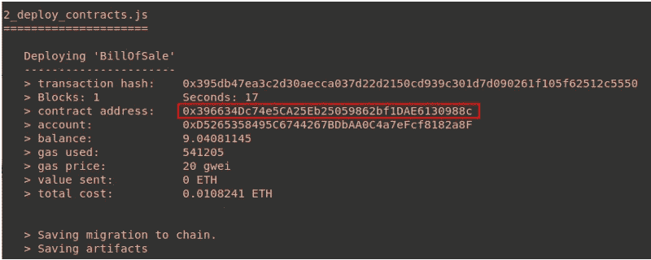
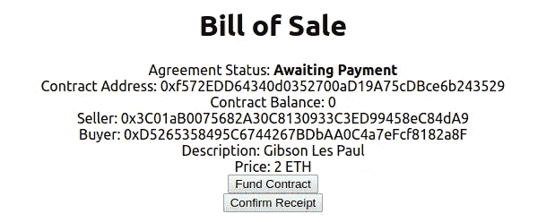

# OpenLaw 教程:智能协议的 DApps

> 原文：<https://medium.com/coinmonks/openlaw-tutorial-dapps-for-your-smart-agreements-3a3176f6563a?source=collection_archive---------5----------------------->

在这篇文章中，我们将学习如何创建一个以太坊 DApp 来与你在迈克尔·赖斯的教程[这里](/@OpenLawOfficial/openlaw-tutorial-blockchain-enabled-legally-enforceable-smart-contracts-24d5654050fa)中提出的法律协议和智能合同进行交互。

我强烈建议您在继续学习之前先完成该教程，因为这里涉及的内容更高级。除了本教程之外，构建 DApps 还需要 [ReactJS](https://reactjs.org/tutorial/tutorial.html) 的知识，但现在不是必需的。

在本教程结束时，您将已经创建了一个允许用户管理其已执行的销售协议清单的 DApp。用户可以查看协议的细节，买方将能够支付项目，卖方将能够在付款后提取他们的资金。

诚然，这篇文章在工具和如何做事上非常固执己见。有许多其他正确的方法来完成我们正在做的事情，但我发现这是最有效的开始方式。所以我们开始吧！

# 设置您的开发环境

我们的目标中有许多移动部分，因此请确保您已经完成了以下工作:

1.  安装 [Node.js v8+ LTS 和 npm](https://nodejs.org/en/) 。
2.  安装[元掩码](https://metamask.io/)(记得保存你的 12 字助记符，我们以后会用到)。MetaMask 为您的浏览器带来以太坊，允许您与 DApps 进行交互。
3.  从水龙头里拿些测试乙醚给 Rinkeby(我用的是[https://faucet.rinkeby.io/](https://faucet.rinkeby.io/))。你可以放弃社交媒体对 http://rinkeby-faucet.com/的验证，但它只给出 0.001 ETH
4.  用`npm install -g truffle`在你的终端里全球安装松露。Truffle 为以太坊 DApp 开发提供了一套全面的工具。
5.  注册一个 [Infura](https://infura.io/register) 帐户，并获取您的 API 密钥(登录后在项目 ID 标题下)。Infura 提供了一个远程节点，让您无需在本地下载以太坊区块链就可以部署您的合同
6.  安装一个文本编辑器(我最喜欢的是 [VS 代码](https://code.visualstudio.com/download))

如果您在这个过程中遇到任何问题，可以在这里找到代码的工作版本。

# 步骤 1:安装样板 DApp 和依赖项

1.  在终端窗口中，在您选择的文件夹中创建一个目录，然后在其中移动。

```
mkdir openlaw-dapp-tutorial
cd openlaw-dapp-tutorial
```

2.现在我们下载样板文件[松露盒](https://truffleframework.com/boxes)，它包括一个基本的以太坊 DApp 项目结构

```
truffle unbox joshma91/openlaw-react-box 
```

3.安装依赖项

```
npm install
```

4.在文本编辑器中打开您的`openlaw-dapp-tutorial`项目文件夹。如果您在 Windows 或 Linux 上使用 VS 代码，您可以在终端中运行以下代码

```
code .
```

## 目录结构

让我们快速浏览一下我们正在使用的目录结构:

*   `client/`:包含我们网站的[反应](https://reactjs.org/)文件
*   `contracts/`:包含我们智能合约的[可靠性](https://solidity.readthedocs.io/)源文件
*   `migrations/`:包含处理智能合同部署的[块菌](https://truffleframework.com/truffle)文件
*   `test/`:包含我们智能合约的 JavaScript 和可靠性测试
*   `truffle.js`:一个 Truffle 配置文件，指定了我们的合同构建目录和以太坊网络位置

# 步骤 2:创建和部署销售清单智能合同

1.  在`contracts/`目录下创建一个新文件`BillOfSale.sol`，内容如下。您可能还记得这是上一篇教程中的内容(略有修改):

`recordContract`函数有四个参数:商品描述、购买价格以及买方和卖方的以太坊地址。`confirmReceipt`功能允许买方确认收到他们的物品，并向卖方释放合同中存储的资金。

2.在项目根目录中，创建一个名为`.env`的文件，并用以下内容填充它:

```
MNEMONIC = “YOUR METAMASK 12 WORD MNEMONIC HERE”
INFURA_API_KEY = “YOUR INFURA API KEY HERE”
```

3.在`migrations/2_deploy_contracts.js`中，用`BillOfSale`替换`SimpleStorage`的所有 3 个实例。

4.在您的终端中运行以下命令，将合同部署到 Rinkeby Testnet:

```
truffle migrate --network rinkeby
```

这可能需要一段时间，但如果一切顺利，您应该会看到如下内容:



所以你的合同现在已经部署好了，更重要的是松露已经自动保存了`client/src/contracts/BillofSale.json`中的合同界面(合同 ABI)。这对于在步骤 4 中从 DApp 调用智能合约函数非常重要。

# 步骤 3:创建 OpenLaw 销售清单模板

这一步重复了你在迈克尔的教程中所做的，所以我不会解释下面发生的事情，但这里有完整的协议标记，所以你可以把它放到一个新的模板:[https://app.openlaw.io/new_template](https://app.openlaw.io/new_template)。

记得用上图中突出显示的“合同地址”替换`contract`字段。

# 步骤 4:创建 DApp

在你的文本编辑器中打开`client/src/App.js`，你会注意到已经有一堆代码在里面了。如果你是新手，这可能看起来很可怕，但只要仔细遵循这些指示，你会没事的。我们首先要做的是解开样板文件，用我们需要与`BillOfSale.sol`互动的代码来代替它。

首先，查看文件顶部附近，然后进行更改

```
import SimpleStorageContract from "./contracts/SimpleStorage.json"; 
```

到

```
import BillOfSaleContract from "./contracts/BillOfSale.json";
```

在`componentDidMount()`方法中，将`SimpleStorageContract`替换为`BillOfSaleContract`，如下所示:

```
const Contract = truffleContract(BillOfSaleContract);
```

将状态初始化(位于`class App extends Component`正下方的行)替换为:

```
state = { seller: null, buyer: null, descr: null, price: 0, web3: null, accounts: null, contract: null };
```

经过上面的更改，`App.js`现在引用了我们的`BillOfSale`契约的一个实例，并用我们将使用的变量初始化 React 状态。

光是解开 DApp 的样板就够了，但现在我们开始有趣的东西。在`App.js`的底部，将`componentDidMount()`的右括号后的所有方法**替换为以下内容并保存文件(靠近底部有一个右括号不应被替换):**

由于这不是一个 React 教程，以下是从上面学到的最重要的几点:

*   `runExample()`在`componentDidMount()` React 生命周期方法中被调用，该方法在页面加载之前运行，以从`BillOfSale.sol`获取合同余额、卖方&买方以太坊地址、物品描述&价格和协议状态
*   `setStatusMessage()`检查买方是否为智能合同提供了适当金额的资金，并相应地设置状态
*   `onFundClick()`在点击资金合同按钮时调用，提示用户以项目价格为合同提供资金
*   点击确认接收按钮，调用`onConfirmClick()`。如果被卖方以太坊地址调用，将触发`BillOfSale.sol`中的`confirmReceipt()`方法，将合同余额发送给卖方，并确认履行协议
*   `render()`是包含所有表示代码的 React 方法(JSX——可以说是 HTML 和 JavaScript 的混合)

# 第五步:把所有东西绑在一起

走到这一步需要付出很多努力，所以向你致敬！这是奇迹最终发生的地方。

## 执行 OpenLaw 协议

转到您创建的 OpenLaw 协议模板，并填写必要的字段(提示:保持低价格，例如 0.01 ETH，以确保您有足够的时间来玩)。将草案发送给签署人并签署协议。双方签字后，调用`BillOfSale.sol`中的`recordContract()`方法在区块链上存储您的协议细节。

## 跑 DApp

1.  现在，在您的终端中，我们将导航到`client/`目录，并通过运行以下命令启动我们的 DApp:

```
cd client
npm run start 
```

2.打开浏览器窗口，导航到 [http://localhost:3000，](http://localhost:3000,)确保您的元掩码设置为 Rinkeby。您应该会看到如下所示的内容:



此时，DApp 现在功能齐全，您应该尝试一下。在 MetaMask 中，切换到您的“卖方”地址，点击基金合同按钮并提交交易。交易被确认后(MetaMask 可以显示交易的状态)，刷新页面并观察显示信息的变化。

现在，将您的元掩码帐户更改为您的“买家”地址，并刷新页面。点击确认接收按钮并提交交易。确认交易后刷新页面，观察页面和元掩码余额的变化。

# 结论

恭喜你！通过创建一个可以通过以太坊 DApp 管理的端到端智能协议，您已经通过 OpenLaw 打开了一个法律工程的可能性世界。当然，这只是开始，关于使用这些工具可以实现什么，还有很多东西需要学习(当然包括我自己)。

要了解更多关于 OpenLaw 的信息，请查看他们的[网站](https://openlaw.io/)和[文档](https://docs.openlaw.io/)。我很乐意回答任何问题或只是聊天。在社区[的 Slack 频道](https://openlaw-community.slack.com/) (Josh Ma)，在 [Github](https://github.com/joshma91) ，或者在 [Twitter](https://twitter.com/Joshma91) 上联系我。

你可以在这里找到我做的另一个聪明的协议:

*   https://smart-trust.now.sh/ DApp
*   OpenLaw 协议:[https://app.openlaw.io/template/Revocable%20Living%20Trust](https://app.openlaw.io/template/Revocable%20Living%20Trust)

> [直接在您的收件箱中获得最佳软件交易](https://coincodecap.com/?utm_source=coinmonks)

[](https://coincodecap.com/?utm_source=coinmonks)