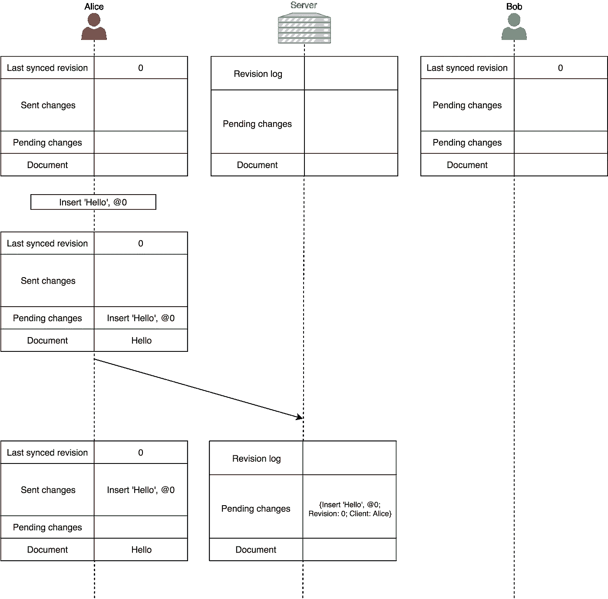

# 作为自动冲突解决算法的运算变换

> 原文：<https://medium.com/coinmonks/operational-transformations-as-an-algorithm-for-automatic-conflict-resolution-3bf8920ea447?source=collection_archive---------1----------------------->

# 1.介绍

具有多个引导节点的分布式系统中的自动冲突解决算法是一个非常有趣的研究领域。在这个领域有不同的方法和算法，它们都有自己的权衡，在本文中，我们将重点介绍 Operational Transformation 技术，该技术旨在解决协作编辑应用程序(如 Google Docs 或 Etherpad)中的冲突。

从开发的角度来看，协作编辑是一项很难解决的任务，因为客户几乎可以同时对文本的相同部分进行修改。为了模仿即时响应，每个客户端都必须维护自己的文档本地副本，否则客户端将不得不等到他们的更改与其他客户端同步，这可能会花费大量的时间。因此，协作编辑中的主要问题是确保本地副本之间的*一致性*，即所有副本都必须*收敛*到文档的相同、正确版本(请注意，我们不能要求所有副本在某个时间点都具有文档的相同副本，因为编辑过程可能是无止境的)。

## 1.1 谷歌文档的第一版

谷歌文档的第一个版本(以及其他类似的应用程序)使用了文档版本的比较。假设我们有两个客户——爱丽丝和鲍勃，他们的文档是同步的。当服务器收到 Alice 的更改时，它会计算她的版本和它的版本之间的差异，并尝试合并它们。然后，服务器将合并后的版本发送给鲍勃。如果 Bob 有自己的未发送更改，他会尝试将收到的服务器版本与自己的合并。重复这个过程。

通常，这种方法不会很好地工作。例如，假设爱丽丝、鲍勃和服务器从同步的文档“快速棕色狐狸”开始。

爱丽丝用粗体字表示“棕色狐狸”，同时鲍勃把“狐狸”改为“狗”。Alice 的更改首先到达服务器，它应用并进一步将更改发送给 Bob。合并的正确结果应该是“快速的**棕色狗”**，但是合并算法没有足够的信息来执行正确的合并。从他们的角度看“麻利的**褐狐**犬”、“麻利的**褐**犬”、“麻利的**褐**犬**狐**都是正确有效的结果。(在 git 中的这种情况下，您会有合并冲突，并且您必须手动合并)。因此，这就是主要问题——我们不能依靠这种方法进行合并。

## 1.2 最新谷歌文档版本

最新的谷歌文档版本遵循另一种方法——将文档存储为一系列操作，并按顺序应用它们(这里的顺序是指[总顺序](https://en.wikipedia.org/wiki/Total_order))，而不是比较文档的版本。

好的，现在我们需要理解**何时**应用变更——我们需要*合作协议*。在谷歌文档中，所有操作都可以归结为 3 种可能的类型:

*   插入文本
*   删除文本
*   应用样式

当您编辑文档时，所有的更改都以这三种类型之一附加到变更日志中，并且当您打开文档时，变更日志会从某个点重放。

(有 OT 支持的第一个(公共)谷歌项目是 Google Wave，其可能的操作集要丰富得多)

## 1.3 示例

让爱丽丝和鲍勃从一个同步的文档“生命 2017”开始。

Alice 将 2017 年更改为 2018 年，这实际上创建了两个操作:

同时，Bob 将文本更改为“2017 年疯狂生活”:

如果 Bob 在收到 Alice 的删除操作时只是应用了它，那么他得到了一个不正确的文档(数字 7 应该被删除了):

Bob 需要将删除操作转换为相应的本地更改，以获得文档的正确状态:

现在它是完美的。

为了使它更正式，让我们考虑以下示例:

然后

瞧。描述的算法是运算变换。

# 2.运营转型

## 2.1 一致性模型

很少有*一致性模型*能够为 OT 提供一致性。让我们考虑其中之一——CCI 模型。

CCI 模型由以下属性组成:

1.  聚合:在执行所有操作后，同一文档的所有副本必须相同

Alice 和 Bob 从同一个文档开始，然后进行局部更改，副本会发生分歧(因此实现了高响应性)。收敛属性要求 Alice 和 Bob 在收到彼此的更改后看到相同的文档。

2.意图保存:确保对任何文档状态执行一个操作的效果与该操作的*意图*相同。操作意图被定义为其执行对创建的副本的影响。
举一个违反该属性的例子:

Alice 和 Bob 从相同的文档状态开始，然后进行本地更改。Alice 操作的目的是在位置 1 插入“12”，Bob 操作的目的是删除“CD”。同步后，鲍勃的意图被违背了。我们也可以观察到复制品有分歧，但这并不是对意图保护属性的要求。练习:这个例子中正确的最终状态是什么？

3.因果关系保持:在协作过程中，操作必须按照其自然因果顺序执行(基于[发生-之前](https://en.wikipedia.org/wiki/Happened-before%22)的关系)。
让我们考虑这个属性被侵犯的例子:

爱丽丝、鲍勃、特工史密斯从同一个文档状态开始。Alice 完成她的更改并将其发送给其他客户。Bob 首先收到它，并纠正了打字错误，然后将此更改发送给其他客户端。由于网络延迟，特工史密斯首先收到鲍勃的操作，即删除一个在他的复制品中尚不存在的符号。

OT 不能保证这个特性，所以可以使用其他算法，如[矢量时钟](https://en.wikipedia.org/wiki/Vector_clock)。

## 2.2 加班设计

OT 设计策略之一是将其分为 3 个部分:

1.  转换控制算法:负责确定操作(转换目标)何时准备好进行转换，应该对哪些操作(转换引用)进行转换，以及应该以什么顺序执行转换
2.  转换函数:负责根据引用操作的影响对目标操作执行实际的转换
3.  属性和条件:定义转换控制算法和函数之间的关系，作为 OT 算法正确性的要求

## 2.3 转换功能

转换函数可以分为两种类型:

*   包含/正向转换:在 Ob 之前转换操作 Oa，以便包含 Ob 的效果(例如，两次插入)
*   排除/反向转换:在 Ob 之前转换操作 Oa，以便排除 Ob 的影响(例如删除后插入)

下面是一个处理字符变化的变换函数示例:

# 3.Google Docs 中的协作协议

让我们更详细地考虑一下 Google Docs 协作协议是如何工作的。

每个客户端维护以下信息:

*   上次同步修订(id)
*   尚未发送到服务器的所有本地更改(挂起的更改)
*   所有发送到服务器但尚未被确认的本地更改(已发送的更改)
*   用户可见的当前文档状态

服务器维护以下信息:

*   所有已接收但尚未处理的更改(待定更改)的列表
*   所有已处理更改的日志(修订日志)
*   上次处理更改时的文档状态

假设我们有 Alice、Server、Bob，他们从一个同步的空文档开始。

爱丽丝键入“你好”:

她的更改被添加到待定更改列表中，然后被发送到服务器并移到已发送的更改列表中。

与此同时，爱丽丝正在打字，她添加了“世界”。与此同时，鲍勃打出了“！”在他的空文档中(他没有收到 Alice 的更改):

Alice 的{Insert ' World，@5}被添加到待定更改中，但它未被发送，因为她的第一个更改尚未被确认，并且**我们一次仅发送一个更改**。还要注意，服务器已经处理了 Alice 的第一个更改，并将其移动到修订日志中。然后，它向 Alice 发送确认，并将她的更改传播给 Bob:

Bob 接收到变更，并对其应用转换函数，结果，其未决变更中的索引从 0 移动到 5。请注意，爱丽丝和鲍勃都将他们上次同步的修订更新为^ 1。Alice 最终从已发送的更改中删除了她的第一个更改。

接下来，Alice 和 Bob 都将他们未发送的更改发送到服务器:

服务器首先接收到 Alice 的更改，因此它对其进行处理，并向 Alice 发送确认，然后将其传播给 Bob。Bob 必须再次应用变换函数，并将他的局部改变转移到索引 11。

接下来是一个重要的时刻。服务器开始处理 Bob 的更改，但是因为 Bob 的修订 id 已经过时(2 对实际 3)，所以服务器根据 Bob 还不知道的所有更改转换他的更改，并将其保存为修订 3。

对于 Alice 来说，该过程现在已经完成，Bob 仍然需要接收转换后的更改并发送确认。

# 4.以太垫

让我们来看看另一个使用 OT 技术的协同编辑应用程序——http://etherpad.org

Etherpad 使用稍微不同的转换函数——它以下面的格式将变更作为*变更集*发送到服务器:

(p1 -> p2)[c_1，c_2，…]，

其中:

*   p1 —变更前的文件长度
*   p2 —更改后的文档长度
*   c_i —文档的定义:
    如果 c_i —数字或数字范围，则表示保留了*字符的索引，或者
    如果 c_i —字符或字符串，则表示插入*

示例:

*   " "+ (0 -> 5)["Hello"] = "Hello "
*   " Hllo World" + (10 -> 14)[0，' e '，1–9，"！！!"] =“你好世界！！!"

文档由应用于空文档的这种变更集的时间序列形成。

我们可以注意到，服务器不能只应用来自客户端的更改(尽管在 Google Docs 中是可能的)，因为文档的长度可能不同，例如，如果客户端 A 和 B 从相同的长度为 n 的文档 X 开始，并且分别执行以下更改集:

答:(n -> n_a)[…]，

B: (n -> n_b)[…]

那么 B(A(X))是不可能的，因为 B 需要长度为 n 的文档，但它在 A 之后的长度为 n_a。为了解决这个问题，etherpad 引入了所谓的 *merge* 函数，该函数采用将**应用于同一文档状态**的 2 个变更集，并计算新的单个变更集。要求

当客户端 A 从客户端 B 接收改变时，计算 m(A，B)不是非常有用，因为 m(A，B)适用于状态 X，但是 A 处于状态 A(X)。相反，我们应该这样计算 A '和 B '

为了简单起见，让我们定义一个*跟随*函数 *f* :

这是通过以下算法建立的(对于 f(A，B)):

*   中的插入成为保留字符
*   B 中的插入成为插入
*   保留 A 和 B 中所有保留的字符

## 例子

然后

现在试着计算合并后的最终状态 m(A，B)(X)。

# 5.OT 批判

*   所有文档更改必须在一组操作中保存
*   OT 的实现可能是一项非常复杂的任务，引用维基百科:
    同样，Joseph Gentle 是前 Google Wave 工程师，也是该分享的作者。JS library 写道，“不幸的是，实现 OT 糟透了。有一百万种算法有不同的权衡，大部分困在学术论文中。正确实现这些算法非常困难和耗时。[……]Wave 花了 2 年时间来编写，如果我们今天重写它，那么第二次编写几乎需要同样长的时间。”

# 6.参考

*   [群件系统中的并发控制](https://www.lri.fr/~mbl/ENS/CSCW/2012/papers/Ellis-SIGMOD89.pdf)
*   [新的谷歌文档有什么不同:一起工作，甚至分开工作](https://drive.googleblog.com/2010/09/whats-different-about-new-google-docs_21.html)
*   [新的谷歌文档有什么不同:冲突解决](https://drive.googleblog.com/2010/09/whats-different-about-new-google-docs_22.html)
*   [理解并应用操作转换](http://www.codecommit.com/blog/java/understanding-and-applying-operational-transformation)
*   [维基百科:运营转型](https://en.wikipedia.org/wiki/Operational_transformation)
*   [Jupiter 协作系统中的高延迟、低带宽窗口](https://dl.acm.org/citation.cfm?id=215706)
*   [新的谷歌文档有什么不同:让协作更快捷](https://drive.googleblog.com/2010/09/whats-different-about-new-google-docs.html)
*   [实时群组编辑器中的操作转换:问题、算法和成果](http://citeseerx.ist.psu.edu/viewdoc/download?doi=10.1.1.53.933&rep=rep1&type=pdf)
*   [以太网垫和 EasySync 技术手册](https://github.com/ether/etherpad-lite/blob/develop/doc/easysync/easysync-full-description.pdf)
*   [Google TechTalks:设计实时协作编辑系统的问题和经验](https://www.youtube.com/watch?v=84zqbXUQIHc)
*   [运营转型常见问答](http://www3.ntu.edu.sg/home/czsun/projects/otfaq/)

> 加入 Coinmonks [电报频道](https://t.me/coincodecap)和 [Youtube 频道](https://www.youtube.com/c/coinmonks/videos)获取每日[加密新闻](http://coincodecap.com/)

## 另外，阅读

*   [复制交易](/coinmonks/top-10-crypto-copy-trading-platforms-for-beginners-d0c37c7d698c) | [加密税务软件](/coinmonks/crypto-tax-software-ed4b4810e338)
*   [网格交易](https://coincodecap.com/grid-trading) | [加密硬件钱包](/coinmonks/the-best-cryptocurrency-hardware-wallets-of-2020-e28b1c124069)
*   [密码电报信号](http://Top 4 Telegram Channels for Crypto Traders) | [密码交易机器人](/coinmonks/crypto-trading-bot-c2ffce8acb2a)
*   [最佳加密交易所](/coinmonks/crypto-exchange-dd2f9d6f3769) | [印度最佳加密交易所](/coinmonks/bitcoin-exchange-in-india-7f1fe79715c9)
*   开发人员的最佳加密 API
*   最佳[密码借贷平台](/coinmonks/top-5-crypto-lending-platforms-in-2020-that-you-need-to-know-a1b675cec3fa)
*   [杠杆代币](/coinmonks/leveraged-token-3f5257808b22)终极指南