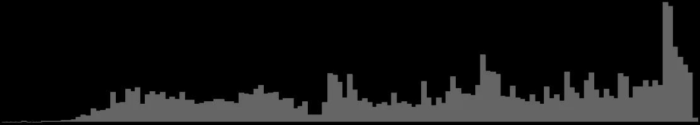
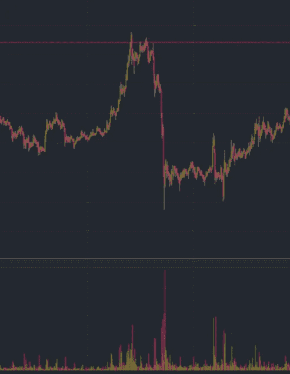
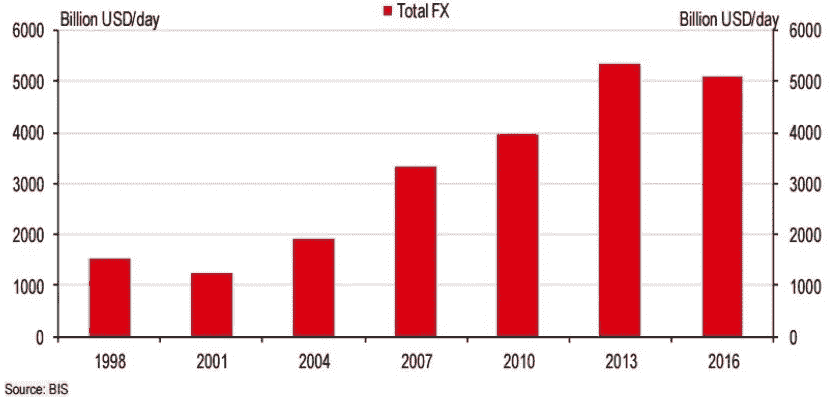
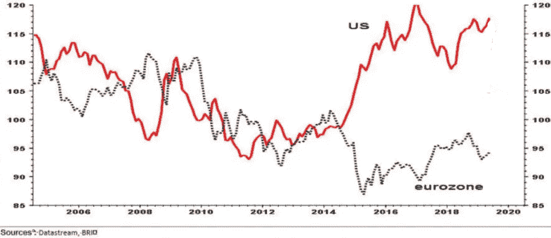
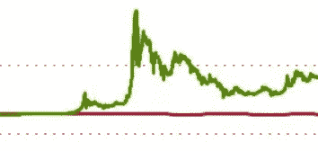

# 观点:比特币不会很快让你变得富有。

> 原文：<https://medium.com/coinmonks/opinion-bitcoin-wont-make-you-rich-any-time-soon-284bbe847885?source=collection_archive---------1----------------------->

**Bitcoin (BTC)**

**[**简单几何！**](https://www.google.com/search?q=overwatch+hanzo&newwindow=1&rlz=1C1CHBD_enUS896US896&sxsrf=ALeKk03W0x_ayIRrWot8yk3AdJNYVBmX6g:1587388825712&source=lnms&tbm=isch&sa=X&ved=2ahUKEwiXus6YjPfoAhUD16wKHb4CC-4Q_AUoAXoECHQQAw&biw=1536&bih=722)**——*一个不知名的武士*****

****比特币(BTC)的投机性质一直是其命脉，是其价格背后的驱动力。早期采用者、投机交易者和愿意开采这些硬币的男男女女长期以来一直是比特币价格的决定者。对于这些人中的大多数人来说，许多夜晚都在计算这枚硬币的潜力。截至发稿时，比特币的价格约为 6850 美元，比 2017 年的历史高点低约 12650 美元。****

****在比特币的早期历史中，只有最懂计算机的人才对它感兴趣，它与任何市场都没有关联。这是事实，因为比特币与其说是一种货币，不如说是一个科学项目。这将在 2017 年发生巨大变化，届时比特币将通过如此巨大的价值增长向世界宣布其存在，几乎没有人会忽视其潜力。****

********

****在比特币 2017 年创下历史新高后，它将再次跌至更现实的价值。这种戏剧性的上涨，然后是修正，将是一种新的世界货币的诞生。这将标志着对美元霸权的威胁，并立即引起渴望低风险、高回报投资的华尔街交易员的注意。尽管如此，即使在这一事件之后，比特币也只是一种假设情况下的货币。尽管证明了价值，比特币还没有被大量点对点交易。相对于其他政府发行的货币，比特币几乎没有交易。尽管估值很高，但考虑到所提供的使用案例，比特币的衰落将源于其交易量的不足，而交易量是衡量一种货币健康和潜力的关键指标。****

****对于比特币纯粹主义者来说，用美元衡量比特币的价值是愚蠢的。他们认为衡量成功的唯一标准是他们获得的比特币数量。对于更短线的投资者来说，他们认为比特币的价值来自于其交易账户中产生美元的能力，他们只关心比特币可能会推高价格这一点。这两类投资者之间的思想分歧是比特币每日波动的一个重要因素。一方面，我们有渴望收集比特币的投资者，另一方面，我们也有等待最佳时机退出比特币头寸并向其账户盈利的投资者。****

****在比特币投机者社区内部，正在进行一场讨论。这场讨论谈到了比特币与传统市场的相关性或因果关系。谁能证明比特币与传统市场相关？为什么这很重要？与其关注趋势或过去的价格走势，我会建议将成交量作为我们得出结论的主要指标。****

********

****Bitcoin’s volume over time, 2017–2020.****

****为什么比特币与传统市场的相关性如此重要？简单地说，如果比特币要有未来，它必须与传统市场相关联。比特币最大的卖点是，它有可能成为一种交易活跃的货币，一种价值储存手段。长期以来，无论地理位置如何，美元一直是财富与商品和/或服务交换的主要方式。这在不久的将来可能会改变。****

********

****BTC price action (above) and volume (below).****

****左图是 BTC [价格行为](https://www.investopedia.com/terms/p/price-action.asp)(上半部分)和[交易量](https://www.investopedia.com/terms/v/volumeoftrade.asp)(下半部分)的样本。价格行为只是交易资产价格的运动，上升或下降。成交量是在任何给定时刻交易的比特币数量的代表。在没有额外信息的情况下，只看左边的图表，我们可以确定交易量的增加与价格行为相对应。在比特币的整个生命周期中，这种相关性以不同的强度多次出现。****

****以“鸡生蛋还是蛋生鸡”的方式，价格可以驱动销量，而销量可以驱动价格。这两个要素的相互关系很难分开，因为它们是如此内在地联系在一起。我觉得交易量，特别是 [OTC](https://www.investopedia.com/terms/o/otc.asp) 交易量，是交易中最容易被误解的因素之一。现在，让我们停留在这样的简化上:价格变化，交易量也必须变化，反之亦然。****

****这些波动之所以如此有趣，是因为它们会重复，就像市场中的任何模式一样，它们允许交易者获得重要信息来推测未来价格。要预测未来价格，我们必须像传统交易者那样思考；我们必须将比特币与其潜在竞争对手美元进行比较。****

********

****Volume of US Dollars traded in the open market.****

****上图是美元的历史成交量。这个数字代表一个总的估计，因为计算真实的 OTC 量是一件徒劳的事情。正如我们所看到的，随着时间的推移，交易量只增加了美元，交易量以万亿计。这种交易量很大程度上可以归因于大型对冲风险机构或像乔治·索罗斯这样的高价值投机者。这一交易量的相当一部分可以归因于[散户](https://www.investopedia.com/terms/r/retailinvestor.asp)，他们只是在不同货币之间进行交易，希望从每时每刻的价值变化中获取财富。不管原因是什么，很明显，美元经常交易，交易者是许多不同层次的人。每天如此巨大的交易量，让人相信它是最高储备货币。****

****由于美元交易的激烈和频繁，它允许非常精确的价格发现。简而言之，价格发现是市场交易的一种方式，旨在发现标的资产随着时间推移的“真实”价值。在以后的文章中，我将更深入地讨论这一点，但现在，我希望读者理解的是，价格发现是功能性(健康)货币的重要组成部分。价格发现是交易者在特定时刻对公平市场价值达成共识的结果。价格发现随时都在发生；没有例外。价格行为是“谈判”(交易/交易)的结果，谈判的结果是发现交易者可以交易的“公平”价格。随着价格的变化，交易量增加(非线性关系)。随着交易量的增加，价格也在变化。价格行为、价格发现和交易量这三位一体是许多久经考验的资产价值和潜在价值指标的基础。请注意，价格发现并不意味着波动。****

********

****在上图中，我们可以看到美元相对于欧洲货币的平均价值。乍一看，这个图表非常混乱，在某种程度上，你这样想可能是对的。检查这张图表的比例，我们看到它涵盖了大约 14 年的贸易。美元先升值后贬值，是宏观经济事件与[投机价值](https://www.investopedia.com/terms/s/speculation.asp)共同作用的结果。对于交易者来说，不管有没有杠杆，都有风险。[风险](https://www.investopedia.com/terms/r/risk.asp)，在交易的背景下，是一个结果或投资的实际收益与预期结果或回报不同的可能性。我向你保证，在上述 14 年的数据中，一些交易者承担了他们不应该承担的风险。****

****比价格波动或交易量更重要的是，我想让你明白另一件事:这两种货币之间的差额从来没有超过初始值的百分之三十。尽管并不完美，但美元保持了一个可接受的足够大的价值储备，它仍然是世界上交易量最大的储备货币。正因如此，这也是为什么我们必须将比特币与美元相提并论的原因。****

********

****现在让我们以美元为标准，从价格行为、交易量和价格发现的角度来评估比特币。首先，让我们检查体积。平均而言，所有市场的美元总量每天将达到约 6 万亿美元。这与比特币每天 20 到 330 亿的区间形成了鲜明对比。美元每天的交易额是比特币的 180 倍。比特币交易量的不足表明，很少有人将它用于其预期目的——作为一种货币——而不是投机其未来价值。这导致了一个问题:在比特币被用作货币之前，我们将无法确定它被用作货币的背景下的公平市场价值。****

****接下来，让我们来看看价格行为。在上面显示美元价格与欧元平均价格的图表中，我们可以确定最大的价格差大约是百分之三十。交易者投资组合的 30%的变化可能是非常好的一天，也可能是非常糟糕的一天。对一些人来说，这风险太大，而对另一些人来说，他们只希望价格有更大的变化。由于我们使用美元作为基准世界储备货币，让我们假设它的功能如预期的那样，价值 30%的变化是可以接受的。****

********

****左图是比特币(绿色)对美元(红色)的价格。对于任何没有购买过比特币最小功能形式(类似于美国便士)的人来说，你可能会开始在脑海中计算如何开始获得这些神奇的硬币。你可能已经在猜测，如果投资这笔资产，你会获得多少收益。我附上这张图片不是为了吸引你，而是为了吓你一跳。许多人(大多是缺乏经验的交易者)基于过去的表现(有效)进行猜测，但完全忽略了比特币在短期内可能会跌至多低，因为它没有被采用，或者监管压力可能会造成破坏。****

****虽然比特币在几天内的涨幅超过了 1000 %,但在硬币的另一面，交易者很快被彻底消灭。死人很少说话，我向你保证，任何赌输了全部投资组合的交易者都会觉得自己死了。****

****对于美元，在特定情况下，你*可能*失去你的全部投资组合(杠杆交易)，但这在正常市场中不太可能发生。是的，30%的价值变化是残酷的，但请记住，这是比特币著名的千分之一移动道路上的一个小颠簸。每个人都想象自己中了彩票，很少有人预见自己会因为市场的一点坏消息而失去所有的财富。在这种理解下，美元提供了比特币所不能提供的安心。****

****对于美元来说，与比特币相比，价格发现是一个非常温和的过程。比特币疯狂地寻求找到其真实(当前)价值。对于比特币投机者来说，一个交易日显示你持有量变化 30%一点也不罕见。对于拥有良好信息甚至更好时机的投机者来说，这种价格行为是他们的命根子，这是他们如何谋生的。投资任何其他资产都不太可能带来比特币那样的潜在收益。这创造了一个正反馈循环，不断吸引风险最大的交易者。每一次价格飙升都是对其他投机者的一次交配召唤，让他们看到了潜力。这反过来创造了更多的交易量，更多的价格行为，但更不稳定的价格发现，因为每个投机者都有他们对一个真实价格的想法，但没有具体的证据。****

****在比特币作为一种货币被广泛采用之前，它将一直处于不断投机的地狱之中。美元的价值并不是一成不变的，它的价值确实有具体的证据。美元可以很容易地与现实世界的商品和服务进行交易。作为人类，我们可以体验这些商品和服务，并在个人层面上确定我们是否做了一笔好的“交易”。对于比特币来说，这并不简单。用比特币交易各种商品和服务是可能的，但它的 T2 购买力依赖于它与美元的汇率，而不是人类主动比较一条面包的公平交易量。这种与现实的脆弱联系，仅仅通过美元来桥接，使得比特币的流沙在片刻之间增长和收缩，这种增长和收缩要么仅仅基于恐惧，要么仅仅基于繁荣。****

****现实和比特币之间的障碍只会让急于说服你为什么应该购买比特币的市场人士受益。上面说了，比特币的未来价格很大程度上是未知的。比特币有可能颠覆美元作为储备货币的主导地位，有可能成为一个世界的货币，而且非常容易获得，因此比特币成为未来价格上涨的合理理由。这个未来有多远，不得而知。比特币能达到(并保持)多高是一个更大的未知数。如果你持有比特币，只期待未来快乐的日子，那么你对市场的方式没有经验。对我个人来说，我认为通往资本增长的道路是漫长的，充满了智慧，我预计这个旅程将会硕果累累。在那之前，我仍然认为比特币市场在近期和很长一段时间内的交易价格都在 5500 美元或附近。我计划在随后的文章中讨论我的推理，我认为这不仅是比特币的公平市场价值，也是为什么世界各地的交易员会同意我的观点。截至本文发表时，我目前持有比特币头寸。****

********

# ****“穷人会教富人”****

****校对提供，金伯利苏，自由校对。****

****【Kimberly@ProofreadingByKim.com ****

****[www.ProofreadingByKim.com](http://www.proofreadingbykim.com/)****

> ****[直接在您的收件箱中获得最佳软件交易](https://coincodecap.com/?utm_source=coinmonks)****

********