# 优化加密货币投资组合的风险

> 原文：<https://medium.com/coinmonks/optimizing-risks-for-a-portfolio-of-cryptocurrencies-dd624955c22a?source=collection_archive---------0----------------------->

## cvxpy python 包用法介绍

与[马克西姆·科罗特科夫](/@korotkov.maxim)和[德米特罗·卡拉巴什](/@dmytro.karabash)共同创作


credit [geralt](https://pixabay.com/fr/users/geralt-9301/) at pixabay

在本帖中，我们将讨论如何优化一个简单的加密货币投资组合。下面的方法已经成功地应用到股票期权交易中，正如我们所看到的，对加密也很有效。此外，crypto 非常适合学习和尝试现代交易策略，因为你可以免费获得所需的历史货币数据(我们将在下面展示如何操作)。在这篇文章中，我们做了一个简单的投资组合组合，并应用 CVXPY 优化来介绍库和方法，我们将在下一篇文章中探讨更复杂的基于随机贴现因子的策略。

欢迎你在 colab 上打开我们的[笔记本](https://yourdatablog.com/cryptopt/)看完整的工作代码，这里我们隐藏了一些技术部分。

# 数据采集

本练习的数据是使用 Python API 客户端`python-binance`从币安 API 获得的。虽然获取股票市场的类似数据本身是一项相当艰巨的任务(除非你为一家交易公司工作)，但在密码世界里，这是轻而易举的事情。

数据采集代码示例:

> ***注意:*** *如果需要，使用 pip 安装模块(* pip 安装 python-币安)

```
from binance.client import Client
binance_api_key = 'YOUR-API-KEY'
binance_api_secret = 'YOUR-API-SECRET'
binance_client = Client(api_key=binance_api_key
                ,api_secret=binance_api_secret)
klines = binance_client.get_historical_klines(symbol
                 ,kline_size, date_from, date_to)
data = pd.DataFrame(klines, columns = [COLUMNS])
```

以下每日配对已下载并格式化为 pd 数据帧:

1.  BTCUSDT
2.  埃胡斯特
3.  BNBUSDT
4.  LTCUSDT

对于每个时间点，币安提供传统的 OHLC(开盘、盘高、盘低、收盘)和成交量数据。在本练习中，我们只使用了`Close`列。人们可能会考虑所有五个值的组合，并得出一个不同的(可能更可靠的)指标，例如:加权平均价格。为了简单起见，我们将限于基本的一个

数据被加载和转换:

```
fuldf = (pd.read_csv('https://raw.githubusercontent.com/h17/fastreport/master/data/cryptosdf/data.csv',parse_dates=['timestamp'])
        .set_index('timestamp')
        )
y_label = fuldf.columns[0]
factors = (fuldf
           .columns
            .tolist()
          )

total_size = fuldf.shape[0]

train_set = .8

train_id = int( total_size * train_set)
df_train = fuldf.iloc[:train_id]
df_test = fuldf.iloc[train_id:]
split_index = fuldf.iloc[train_id].name
```

四种加密资产的联合时间序列如下:

```
df_train.head()
```

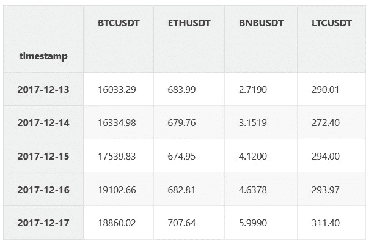

input dataframe

每个交易对都有不同数量的可用数据:币安最古老的可交易加密工具是 BTCUSDT 和 ETHUSDT——数据点可从*2017–08–17*获得。对于 BNBUSDT 和 LTCUSDT，首个交易日分别为*2017–11–06*和*2017–12–13*。

我们在最早的共同交易日将这些时间序列连接在一起:*2017–12–13*到*2021–06–14*。完整的联合数据集大小等于 1280 个样本。为了正确训练模型，我们在*2020–10–02*将数据集分成训练集和测试集。

训练间隔:*2017–12–13*至*2020–10–02*(1024 个数据点)。

下图是对数标度下完整数据集的联合图。虚线表示在*2020–10–02*的列车测试分离

```
plot_data =np.log(fuldf)
fig , ax = plt.subplots(figsize=(12,7))
plot_data.plot(ax=ax,alpha=0.8)
ax.legend(loc=0)
ax.set(title='Assets',xlabel='Date',ylabel='price, log scale');

ax.axvline(split_index,color='grey', linestyle='--', lw=2);
```

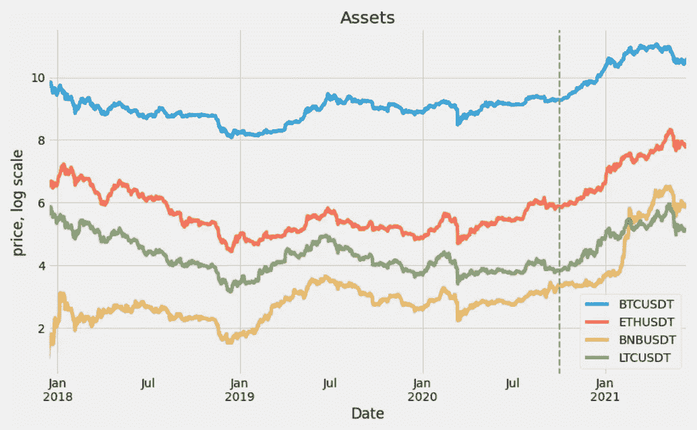

log prices of crypto assets

```
#Transform raw data to log-return format:
lret_data = np.log1p(df_train.pct_change()).dropna(axis=0,how='any')
```

# 数据转换

为了正确训练，输入时间序列必须转换成对数返回格式:

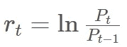

其中 *P_t* 是资产在时间 *t* 的价格。该模型需要矢量 *I* 来执行优化:

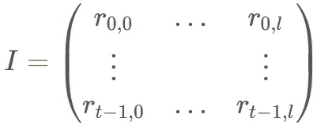

其中 *l* 是模型中特征的数量。

```
I = (lret_data[factors].iloc[1:].values)

print(I.shape,'\n',I[:10,:])
```

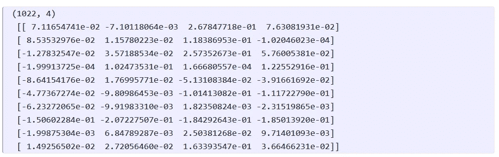

```
F = pd.DataFrame(I)
F.columns = factors#+ [y_label]
F.cov()
```

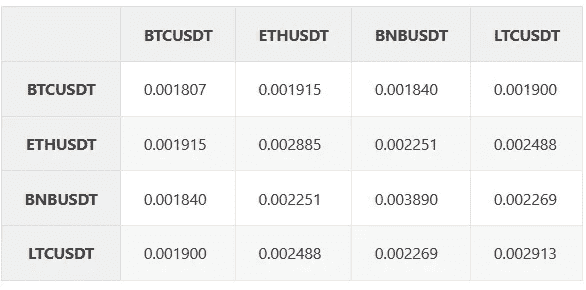

covariance matrix

```
f = plt.figure(figsize=(10, 10))
cov_data = F.cov()
mask = np.triu(np.ones_like(cov_data))
dataplot = sb.heatmap(cov_data.corr(), cmap="YlGnBu", annot=True, mask=mask)
plt.title('Covariance Matrix', fontsize=16);
```

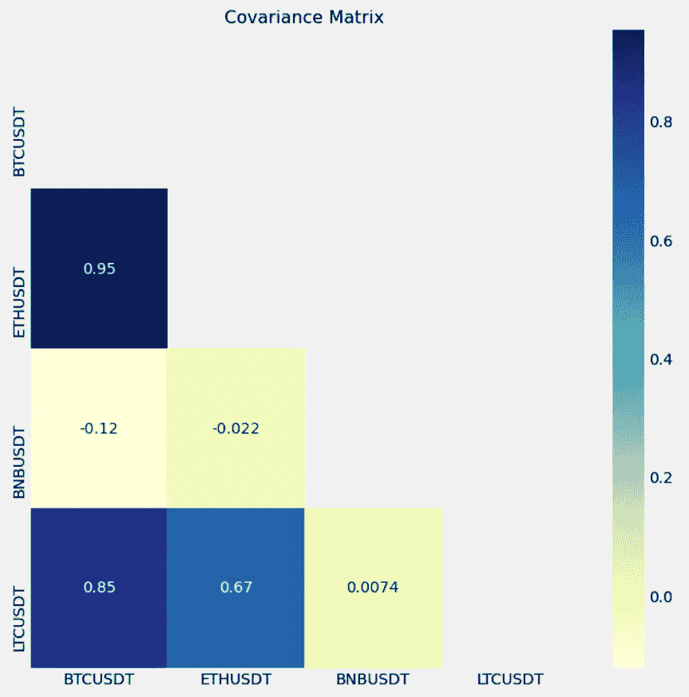

covariance matrix plot

# 模型

我们的目标是解释单个股票收益截面的差异。

让 *I* 表示在时间 *t* 的加密资产的返回。我们试图获得在给定固定回报的情况下使风险最小化的权重。投资组合收益 *R* 可以表示如下:

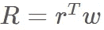

对于这个模型组合，我们的目标是 100%的回报，这在加密领域是很有希望的。我们将只对持有一段时间的投资进行建模。
这个问题可以表述为:

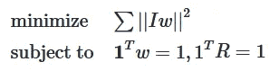

由于上述问题是凸的，我们可以使用`cvxpy`框架来估计模型投资组合的 *w* 。

> **注:**在现实中，你希望在给定固定风险的情况下获得最大回报，但由于 CVXPY 和半线性规划的设置方式，这个公式并不遵循有纪律的凸规划规则(参见[https://dcp.stanford.edu/](https://dcp.stanford.edu/))，所以我们使用前一个公式，因为它是等价的。此外，你可能需要固定回报和低风险模型，这取决于你的业务类型和你的风险偏好。

```
#define weights
w = cp.Variable(shape=(I.shape[1]
                        ,1),nonneg=True)

#Define expression
R = I @ w

#Construct the problem
prob = cp.Problem(cp.Minimize( cp.norm(R) )
                 , [ cp.sum(R) == 1 
                    ,cp.sum(w) == 1
                    ]

                )
prob.solve(verbose=True)

print('weights for the model:\n',dict(zip(factors,w.value)))
```

优化运行的 CVXPY 输出:

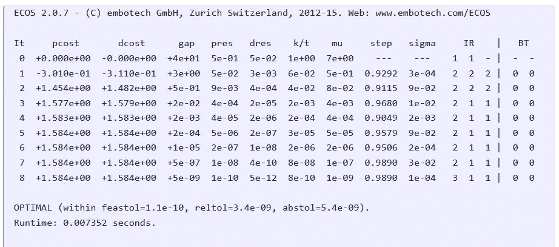

# 结果

让我们定义效用函数来分析我们的模型组合:

```
def sharpe(x):
  return (x.mean() / x.std() * np.sqrt(365))

def calc_metrics(data):
  p_return = ((data[factors].pct_change().fillna(0))
              .apply(lambda x: (x @ w.value)[0] ,axis =1)
              .rename('Model Portfolio')
              )
  returns = data.pct_change().fillna(0)
  returns['Model Portfolio'] = p_return
  sharpes = returns.apply(np.log1p).apply(sharpe)
  pnls = (returns.apply(np.log1p).sum().apply(np.expm1)).apply(lambda x:f'{100*x:4.2f}%')
  result = pd.concat([sharpes,pnls],axis=1)
  result.columns='sharpes pnls'.split()
  return result

def plot_return(data,title):
  datac = data.copy()
  fig , ax = plt.subplots(figsize=(13,5))

  y_return = (datac[factors].pct_change().fillna(0)+1)

  p_return = ((datac[factors].pct_change().fillna(0) + 1)
              .apply(lambda x: (x @ w.value)[0] ,axis =1)
              .rename('Model Portfolio')
              )

  p_return_c = p_return.cumprod()
  y_return_c = y_return.cumprod()
  portfolio_benchmark = pd.concat([y_return_c,p_return_c],axis=1)

  #change to the log scale 
  portfolio_benchmark = np.log1p(portfolio_benchmark)
  portfolio_benchmark[factors].plot(ax=ax,alpha=.5)
  portfolio_benchmark['Model Portfolio'].plot(ax=ax,alpha=.7,color='black')
  ax.legend(loc=0)
  ax.set(title=title,ylabel='growth factor',xlabel='date')

  return portfolio_benchmark
```

下面是对训练数据集计算模型投资组合并根据指数投资组合(BTCUSDT)绘制的结果:

```
calc_metrics(df_train)
```

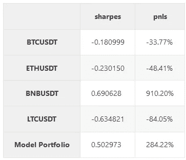

In-sample performance

```
portfolio_benchmark = plot_return(df_train,'In-sample: Performance of the Model Portfolio')
```

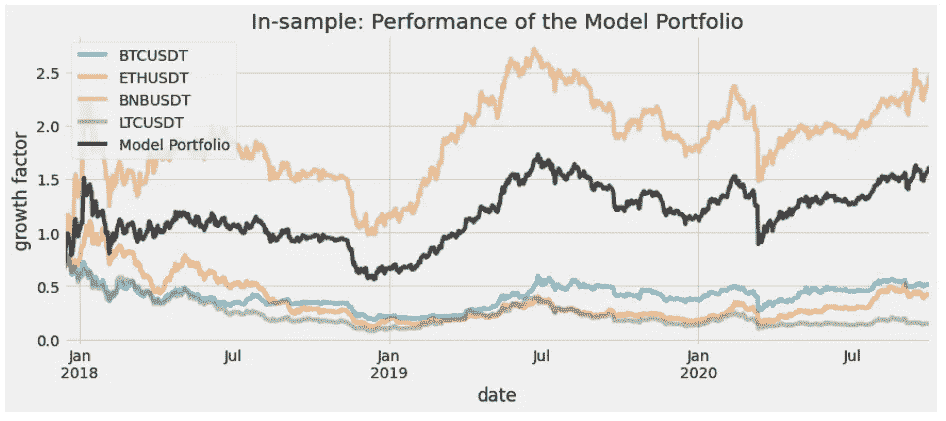

in-sample results

不公开数据集的结果图和指标:

```
calc_metrics(df_test)
```

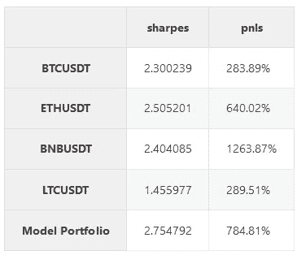

Out-of-sample performance

```
portfolio_benchmark_ho = plot_return(df_test,'Out-of-sample: Performance of the Model Portfolio')
```

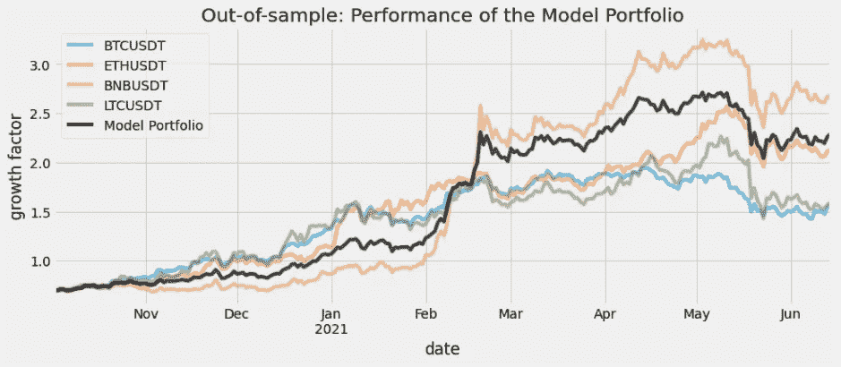

Out-of-sample results

# 结论

在这个练习中，我们固定了我们投资组合的回报，并最小化了风险——我们得到了比任何硬币都更好的夏普，表现介于最好和第二好的硬币之间。

> *免责声明:本文作者不使用这些方法进行任何投资，也不建议使用本文进行投资。这只是为了 CVXPY 的演示目的。这里介绍的材料是在没有回溯测试、日常模拟或前沿库的情况下完成的。我们建议使用 MOSEK 库和更严格的方法。*

最初发表于[https://yourdatablog.com](https://yourdatablog.com)

加入 [Coinmonks 电报频道](https://t.me/coincodecap)，了解加密交易和投资

[](https://blog.coincodecap.com/crypto-exchange) [## 最佳加密交易所| 2021 年十大加密货币交易所

### 加密货币交易所的加密交易需要了解市场，这可以帮助你获得利润…

blog.coincodecap.com](https://blog.coincodecap.com/crypto-exchange) [](https://blog.coincodecap.com/crypto-lending) [## 2021 年 9 大最佳加密借贷平台

### 当谈到加密货币贷款时，大量因素等同于良好的收入状况。此外，借款的一部分…

blog.coincodecap.com](https://blog.coincodecap.com/crypto-lending) [](/coinmonks/crypto-trading-bot-c2ffce8acb2a) [## 2021 年最佳加密交易机器人(免费和付费)

### 2021 年币安、比特币基地、库币和其他密码交易所的最佳密码交易机器人。四进制，位间隙…

medium.com](/coinmonks/crypto-trading-bot-c2ffce8acb2a) [](/coinmonks/best-crypto-signals-telegram-5785cdbc4b2b) [## 最佳 4 个加密交易信号电报通道

### 这是乏味的找到正确的加密交易信号提供商。因此，在本文中，我们将讨论最好的…

medium.com](/coinmonks/best-crypto-signals-telegram-5785cdbc4b2b) [](https://blog.coincodecap.com/blockfi-review) [## BlockFi 评论 2021:利弊和利率

### 今天，我们提出了一个全面的 BlockFi 评论，这是一个成立于 2017 年的加密贷款平台，拥有其…

blog.coincodecap.com](https://blog.coincodecap.com/blockfi-review) [](/coinmonks/buy-bitcoin-in-india-feb50ddfef94) [## 如何在印度购买比特币？2021 年购买比特币的 7 款最佳应用[手机版]

### 如何使用移动应用程序购买比特币印度

medium.com](/coinmonks/buy-bitcoin-in-india-feb50ddfef94) [](/coinmonks/best-crypto-tax-tool-for-my-money-72d4b430816b) [## 加密税务软件——五大最佳比特币税务计算器[2021]

### 不管你是刚接触加密还是已经在这个领域呆了一段时间，你都需要交税。

medium.com](/coinmonks/best-crypto-tax-tool-for-my-money-72d4b430816b) [](https://blog.coincodecap.com/pionex-review-exchange-with-crypto-trading-bot) [## Pionex 评论-被动交易者的简单交易机器人

### 在本文中，我们将回顾 Pionex，它提供了加密交易机器人自动化工具，集成了一个…

blog.coincodecap.com](https://blog.coincodecap.com/pionex-review-exchange-with-crypto-trading-bot) [](https://blog.coincodecap.com/best-hardware-wallet-bitcoin) [## 存储比特币的最佳加密硬件钱包[2021]

### 保管您的数字资产很容易，但找到正确的存储方式却是一项繁琐的任务。在线钱包有一个风险…

blog.coincodecap.com](https://blog.coincodecap.com/best-hardware-wallet-bitcoin)