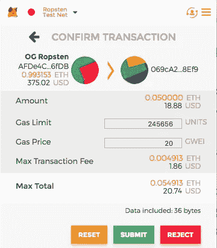
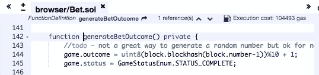
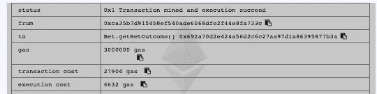

# 优化您的固体合同的天然气使用

> 原文：<https://medium.com/coinmonks/optimizing-your-solidity-contracts-gas-usage-9d65334db6c7?source=collection_archive---------0----------------------->


以太坊社区的人都知道，*气*是智能合约执行的必要之恶。如果指定得太少，您的事务可能无法及时得到处理，或者在处理智能合约操作的过程中死亡。也就是说，一个聪明的合同不应该对用户委托给他们的有价值的资源贪得无厌。正是出于这个原因，我们将研究调整和优化我们的合同，以尽量减少所需的天然气量。

> [发现并评估最佳区块链 api 和节点产品](https://coincodecap.com/category/blockchain-node-and-api)

## 作为用户使用气体

在以太坊中指定气体量时，需要考虑两个因素。第一个是**汽油限量**或放入你的智能合约油箱的总*加仑*汽油。请注意，这个数量实际上只影响智能合约执行本身，并且必须足以满足智能合约所需的所有资源。否则，你会得到一个 *Out of Gas* 异常。像 *MetaMask* 这样的工具会尝试对这个值做出最好的猜测，并且在一个不拥挤的以太网上或多或少是正确的。关键的一点是，任何未使用的气体将返回给你。

**即**。你设置了 30 万的汽油限额，交易只需要 20 万——30 万不会向你收费。汽油限额是你愿意花多少钱，而不是 T21 有多少钱。

用于发送交易的与气体消耗相关的第二个参数是**气体价格**。该金额通常用**gwei**(**Wei**)表示，并且不影响交易的执行或智能合约交互，而是影响交易被添加到块的速度。用汽车的燃料来类比，这个价格就是你支付的燃料价格。如果您支付更高的汽油价格，您的交易将更快地添加到区块中，从而加快交易的处理速度。用今天的术语来说，20 gwei 是一个平均支付价格，意味着你的交易将会很快得到处理。50 gwei 的价格将使您几乎立即处理，而 5 gwei 的价格将需要几分钟。根据你要写的 dApp 的类型，汽油价格是一个强大的特性。像[https://eth gastation . info](https://ethgasstation.info)这样的地方可以帮助你了解当前的网络负载以及相应的与气价相关的等待时间。



**MetaMask Transaction(See Gas Limit and Gas Price)**

## 作为开发人员使用气体

作为开发商，你根本不担心**天然气价格**，但你希望你的智能合同**天然气限制**落在你特定 dApp 的合理成本基础内。例如，如果您正在创建一个智能合同来处理价值 100 万美元的 eth 的托管，您可能不关心 5 美元的汽油限额。然而，如果你在做一个每篇帖子 5 美元的社交平台，你会很快让你的用户破产。您需要设计您的智能合约来适应您的使用案例，因为现在以太坊的处理能力和存储非常昂贵。

在区块链上发送和执行以太坊交易有两个主要的相关成本。

*   执行成本
*   交易成本

**注:**由于*执行成本*包含在*交易成本中，因此*在大多数情况下，当提到交易的 gas 限额时，我们指的是*交易成本*。

**执行成本**主要与全局变量的存储以及用于计算和局部变量操作的处理能力有关。所以，一个简单的总结将是，*所有与合同的内部存储和操纵相关的成本。*

**交易成本**包括前面所说的**执行成本**和向区块链发送数据的成本。这些变量包括:

*   基本交易成本(普通)~21，000 英镑
*   合同部署(第一次)~32，000
*   0 字节输入的交易输入成本(通用)～4，非 0 字节输入的交易输入成本为 64
*   合同发起的交易每笔花费约 32，000 英镑

所有这些因素都会导致你的油费快速增加。以下是开发或调整合同时的一些主要考虑事项:

## 合同规模

您的合同的总规模将在所有与之互动的 tx 成本中发挥作用。如果你能够将合同分解成更小的独立合同，这将减少用户互动时的燃气成本。例如，如果你有一个支持汽车和摩托车租赁的 dApp 好的设计会建议你签订一个单独的合同并共享公共部分。然而，如果摩托车市场不景气，没有人租用摩托车，汽车租赁用户为未使用代码的合同膨胀付费是没有意义的。将合同分别分解为汽车和摩托车合同可能是有意义的。

## 全局变量(存储)

全局变量存储或持久化在区块链的契约状态中。就交易的天然气而言，这可能是最昂贵的操作。因此，为存储的全局变量使用最小的内存是非常必要的。这在所有语言中都是一个很好的编程实践，但在像以太坊区块链这样的受限环境中尤其重要。这种情况的一个例子是使用昂贵的 type *string* 当你可以使用一个 uint 来表示一些东西的时候。

```
string STATUS = ‘unknown status’; //This is really expensive
uint STATUS = 0; //This is a lot cheaper
```

注意:重要的是要认识到一个 uint == uint256。此外，不管出于什么原因，uint256 比 uint8 需要更少的气体来储存。因此，如果您试图优化您应该优化的数据类型，只需认识到这一点。

尽可能多地移除结构中的重复。如果结构中有存储相同值的成员变量，则在不牺牲安全性的情况下，尽可能移除重复的成员变量。

```
struct Game {
 uint256 betAmount;
 uint outcome;
 uint status;
 JediBet originator;
 JediBet taker;
 }

 JediBet orig; // There is no reason to have these global vars
 JediBet take; // when they are already in the Game struct
```

## 调整合同

我们现在来看看我们在[混音](https://remix.ethereum.org)中的 [Bet.sol 合约](https://github.com/cipherzzz/JediBetDapp/blob/cebf2937c33831814deaa3d4571b435416a6b14d/contracts/Bet.sol)。在你的浏览器中打开 Remix，创建一个新的合同，然后从这里粘贴代码。将光标放在第 142 行——在 *generateBetOutcome* 方法处，并查看编辑器的右上角。你会看到一个气泵图标和一个估计的气体，如下所示。



How to check estimated execution gas cost for a method

这个工具对于快速查看方法调用的估计 gas 非常有用，但它只是一个估计。对于像这样的私有方法，您无法调用它，也无法从调试日志中查看 gas 的使用情况。

如果您想查看执行成本的更接近的估计，您可以将其公开，并直接从 remix 调用它。请注意，这与 Remix IDE 的估计成本相差甚远，但根据合同执行时的状态，这可能会有所不同。



以下是 Solidity 的一些运营成本，供您在调整合同时参考。

```
Operation         Gas           Description

ADD/SUB           3             Arithmetic operation
MUL/DIV           5             Arithmetic operation
ADDMOD/MULMOD     8             Arithmetic operation
AND/OR/XOR        3             Bitwise logic operation
LT/GT/SLT/SGT/EQ  3             Comparison operation
POP               2             Stack operation 
PUSH/DUP/SWAP     3             Stack operation
MLOAD/MSTORE      3             Memory operation
JUMP              8             Unconditional jump
JUMPI             10            Conditional jump
SLOAD             200           Storage operation
SSTORE            5,000/20,000  Storage operation
BALANCE           400           Get balance of an account
CREATE            32,000        Create a new account using CREATE
CALL              25,000        Create a new account using CALL
```

## 摘要

调整契约不是一门精确的科学，但它是安全性、良好的编码实践和成本之间的平衡。针对性能和安全性优化代码对于大多数开发人员来说是一个新概念，不这样做的破坏性影响现在才被理解。希望这篇文章在理解和优化天然气**执行**和**交易**成本方面对你有所帮助。

## **还有，读**

*   [顶级 DeFi 项目](/coinmonks/defi-future-10-promising-projects-in-the-defi-world-ff2b697ab006)
*   [最佳加密交易机器人](/coinmonks/whats-the-best-crypto-trading-bot-in-2020-top-8-bitcoin-trading-bot-c16adeb13317)
*   最好的比特币[硬件钱包](/coinmonks/the-best-cryptocurrency-hardware-wallets-of-2020-e28b1c124069?source=friends_link&sk=324dd9ff8556ab578d71e7ad7658ad7c)
*   最好的[加密税务软件](/coinmonks/best-crypto-tax-tool-for-my-money-72d4b430816b)
*   [最佳加密交易平台](/coinmonks/the-best-crypto-trading-platforms-in-2020-the-definitive-guide-updated-c72f8b874555)
*   [unis WAP 最佳钱包](/coinmonks/best-wallets-to-use-uniswap-e91a6385d9e8)
*   [bits gap review](https://blog.coincodecap.com/bitsgap-review)——一个轻松赚钱的加密交易机器人
*   为专业人士设计的加密交易机器人
*   Bitmex 的[保证金交易指南](/coinmonks/the-idiots-guide-to-margin-trading-on-bitmex-dbbd7742c6fc?source=friends_link&sk=7bfa99d2a181142510c8442c8ddb0786)
*   加密摇摆交易的权威指南
*   [Bitmex 高级保证金交易指南](/coinmonks/bitmex-advanced-margin-trading-guide-2270c195ce25?source=friends_link&sk=1d986cca731f5084b9a2db4a4bc4a7ad)
*   开发人员的最佳加密 API

> [在您的收件箱中直接获得最佳软件交易](https://coincodecap.com?utm_source=coinmonks)

[](https://coincodecap.com?utm_source=coinmonks)