# 加密投资者的选择(下)

> 原文：<https://medium.com/coinmonks/options-for-crypto-investors-part-2-1a6aea13c1b3?source=collection_archive---------1----------------------->

大家好，这是关于加密选项系列的第二部分。在第 1 部分中，重点是使用选项的基础和最常见的方法。

在第 2 部分中，您会发现:

1.  基础 2.0:波动的偏斜和期限结构
2.  组合选项的方式
3.  期权价格敏感度
4.  特例:什么是“反向兑换”

**基础知识 2.0**

**歪斜**

当给定期限的隐含波动率相对于不同的执行价格作图时，得到的形状被称为波动率微笑或偏斜。它显示了看跌期权与看涨期权的相对价格，或者 ITM 期权与自动柜员机期权和 OTM 期权的价格。[这里的](http://www.theoptionsguide.com/volatility-smile.aspx)是更长的描述，来源于下图。

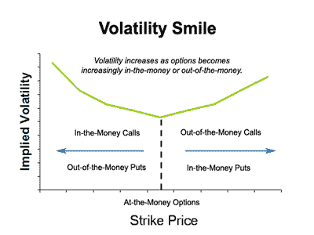

曲线的形状取决于市场——大宗商品不同于股票和外汇。例如，长期期权的偏差通常如下所示。这样的曲线表明，OTM 看跌期权比 OTM 看涨期权更贵，因为投资者愿意通过抬高期权来支付更多的下跌保护。

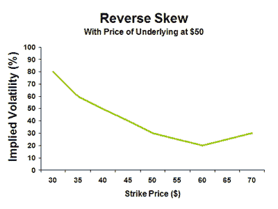

大宗商品期权有一种不同的倾向:当供应变得不确定时，需要某种商品的人会希望获得它，并将中断的风险降至最低——因此抬高了 OTM 看涨期权的价格。

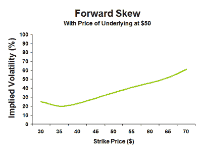

**为什么不对称很重要？**它允许市场参与者观察期权市场价格如何受情绪、催化剂和基本面的影响。有了这些信息，投资者和交易者可以利用上升或下降的波动性来更好地表达他们的观点或不同意期权市场的观点。

目前尚不清楚 crypto 中是否应该存在“典型”偏差。Sk3w 的[人员正在展示 BTC 的 3mo 偏斜数据(见下文)。“50/150%正常化”基本上意味着他们采用 OTM 看跌期权的隐含波动率减去 OTM 看涨期权的隐含波动率，显示了它们的相对昂贵。这个比率表明看跌期权比看涨期权更贵(或者看涨期权更便宜)。](https://www.sk3w.co/options.html)

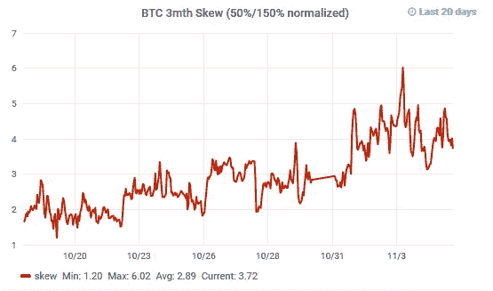

在他们最新的[出版物](/@skew_options/crypto-derivatives-market-color-2-3bb78eb10383)中，sk3w 给出了一个启示性的评论:

> 过去一个月，随着投资者最终在比特币的短期反弹中投降，大多数期权抛售来自看涨抛售。其结果是，“*偏斜*”——相对于特定期限的看涨期权的看跌价格——开始上升。

在第一部分中，我们将备兑买入卖出视为一种策略，如果你认为价格不会上涨太多，且隐含成交量足够高，就可以从溢价中获得额外回报。

或者，这种不对称为人们提供了一个以相对低廉的价格购买看涨期权的好机会。

**期限结构**

期限结构比较了不同到期日的期权隐含波动率，通常反映了市场对即将到来的重要事件的预期。在股票方面，这可能是一家制药公司即将公布的药物测试结果。与一个月前或一个月后相比，这份声明前后的股票可能会更不稳定。因此，就隐含波动率而言，相应月份的期权可能比前一个月更贵。例如，认为该事件可能不太重要或已经反映在价格中的人，可能会利用这种较高的波动性卖出它，而不是购买另一种较便宜的期限。

Sk3w 有一张 BTC 期限结构图。它表明，期权市场预计今年年底至 2019 年 6 月之间不会出现明显不同的波动。11 月和 12 月的波动性看起来大致相当于 BTC 100 万和 300 万的实际波动性——分别为 30%和 40%。

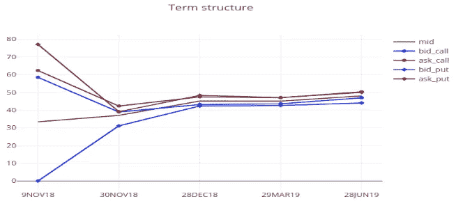

既然我们已经看到了不同履约期和到期日的波动性是如何不同的，让我们来看看…

**组合选项的方式**

看跌价差、看涨价差、蝴蝶、绞杀和跨骑、合成多头和空头、彩虹和击倒等。有许多组合的选项都有吸引人的名字。**然而，需要注意的重要一点是，任何组合都需要服务于投资者的目的。**组合不同罢工和条款的期权非常适合表达定制观点，无论是方向性观点、波动性观点还是两者兼而有之。

**让我们来看一个标准用例:对冲下行风险。**

假设一个投资者想拥有下跌保护。一个简单的方法是购买看跌期权。然而，我们看到 BTC 偏斜是正的，这意味着看跌期权比看涨期权更昂贵。此外，就美元成本而言，自动柜员机期权(从当前水平提供保护)比 OTM 期权(从较低罢工水平提供保护)更昂贵。此外，知道大多数期权到期一文不值可能会让投资者担心牺牲总头寸的几个百分点。根据个人的市场观点，有各种方法来解决这个问题。让我们来看两个:

*   **上涨空间有限，下跌空间巨大:**如果投资者认为价格不会上涨太多，那么卖出看涨期权来购买看跌期权可能是有意义的。下面的图表显示了一个示例收益，其中买入一个看跌期权(成本 800 美元)与买入一个看跌期权并卖出一个看涨期权(净成本 200 美元)进行了比较。投资者牺牲了上涨空间，以降低下跌保护的成本。这种组合(看涨，看跌)被称为颈圈，以防你想出去玩。如果买入波动性相对于卖出波动性(远期偏斜)较高，那么实施这样的结构是有意义的。为了利用期限结构，你也可以混合期限。例如，如果投资者担心短期下跌缺口移动，购买更接近到期的看跌期权和出售更长期的看涨期权可能是有意义的。期限较长的期权往往具有较高的隐含波动率(因此价格相同，其他条件相同)，这甚至可能使头寸的溢价为零，即投资者无需支付任何成本。

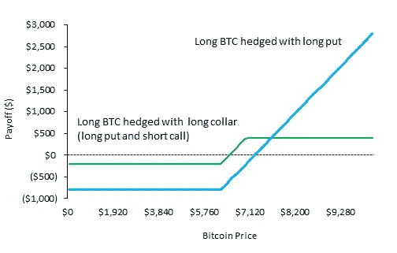

Hedge 1

*   **下跌空间有限，保持上涨空间:**如果投资者认为下跌空间有限，他可以买入一份自动取款机看跌期权，并卖出一份 OTM 看跌期权，以降低前期成本。在这种情况下，投资者将愿意通过在当前价格和卖空执行之间建立一个保护水平来接受低于某一水平的保护。混合不同的期限也有助于降低成本。

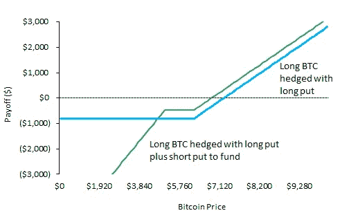

Hedge 2

**这些组合可以帮助交易商、基金、矿商或交易所围绕诸如难度变化、分叉、新 ASIC 的推出、矿商清算库存、期货到期、奖励减半、周转率增加或减少等事件形成观点和策略。**

更复杂的是，请记住，不同的期权组合可能有相同的收益图，产生相同的方向风险，但有不同的波动风险。例如，上面对冲 1 图中的绿色收益线看起来是一样的:a)多头 BTC、多头卖出和空头买入 b)多头买入价差和 c)空头卖出价差。但是，就 vol 风险而言:a)最初是平的 vol b)最初是长的 vol 和 c)最初是短的 vol。这些细微差别对按市值计价其头寸并在到期前平仓的交易者有影响。我将在本系列的第 3 部分中详述其中的一些细节。

**期权价格敏感度**

观察某些事件如何影响比特币的已实现波动性是一件有趣的事情。请注意，这些都是已知的(除了 CVE 错误)，以前宣布的未知价格后果的事件。这些是人们倾向于通过选择来玩的类型，而不是以前不知道的突然消息。**但是，该分析需要结合隐含波动率的数据来完成，以便评估什么时候定价。**

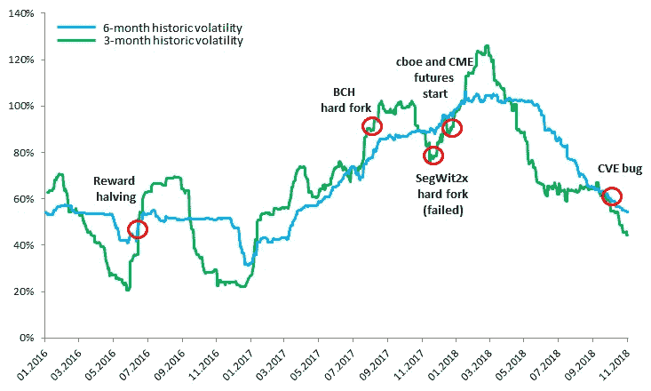

Bitcoin historical volatility

**实际案例:比较隐含波动率和历史(已实现)波动率**

绘制 3 个月隐含波动率与实际波动率的关系图(过去 20 天的数据来自 [sk3w](https://www.sk3w.co/options.html) )揭示了一个有趣的画面:在 10 月中旬，利差接近 13 个 vol 点，然后在 10 月底收敛，只是在 11 月的第一周再次扩大。在此期间，比特币的价格一直在 6350 美元至 6450 美元之间波动。

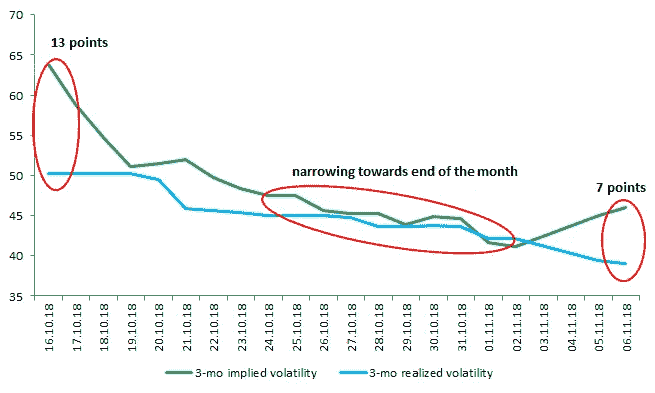

举例来说，一个投资者可以卖出一个执行价格为 10，000 美元的看涨期权，该期权将于 2019 年 3 月 16 日到期，理论价格为[**ca**](http://www.option-price.com/index.php)。每个选项 280 美元。在接下来的两周内，隐含波动率下降了大约 20 个点，BTC 价格下降了大约。$100.同样的期权在 10 月底的价格会低于 50 美元。请注意，BTC 价格的下降只会产生有限的积极影响(保持价格不变会给我们带来大约。$60).

**重要的是，这只是标准期权价格计算器得出的理论值**。现实是不同的。无论是谁做市，都会增加或减少自己的买卖价格。那会是多少钱？在股票市场上，竞争非常激烈，vol 交易者需要保持较低的价差。加密卷市场是新的，流动性不是很好，交易者可以获得相当可观的利润。为了给出一个想法，看看下面由 [skew 发的推文。](https://medium.com/u/2fb3e15e75c6?source=post_page-----1a6aea13c1b3--------------------------------)10 月 29 日，在回答 [Tuur Demeester](https://medium.com/u/95791aef6458?source=post_page-----1a6aea13c1b3--------------------------------) 关于期权的问题时。请注意，他们肯定指的是 3 月 19 日的电话，而不是 3 月 18 日。

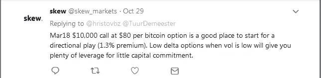

假设做市商以 80 美元的价格卖出看涨期权，这意味着波动率约为 50%。为了评估做市商在价格中包含了多少 vol，我们需要将其与市场上的隐含波动率进行比较。Sk3w 的网站显示 10 月 29 日 3 月 vol 为 44%。然而，我们需要 5 月 vol，因为我们谈论的是 2019 年 3 月。期限结构图显示 12 月 18 日和 3 月 19 日到期之间几乎没有差异，因此我们假设(注意，期限结构数据取决于流动性)3 个月和 5 个月隐含 vol 在 ca。44%.

我们得到了 5-6 个体积点的差价。听起来可能没那么多，但如果我们用 44%的隐含 vol 重新计算价格，在其他条件相同的情况下，美元价值几乎减半。在上面的例子中，价格大约是。45 美元，而不是提到的 80 美元。

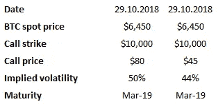

坦率地说，这种情况下的 vol 溢价与大型投资银行出售给零售客户的期权中包含的溢价没有太大区别。为了允许小投资者在亚马逊或苹果上购买少量期权，银行的结构化柜台需要包括足够的溢价，以使他们能够:a)对冲他们的头寸，b)赚大钱。从历史上看，银行在这些产品上赚了一笔——越复杂越好。下次你决定花 200 美元在苹果上购买一个双重敲除彩虹期权时，它很可能会让卖方银行损失 50-100 美元:)

这让我想到了期权敏感度表，它对于指导不同波动率水平的定价非常有用。我使用了一个[看跌期权和看涨期权价格模拟](http://www.option-price.com/option-matrix.php)来说明以下输入:

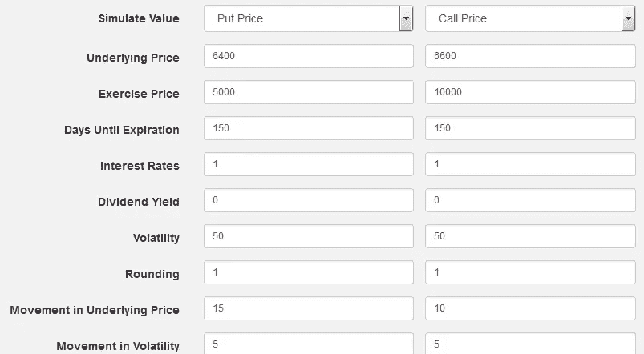

波动水平对期权价格的影响是显而易见的。**然而，最重要的是找到方向。尤其是当你考虑买卖差价的时候。这是期权的一个重要元素——它们不是纯粹的波动工具。**

例如，如果你以 97.3 美元买入一个看涨期权，价格下跌 15%，隐含波动率需要增加 20 个点，才能让你的看涨期权保持其价格。我甚至没有计算购买期权所固有的时间价值损失。比特币是一种不稳定的资产，但即使考虑到这一点，这也是很大的变动。

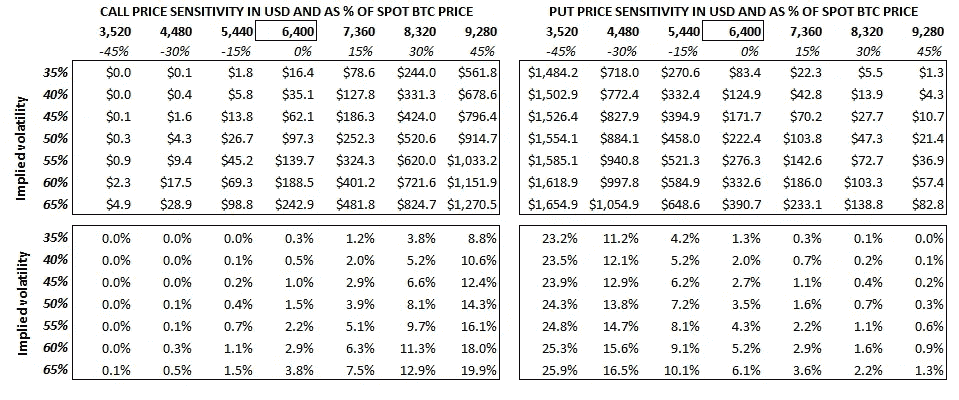

**特别聚焦**

在[第 1 部分](/@hristovbz/options-for-crypto-investors-part-1-407c294b5ae1)中，我们将卖出看跌期权视为一种在较低价位买入获得回报的方式。传统市场上有一种产品叫做“反向兑换”。它将看跌期权、股票和债券组合成一个结构性产品。这样做的目的是提高债券投资者的兴趣，他们也渴望以更低的价格购买基础资产。

我在这里发现有趣的是，这个想法可以通过使用选项和协议/服务之一来适应加密，这些协议/服务支持贷款，如 [Nexo](http://nexo.io/) 、 [Compound](https://compound.finance/) 或 [Dharma](https://dharma.io/) 。协议的一方允许人们将密码作为抵押品，并获得现金贷款。另一方投资菲亚特并收取利息。我相信，在这样一个平台上进行反向转换将会增加价值，成为一种创新产品。

**例如**，假设一个投资基金有它没有投资的现金。他们可能会决定把钱贷出去，而不是放到货币市场上获得很少的回报。加密担保贷款利率目前相当高(10-16% pa)，随着竞争的加剧，未来几年肯定会下降。此外，如果该基金希望以更低的价格做多 BTC，他们可以将贷款和看跌期权结合起来。如果隐含波动率增加到 50/60 左右，投资者可以出售 ca 的 3 月 19 日 5000 美元的执行期权。5%.6 个月后有两种可能的结果:1/ BTC 保持在 5，250 美元以上(5，000 美元执行价+250 美元溢价)，在这种情况下，投资者将获得 5-8%的现金利息，外加 5%的期权溢价，总计 10-13%。如果价格低于执行价，投资者的本金将以有效的 ca 水平转换为 BTC。4750 美元(约比现价低 25%)。下图展示了结果。如果价格开始大幅下跌，投资者将面临损失。

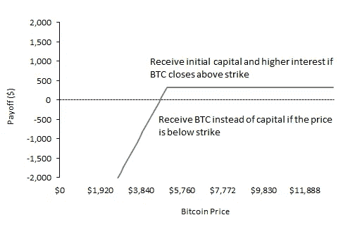

**未完待续……**

本系列的第二部分重点关注选项组合和表达定制视图的方式。在下一部分，重点将放在希腊期权以及它们如何影响组合。

**强制性免责声明:本分析仅用于说明目的，并不构成对购买或出售 crypto(或任何其他相关事宜)的建议。**

感谢您的阅读。

> [直接在您的收件箱中获得最佳软件交易](https://coincodecap.com/?utm_source=coinmonks)

