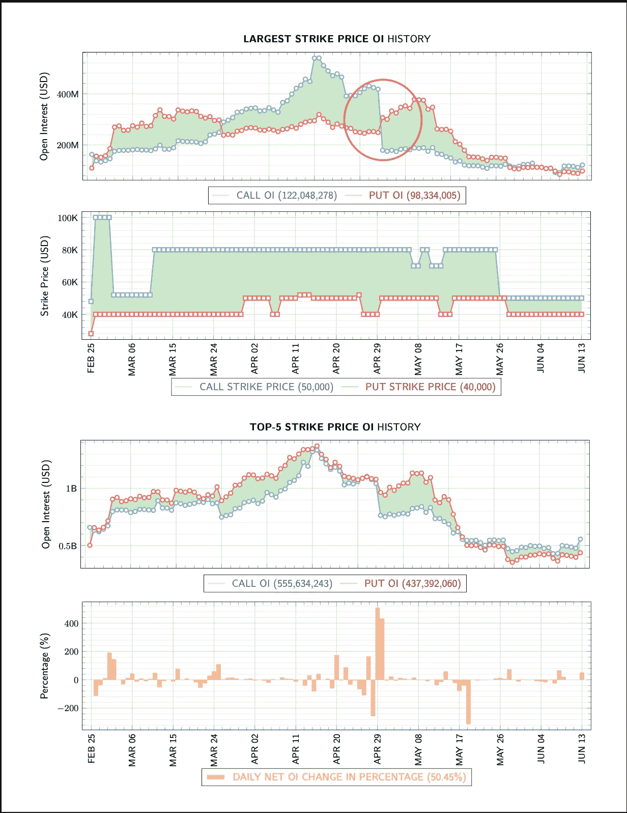
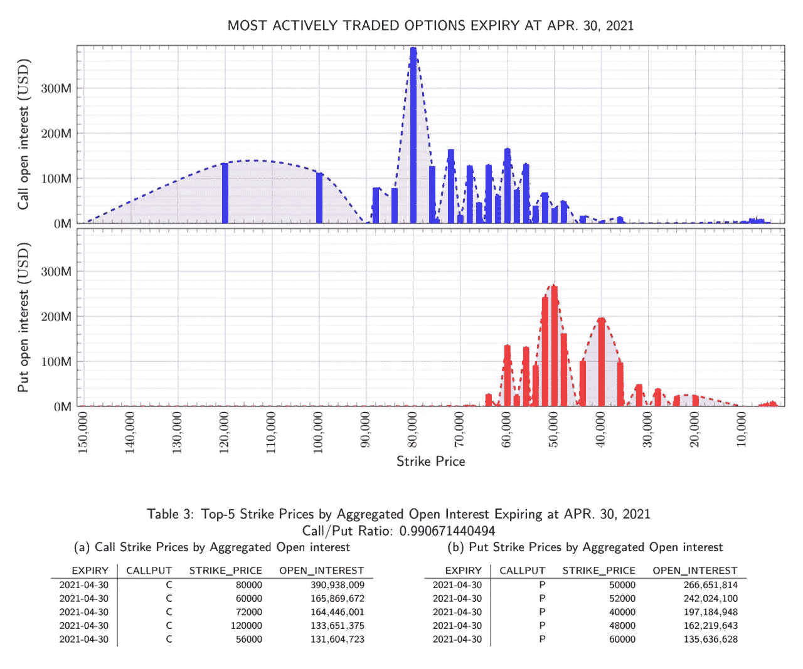
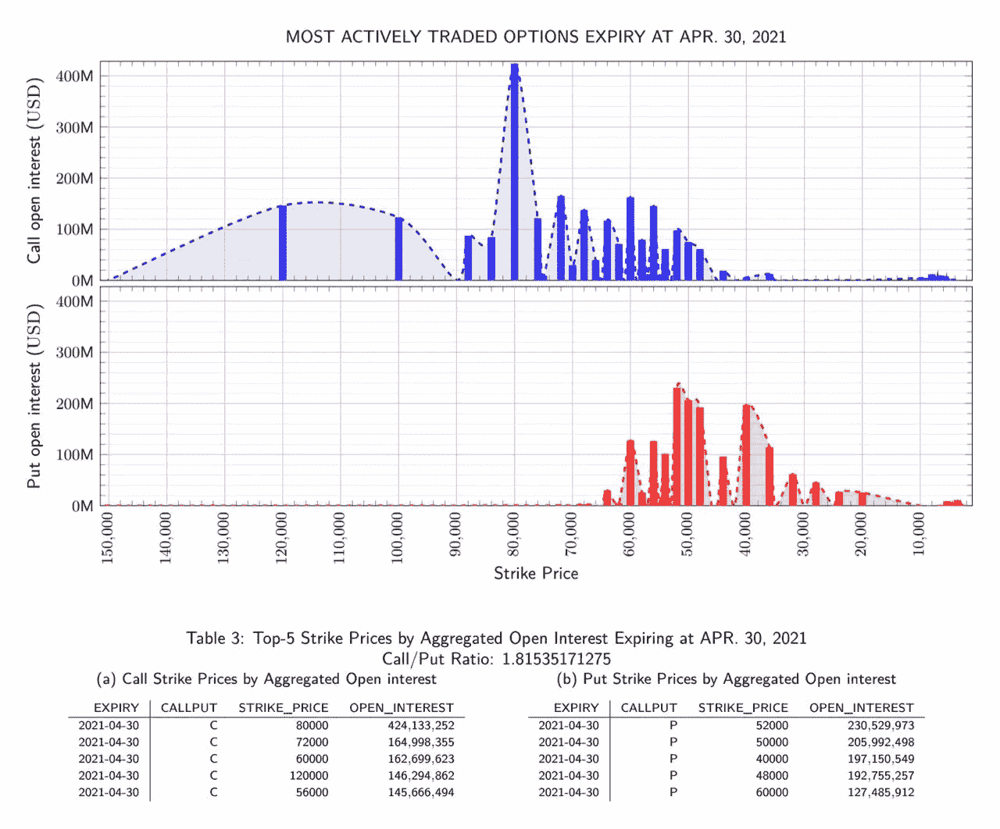
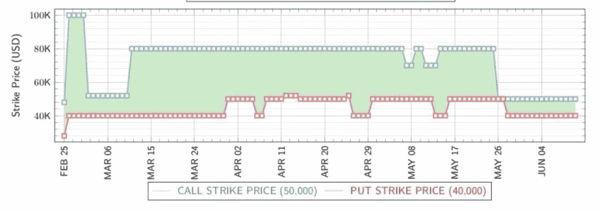
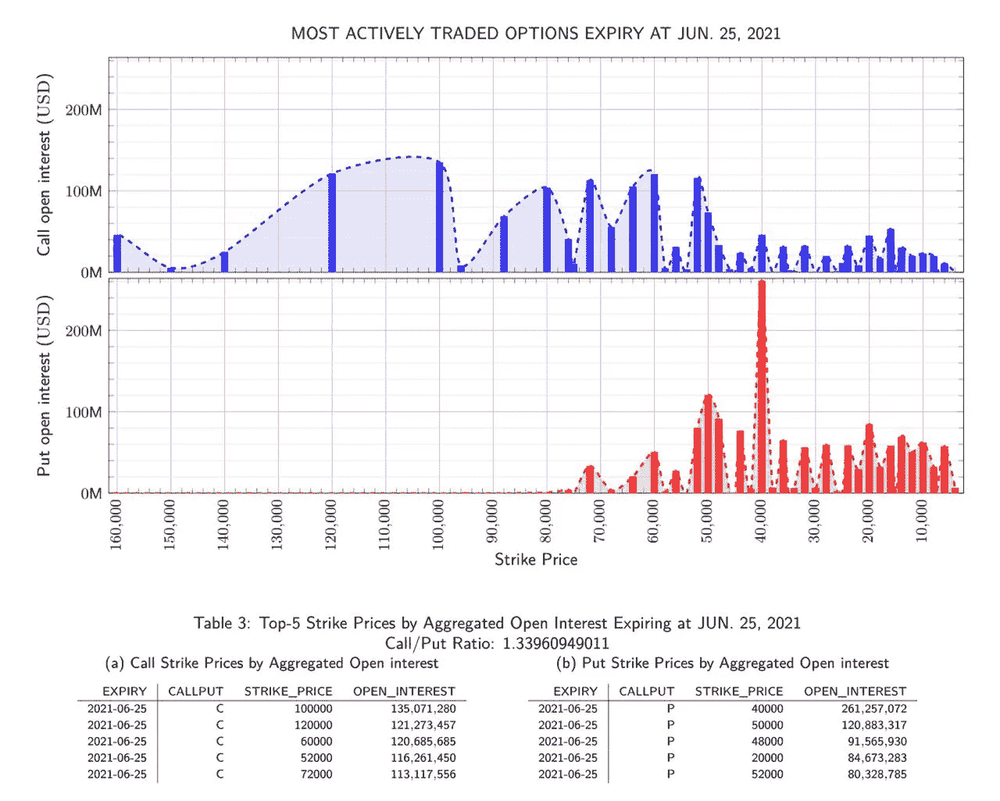

# 与现货价格相关的期权市场-第一部分

> 原文：<https://medium.com/coinmonks/options-markets-in-relation-to-spot-price-part-1-16155f6bf757?source=collection_archive---------8----------------------->

## 最大执行价格未平仓合约对资产现货价格的影响。

今天我们来回顾一下过去，展示一下期权市场和资产现货价格之间的紧密联系。在这种情况下比特币。在 ExxaBlock 每日加密报告中，我们在一页上展示了现货-期权-期货-掉期市场。所有这些都是相互关联的。为了给期权市场部分增加一些细微差别，我们想仔细看看市场上最大的未平仓利息执行价格。

我们从一位合伙人那里收到的问题是:看看 4 月 29 日看涨和看跌期权的反转。那里发生了什么？这种情况经常发生吗？

Snapshot from June 15, 2021

我们制作这些图表是因为 ExxaBlock 团队希望提供一种信息丰富的方式来查看最大 OI 合约之间发生的“战斗”——大多数交易者进行投机或对冲头寸的地方。这些图表中的合约汇总自 Deribit、Okex、Bitcom、CME 和 LedgerX。

2021 年 4 月对比特币来说是一个激动人心的时刻——4 月 14 日创下了约 63，000 美元的历史新高。市场上的看涨情绪很强烈。在期权市场:14 日，最大执行价格 OI 看涨期权几乎是市场上最大 OI 看跌期权的两倍。什么会出错？29 号发生了什么？

## 2021 年 4 月 30 日合约结束

当期权合约结束时，我们看到交易者做三件事情中的一件。它们是:

1.  滚动位置；
2.  平仓。
3.  等待到期。

4 月 14 日 ATH 之后，我们在现货市场上观察到:

1.  4 月 14 日左右从 ATH 向下突破(63K)；
2.  在 25 日(48K)反弹出一个“底部”。

在期权市场上，我们看到

1.  最高的 OI 调用是 80K
2.  最高产油量为 50K，直到；
3.  4 月 26 日，6 月合约中的最高 OI 看跌期权转移到 40K

ExxaBlock 团队正在查看 4 月 30 日的合同，并观察交易动向。请注意石油指数在 22 日至 28 日之间的前五大合同中的变化。在 8 万需求时 OI 增加了 3400 万，其他合同略有增加和减少。

Snapshot from April 22, 2021

Snapshot from April 28, 2021

在 4 月 26 日，我们在下面的图表中看到，看跌期权跌至 40K。这让我们的团队想到了一个问题:OI 将走向何方？这不是在 4 月份的合约中，交易者在另一个月的合约中积累了 40K 的头寸。经过一番挖掘，我们发现看跌期权在 5 月合约中不断累积，但大多数是在 6 月合约中发现的。

Snapshot from June 15, 2021

## 那么期权市场发生了什么？

反转发生在 4 月 29 日结算和 4 月 30 日最终结算之间。30 日，我们看到现货价格位于 58K——正好在 4 月 29 日最高 OI 的中间，80K 和 40K。

4 万卖出 OI 在 5 月和 6 月增加，而买入 OI 从 4 月合约收盘时开始下跌——这可能是收紧风险参数的信号。看到这种情况，我们想到了期权交易者可能利用这些头寸的两种可能性:

-更多人用看跌期权对冲多头头寸；

⁃人持有更多投机性空头头寸。

Snapshot on May 1st of June 25, 2021 Contract

40K 看跌期权在 2021 年 6 月 25 日的合约中表现强劲，现货市场一直处于下行趋势，直到当前时间(2021 年 6 月 15 日)。

这种反转一直持续到下一个合约月结束后的 5 月 28 日，那时它再次反转。我们 ExxaBlock 希望这种回顾可以让我们深入了解观察整个市场、现货、期权、期货和掉期如何能够让我们深入了解资产的定价。一个简单的图表引出了一个问题——稍加挖掘，我们发现了收紧风险参数的可能信号。尽管看涨情绪似乎很高，但市场不会说谎。

> 加入 Coinmonks [电报频道](https://t.me/coincodecap)和 [Youtube 频道](https://www.youtube.com/c/coinmonks/videos)了解加密交易和投资

## 也阅读

 [## 最佳加密交易所| 2021 年十大加密货币交易所

### ICON _ PLACEHOLDEREstimated 预计阅读时间:28 分钟加密货币交易所的加密交易需要知识…

blog.coincodecap.com](https://blog.coincodecap.com/crypto-exchange)