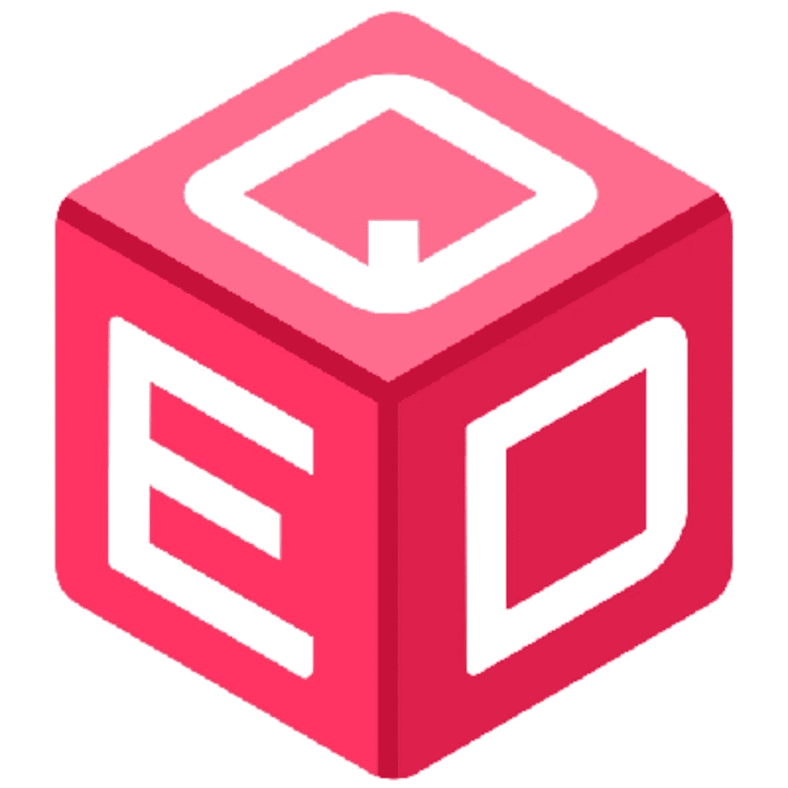

# 使用 QED 解决 Oracle 困境

> 原文：<https://medium.com/coinmonks/oracle-dilemma-resolved-using-qed-a8b6d95e0fbd?source=collection_archive---------5----------------------->

以分散的方式访问现实世界中的数据

Source:[https://medium.com/@QED.network/about](/@QED.network/about)

***编者按:投资任何项目前，请做好自己的调研。***

与集中式网络相比，区块链的分散性质是使其脱颖而出的一个主要特征，也是令人羡慕的一点，因为交易在执行之前不需要中介。

然而，某些交易需要智能合约才能在区块链上执行。智能合同的概念使得区块链的分散金融和其他应用真正分散，因为一旦满足某些预定条件，交易就被执行。

关于智能合同的具体问题出现了，“智能合同有多智能？”“它们是如何确保及时了解现实世界中的最新问题的，以及它们如何知道现实世界中的预定条件何时得到满足？”

这些问题的答案是区块链神谕的出现。区块链甲骨文是第三方服务，为智能合同提供必要的操作信息。它们充当区块链和现实世界之间的桥梁，因为智能合同无法访问网络外部的数据。

神谕是至关重要的，因为它们是减轻智能契约能力并扩大其使用范围的燃料。尽管区块链预言对智能合约的效率有很好的影响，但它们也带来了一些挑战，被称为预言难题。

## **什么是甲骨文困境？**

区块链的真正本质是一个去中心化的网络，无法独自访问数据。然而，为了有效地执行由智能合约驱动的交易，需要访问现实世界，因此需要 oracles。

出现的问题是，oracles 向智能合约提供正确信息的可靠性如何，在输入错误信息的情况下，智能合约会做什么，它会根据这些信息执行交易吗？这些问题被称为甲骨文困境，因为甲骨文的妥协也会导致智能合同的妥协。

尽管这让许多人心生疑虑，但 QED 还是迈出了大胆的一步，解决了区块链遭遇的甲骨文困境。

## **QED 如何解决甲骨文困境**

[QED](https://qed.network/) 是一个去中心化的 oracle 协议和聚合器，拥有强大的经济模型，能够连接多个区块链、智能合约平台和链外数据源。

QED 的基础软件 DelphiOracle 是 WAX 区块链上使用最广泛的 Oracle，有超过 60，000 次使用的记录，每周有不到 10，000 个用户，每小时有超过 1400 个操作。它已经存在了 3.5 年多，是唯一一项在 2020 年“黑色星期四”事件中不会失败的 oracle 服务。

有了 oracles，智能合约一旦执行交易，由于信息不正确导致的错误是无法通过代码撤销的；因此，不受 oracle 排名保护的智能合约无法解决通常出现的垃圾入垃圾出问题。

QED 认为，需要实现一种机制来允许恢复，同时也维护分布式系统的基础。因此，oracle 的困境在 QED 中得到逆转，因为它优先使用 QED oracle 的债券抵押品，并实施索赔机制和解决方案，oracle 将抵押品作为一种归还手段。索赔和解决方案流程都在链上进行，使用准确性评级和激励措施来承保系统。

此外，QED 使用了一种商业架构模型，在这种模型中，甲骨文因使用主动评分系统更加准确而获得更多报酬。财务上最成功的先知会通过最准确的方式获得最好的抵押品回报。

总之，QED 对任何索赔使用抵押系统，并允许系统中最准确的神谕充当解决神谕(使用资本效率激励)，以解决智能合同面临的甲骨文困境。

## **QED 价值主张**

QED 确保为用户提供最好的服务，因为不准确的预言会得到补偿，而错误的预言会得到补偿。此外，通过 QED 评分系统，从 QED 生态系统中消除了糟糕的甲骨文，使用户能够根据准确数据的发现做出决策。

QED 通过提供现实世界中常见的成熟追索机制来保护客户。随着时间的推移，企业将能够使用 oracle accuracy 作为计算错误或索赔概率的基础。

QED 完全在区块链上运行，没有单点故障，没有集中式验证系统，并且在经济上受 QED 令牌的约束。QED 协议被构建为与任何公共区块链或智能合约平台接口。

> 加入 Coinmonks [电报频道](https://t.me/coincodecap)和 [Youtube 频道](https://www.youtube.com/c/coinmonks/videos)了解加密交易和投资

## 另外，阅读

*   [在印度利用加密套利赚取被动收入](https://blog.coincodecap.com/crypto-arbitrage-in-india)
*   [德国最佳加密交易所](https://blog.coincodecap.com/crypto-exchanges-in-germany) | [WazirX P2P](https://blog.coincodecap.com/wazirx-p2p)
*   [如何购买 Monero](https://blog.coincodecap.com/buy-monero) | [IDEX 评论](https://blog.coincodecap.com/idex-review) | [BitKan 交易机器人](https://blog.coincodecap.com/bitkan-trading-bot)
*   [如何在 Bitbns 上购买柴犬(SHIB)币？](https://blog.coincodecap.com/buy-shiba-bitbns) | [印度币安](https://blog.coincodecap.com/binance-in-india)
*   [币安 vs 比特邮票](https://blog.coincodecap.com/binance-vs-bitstamp) | [比特熊猫 vs 比特币基地 vs Coinsbit](https://blog.coincodecap.com/bitpanda-coinbase-coinsbit)
*   [如何购买 Ripple (XRP)](https://blog.coincodecap.com/buy-ripple-india) | [非洲最好的加密交易所](https://blog.coincodecap.com/crypto-exchange-africa)
*   [非洲最佳加密交易所](https://blog.coincodecap.com/crypto-exchange-africa) | [晤交易所评论](https://blog.coincodecap.com/hoo-exchange-review)
*   [eToro vs robin hood](https://blog.coincodecap.com/etoro-robinhood)|[MoonXBT vs by bit vs Bityard](https://blog.coincodecap.com/bybit-bityard-moonxbt)
*   [Stormgain 回顾](https://blog.coincodecap.com/stormgain-review) | [Bexplus 回顾](https://blog.coincodecap.com/bexplus-review) | [币安 vs Bittrex](https://blog.coincodecap.com/binance-vs-bittrex)