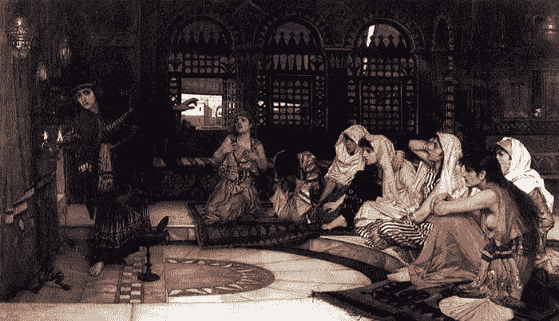

# 神谕:区块链如何看待世界

> 原文：<https://medium.com/coinmonks/oracles-how-blockchains-perceive-the-world-390dcce3789c?source=collection_archive---------3----------------------->

> “我思故我在”——笛卡尔

除了引发一场生存危机之外，决定区块链如何看待现实世界以及它对真理的理解，是这个体系中一个很少被提及但不可或缺的部分。我们如何着手将真实的物理世界与虚幻的数字世界联系起来，并将概率性的真实世界数据转化为确定性的链上数据？

那些更熟悉区块链世界的人可能会很快指出，区块链的真相是由矿工不断选择最长的链条决定的。当跟踪链上数据和事务时，这是正确的。然而，特别是在智能合同的上下文中，合同中的许多细节在合同创建时无法确定。因此，智能合约仍然需要一个可信桥来接收来自链外的数据，以便在链上触发合约。因此，智能合约的承诺与其获取可靠现实世界数据的能力紧密相连。

《神谕:区块链如何感知世界》

[Consulting the oracle](https://en.wikipedia.org/wiki/Oracle#/media/File:John_William_Waterhouse_oracle_1884.png)

在加密货币领域，这种与物理世界的联系以神谕的形式出现。虽然，不像它的名字一样，神谕不提供对未来的预言，而是报告过去的事实，这使得它更加准确，但也更加乏味。本质上，神谕充当了区块链从现实世界接收反馈的界面，就像我们的感官如何让我们理解周围的世界。因此，一个 oracle 必须同时存在于软件和硬件领域，这通常有两种形式:机器和用户。

机器先知往往属于无所不包的物联网，因为它们本质上是将信息发送到区块链而不是传统服务器的智能设备。由于报告可以通过传感器完成，这为通过智能合同实现大部分管理功能的自动化提供了重要的可能性。此外，机器预言使这种报告能够 24/7 不间断地执行，在与数据库同步以及在需要时触发合同方面没有任何延迟。机器先知最大的优势也是致命的弱点是，这种传感器可以确保数据的客观性，因为它只能测量条件是真还是假。

根据智能合约的规则，当机器 Oracle 与用户 Oracle 协同工作时，可以补充这种数据客观性。其中最基本的是，当传感器被触发时，用户可以通过 oracles 向智能合约提供确认，从而最大限度地减少误报。展望未来，预计智能合约触发器将越来越依赖于多个数据流，甚至共识规则。也就是说，人类从来没有被认为是真理的可靠来源，因此需要深思熟虑的激励来防止系统的任何滥用。这可能是金钱上的，也可能是名誉上的，但如果假新闻丑闻让我们明白了什么，那就是人类的心理倾向于先于任何真相。

尽管如此，已经出现的解决这种协调问题的解决方案之一是预测市场，即那些正确预测结果的人赢得金钱，而那些预测错误的人则付出代价。在这样的市场中，为每股价值创建预定义的期权，总计为 1 美元(100%)。一旦事件过去，并导致市场关闭，获胜期权的份额可兑换为全部美元减去任何交易成本，而所有其他期权变得一文不值。在这样一个市场中，个人将有购买股票的动机，这些股票反映了他们的信念，即他们对正在讨论的事件有更好的信息。本质上，预测市场整理了关于未来事件可能性的信息。

那些更熟悉博彩公司/博彩公司之旅的人会正确地(也可能犹豫地)指出，这种预测市场已经存在。冒着听起来像一个过度热情的区块链将如何分散世界的布道者的风险，集中式预测市场有其自身的风险和局限性。其中的关键是，由于其范围的上限(地方法规、人口等)，集中式市场受到可创建的市场类型的显著限制。此外，正如其名称所暗示的那样，任何基金都必须按照自己的规则，根据市场的正确决议，在它们的账簿中进行支付。

当然，已经实施了适当的规则和执法，但在谷歌上快速搜索“博彩骗局”会突显出博彩公司带着资金逃跑或扣留奖金的频率。区块链的预测市场将使信任建立在一个网络之上，在这个网络中:

*   价值可以储存在可自我执行的智能合同上；
*   执行和合同规则是透明的，并得到鼓励参与和报告的激励措施的支持；
*   交易成本仅限于补偿报告结果的市场创造者和使用者。

值得注意的是，预测市场迫使先知分享其决定的后果。从本质上讲，无论谁参与市场，都将参与到这场游戏中，理论上这将导致一个更有效的市场。事实上，预测市场已经被证明优于传统的预测和投票方法。

> “由于市场擅长鼓励人们获取信息，通过交易分享信息，并将这些信息汇总成一致的价格以说服更广泛的受众，因此它们似乎是理想的信息机构”——[汉森](http://mason.gmu.edu/~rhanson/futarchy2013.pdf)

总部位于区块链的预测市场好处多多，但也有不利之处。其中的关键是，没有一个单一的权威点来决定结果，经济上有能力的攻击者将能够通过向他们想要的结果注入金钱来压倒系统。这也可能因为一个市场中的赢家基本上是输家的腰包而加剧。引入这种自由市场经济也带来了交易者，他们会根据噪音而不是知识进行交易，这可能会进一步引导市场远离“客观现实”。因此，网络中迫切需要深思熟虑的规则和机制，以限制不良行为者的影响。

**用神谕探索未知水域**

[What lies north of the wall?](https://www.amazon.com/Best-Print-Store-Thrones-Westeros/dp/B06XJHTLS3)

与过去的预言类似，基于预测市场的预言实际上可以创造新的市场，因为它鼓励对未知事物的探索。随着对信息发现的更大激励，预计将有更多的粒度数据可用，这在理论上导致更有效的市场和更好的风险定价。本质上:

> “预测市场能够更细致、更具体地表达经济事件，进而在宏观和微观经济层面更明确地传达价值(以及风险)”— [Gnosis 白皮书](https://gnosis.pm/assets/pdf/gnosis-whitepaper.pdf)

然而，如果我们要从 [2010 年的闪电崩盘](https://en.wikipedia.org/wiki/2010_Flash_Crash)中吸取教训，我们在将此类信号与实际市场增值相关联时必须保持谨慎，因为市场有自我参照的倾向。如果做得好的话，新市场的创建将提供实时获取与正在讨论的事件相关的所有信息。观察这种情况对信息资本控制的影响将是有趣的，因为预测市场的激励是否会超过囤积优质数据带来的安全感，还有待观察。

预测市场的另一个有趣的用例是激励现实世界中的行动。这可以通过为预想的结果创造一个市场，并押注于相反的结果来实现。如果个人看到该事件的预测市场，并相信他可以使其发生，他/她将被激励与市场创造者打赌，以便在解决对自己有利的市场时实现利润。这实质上为服务创造了一个基于绩效的市场，在这个市场中，增加的投标竞争(价值流不再局限于两个参与者)强烈鼓励最高效的提供商提供服务。

分散预测市场可能带来的一个更具革命性和未经尝试的想法是 futarchy，这是 Robin Hanson 设想的一种基于市场的治理方法。我计划在未来的文章中更详细地介绍这一点，但 futarchy 本质上是一种治理形式，选民将决定所需的政策结果，但博彩市场将决定如何实现这些结果。这是值得注意的事情，因为如果专制有效，这种参与性治理过程将鼓励更多地关注提案而不是个人，从而确保此类政策的实施有效且意识形态中立。

**预测未来**

神谕只是智能合约感知现实世界的媒介，但真正让它变得激进的是底层架构和由此产生的影响。机器先知确保了输入智能合同的数据的客观性，同时还实现了智能合同的 24/7 触发。无论是通过经济手段还是其他方式，用户先知确保这些数据符合社会公认的现实。这些功能可以在一个集中的系统上执行，但将它放在区块链上将消除对可信的中央协调器的需要，同时还鼓励数字合同条款和数据的更大透明度。

除了提高数据完整性之外，预计信息市场生态系统将会显著增长，因为其范围不再受限。因此，市场创造将只限于市场创造者定义这样一个市场的能力。此外，拥有这样一个市场可以有效地将个人行为与他们的个人信念联系起来，将信息收集与他们的决策联系起来。随着数据分辨率和流动性的提高，也为通过数据分析和机器智能学习改善分析奠定了基础。这一生态系统的发展还可能带来用户友好的 oracle 应用程序的创建，这将使非技术用户能够创建不同的市场，进一步发展网络和生态系统。

预言未来无疑是令人兴奋的，但在实现上述目标之前，必须克服重大的技术和非技术障碍。话虽如此，但鉴于这种技术相对于传统系统的固有优势，我愿意打赌，这种技术将在未来发挥核心作用，只是不要问我什么时候定义。

谢谢你坚持到最后。希望听到你的想法/评论，所以请留言。我在 twitter 上很活跃[*@*AwKaiShin](https://twitter.com/awkaishin)*如果你想收到更多易消化的密码相关信息，或者访问我的* [*个人网站*](https://www.awkaishin.com/) *如果你想要我的服务:)*