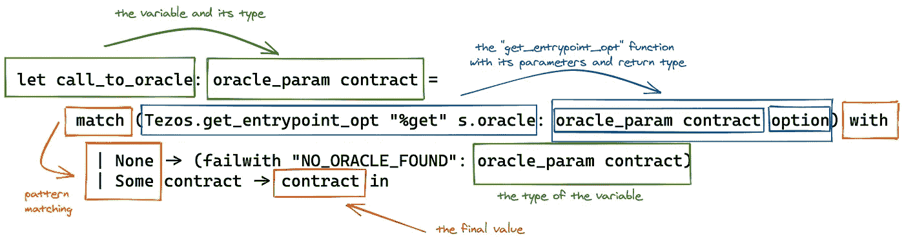

# Tezos 上的 Tezos with Ligo:一个简单的用例

> 原文：<https://medium.com/coinmonks/oracles-on-tezos-with-ligo-a-simple-use-case-b9e5605f0064?source=collection_archive---------3----------------------->

## 用 Ligo 连接到 Harbinger oracle 以获得连锁汇率

[Image by Christian Hardi from Pixabay](https://pixabay.com/users/twalmedia-2586533/?utm_source=link-attribution&amp;utm_medium=referral&amp;utm_campaign=image&amp;utm_content=2975066")

看到 Tezos 区块链在短短 6 个月内走了多远令人难以置信:在 2020 年初， [TezBridge](https://docs.tezbridge.com/) 是唯一的钱包，在 Tezos 上 dapps 的可能性非常有限。现在，在 2020 年秋天，我们有了[灭霸](https://thanoswallet.com/)，一个更好更优雅的钱包来与 [dapps](https://blog.coincodecap.com/what-are-dapps-an-ultimate-guide) 互动，我们还有神谕！Oracles 是游戏规则的改变者，因为它们允许智能合约访问实时数据。它们为合同增加了一层安全，因为它们允许开发人员更少地依赖用户提供的数据，而更多地依赖可靠的信息来源。

然而，从特佐斯区块链的神谕中获取信息似乎不像在其他区块链，例如以太坊，那么简单。增加的复杂性是 Tezos 区块链增加了一层安全的结果:迈克尔逊禁止在合同执行期间进行任何外部干预。在像以太坊这样的区块链中，当一个事务遇到一个需要来自 oracle 的数据的入口点时，契约的执行会短暂地暂停，同时等待来自 oracle 的数据返回。例如，这可能允许重入攻击。重入攻击在 Tezos 上实际上是不可能的，但这意味着您需要一个变通方法来使用 oracles。这是本文的主题。

本教程将向您展示如何在用 Ligo 编写的契约中实现 oracle 调用，以及如何从 oracle 接收数据。我们将使用[比特币基地 Pro normalizer 契约](https://better-call.dev/carthagenet/KT1GcGnKfx8MP3m6axQkkfUiaBM4orYxL5MQ/)作为数据源，并使用 [LigoLang](https://ligolang.org/docs/intro/introduction) 的 CameLigo 语法。我们将涵盖这个合同的[2 个入口点，我用它来创建](https://github.com/claudebarde/hodlers-lifesaver/blob/master/contracts/Hodlers.mligo)[霍德勒斯救生器 dapp](https://hodlers-lifesaver.netlify.app/) 。dapp 允许用户锁定他们的技术开发区，只有当 XTZ 和美元之间的当前汇率高于他们锁定技术开发区时，才会让他们提取资金。

# 建立合同

从 Tezos 上的 oracle 获取数据总是意味着两个入口点:一个发送数据请求，另一个接收数据。oracle 到 target 的入口点将总是接受至少一个类型为`contract type_of_returned_value`的值，因为 oracle 需要被告知将数据发送回哪里。让我们从建立合同开始。

对于我们当前的用例，我们需要一个入口点来接受用户发送的 tez，并在合同中记录发送的金额和发送 tez 时的汇率。我们将实现一个简单的分类帐和一个大地图，其中的键将是用户的地址，值将是他们在合同中锁定的汇率和金额的记录:

如上所述，存储将包含一个分类账来记录交易，但也包括 oracle 地址和管理地址(以防我们需要更改 oracle 地址)。

我们还将为 oracle 所期望的参数创建额外的类型:

Harbinger 契约期望一个代表货币对的`string`和一个返回货币对、上次更新的时间戳和货币对的当前汇率的`(string (timestamp * nat)) contract`。返回的类型类似于迈克尔逊中的类型:`(pair string (pair timestamp nat))`。它被称为`right-combed pair`，这意味着它是一个嵌套对，所有嵌套对都在父对的右侧。相反的是一个`left-combed pair`，它的嵌套对在左边，就像这样:`(pair (pair timestamp nat) string))`。尊重迈克尔逊中的对的结构是最重要的:一个入口点接收一个左梳对，而期望一个右梳对，将拒绝它，即使内部类型是正确的。

这就把我们带到了为将从 oracle 返回的值设置我们的类型:首先，我们创建一个记录，因为它对我们来说可读性更好，也更容易操作。然后我们使用一个名为`michelson_pair_right_comb`的转换器将 Ligo 记录转换成迈克尔逊右梳对。最后，我们创建一个 tuple，它将用`string`和`right-combed pair`发送给 oracle。

现在，我们要写入口点。对于本教程，我们将只编写示例契约包含的 5 个入口点中的 2 个。第一个将向 oracle 发送请求，第二个将接收 oracle 返回的值:

`Hodl` entrypoint 不接受任何参数(在 Ligo 中转化为一个`unit`，它将从`Tezos.amount`和`Tezos.sender`中获得它需要的所有值。`Hodl_callback`将从 oracle 接收数据，数据类型为`returned_val_michelson`。我们可以使用`entrypoint`类型来编写`main`入口点:

`Hodl`入口点将指向一个函数，该函数必须返回一个包含一个事务(调用 oracle)和存储的事务列表。`Hodl_callback`将指向一个不返回任何事务的函数，因此我们可以让该函数单独返回新的存储。

设置现在完成了，我们可以看看不同的入口点。

# 设置对 oracle 的请求

`hodl`函数不需要任何值作为参数，所以我们将使用类型为`unit`的参数。首先，让我们写出函数的结构、名称、参数、类型和返回值:

如声明所示，该函数将返回操作和存储的列表。我们的操作列表将包含要发送到 oracle 的事务，并且存储将随着我们跟踪用户的请求而更新。

由于合同的要点是让我们的用户锁定他们的技术开发区，我们将首先确保有技术开发区附加到交易:

`if Tezos.amount = 0tez`验证发送给合同的金额，如果等于零，则合同失败。如果不是，则继续执行。

> 注意:当在 Ligo 中使用`failwith`时，您必须指出如果入口点将在此刻返回时所期望的类型。

现在，我们想检查发送事务的用户是否已经锁定了一些 tez。由于这是一份简单的合同，我们不允许用户添加更多的技术开发区，他们可以存入或提取技术开发区:

在这一步中，我们在分类帐中查找`Tezos.source`地址，如果找到，我们使合同失效，如果没有找到，我们将在分类帐中添加一个新条目。`deposit`与发送给合同的`Tezos.amount`相匹配，我们将`price`初始化为`0n`，因为该值稍后将使用 oracle 中的值进行更新。此时，`s`变量(包含存储)已经被修改，其值将成为我们的新存储。

接下来，我们准备对 oracle 的请求。让我们看看它是什么样子的:

第一次使用时，这可能看起来有点令人生畏，但当您理解每个部分的作用时，它会变得很容易:

*   `let call_to_oracle: oracle_param contract`:这个变量将接收对 oracle 入口点的引用，我们稍后将使用它来构建事务。变量的类型必须是`contract`，带有一个镜像 oracle 所需参数的参数(`string * (string * (timestamp * nat)) contract`)。
*   `Tezos.get_entrypoint_opt`:该函数返回一个可选值，其参数类型为`contract`，参数类型与 oracle 参数类型相同。它有两个参数:格式`"%name_of_parameter"`下的目标入口点的名称和目标契约的地址(这里是 oracle 地址)。
*   `match ... with ...`:这是对`Tezos.get_entrypoint_opt`的结果进行模式匹配，如果没有找到定义入口点的合同，则返回`None`，否则返回`Some`以及我们要找的合同的引用。
*   `(failwith "NO_ORACLE_FOUND": oracle_param contract)`:如果`get_entrypoint_opt`函数找不到定义了入口点的契约，契约失败，错误代码如上。`failwith`必须是类型化的，并且与`call_to_oracle`变量所期望的类型相同。
*   `Some contract -> contract`:如果一切按预期运行，您将收到一个对 oracle 契约及其入口点的引用，该引用将存储在`call_to_oracle`变量中。

现在让我们看看我们的`hodl`入口点:

最后，我们构建将在合同执行结束时发送给 oracle 的事务:

我们使用接受 3 个参数的`Tezos.transaction`函数:

*   发送给契约的参数，在本例中，表示我们想要的货币对的字符串(`XTZ-USD`)和回调入口点，我们可以在 Ligo 中用`Tezos.self("%name_of_entrypoint")` +包装在`contract`类型中的这个入口点的类型轻松获得
*   额送来的神谕(`0 tez`，是免费使用的！)
*   对交易将发送到的合同的引用

就是这样！确保将此事务包含在函数结束时返回的操作列表中:

这个新事务将被发送到 oracle 来收集我们想要的数据。但是，我们要怎么做才能把这些数据拿回来呢？

# 设置回调入口点

回调入口点是所有危险的地方！当您构建将从 oracle 接收所需数据的入口点时，必须牢记这种体系结构的一些固有风险。问自己以下问题:

*   **我如何知道事务实际上来自 oracle？**毕竟，你的合约的入口点是开放的，任何人都可以向它们发送交易，即使它们被设计为从 oracle 接收数据。
*   如何整理传入的数据？即使您确实知道当前事务来自 oracle，这并不意味着数据就是您所期望的(正如我们将在下面看到的)。
*   **我如何安全地追求我在第一个事务中开始的变更？**您请求这些数据是因为您需要它们来更新存储，然而，现在很多事情都不同了，例如，`Tezos.sender`不再一样了。

最容易回答的问题将是第一个:您可以在契约的存储中保留 oracle 的地址(并实现一个入口点来更新它，以防您想要更改数据源)，以便在需要时可以很容易地找到它:`if Tezos.sender <> storage.oracle_address`。这是我们在合同中做的:

首先，我们必须将从神谕中获得的值转换成我们之前声明的记录，以使我们的生活更轻松。您只需使用助手函数`Layout.convert_from_right_comb`，后跟参数，并对保存记录的变量使用`returned_val`类型。接下来，我们将`Tezos.sender`的地址与神谕的地址进行比较。

> 这里使用`Tezos.sender`而不是`Tezos.source`,因为您想要检查是谁发送了当前事务，而不是谁发送了第一个事务。

现在，第二个问题。先知预言通过发送货币对和汇率使我们的生活变得更容易。我们希望确保收到正确的货币对，因此我们可以:

如果我们使用不同的货币对，这将是根据它接收的货币对将入口点的逻辑划分到不同分支的一个很好的方法。

> 这里我们不使用 oracle 返回的时间戳，但是您可以自由使用它，例如，如果您想要验证您收到的汇率是否足够新。

现在，是时候更新存储了。在前面的 entrypoint 中，我们用一个`0n`作为价格来设置用户的帐户，以表示初始化没有完成。我们将取回帐户并完成它的设置！

我们试图找到在`ledger`中创建的账户，该账户的密钥与第一笔交易的地址(`Tezos.source`)相匹配，如果我们找不到，则合同失败(这肯定是一种意外行为！)如果我们找到它，我们希望确保将`price`字段设置为`0n`(这意味着帐户正在等待用汇率更新)。如果不是这样，合同就失效了。

现在，我们可以更新帐户并返还新存储:

我们只需将汇率输入用户的账户，并更新存储。当用户稍后回来提取他们的资金时，我们可以再次调用 oracle，将当前汇率与存储在存储器中的汇率进行比较，如果当前汇率高于先前汇率，我们可以释放他们的资金！

# 在 Tezos 上使用神谕的风险

每次你需要来自先知的数据时，你都要离开温暖舒适的契约，去面对危险而可怕的外部世界！这是一个充满不怀好意的人的地方，他们潜伏在合同后面，等待机会潜入您的代码并窃取您的资金！

但是不要害怕，通过遵循非常简单的方法，你可以打败他们中的大多数！验证数据来自正确的 oracle，您正在获得您期望的数据，注意`Tezos.sender`和`Tezos.source`之间的差异，并在收到来自 oracle 的数据后尽可能少地更新存储。永远不要认为只有 oracle 会使用回调入口点。

这里有一个攻击者可以做什么的具体例子:就在撰写本文之前，本教程中使用的 Harbinger 契约只返回了一个`nat`值(所请求的货币对的当前汇率)。在本文中使用的契约发布之后，人们发现这个设计中有一个缺陷:一个恶意的参与者可以伪造一个交易，并将当前的契约作为回调，然后用错误的货币对将其发送给 oracle。结果，当前的契约将接收到错误的值，而无法知道该值不是正确的对。在这个简单的用例中，这不是一个大问题，但在一个使用返回的汇率来决定向给定地址转移多少技术开发区的合同中，这可能是灾难性的！

我希望这篇文章为您提供了更多关于 Tezos 上的神谕和契约的信息。Tezos 上 oracles 的使用不同于您在其他区块链中可以找到的，了解交易交换如何工作以及恶意合同如何影响交易和您自己的合同至关重要。

通过几个简单的额外步骤，您就可以开始安全地使用 Harbinger oracles 并创建惊人的 dapps！

## 另外，阅读

*   最好的[密码交易机器人](/coinmonks/crypto-trading-bot-c2ffce8acb2a)
*   [密码本交易平台](/coinmonks/top-10-crypto-copy-trading-platforms-for-beginners-d0c37c7d698c)
*   最好的[加密税务软件](/coinmonks/best-crypto-tax-tool-for-my-money-72d4b430816b)
*   [最佳加密交易平台](/coinmonks/the-best-crypto-trading-platforms-in-2020-the-definitive-guide-updated-c72f8b874555)
*   最佳[加密贷款平台](/coinmonks/top-5-crypto-lending-platforms-in-2020-that-you-need-to-know-a1b675cec3fa)
*   [最佳区块链分析工具](https://bitquery.io/blog/best-blockchain-analysis-tools-and-software)
*   [加密套利](/coinmonks/crypto-arbitrage-guide-how-to-make-money-as-a-beginner-62bfe5c868f6)指南:新手如何赚钱
*   最佳[加密制图工具](/coinmonks/what-are-the-best-charting-platforms-for-cryptocurrency-trading-85aade584d80)
*   [莱杰 vs 特雷佐](/coinmonks/ledger-vs-trezor-best-hardware-wallet-to-secure-cryptocurrency-22c7a3fd391e)
*   了解比特币最好的[书籍有哪些？](/coinmonks/what-are-the-best-books-to-learn-bitcoin-409aeb9aff4b)
*   [3 商业评论](/coinmonks/3commas-review-an-excellent-crypto-trading-bot-2020-1313a58bec92)
*   [AAX 交易所评论](/coinmonks/aax-exchange-review-2021-67c5ea09330c) |推荐代码、交易费用、利弊
*   [Deribit 审查](/coinmonks/deribit-review-options-fees-apis-and-testnet-2ca16c4bbdb2) |选项、费用、API 和 Testnet
*   [FTX 密码交易所评论](/coinmonks/ftx-crypto-exchange-review-53664ac1198f)
*   [n 零审核](/coinmonks/ngrave-zero-review-c465cf8307fc)
*   [Bybit 交换审查](/coinmonks/bybit-exchange-review-dbd570019b71)
*   [3Commas vs Cryptohopper](/coinmonks/cryptohopper-vs-3commas-vs-shrimpy-a2c16095b8fe)
*   最好的比特币[硬件钱包](/coinmonks/the-best-cryptocurrency-hardware-wallets-of-2020-e28b1c124069?source=friends_link&sk=324dd9ff8556ab578d71e7ad7658ad7c)
*   最佳 [monero 钱包](https://blog.coincodecap.com/best-monero-wallets)
*   [莱杰 nano s vs x](https://blog.coincodecap.com/ledger-nano-s-vs-x)
*   [Bitsgap vs 3 commas vs quad ency](https://blog.coincodecap.com/bitsgap-3commas-quadency)
*   [莱杰 Nano S vs 特雷佐 one vs 特雷佐 T vs 莱杰 Nano X](https://blog.coincodecap.com/ledger-nano-s-vs-trezor-one-ledger-nano-x-trezor-t)
*   [block fi vs Celsius](/coinmonks/blockfi-vs-celsius-vs-hodlnaut-8a1cc8c26630)vs Hodlnaut
*   [bits gap review](/coinmonks/bitsgap-review-a-crypto-trading-bot-that-makes-easy-money-a5d88a336df2)——一个轻松赚钱的加密交易机器人
*   为专业人士设计的加密交易机器人
*   [PrimeXBT 审查](/coinmonks/primexbt-review-88e0815be858) |杠杆交易、费用和交易
*   [埃利帕尔泰坦评论](/coinmonks/ellipal-titan-review-85e9071dd029)
*   [赛克斯·斯通评论](https://blog.coincodecap.com/secux-stone-hardware-wallet-review)
*   [BlockFi 评论](/coinmonks/blockfi-review-53096053c097) |赚取高达 8.6%的加密利息