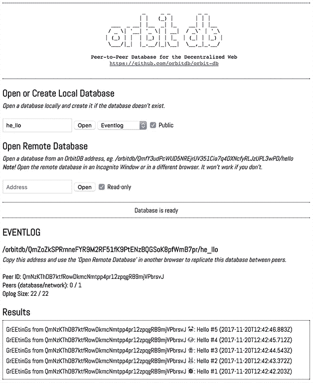
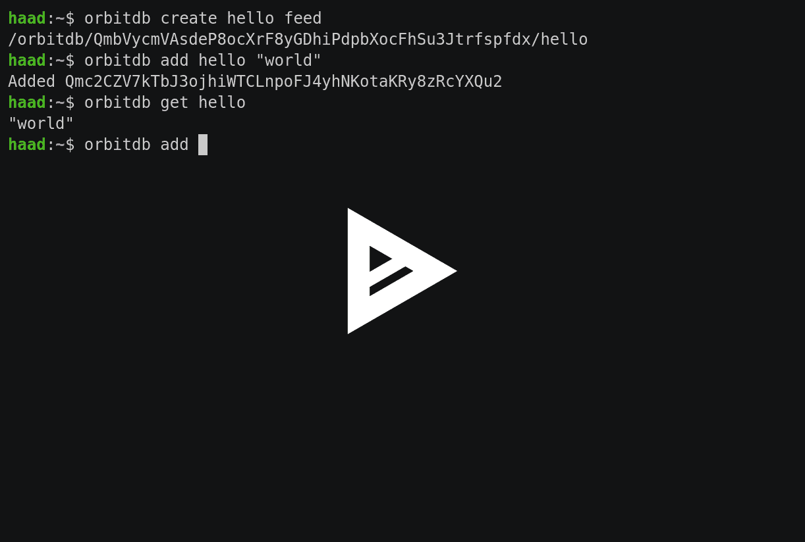
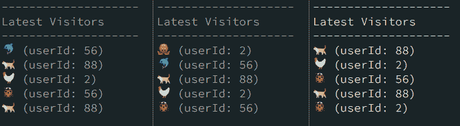

# OrbitDB:一个用于分散式 web 的对等数据库

> 原文：<https://medium.com/coinmonks/orbitdb-a-peer-to-peer-database-for-the-decentralized-web-30bac1d056fe?source=collection_archive---------1----------------------->

## IPFS 之上的分散式数据库

OrbitDB 是一个无服务器的分布式对等数据库。OrbitDB 使用 [IPFS](https://ipfs.io/) 作为其数据存储，使用 [IPFS 发布](https://github.com/ipfs/go-ipfs/blob/master/core/commands/pubsub.go#L23)来自动与对等方同步数据库。这是一个最终一致的数据库，使用[crdt](https://en.wikipedia.org/wiki/Conflict-free_replicated_data_type)进行无冲突的数据库合并，使 OrbitDB 成为去中心化应用(dApps)、区块链应用和离线优先 web 应用的绝佳选择。

> 交易新手？尝试[加密交易机器人](/coinmonks/crypto-trading-bot-c2ffce8acb2a)或[复制交易](/coinmonks/top-10-crypto-copy-trading-platforms-for-beginners-d0c37c7d698c)

OrbitDB 中的数据可以存储在

*   [键值存储](https://github.com/orbitdb/orbit-db/blob/master/API.md#keyvaluenameaddress)
*   [日志数据库](https://github.com/orbitdb/orbit-db/blob/master/API.md#lognameaddress)(仅附加日志)
*   [进给](https://github.com/orbitdb/orbit-db/blob/master/API.md#feednameaddress)(与日志数据库相同，但可以删除条目)
*   [文档存储](https://github.com/orbitdb/orbit-db/blob/master/API.md#docsnameaddress-options)(存储索引的 JSON 文档)
*   [计数器](https://github.com/orbitdb/orbit-db/blob/master/API.md#counternameaddress)

这是 Javascript 实现，它在 Node.js 和浏览器中都可以工作。

若要开始，请尝试使用 [OrbitDB CLI](https://github.com/orbitdb/orbit-db-cli) ，阅读[入门指南](https://github.com/orbitdb/orbit-db/blob/master/GUIDE.md)或查看 [Live demo 1](https://ipfs.io/ipfs/QmeESXh9wPib8Xz7hdRzHuYLDuEUgkYTSuujZ2phQfvznQ/) 、 [Live demo 2](https://ipfs.io/ipfs/QmasHFRj6unJ3nSmtPn97tWDaQWEZw3W9Eh3gUgZktuZDZ/) 或 [P2P TodoMVC app](https://ipfs.io/ipfs/QmTJGHccriUtq3qf3bvAQUcDUHnBbHNJG2x2FYwYUecN43/) ！



# 目录

*   [用法](https://github.com/orbitdb/orbit-db#usage)
*   [API](https://github.com/orbitdb/orbit-db#api)
*   [例题](https://github.com/orbitdb/orbit-db#examples)
*   [发展](https://github.com/orbitdb/orbit-db#development)
*   [背景](https://github.com/orbitdb/orbit-db#background)
*   [投稿](https://github.com/orbitdb/orbit-db#contributing)
*   [执照](https://github.com/orbitdb/orbit-db#license)

# 使用

阅读[入门](https://github.com/orbitdb/orbit-db/blob/master/GUIDE.md)指南以获得更深入的教程并理解 OrbitDB 是如何工作的。

OrbitDB 目前支持 Linux 和 OS X，Windows 还不支持。

# 硬币指示器 （coin-levelindicator 的缩写）命令行界面（Command Line Interface for batch scripting）

关于管理 orbitd-db 数据库的 CLI 工具，参见 [OrbitDB CLI](https://github.com/orbitdb/orbit-db-cli) 。

它可以从 Npm 安装，包括:

```
npm install orbit-db-cli -g
```

# 作为一个图书馆

安装依赖项:

```
npm install orbit-db ipfs
```

将其用作一个模块:

```
const IPFS = require('ipfs')
const OrbitDB = require('orbit-db')// OrbitDB uses Pubsub which is an experimental feature
// and need to be turned on manually.
// Note that these options need to be passed to IPFS in 
// all examples even if not specfied so.
const ipfsOptions = {
  EXPERIMENTAL: {
    pubsub: true
  },
}// Create IPFS instance
const ipfs = new IPFS(ipfsOptions)ipfs.on('error', (e) => console.error(e))
ipfs.on('ready', async () => {
  // Create a database
  const orbitdb = new OrbitDB(ipfs)
  const db = await orbitdb.log('database name')
  // Add an entry to the database
  const hash = await db.add('hello world')
  // Get last 5 entries
  const latest = db.iterator({ limit: 5 }).collect()
  console.log(JSON.stringify(latest, null, 2))
})
```

*更多细节参见*[*kv store*](https://github.com/orbitdb/orbit-db-kvstore#usage)*，*[*event log*](https://github.com/haadcode/orbit-db-eventstore#usage)*，*[*feed*](https://github.com/haadcode/orbit-db-feedstore#usage)*，*[*doc store*](https://github.com/shamb0t/orbit-db-docstore#usage)*和*[*counter*](https://github.com/haadcode/orbit-db-counterstore#usage)*。*

*node . js 现在的最低要求版本是 8.0.0。为了使用 Node.js 的旧版本，我们通过 npm 包提供了一个兼容 ES5 的版本，当通过 npm 安装时，它位于* `*dist/es5/*` *中。*

# 应用程序接口

完整文档见 [API 文档](https://github.com/orbitdb/orbit-db/blob/master/API.md#orbit-db-api-documentation)。

*   [入门](https://github.com/orbitdb/orbit-db/blob/master/API.md#getting-started)
*   [OrbitDB](https://github.com/orbitdb/orbit-db/blob/master/API.md#orbitdb)
*   [键值](https://github.com/orbitdb/orbit-db/blob/master/API.md#keyvaluenameaddress)
*   [日志](https://github.com/orbitdb/orbit-db/blob/master/API.md#lognameaddress)
*   [进给](https://github.com/orbitdb/orbit-db/blob/master/API.md#feednameaddress)
*   [文档存储](https://github.com/orbitdb/orbit-db/blob/master/API.md#docsnameaddress-options)
*   [计数](https://github.com/orbitdb/orbit-db/blob/master/API.md#counternameaddress)测试 [r](https://github.com/orbitdb/orbit-db/blob/master/API.md#counternameaddress)
*   [常见的](https://github.com/orbitdb/orbit-db/blob/master/API.md#store)

# 例子

# 安装依赖项

```
git clone https://github.com/orbitdb/orbit-db.git
cd orbit-db
npm install
```

如果您还没有安装 babel 和 webpack，您还需要它们:

```
npm install --global babel-cli
npm install --global webpack
```

一些依赖依赖于本地插件模块，所以你也需要满足 node-gyp 的安装先决条件。因此，Linux 用户可能需要

```
make clean && make
```

使用工作的本地依赖项重做本地 package-lock.json。

# 浏览器示例

在 macOS 中:

```
npm run build
npm run examples:browser-macos
```

在 Linux 中:

```
npm run build
npm run examples:browser-linux
```


检查[examples/browser/browser . html](https://github.com/orbitdb/orbit-db/blob/master/examples/browser/browser.html)中的代码，并尝试[真实示例](https://ipfs.io/ipfs/QmRosp97r8GGUEdj5Wvivrn5nBkuyajhRXFUcWCp5Zubbo/)。

# Node.js 示例

```
npm run examples:node
```



事件日志

查看 [examples/eventlog.js](https://github.com/orbitdb/orbit-db/blob/master/examples/eventlog.js) 中的代码，并使用以下代码运行:

```
node examples/eventlog.js
```

更多示例见[示例](https://github.com/orbitdb/orbit-db/tree/master/examples)。

# 自定义商店类型

您可以向 OrbitDB 添加自定义存储类型:

```
// define custom store type
class CustomStore extends DocumentStore {
  constructor (ipfs, id, dbname, options) {
    super(ipfs, id, dbname, options)
    this._type = CustomStore.type
  } static get type () {
    return 'custom'
  }
}// add custom type to orbitdb
OrbitDB.addDatabaseType(CustomStore.type, CustomStore)// instantiate custom store
let orbitdb = new OrbitDB(ipfs, dbPath)
let store = orbitdb.create(name, CustomStore.type)
```

# 发展

## 运行测试

```
npm test
```

## 建设

```
npm run build
```

## 基准

```
node benchmarks/benchmark-add.js
```

参见[基准/](https://github.com/orbitdb/orbit-db/blob/master) 了解更多基准。

## 记录

要启用 OrbitDB 的日志输出，请将名为`LOG`的全局环境变量设置为`debug`、`warn`或`error`:

```
LOG=debug node <file>
```

# 背景

使用以下模块:

*   [ipfs-log](https://github.com/orbitdb/ipfs-log)
*   [crdt](https://github.com/orbitdb/crdts)
*   [轨道数据库缓存](https://github.com/orbitdb/orbit-db-cache)
*   [轨道-数据库-存储](https://github.com/orbitdb/orbit-db-store)
*   [轨道-数据库-事件存储](https://github.com/orbitdb/orbit-db-eventstore)
*   [轨道-数据库-饲料商店](https://github.com/orbitdb/orbit-db-feedstore)
*   [orbit-db-kvstore](https://github.com/orbitdb/orbit-db-kvstore)
*   [orbit-db-docstore](https://github.com/orbitdb/orbit-db-docstore)
*   [orbit-db-counterstore](https://github.com/orbitdb/orbit-db-counterstore)
*   [轨道-db-pubsub](https://github.com/orbitdb/orbit-db-pubsub)
*   [orbit-db-keystore](https://github.com/orbitdb/orbit-db-keystore)
*   [指规数](https://github.com/ipfs/js-ipfs)
*   [ipfs-publib-room](https://github.com/ipfs-shipyard/ipfs-pubsub-room)

要了解该架构的一些情况，请查看在[https://github.com/haadcode/proto2](https://github.com/haadcode/proto2)的数据流可视化或现场演示:[http://celebdil . benet . ai:8080/ipfs/QM ezm 7g 8 mbpwyupk 6d 84 ncflkjwu 6 mpxu indigen gjznkx3xk/](http://celebdil.benet.ai:8080/ipfs/Qmezm7g8mBpWyuPk6D84CNcfLKJwU6mpXuEN5GJZNkX3XK/)。

**归属——这是复制粘贴的** [**OrbitDB 的 github 自述。**](https://github.com/orbitdb/orbit-db)

如果你偶然发现这一点，你是一个开发人员，所以请尝试让我们知道你如何喜欢它，并在评论部分的用例。

要了解更多关于去中心化技术的信息，请关注我们的 Coinmonks 出版物。要了解更多关于 IPFS 点击👇。

> 加入 Coinmonks [电报频道](https://t.me/coincodecap)和 [Youtube 频道](https://www.youtube.com/c/coinmonks/videos)获取每日[加密新闻](http://coincodecap.com/)

## 另外，阅读

*   [复制交易](/coinmonks/top-10-crypto-copy-trading-platforms-for-beginners-d0c37c7d698c) | [加密税务软件](/coinmonks/crypto-tax-software-ed4b4810e338)
*   [网格交易](https://coincodecap.com/grid-trading) | [加密硬件钱包](/coinmonks/the-best-cryptocurrency-hardware-wallets-of-2020-e28b1c124069)
*   [密码电报信号](/coinmonks/top-3-telegram-channels-for-crypto-traders-in-2021-8385f4411ff4) | [密码交易机器人](/coinmonks/crypto-trading-bot-c2ffce8acb2a)
*   [币安交易机器人](/coinmonks/binance-trading-bots-d0d57bb62c4c) | [OKEx 评论](/coinmonks/okex-review-6b369304110f) | [阿塔尼评论](https://coincodecap.com/atani-review)
*   [最佳加密交易信号电报](/coinmonks/best-crypto-signals-telegram-5785cdbc4b2b) | [MoonXBT 评论](/coinmonks/moonxbt-review-6e4ab26d037)
*   如何在 Bitbns 上购买柴犬(SHIB)币？ | [买弗洛基](https://coincodecap.com/buy-floki-inu-token)
*   [CoinFLEX 评论](https://coincodecap.com/coinflex-review) | [AEX 交易所评论](https://coincodecap.com/aex-exchange-review) | [UPbit 评论](https://coincodecap.com/upbit-review)
*   [十大最佳加密货币博客](https://coincodecap.com/best-cryptocurrency-blogs) | [YouHodler 评论](https://coincodecap.com/youhodler-review)
*   [AscendEx 保证金交易](https://coincodecap.com/ascendex-margin-trading) | [Bitfinex 赌注](https://coincodecap.com/bitfinex-staking)
*   [最好的卡达诺钱包](https://coincodecap.com/best-cardano-wallets) | [Bingbon 副本交易](https://coincodecap.com/bingbon-copy-trading)
*   [最佳加密交易所](/coinmonks/crypto-exchange-dd2f9d6f3769) | [印度最佳加密交易所](/coinmonks/bitcoin-exchange-in-india-7f1fe79715c9)
*   [面向开发人员的最佳加密 API](/coinmonks/best-crypto-apis-for-developers-5efe3a597a9f)
*   最佳[密码借贷平台](/coinmonks/top-5-crypto-lending-platforms-in-2020-that-you-need-to-know-a1b675cec3fa)
*   [免费加密信号](/coinmonks/free-crypto-signals-48b25e61a8da) | [加密交易机器人](/coinmonks/crypto-trading-bot-c2ffce8acb2a)
*   杠杆代币的终极指南