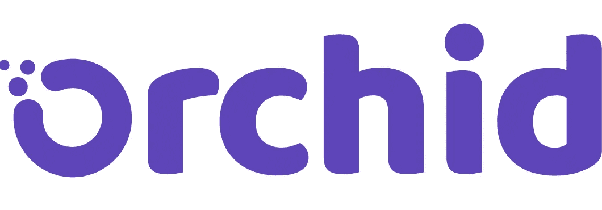

# 兰花:分散的私人通信

> 原文：<https://medium.com/coinmonks/orchid-decentralized-private-communication-1c74f47cd6f3?source=collection_archive---------20----------------------->

隐私正成为一种稀缺的特权，互联网隐私比以往任何时候都更加稀缺。当涉及到个人数据时，我们缺乏隐私已经成为一个互联网迷因。众所周知，大多数手机应用和网站都在向出价最高的人出售用户数据。这通常是在受影响方不知情或不同意的情况下进行的。越来越多的人对这一事实感到不安。为了应对这种情况，VPN(虚拟专用网络)服务和它们各自的公司开始流行起来。不幸的是，集中式 VPN 在过去曾有过用户数据泄露的情况，而且可能会再次发生。信任集中式 VPN 需要对 VPN 公司的安全和道德有太多的信心。兰花进来了。使用兰花的 VPN 网络需要很少的信任，并增加了巨大的和必要的安全和隐私程度。使用基于区块链的协议兰花为匿名通信创造了一个分散的市场。随着我们的个人和商业生活越来越基于互联网，匿名通信将成为一种日益增长的需求。大多数企业已经处于这样一种环境中，不当的互联网安全可能导致收入的指数级损失。在没有 VPN 的情况下使用互联网就像在拥挤的咖啡店里开一个重要而敏感的商务会议。任何人都可能在监听，不管是你的互联网服务提供商还是一个意图窃取商业机密的恶意行为者。

VPN 产业的价值已经达到了 250 亿美元。人们和企业使用 VPN 做任何事情，从伪装互联网流量到获取特定位置的流媒体内容。生活在政府压迫下的很大一部分人也使用 VPN 来访问被封锁的互联网内容。VPN 的采用变得如此普遍，甚至最新的 iPhone iOS 也有内置的 VPN 拨动开关。传统 VPN 公司的问题是用户必须给予他们信任。传统的 VPN 公司是集中式的，可能会因为金钱利益、数据泄露或政府力量的威胁而背叛给予他们的信任。兰花的分散方法提供了一个 VPN 否定了信任的需要。兰花不能记录活动或出售用户数据的设计。使用直接链接到兰花区块链协议的兰花 iOS 或 MacOS 应用程序简单、快捷、方便。用户可以直接从应用程序中购买 xDAI(一种运行在以太坊虚拟机上的稳定硬币)，或者导入之前购买的$OXT 令牌，并在不到 5 分钟的时间内激活他们的 VPN 服务。兰花利用 xDAI 由于高气费以太坊正在经历。当 Eth1 和 Eth2 预计在 2022 年合并时，这些天然气费用预计会降低。底线是兰花目前提供最安全和最私人的虚拟专用网络在一个较低的价格点比竞争对手。

> 订阅 [**Coinmonks Youtube 频道**](https://www.youtube.com/c/coinmonks/videos) 获取每日加密新闻。

## **兰花背后是谁？**

兰花是由一群令人印象深刻的个人创立的。Stephen Waterhouse 博士、Jay Freeman、Brian J. Fox 和 Gustav 西蒙松组成了创始团队，他们在开源软件和安全技术方面都有很长的履历。沃特豪斯博士是兰花公司的首席执行官。沃特豪斯是潘迪拉资本区块链基金的创始合伙人，也是 Fabric Ventures 的风险合伙人兼首席技术官。沃特豪斯博士还拥有许多学位，包括剑桥大学的博士学位。要列出沃特豪斯博士的更多成就将会占这篇文章的大部分篇幅，但可以说，他是一个令人印象深刻的 CEO 人选。杰伊·弗里曼是兰花的首席技术官。弗里曼最出名的可能是通过他的应用 Cydia 使越狱变得容易。Cydia 允许用户在他们的越狱设备上轻松安装第三方应用程序。弗里曼的开发者名字 *Saurik* 在开源软件开发者中备受推崇。Brian J. Fox 是一位互联网先驱和专注的自由软件开发者和倡导者，他的成就在广度和长度上都可以与 Waterhouse 博士相媲美。古斯塔夫·西蒙松是一名工程师和开发人员，他帮助推出了以太坊，目前是兰花公司的顾问。Orchid 已经从 Andreessen Horowitz、Blockchain Capital 和 Sequoia Capital 等公司获得了风险投资。

## **兰花背后是什么？**

兰花协议是一个开放源代码的覆盖网络，它允许销售和购买由区块链技术促进的带宽。兰花的用户可以从带宽提供商网络购买 xDAI 或 OXT 的带宽。xDAI 和 OXT 都建立在以太坊区块链上。兰花使用的支付方案，功能就像一个家庭水表。用户付费与他们使用多少服务直接相关。传统的 VPN 支付模式通常是按月或按年预付费系统。无论用户使用多少带宽，这笔费用都会留在他们的账户上。兰花的支付系统更加灵活和公平。有了兰花，用户可以随心所欲地向自己的账户注入 xDAI 或 OXT，并为他们愿意支付的服务设定价格上限。然后，带宽提供商通过以合理的价格提供服务来争夺用户。兰花协议通过使用概率纳米支付系统保持低交易费用([兰花的介绍纳米支付](/orchid-labs/probabilistic-nanopayments-4aa423c3f22f))。简而言之，该系统支付票据是离线发送的，并且仅在交易的接收者要求支付时产生交易费用。这降低了交易费用，否则这将使区块链上的小额支付相形见绌。

## **我们为什么投资？**

兰花完全符合我们的投资理念。这个团队是由比我们看过的大多数区块链项目更有荣誉和经验的个人组成的。他们共同组成了一个令人印象深刻的管理团队。在本文发表时，OXT 代币的市值仍约为 2.3 亿美元。兰花也得到了聪明风险投资的支持。OXT 的增长潜力巨大，我们认为 OXT 目前被大大低估了。兰花的项目发展一直迅速和透明。随着对 VPN 和互联网安全的需求变得越来越明显，兰花似乎定位于快速增长。他们专门的开发团队一直在努力改进和修复 bug，这在 Orchid 的 GitHub 中显而易见。Orchid 协议是开源的，这意味着 Orchid 团队和任何发现 Orchid 有趣的开发者都可以推进项目的目标。兰花的代码已经由 Certora 和 Consensys 审计，这两家公司都是加密领域备受尊敬的审计员。兰花已经有客户，他们的基础正在增长。随着兰花团队改进他们的 VPN 应用程序，以及更多的服务提供商加入兰花生态系统，采用率将继续上升。我们相信兰花将成为个人和企业的必需品，他们希望在使用互联网时保持安全和安心。我们已经身处一个大规模数据泄露司空见惯的世界。兰花提供了一个强大的解决方案来抑制数据焦虑。

由 Istari Capital LP 的加密专家和分析师 David Coryat 撰写。

【https://www.istari.io/ 号

*本内容仅供参考，您不应将任何此类信息或其他材料理解为法律、税务、投资、财务或其他建议。本报告中的任何内容均不构成 Istari 或任何第三方服务提供商在该司法管辖区或任何其他司法管辖区购买或出售任何证券或其他金融工具的邀约、建议、认可或要约，根据该司法管辖区的证券法，此类邀约或要约是非法的。请注意，Istari Capital LP 投资于本文讨论的项目或与本文相关的项目。*

> 加入 Coinmonks [电报频道](https://t.me/coincodecap)和 [Youtube 频道](https://www.youtube.com/c/coinmonks/videos)了解加密交易和投资

## 另外，阅读

*   [网格交易机器人](https://blog.coincodecap.com/grid-trading) | [Cryptohopper 审查](/coinmonks/cryptohopper-review-a388ff5bae88) | [Bexplus 审查](https://blog.coincodecap.com/bexplus-review)
*   [7 个最佳零费用加密交易平台](https://blog.coincodecap.com/zero-fee-crypto-exchanges)
*   [分散交易所](https://blog.coincodecap.com/what-are-decentralized-exchanges) | [比特 FIP](https://blog.coincodecap.com/bitbns-fip) | [Pionex 评论](https://blog.coincodecap.com/pionex-review-exchange-with-crypto-trading-bot)
*   [用信用卡购买密码的 10 个最佳地点](https://blog.coincodecap.com/buy-crypto-with-credit-card)
*   [加密复制交易平台](/coinmonks/top-10-crypto-copy-trading-platforms-for-beginners-d0c37c7d698c) | [如何在 WazirX 上购买比特币](/coinmonks/buy-bitcoin-on-wazirx-2d12b7989af1)
*   [信用贷款审核](https://blog.coincodecap.com/coinloan-review)|[Crypto.com 审核](/coinmonks/crypto-com-review-f143dca1f74c) | [货币融资融券交易](/coinmonks/huobi-margin-trading-b3b06cdc1519)
*   [Bookmap 点评](https://blog.coincodecap.com/bookmap-review-2021-best-trading-software) | [美国 5 大最佳加密交易所](https://blog.coincodecap.com/crypto-exchange-usa)
*   最佳加密[硬件钱包](/coinmonks/hardware-wallets-dfa1211730c6) | [Bitbns 评论](/coinmonks/bitbns-review-38256a07e161)
*   [新加坡十大最佳加密交易所](https://blog.coincodecap.com/crypto-exchange-in-singapore) | [购买 AXS](https://blog.coincodecap.com/buy-axs-token)
*   [投资印度的最佳加密软件](https://blog.coincodecap.com/best-crypto-to-invest-in-india-in-2021) | [WazirX P2P](https://blog.coincodecap.com/wazirx-p2p)
*   [加拿大最佳加密交易机器人](https://blog.coincodecap.com/5-best-crypto-trading-bots-in-canada) | [库币评论](https://blog.coincodecap.com/kucoin-review)
*   [火币的加密交易信号](https://blog.coincodecap.com/huobi-crypto-trading-signals) | [HitBTC 审查](/coinmonks/hitbtc-review-c5143c5d53c2)
*   [如何在 FTX 交易所交易期货](https://blog.coincodecap.com/ftx-futures-trading) | [OKEx vs 币安](https://blog.coincodecap.com/okex-vs-binance)
*   [OKEx vs KuCoin](https://blog.coincodecap.com/okex-kucoin) | [摄氏替代品](https://blog.coincodecap.com/celsius-alternatives) | [如何购买 VeChain](https://blog.coincodecap.com/buy-vechain)
*   [币安期货交易](https://blog.coincodecap.com/binance-futures-trading)|[3 commas vs Mudrex vs eToro](https://blog.coincodecap.com/mudrex-3commas-etoro)