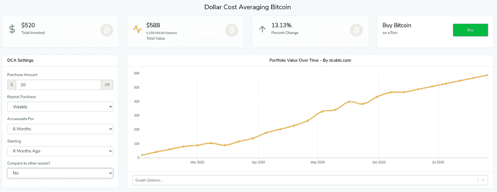
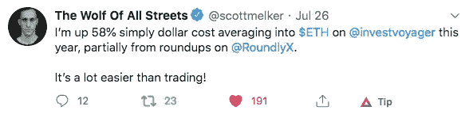
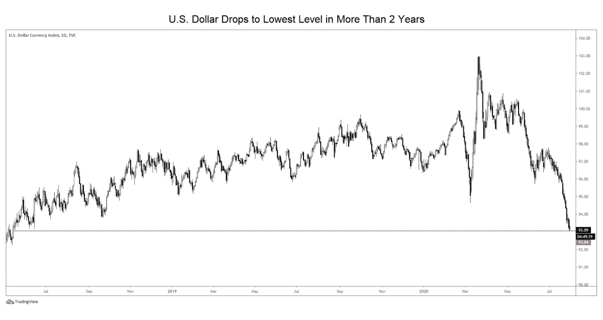
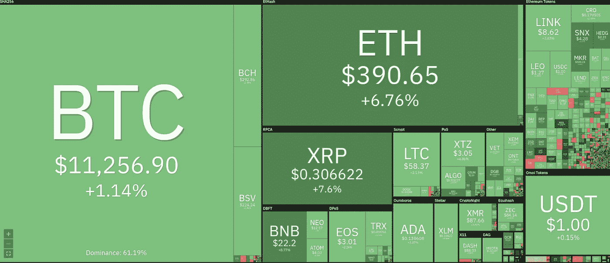

# 点餐🍕以及投资比特币

> 原文：<https://medium.com/coinmonks/ordering-food-and-investing-in-bitcoin-5dd7f8267a18?source=collection_archive---------1----------------------->

## 使用 [RoundlyX](https://www.roundlyx.com/?utm_source=coincodecapemail&utm_medium=email&utm_campaign=coincodecapemail) 进行美元成本平均

如果你在过去的六个月里每周投资 20 美元在比特币上，你今天有 68 美元的利润。💵

这种投资策略被称为平均成本投资——定期投入固定数量的资金。这是任何市场中最安全的投资策略之一。

我最近找到了 [**RoundlyX**](https://www.roundlyx.com/?utm_source=coincodecapemail&utm_medium=email&utm_campaign=coincodecapemail) ，每次我点餐或预订 uber 时，它都能帮我做到这一点。是不是很牛逼？👏

[**RoundlyX**](https://www.roundlyx.com/accounts/signup/?utm_source=coincodecapemail&utm_medium=email&utm_campaign=coincodecapemail) 将我日常交易中的零花钱投资于我选择的加密货币。通过这种方式，你可以为以太坊、比特币和其他数字资产设定一个美元成本平均值。

并通过 [**RoundlyX**](https://www.roundlyx.com/accounts/signup/?utm_source=coincodecapemail&utm_medium=email&utm_campaign=coincodecapemail) 在 crypto 中购买 45 美元或以上后，在 BTC 使用“CoinCodeCap**”**促销代码换取 4 美元。

## 秘密交易🆓

想在收件箱中直接收到最新的加密交易吗？报名 [***这里***](https://coincodecap.com/)

*   [Holderlab](https://coincodecap.com/product/holderlab-0?scroll=deal) —自动化您的加密产品组合
*   [硬币追踪](https://coincodecap.com/product/cointracking-8?scroll=deal) —加密税务解决方案九折优惠

对密码交易机器人感兴趣，加入本 [**电报频道**](https://t.me/mocbchat) 。

## 最新消息📰

*   [以太坊经典交易员不为潜在的 51%攻击所吓倒](https://decrypt.co/37414/ethereum-traders-undeterred-by-potential-51-attack)
*   [以太坊:未来五年](https://decrypt.co/37295/ethereum-the-next-five-years)
*   [官方逮捕三名涉嫌推特黑客](https://www.coindesk.com/suspected-twitter-hacker-arrested-in-florida)
*   [比特币基地考虑增加 19 种密码上市交易](https://www.coindesk.com/coinbase-considering-20-additional-cryptos-for-exchange-listing)
*   [一个秘密的“庞氏骗局”:650 万美元的香蕉。基金诈骗被揭露](https://www.coindesk.com/banana-fund-crypto-ponzi-scheme)
*   [《经济学人》宣传有争议的加密项目 HEX](https://decrypt.co/37484/the-economist-advertises-controversial-crypto-project-hex)
*   [Maskbook:一个中国开发者在 Twitter 和脸书上建立了一个 Web3 木马](https://decrypt.co/32298/maskbook-a-chinese-dev-builds-a-web3-trojan-horse-on-twitter-and-facebook)
*   [YFI 叉烧明日香令牌的创造者据说被骗出境](https://www.theblockcrypto.com/post/73737/creator-of-yfi-fork-asuka-token-is-said-to-have-exit-scammed)
*   [近千名 Tezos 用户直接授权给币安和北海巨妖，不会获得赌注奖励](/coinmonks/almost-a-thousand-tezos-users-delegated-to-binance-and-kraken-directly-and-will-not-get-staking-325f91ebfa2a)

## 播客💽

*   [来自地穴的故事:维杰·博雅帕蒂](https://www.stitcher.com/podcast/marty-bent/tales-from-the-crypt/e/76503435)
*   [维塔利克·布特林在以太坊五周年庆典上](https://www.youtube.com/watch?v=gJq9FcYZe0k)
*   [进入以太:Axie Infinity:游戏的新典范](https://podcast.ethhub.io/axie-infinity-a-new-paradigm-in-gaming)
*   [平衡器——可编程流动性的自动做市商协议](https://epicenter.tv/episodes/350/)

## 好的读物📑

*   [货币市场利率如何影响稳定](/coinmonks/how-money-market-interest-rates-affect-stablecoins-f35867f55a98)
*   [朱利安·戈达德](/coinmonks/agreeable-smart-contracts-354fb74c3c17)撰写的令人愉快的智能合同
*   [零知识证明由](/coinmonks/zero-knowledge-proofs-explained-727b9b8e0e5e)[阿勒塔·维奇](https://medium.com/u/fab202851b3b?source=post_page-----5dd7f8267a18--------------------------------)解释
*   [检查泰佐斯放权](/coinmonks/inspecting-tezos-decentralization-200-public-nodes-1000-in-total-6ef0761caac9)被[烤坏](https://medium.com/u/dfc73e52e44d?source=post_page-----5dd7f8267a18--------------------------------)
*   美国一个月印的钱比两个世纪印的还多
*   [比特币和 stablecoins 的崛起](https://www.theblockcrypto.com/post/73656/jump-capital-crypto-theses)
*   [以太坊经典 51%连锁攻击 2020 年 7 月 31 日](https://blog.bitquery.io/ethereum-classic-51-chain-attack-july-31-2020)
*   [Delphi-2020 年以太坊报告的数字状态](https://drive.google.com/file/d/1s9ANCi6fRyWyyd-P2GtnOfIWtTCP_6HF/view)和 [Twitter 线程](https://twitter.com/Delphi_Digital/status/1289232627958837248)
*   [Reddit 缩放烘焙大赛](https://old.reddit.com/r/ethereum/comments/hbjx25/the_great_reddit_scaling_bakeoff/) — Reddit 向社区征集以太坊缩放解决方案。你可以点击查看所有投稿的列表。

## 照片说明了一切📷

[**Dollar at 2 years low**](https://www.coindesk.com/dollar-falls-to-lowest-level-in-over-2-years-while-gold-silver-bitcoin-continue-to-shine)

Coin360.com

> [*在您的收件箱中直接获得最佳软件交易*](https://coincodecap.com/?utm_source=coinmonks)

